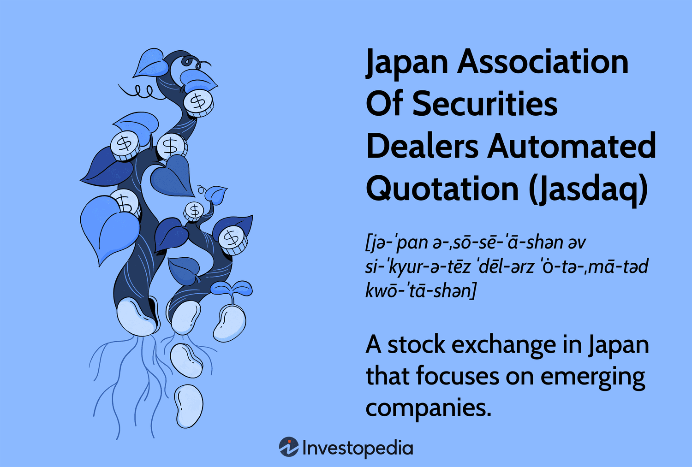

The Japanese stock market holds a prominent position in the world's financial landscape, characterized by its significant market capitalization and diverse array of listed companies. It is a vital component of Asia's financial ecosystem, acting as a barometer for the region's economic health and offering investors exposure to global and domestic industries ranging from consumer electronics to automotive manufacturing. Within this market, several exchanges play pivotal roles, with the Tokyo Stock Exchange (TSE) being the largest and most well-known. However, Jasdaq also represents a crucial element, particularly for small and mid-sized enterprises (SMEs).

Jasdaq, an important segment of the Japanese securities market, serves as a platform for emerging and growing companies, providing them with access to capital and enhancing investor diversification opportunities. It traditionally functions as one of the key venues for startups and smaller scale firms, fulfilling a role similar to Nasdaq in the United States. Jasdaq specializes in fostering innovative companies by providing a market that supports growth-stage businesses, thus playing a significant role in nurturing the Japanese economy.



Parallelly, algorithmic trading has emerged as a transformative force in global financial markets, including Japan's. This refers to the use of computer algorithms to automate trading processes, offering increased execution speed, accuracy, and reduced transaction costs. The rise of such technology has been driven by advances in computing power, data availability, and the need for more efficient trading mechanisms. In Japan, algorithmic trading is increasingly becoming a norm on platforms like Jasdaq and the TSE, aligning with global trends toward market efficiency and competitiveness.

This article explores the intersection of Jasdaq and algorithmic trading, analyzing how these technological advancements are reshaping the Japanese stock market. This includes examining Jasdaq's unique position within this ecosystem and understanding its response to the growing prevalence of algorithmic systems. By doing so, the article aims to shed light on the implications of these developments for market participants, including investors, regulators, and companies, while also considering the broader impact on the future of trading in Japan and beyond.

## Table of Contents

## Understanding Jasdaq in the Japanese Stock Market

Jasdaq, formally known as the Japan Securities Dealers Association, serves as a crucial component of the Japanese stock market, particularly catering to the growth and support of small and medium-sized enterprises (SMEs). Established with the intent to provide a more accessible platform for smaller companies to raise capital, Jasdaq was initially formed in 1963 as an over-the-counter (OTC) market before evolving into its current form. This evolution was marked by significant milestones, such as the implementation of a computer trading system in 1976, which facilitated more efficient transactions and expanded market reach.

The key features of Jasdaq distinguish it from other stock exchanges in Japan, such as the Tokyo Stock Exchange (TSE). While the TSE primarily caters to larger, established corporations, Jasdaq focuses on providing innovative and flexible listing requirements that allow SMEs to access public capital markets, thus filling a critical niche. Notably, Jasdaq introduced the "Jasdaq Standard" and "Jasdaq Growth" market segments. The "Jasdaq Standard" is designed for companies with stable business operations, while the "Jasdaq Growth" segment is intended for emerging companies with potential for substantial growth. This segmentation facilitates diverse investment opportunities and attracts investors looking for varied risk and return profiles.

Compared to the Tokyo Stock Exchange (TSE), which is one of the largest and most prominent exchanges in the world, Jasdaq offers distinct advantages for smaller companies that might not meet the stringent listing requirements of the TSE. The TSE has a more extensive regulatory framework and a larger market capitalization threshold for listed companies. In contrast, Jasdaq maintains more streamlined processes to accommodate the dynamic needs of SMEs, thus fostering innovation and entrepreneurial growth within the Japanese economy.

The significance of Jasdaq for SMEs cannot be overstated. By providing a tailored platform, Jasdaq enables smaller enterprises to access a wider investor base, secure funding for expansion, and increase visibility in the financial market. This support is vital for the Japanese economy, where SMEs comprise a large portion of the business landscape. Jasdaq's role in facilitating the growth and development of these enterprises contributes to economic diversity and resilience, encouraging a competitive and innovative market environment.

Jasdaq's function as a nurturing ground for SMEs reflects its fundamental mission to diversify the Japanese stock market and offer broader economic opportunities. By balancing the needs of smaller firms with investor interests, Jasdaq ensures a dynamic market structure that complements the offerings of larger exchanges like the TSE, ultimately enhancing the overall vitality of Japan's financial ecosystem.

## Algorithmic Trading: A Brief Overview

Algorithmic trading refers to the use of computer programs and systems to execute a predefined set of trading instructions, aimed at generating profits at speeds and frequencies that would be impossible for a human trader. These algorithms consist of complex mathematical models and leverage historical data to make decisions regarding the timing, price, and quantity of buy or sell orders in financial markets.

### Development and Evolution of Algorithmic Trading

The inception of [algorithmic trading](/wiki/algorithmic-trading) dates back to the 1970s with the introduction of electronic trading systems. The significant technological advancements over the subsequent decades, particularly in computing power and data processing, have accelerated the adoption of algorithmic trading. The 1990s and early 2000s saw a substantial expansion with the advent of more sophisticated algorithms capable of complex strategies such as statistical [arbitrage](/wiki/arbitrage) and [trend following](/wiki/trend-following). Currently, algorithmic trading is estimated to comprise a substantial portion of trading [volume](/wiki/volume-trading-strategy) on major stock exchanges globally.

### Advantages of Algorithmic Trading

The primary advantages of algorithmic trading include:

**1. Speed:** Algorithms can process and act upon market conditions within fractions of a second. This speed enables traders to capture opportunities that would otherwise be missed due to slower human reaction times.

**2. Accuracy:** By adhering strictly to pre-set rules, algorithms can eliminate the errors typically introduced by human emotion and judgment, ensuring consistent execution of trades.

**3. Cost-Efficiency:** By optimizing trade execution and reducing transaction costs, algorithmic trading can enhance profitability. Algorithms can exploit small price discrepancies across markets more effectively than manual trades.

### Challenges and Risks Associated with Algorithmic Trading

Algorithmic trading is not without its challenges and risks. Among these are:

**1. Technical Failures:** Infrastructure issues such as hardware failures or software bugs can lead to significant financial losses. Ensuring robust systems and fail-safes is crucial.

**2. Market Volatility:** While algorithms are designed to operate under various market conditions, extreme volatility can present scenarios that were not anticipated during development, potentially leading to suboptimal performance.

**3. Liquidity Risk:** Algorithms are often predicated on the availability of sufficient market liquidity. During times of liquidity crunch, executing trades without significantly impacting the market price becomes challenging.

**4. Ethical and Regulatory Challenges:** The automation of trading raises ethical concerns regarding market manipulation and fairness. Moreover, regulatory bodies are continually evolving their frameworks to ensure that trading remains transparent and equitable.

In summary, algorithmic trading represents a significant advancement in financial technology, offering benefits of speed, accuracy, and efficiency. However, it requires careful management of its inherent risks and challenges to ensure its continued success and acceptance in stock markets worldwide.

## Algorithmic Trading in the Japanese Stock Market

Algorithmic trading has become a pivotal component of the Japanese stock market, reflecting broader global trends. Initially slow to adopt due to regulatory and market structure complexities, Japan has seen a significant increase in algorithmic trading activities in recent years. This growth is largely driven by technological advances and the globalization of financial markets.

### Adoption and Growth in Japan

The proliferation of algorithmic trading in Japan has been enabled by the rise of high-frequency trading ([HFT](/wiki/high-frequency-trading-strategies)) and the integration of sophisticated technologies in financial market infrastructure. Tokyo Stock Exchange (TSE), which amalgamated with Osaka Securities Exchange to form the Japan Exchange Group (JPX), has been at the forefront, implementing systems like Arrowhead to facilitate faster transaction processing. As a result, algorithmic trades have become the norm, accounting for a significant portion of the daily trading volumes.

Japanese financial institutions, previously reliant on traditional trading methods, have adapted to this shift. They have incorporated algorithms to execute trades at greater speeds and accuracy, thereby reducing transaction costs and enhancing efficiency. The demand for algorithm-driven trading has surged, primarily due to increased competition and the need for precision in fast-paced market environments.

### Major Players and Stakeholders

Several key stakeholders have shaped the landscape of algorithmic trading in Japan. Domestic and international investment banks, such as Nomura Securities, Daiwa Securities, Goldman Sachs, and Morgan Stanley, are major players, leveraging sophisticated algorithms to execute trades and manage portfolios. Additionally, proprietary trading firms and hedge funds utilize algorithmic strategies to exploit market inefficiencies, often employing diverse approaches like [market making](/wiki/market-making), [statistical arbitrage](/wiki/statistical-arbitrage), and trend following.

Technology providers play a crucial role by offering advanced software and hardware solutions tailored for high-speed trading environments. Companies like Tradeworx and Bloomberg supply market participants with tools needed for algorithm development and deployment, ensuring seamless integration with stock exchanges and other trading venues.

### Regulatory Framework

Japan's regulatory framework governing algorithmic trading is designed to promote market stability and investor protection. The Financial Services Agency (FSA) oversees these activities, ensuring compliance with the Financial Instruments and Exchange Act. This regulatory environment mandates thorough testing and risk assessment of trading algorithms before deployment, preventing market disruption and unintended consequences.

The Tokyo Stock Exchange has also established rules to curb potential abuses associated with high-frequency trading. These include stringent requirements for market access and the imposition of penalties for excessive order amendments or cancellations, known as spoofing. Such regulations are intended to prevent market manipulation and maintain the integrity of the trading infrastructure.

### Case Studies on Jasdaq

Jasdaq, as a part of the Tokyo Securities Exchange, has witnessed successful implementations of algorithmic trading strategies that have enhanced [liquidity](/wiki/liquidity-risk-premium) and market participation. For instance, certain automated systems designed for Jasdaq focus on liquidity provision for small-cap stocks, customizing algorithms to the specific trading behaviors and [volatility](/wiki/volatility-trading-strategies) profiles of these securities.

One example includes a mid-sized Japanese trading firm that developed a bespoke algo system for trading on Jasdaq. This system increased trading speed by 25% and improved execution quality by leveraging [machine learning](/wiki/machine-learning) models to predict short-term price movements. As a result, the firm achieved a higher trade volume and better execution margins, underpinning the transformative potential of algorithmic trading in smaller exchange environments.

Overall, the Japanese market's embrace of algorithmic trading represents both an evolution of its financial landscape and a testament to the dynamic interplay between technology and finance. The continued integration of algorithms promises further innovations and efficiencies in the years to come.

## How Algo Trading is Transforming Jasdaq Securities Trading

Algorithmic trading has significantly transformed securities trading on Jasdaq, a platform primarily known for accommodating small and medium-sized enterprises. This transformation is evident in the increased trading volume and liquidity, driven by the speed and efficiency of automated systems. Algorithmic trading has enabled traders to execute a higher number of transactions in less time, contributing to a more dynamic market environment. According to research, algorithmic trading accounts for a substantial portion of the trading activity, thus facilitating a smoother flow of capital and enhancing the overall efficiency of the market.

The technological advancements that have facilitated algorithmic trading on Jasdaq are manifold. High-frequency trading (HFT) systems and sophisticated algorithms have evolved to process large datasets quickly, analyzing market patterns to execute trades at optimal prices. These systems employ machine learning techniques and advanced statistical models to predict price movements and make real-time decisions. The integration of cutting-edge technology, such as AI and machine learning, has further augmented the capabilities of algorithmic traders, allowing for more accurate forecasting and strategy implementation. Additionally, improvements in network infrastructure, including lower latency and faster execution speeds, have bolstered the operational effectiveness of these algorithms.

Jasdaq traders have experienced notable shifts in trading strategies due to the prevalence of algorithmic systems. Traditional discretionary trading methods are increasingly being supplemented or replaced by algorithmic strategies that prioritize data-driven decision-making. Traders now rely on algorithms to identify arbitrage opportunities, manage risk, and optimize trade execution. These systems utilize complex mathematical models to assess probabilities and develop strategic approaches, enabling traders to capitalize on fleeting market inefficiencies that would otherwise be difficult to exploit.

Looking towards the future, algorithmic trading is set to become even more pervasive on Jasdaq. The continued evolution of technology, particularly in the domains of [artificial intelligence](/wiki/ai-artificial-intelligence) and quantum computing, presents opportunities for even more sophisticated trading algorithms. These advances could lead to more nuanced and multifaceted trading strategies, further increasing market efficiency and potentially attracting more international investors. Moreover, as regulatory frameworks adapt to accommodate and supervise these technological innovations, the potential for algorithmic trading to reshape the landscape of Jasdaq remains significant. The confluence of technological progress and strategic adaptation underscores a promising trajectory for algorithmic trading on Jasdaq, potentially setting precedents for other markets globally.

## Challenges and Opportunities in Algorithmic Trading

Algorithmic trading, while offering significant benefits, also presents a variety of challenges as well as opportunities in the financial markets. 

**Technical Challenges: Infrastructure and Software Development**

The success of algorithmic trading systems heavily depends on robust technical infrastructure and sophisticated software development. High-frequency trading (HFT) requires low-latency networks and powerful computing resources to process information and execute trades in milliseconds. Designing and maintaining such infrastructure can be expensive and complex, requiring extensive expertise in both software engineering and financial markets. Additionally, algorithms need continual updates and enhancements to address changing market conditions and to remain competitive.

Developing reliable algorithms also involves complex statistical modeling and machine learning techniques. For instance, traders often use time series analysis and pattern recognition to predict price movements. Python, a popular language in algorithmic trading, can facilitate such tasks with libraries like Pandas and NumPy. A simple example of moving average crossover strategy can be implemented as follows:

```python
import pandas as pd

# Load historical stock data
data = pd.read_csv('stock_prices.csv')
prices = data['Close']

# Calculate short and long-term moving averages
short_window = 40
long_window = 100
signals = pd.DataFrame(index=data.index)
signals['signal'] = 0.0
signals['short_mavg'] = prices.rolling(window=short_window, min_periods=1, center=False).mean()
signals['long_mavg'] = prices.rolling(window=long_window, min_periods=1, center=False).mean()

# Generate trading signals: 1 (Buy), 0 (Sell)
signals['signal'][short_window:] = np.where(signals['short_mavg'][short_window:] > signals['long_mavg'][short_window:], 1.0, 0.0)
signals['positions'] = signals['signal'].diff()

print(signals.tail())
```

**Market Challenges: Volatility and Unpredictability**

Algorithmic trading can contribute to market volatility, sometimes causing extreme price swings within short time frames. This unpredictability poses significant challenges, as algorithms need rapid adjustment to mitigate losses during unforeseen market events. The "flash crash" of May 6, 2010, is a notable example where algorithmic trading systems magnified market downturns, triggering significant regulatory investigations.

**Opportunities for Traders and Investors**

Despite these challenges, algorithmic tools offer formidable opportunities. They enable traders to execute complex strategies across multiple markets and asset classes with greater precision and speed than human traders. Algorithmic trading also facilitates improved liquidity due to its ability to process vast quantities of transactions efficiently, thereby often reducing transaction costs. Institutional investors leverage these systems for large-volume trades to optimize entry and [exit](/wiki/exit-strategy) points, thereby enhancing portfolio performance.

**Ethical Considerations and Debate**

The rise of algorithmic trading presents ethical considerations, primarily around market fairness and transparency. Critics argue that algos might provide unfair advantages to those with access to better technology and data. This raises concerns about market manipulation, where sophisticated algorithms could potentially exploit market inefficiencies detrimentally. Ethical questions also surround the potential for creating systemic risks, as heavy reliance on technology can lead to widespread ramifications in case of failures.

In conclusion, while algorithmic trading unfolds new avenues for innovation and efficiency in financial markets, it also challenges traders and regulators to address its inherent complexities and ethical dilemmas. Balancing these factors will define the future trajectory of algorithmic trading in Japan and globally.

## Conclusion

Jasdaq has established itself as a crucial component of the Japanese stock market, predominantly serving as a platform for small and medium-sized enterprises to access capital markets. It offers these companies an opportunity to grow and contribute to the overall economic landscape in Japan. By providing a venue distinct from the Tokyo Stock Exchange, Jasdaq helps diversify the Japanese financial ecosystem. The integration of algorithmic trading into Jasdaq has further enhanced its significance, offering increased liquidity and efficiency to both traders and companies listed on the exchange.

The transformative impact of algorithmic trading on Jasdaq is substantial. Algorithmic strategies have significantly increased trading volumes, providing more liquidity and narrowing bid-ask spreads, which benefits all market participants. With advancements in technology, algorithmic trading has enabled more accurate and faster transaction processing, allowing traders to execute strategies that were previously impractical. This evolution has prompted a shift in trading strategies among participants, as the reliance on traditional human-mediated trade execution diminishes in favor of more sophisticated, data-driven approaches.

Looking ahead, the future of algorithmic trading in Japan, including on platforms like Jasdaq, appears promising. The continued growth of technological capabilities, such as machine learning and artificial intelligence, is expected to further revolutionize trading strategies and market dynamics. However, this evolution presents challenges, with the need for robust regulatory frameworks to ensure fair and stable markets. Balancing the opportunities presented by algorithmic trading with these regulatory needs will be crucial in maintaining the health of stock exchanges and protecting market participants.

Globally, the implications of algorithmic trading extend beyond Japan, as international markets also witness similar transformations. As technology continues to advance, the adoption of algorithmic trading strategies is likely to expand, fostering more interconnected and efficient financial markets worldwide. Nonetheless, the ethical and reactive considerations surrounding these technologies will be pivotal in shaping their future development and integration in global financial systems.

## References & Further Reading

[1]: Wood, Christopher. ["Algorithmic Trading in Financial Markets: Reflections on the Future."](https://www.msn.com/en-us/sports/soccer/chris-wood-on-brink-of-nottingham-forest-goalscoring-history-after-downing-ipswich/ar-AA1v2xqs) ResearchGate, 2018.

[2]: Lopez de Prado, Marcos. ["Advances in Financial Machine Learning."](https://www.amazon.com/Advances-Financial-Machine-Learning-Marcos/dp/1119482089) Wiley, 2018.

[3]: Chan, Ernest P. ["Quantitative Trading: How to Build Your Own Algorithmic Trading Business."](https://github.com/ftvision/quant_trading_echan_book) Wiley, 2009.

[4]: Jansen, Stefan. ["Machine Learning for Algorithmic Trading."](https://github.com/stefan-jansen/machine-learning-for-trading) Packt Publishing, 2018.

[5]: Aronson, David. ["Evidence-Based Technical Analysis: Applying the Scientific Method and Statistical Inference to Trading Signals."](https://www.amazon.com/Evidence-Based-Technical-Analysis-Scientific-Statistical/dp/0470008741) Wiley, 2006.