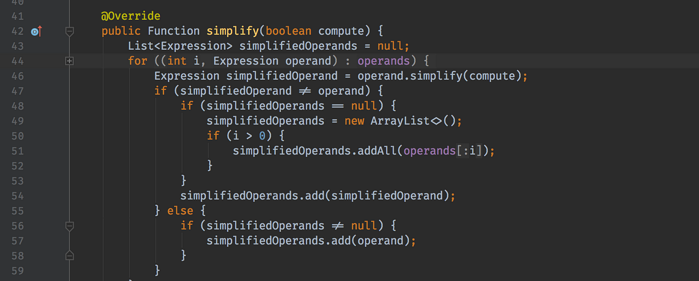

## Table of Contents

## What is Java and what is it used for?

Java is a programming language that was created in the mid-1990s. It is known for being easy to use and for working on many different types of computers and devices. Java is often used to make websites more interactive, to build mobile apps, and to create software that runs on many different systems.

People use Java for many things. For example, big companies use it to build their websites and apps because it is reliable and secure. Java is also used in schools to teach programming because it is easy to learn. It's a popular choice for making games, business software, and even tools for other programmers.

## How do you install Java on different operating systems?

To install Java on a Windows computer, first go to the official Oracle website and download the latest version of Java. Once the download is finished, open the file and follow the instructions on the screen. It will ask you where you want to install Java and if you want to set it as the default for your web browser. After you finish the steps, Java will be installed and ready to use on your Windows computer.

For a Mac, the process is similar. Visit the Oracle website and download the Java installer for macOS. After downloading, open the .dmg file and follow the prompts to install Java. You might need to enter your administrator password during the installation. Once it's done, Java will be set up on your Mac and you can start using it.

On Linux, installing Java can be a bit different depending on your distribution. For most Linux systems, you can use the package manager to install Java. For example, on Ubuntu, you can open a terminal and type a command like "sudo apt-get install default-jdk" to install the Java Development Kit. After entering your password and waiting for the installation to complete, Java will be ready to use on your Linux system.

## What are the basic data types in Java?

In Java, there are two main kinds of data types: primitive and reference. Primitive data types are the most basic data types and they include things like numbers, characters, and true/false values. There are eight primitive data types in Java: byte, short, int, long, float, double, char, and boolean. Each of these types has a specific size and range of values it can hold. For example, an int can hold whole numbers from -2,147,483,648 to 2,147,483,647.

Reference data types, on the other hand, are more complex and include things like objects and arrays. These types don't store the actual data but instead store a reference to where the data is located in memory. Common reference types in Java include String, which is used for text, and Array, which can hold multiple values of the same type. Classes and interfaces are also reference types, allowing you to create and use more complex data structures and behaviors in your programs.

Understanding these basic data types is important because they are the building blocks of any Java program. By choosing the right data type for your needs, you can make your code more efficient and easier to understand.

## How do you write and run a simple Java program?

To write a simple Java program, you need a text editor or an Integrated Development Environment (IDE) like Eclipse or IntelliJ IDEA. Start by creating a new file with a .java extension, for example, "HelloWorld.java". In this file, you write your Java code. A basic program might look like this: you start with a class declaration, like "public class HelloWorld", then inside the class, you write a main method, which is where your program starts running. Inside the main method, you can write a simple command to print a message, like "System.out.println("Hello, World!");". Once you've written your code, save the file.

To run your Java program, you first need to compile it into bytecode that the Java Virtual Machine (JVM) can understand. You do this by opening a command prompt or terminal, navigating to the directory where your .java file is saved, and typing "javac HelloWorld.java". If there are no errors, this will create a new file called "HelloWorld.class". To run the program, type "java HelloWorld" in the command prompt or terminal. The JVM will then execute the bytecode in the "HelloWorld.class" file, and you should see the message "Hello, World!" printed on the screen. This is how you can write and run a simple Java program.

## What is object-oriented programming in Java?

Object-oriented programming (OOP) in Java is a way of organizing and writing code that focuses on objects. Objects are like little machines that have their own data and can do things. In Java, you create these objects using something called a class. A class is like a blueprint that tells the computer how to make an object. For example, if you want to make a car object, you would create a Car class that says what data a car has, like its color and speed, and what it can do, like drive or stop.

One of the main ideas in OOP is that objects can interact with each other. This makes it easier to build big programs because you can break them into smaller parts. Each object does its own job, and they work together to make the whole program work. Java uses concepts like inheritance, where one class can get features from another class, and polymorphism, where objects can act in different ways depending on the situation. These ideas help make your code more organized and easier to change or grow over time.

## How do you handle exceptions in Java?

In Java, exceptions are unexpected events that can happen while your program is running. To handle these exceptions, you use something called "try-catch" blocks. In a try block, you put the code that might cause an exception. If an exception happens, the program jumps to the catch block, where you can write code to deal with the problem. For example, if you're trying to read a file and it's not there, you can use a try-catch block to show a message to the user instead of crashing the program.

There are also other ways to handle exceptions in Java. One way is to use a "finally" block, which runs no matter what happens in the try or catch blocks. This is useful for cleaning up resources, like closing a file you opened. Another way is to "throw" an exception yourself if something goes wrong in your code. You can also use "throws" in a method's declaration to say that it might cause certain exceptions, which means the code calling that method needs to handle them. By using these tools, you can make your Java programs more reliable and user-friendly.

## What are Java collections and how are they used?

Java collections are groups of objects that you can use to store and organize data in your programs. They are part of the Java Collections Framework, which provides a set of classes and interfaces to work with groups of objects. Some common types of collections include lists, sets, and maps. Lists are like arrays but can grow or shrink as you add or remove items. Sets are like lists but don't allow duplicate items. Maps are used to store key-value pairs, where each key is unique and maps to a specific value.

You use collections in Java by creating objects from the collection classes and then adding, removing, or searching for items in them. For example, if you want to keep a list of names, you could use an ArrayList, which is a type of list. You can add names to the list, check if a name is in the list, or remove names from it. Collections make it easy to work with groups of data because they come with built-in methods to do common tasks. This means you don't have to write your own code to manage the data, which saves time and helps keep your programs organized.

## What is multithreading in Java and how do you implement it?

Multithreading in Java is a way to make your program do more than one thing at the same time. Think of it like having multiple workers in a factory, each doing their own job. In Java, these workers are called threads. By using threads, you can make your program run faster and be more responsive. For example, if you're making a game, one thread can handle the game logic while another thread takes care of the graphics, making the game smoother and more enjoyable to play.

To implement multithreading in Java, you can use two main ways. The first way is by extending the Thread class. You create a new class that extends Thread, and then you override the run() method to put the code you want the thread to execute. After that, you create an object of your new class and call its start() method to begin the thread. The second way is by implementing the Runnable interface. You create a class that implements Runnable, and then you override the run() method with your thread's code. To start the thread, you create a Thread object, pass your Runnable object to it, and then call the start() method. Both ways let you create and run multiple threads in your Java program, making it more efficient and powerful.

## How does Java handle memory management and garbage collection?

In Java, memory management is handled automatically by the Java Virtual Machine (JVM). When you create objects in your program, the JVM puts them in a part of memory called the heap. The heap is like a big storage area where objects live until they are no longer needed. Java makes it easy for you because you don't have to worry about freeing up this memory yourself. Instead, the JVM does it for you through a process called garbage collection.

Garbage collection in Java works by finding objects in the heap that are no longer being used. When the JVM sees that an object can't be reached by your program anymore, it marks that object as garbage. Later, the garbage collector comes along and removes these objects from the heap, freeing up space for new objects. This process happens automatically in the background, so you can focus on writing your code without worrying about running out of memory.

## What are Java streams and how do they improve code?

Java streams are a way to work with collections of data in a more efficient and readable way. They let you do things like filtering, sorting, and changing data without writing a lot of complicated code. Imagine you have a list of numbers and you want to find all the even ones, add them up, and then show the result. With streams, you can do all of that in just a few lines of code. This makes your programs easier to understand and less likely to have mistakes.

Streams also help make your code run faster, especially when you're working with big sets of data. They use something called lazy evaluation, which means they only do the work when they need to. For example, if you're filtering a list and then counting the items, the stream won't filter the whole list if it can stop early. This can save a lot of time and computer power. By using streams, you can write code that's not only easier to read but also more efficient.

## What are lambda expressions and functional interfaces in Java?

Lambda expressions in Java are a way to write small pieces of code that you can use like functions. They make your code shorter and easier to read. Imagine you want to sort a list of names. With a lambda expression, you can write a quick rule for sorting without creating a whole new class. For example, you can say "sort the names by their length" in just one line. This makes your code cleaner and more focused on what you want to do, not how to do it.

Functional interfaces are a key part of using lambda expressions. They are special interfaces that have just one method. When you use a lambda expression, you're actually using it as the method in a functional interface. For example, there's a functional interface called "Runnable" that has a method called "run". You can use a lambda expression to define what "run" should do without writing a whole class. This makes your code simpler and more powerful, letting you do more with less.

## How do you use Java for developing web applications?

Java is a popular choice for developing web applications because it's reliable and can handle a lot of users at once. To build a web app with Java, you often use something called a servlet. A servlet is a small piece of code that runs on a web server and helps handle requests from users. For example, when someone visits your website, the servlet can get information from a database and send it back to the user's browser. There are also tools like JavaServer Pages (JSP) and JavaServer Faces (JSF) that make it easier to create the parts of your website that users see and interact with.

Frameworks like Spring and Hibernate are also very helpful when developing web applications in Java. Spring is a big framework that helps you organize your code and connect different parts of your application together. It's like having a helper that makes sure everything works smoothly. Hibernate is another tool that makes it easier to work with databases. Instead of writing a lot of code to save and get data, Hibernate does it for you. By using these tools, you can build web applications that are easier to manage and can grow as your needs change.

## References & Further Reading

[1]: ["Alpaca API Documentation"](https://docs.alpaca.markets/)

[2]: Bergstra, J., Bardenet, R., Bengio, Y., & Kégl, B. (2011). ["Algorithms for Hyper-Parameter Optimization."](https://dl.acm.org/doi/10.5555/2986459.2986743) Advances in Neural Information Processing Systems 24.

[3]: ["Advances in Financial Machine Learning"](https://www.amazon.com/Advances-Financial-Machine-Learning-Marcos/dp/1119482089) by Marcos Lopez de Prado

[4]: ["Evidence-Based Technical Analysis: Applying the Scientific Method and Statistical Inference to Trading Signals"](https://www.amazon.com/Evidence-Based-Technical-Analysis-Scientific-Statistical/dp/0470008741) by David Aronson

[5]: ["Machine Learning for Algorithmic Trading"](https://github.com/PacktPublishing/Machine-Learning-for-Algorithmic-Trading-Second-Edition) by Stefan Jansen

[6]: ["Quantitative Trading: How to Build Your Own Algorithmic Trading Business"](https://books.google.com/books/about/Quantitative_Trading.html?id=j70yEAAAQBAJ) by Ernest P. Chan