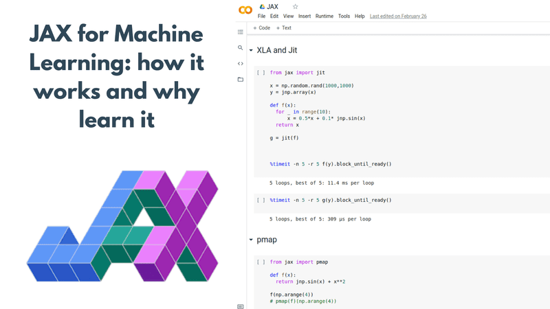

## Table of Contents

## What is JAX and why is it important in the field of machine learning?

JAX is a library in Python that's used a lot in machine learning. It's made by Google and helps with doing math and calculations really fast, especially on things like graphics cards (GPUs) and special chips called TPUs. JAX is special because it can take your regular Python code and make it run much faster without you having to change much. This is really helpful for machine learning because you often need to do the same calculations over and over again on big sets of data.

One of the big reasons JAX is important in machine learning is because it's good at something called automatic differentiation. This means JAX can figure out how to change the numbers in your model to make it better, without you having to do a lot of math by hand. For example, if you're trying to teach a computer to recognize pictures, JAX can help it learn faster by figuring out which parts of the picture are important. This makes it easier for researchers and engineers to build and improve machine learning models quickly and efficiently.

## How does JAX differ from other machine learning frameworks like TensorFlow and PyTorch?

JAX is different from TensorFlow and PyTorch in a few important ways. First, JAX is built around functional programming ideas, which means it likes to work with functions that don't change things outside of themselves. This makes it easier to make sure your code works the same way every time you run it, which is really important for research and testing. In contrast, TensorFlow and PyTorch are more flexible and let you change things more easily, which can be good for building models quickly but can also make it harder to keep track of what's going on.

Another big difference is how JAX handles speed and hardware. JAX is designed to be very fast on GPUs and TPUs, using something called just-in-time (JIT) compilation. This means it can take your Python code and turn it into super fast code that runs directly on the hardware. TensorFlow and PyTorch also have ways to make things faster, but they might need more work from you to get the same speed. For example, if you have a simple function in JAX, it can be compiled and run very quickly like this: ```python
import jax
import jax.numpy as jnp

@jax.jit
def simple_function(x):
    return jnp.sum(jnp.sin(x))

result = simple_function(jnp.array([1.0, 2.0, 3.0]))
print(result)
``` This simplicity and speed make JAX a great choice for researchers who need to run lots of experiments quickly.

Lastly, JAX's automatic differentiation is a bit different too. While TensorFlow and PyTorch also have this feature, JAX's approach is simpler and more straightforward. In JAX, you can easily get the derivative of a function by using the `jax.grad` function. For example, if you want to find the derivative of $$ f(x) = x^2 $$, you can do it like this: ```python
import jax

def f(x):
    return x**2

df = jax.grad(f)
print(df(3.0))  # This will print 6.0
``` This ease of use makes JAX very appealing for people who want to quickly test out new ideas in machine learning.

## What are the key features of JAX that make it suitable for machine learning tasks?

JAX is great for [machine learning](/wiki/machine-learning) because it's really fast and can work well with GPUs and TPUs. It does this using something called just-in-time (JIT) compilation, which means it can take your Python code and make it run super fast on the hardware. For example, if you have a simple function, you can use JAX to make it run faster like this: ```python
import jax
import jax.numpy as jnp

@jax.jit
def simple_function(x):
    return jnp.sum(jnp.sin(x))

result = simple_function(jnp.array([1.0, 2.0, 3.0]))
print(result)
``` This ability to speed up calculations is really important in machine learning, where you often need to do the same thing over and over again on big sets of data.

Another key feature of JAX is its automatic differentiation. This means JAX can figure out how to change the numbers in your model to make it better without you having to do a lot of math by hand. For example, if you want to find the derivative of $$ f(x) = x^2 $$, you can do it easily in JAX like this: ```python
import jax

def f(x):
    return x**2

df = jax.grad(f)
print(df(3.0))  # This will print 6.0
``` This makes it easier for researchers and engineers to build and improve machine learning models quickly and efficiently.

## How can one install JAX and set up the environment for machine learning projects?

To install JAX, you'll need to use pip, which is a tool that helps you install Python packages. Open your command line and type `pip install jax jaxlib` to get the basic version of JAX. If you want to use JAX with your GPU to make things faster, you'll need to install a special version. For NVIDIA GPUs, you can install it by typing `pip install jax[cuda]` and following the instructions to choose the right version for your GPU. For other types of GPUs, you might need to look up the specific instructions on the JAX website.

Once JAX is installed, setting up your environment for machine learning projects is pretty straightforward. You'll need to import JAX and its numpy-like library at the start of your code like this: ```python
import jax
import jax.numpy as jnp
``` This allows you to use JAX's fast math functions. If you want to make your functions run even faster, you can use the `@jax.jit` decorator to tell JAX to compile your function for better performance. For example, if you want to speed up a simple function, you can do it like this: ```python
@jax.jit
def simple_function(x):
    return jnp.sum(jnp.sin(x))

result = simple_function(jnp.array([1.0, 2.0, 3.0]))
print(result)
``` This setup will get you ready to start building and running your machine learning models with JAX.

## What is just-in-time (JIT) compilation in JAX and how does it benefit machine learning models?

Just-in-time (JIT) compilation in JAX is a way to make your code run faster. When you use the `@jax.jit` decorator on a function, JAX turns your Python code into a special version that can run directly on the hardware, like GPUs or TPUs. This means your function can be much faster than if it was just normal Python code. For example, if you have a function that does a lot of math, you can use JIT compilation to make it run quicker like this: ```python
import jax
import jax.numpy as jnp

@jax.jit
def fast_function(x):
    return jnp.sum(jnp.sin(x))

result = fast_function(jnp.array([1.0, 2.0, 3.0]))
print(result)
``` This is really helpful in machine learning because you often need to do the same math over and over again on big sets of data.

Using JIT compilation in JAX helps make machine learning models run faster. When you're training a model, you need to do a lot of calculations many times. With JIT compilation, these calculations can be done much more quickly. This speed can make a big difference in how long it takes to train your model. For example, if you're trying to teach a computer to recognize pictures, the faster calculations can help it learn faster by quickly figuring out which parts of the picture are important. This makes it easier for researchers and engineers to build and improve machine learning models more efficiently.

## How can JAX be used to implement basic neural networks?

To implement a basic [neural network](/wiki/neural-network) using JAX, you first need to define the structure of your network. This means deciding how many layers you want and how many neurons in each layer. For example, you might have an input layer, one or more hidden layers, and an output layer. You can use JAX's numpy-like functions to create these layers. Here's a simple example of a neural network with one hidden layer: ```python
import jax
import jax.numpy as jnp

def init_params(layer_sizes):
    params = []
    for n_in, n_out in zip(layer_sizes[:-1], layer_sizes[1:]):
        params.append({
            'weights': jax.random.normal(jax.random.PRNGKey(0), (n_in, n_out)),
            'biases': jnp.zeros(n_out)
        })
    return params

def forward(params, x):
    *hidden, last = params
    for layer in hidden:
        x = jax.nn.relu(jnp.dot(x, layer['weights']) + layer['biases'])
    return jnp.dot(x, last['weights']) + last['biases']

layer_sizes = [2, 3, 1]  # 2 input neurons, 3 hidden neurons, 1 output neuron
params = init_params(layer_sizes)
x = jnp.array([[1.0, 2.0]])  # Example input
output = forward(params, x)
print(output)
``` This code defines the network's parameters and a forward pass function to compute the output given an input.

Training this neural network involves updating the parameters to minimize a loss function. In JAX, you can use automatic differentiation to find the gradient of the loss with respect to the parameters. Then, you can use an optimization algorithm like gradient descent to update the parameters. Here's how you might do this: ```python
def loss(params, x, y):
    return jnp.mean((forward(params, x) - y) ** 2)

def update(params, x, y, learning_rate):
    grads = jax.grad(loss)(params, x, y)
    return [
        {
            'weights': param['weights'] - learning_rate * grad['weights'],
            'biases': param['biases'] - learning_rate * grad['biases']
        }
        for param, grad in zip(params, grads)
    ]

# Example training loop
x = jnp.array([[1.0, 2.0], [2.0, 3.0], [3.0, 4.0]])
y = jnp.array([[0.0], [1.0], [2.0]])
learning_rate = 0.01
for _ in range(1000):  # Train for 1000 iterations
    params = update(params, x, y, learning_rate)

final_output = forward(params, x)
print(final_output)
``` This code shows how to compute the loss, calculate the gradients, and update the parameters to train the network. By running this loop, the network learns to predict the output values based on the input data.

## What are JAX's automatic differentiation capabilities and how do they assist in optimizing machine learning models?

JAX's automatic differentiation helps you find out how to make your machine learning models better without doing a lot of math by hand. It can figure out the derivative of any function you write. For example, if you have a function $$ f(x) = x^2 $$, JAX can easily find its derivative. You can do this by using `jax.grad` like this: ```python
import jax

def f(x):
    return x**2

df = jax.grad(f)
print(df(3.0))  # This will print 6.0
``` This feature is really useful because it lets you see how changing the numbers in your model affects the results, which is key to making your model better.

Automatic differentiation in JAX helps you optimize machine learning models by making it easy to update the model's parameters. When you're training a model, you want to change the parameters to make the model's predictions closer to the right answers. JAX can calculate the gradients, which show you how to change the parameters to reduce the error. You can then use these gradients in an optimization algorithm like gradient descent to update your model. For example, you can use JAX to train a simple neural network like this: ```python
def loss(params, x, y):
    return jnp.mean((forward(params, x) - y) ** 2)

def update(params, x, y, learning_rate):
    grads = jax.grad(loss)(params, x, y)
    return [
        {
            'weights': param['weights'] - learning_rate * grad['weights'],
            'biases': param['biases'] - learning_rate * grad['biases']
        }
        for param, grad in zip(params, grads)
    ]
``` This way, JAX's automatic differentiation helps you make your machine learning models work better and faster.

## How does JAX handle parallelism and how can it be utilized to speed up machine learning computations?

JAX handles parallelism by letting you use multiple processors or GPUs at the same time to do your calculations faster. This is really helpful in machine learning because you often have to do the same math over and over again on big sets of data. JAX has a special function called `jax.pmap` that helps you split your work across different processors. For example, if you have a function that does some math on a list of numbers, you can use `jax.pmap` to make it run on multiple devices like this: ```python
import jax
import jax.numpy as jnp

def my_function(x):
    return jnp.sum(jnp.sin(x))

devices = jax.devices()  # Get available devices
x = jnp.array([jnp.arange(8.0)] * len(devices))  # Create data for each device
result = jax.pmap(my_function)(x)
print(result)
``` This way, JAX can make your machine learning computations much faster.

To speed up machine learning computations, you can use JAX's ability to compile your functions with just-in-time (JIT) compilation. This means JAX can turn your Python code into super fast code that runs directly on the hardware. For example, if you have a function that you want to run many times, you can use the `@jax.jit` decorator to make it run faster like this: ```python
@jax.jit
def fast_function(x):
    return jnp.sum(jnp.sin(x))

result = fast_function(jnp.array([1.0, 2.0, 3.0]))
print(result)
``` Combining JIT compilation with parallelism, you can make your machine learning models train and run much quicker. This is especially useful when you're working with big datasets or complex models that need a lot of calculations.

## Can you explain how to use JAX for more advanced techniques like meta-learning?

JAX can be used for meta-learning, which is a way to teach a model how to learn other tasks quickly. In meta-learning, you want your model to learn how to adapt to new tasks with just a few examples. One popular method for this is called Model-Agnostic Meta-Learning (MAML). In MAML, you train a model on a bunch of different tasks, and the goal is to find a set of starting parameters that can be quickly fine-tuned for any new task. With JAX, you can use automatic differentiation to calculate the gradients needed for MAML. For example, you might define a function to compute the loss for a task and then use `jax.grad` to find the gradients of this loss with respect to the model's parameters. Here's a simple example of how you might start implementing MAML in JAX: ```python
import jax
import jax.numpy as jnp

def meta_train(params, tasks, num_inner_steps, inner_lr, outer_lr):
    for task in tasks:
        x, y = task
        for _ in range(num_inner_steps):
            grads = jax.grad(loss)(params, x, y)
            params = jax.tree_map(lambda p, g: p - inner_lr * g, params, grads)
        meta_grads = jax.grad(lambda p: loss(p, x, y))(params)
        params = jax.tree_map(lambda p, g: p - outer_lr * g, params, meta_grads)
    return params

def loss(params, x, y):
    return jnp.mean((forward(params, x) - y) ** 2)

# Example usage
tasks = [...]  # List of tasks with input-output pairs
params = init_params(layer_sizes)  # Initialize model parameters
updated_params = meta_train(params, tasks, num_inner_steps=5, inner_lr=0.01, outer_lr=0.001)
``` This code shows how to update the parameters over multiple tasks to make them better at learning new tasks quickly.

Another advanced technique you can use JAX for is Few-Shot Learning, which is closely related to meta-learning. In Few-Shot Learning, you want your model to learn new tasks with just a few examples. JAX's ability to handle fast computations and automatic differentiation makes it perfect for this. For example, you might use a method like Prototypical Networks, where you find the average (or "prototype") of each class from a few examples and then classify new examples based on their distance to these prototypes. With JAX, you can quickly calculate these prototypes and distances using its numpy-like functions and JIT compilation to speed up the process. Here's a basic example of how you might implement a simple Few-Shot Learning approach with JAX: ```python
import jax
import jax.numpy as jnp

def compute_prototypes(support_set, support_labels, num_classes):
    prototypes = jnp.zeros((num_classes, support_set.shape[-1]))
    for c in range(num_classes):
        prototypes = prototypes.at[c].set(jnp.mean(support_set[support_labels == c], axis=0))
    return prototypes

def classify(query_set, prototypes):
    distances = jnp.sum((query_set[:, None, :] - prototypes[None, :, :]) ** 2, axis=-1)
    return jnp.argmin(distances, axis=-1)

# Example usage
support_set = jnp.array([...])  # Support set examples
support_labels = jnp.array([...])  # Support set labels
query_set = jnp.array([...])  # Query set examples
num_classes = 5  # Number of classes

prototypes = compute_prototypes(support_set, support_labels, num_classes)
predictions = classify(query_set, prototypes)
``` This code demonstrates how JAX can help you quickly implement and experiment with Few-Shot Learning methods.

## What are some common challenges faced when using JAX for machine learning and how can they be overcome?

One common challenge when using JAX for machine learning is managing the functional programming style it encourages. JAX works best when you write code that doesn't change things outside the functions, which can be different from how you might usually write code. This can make it harder to keep track of what's going on, especially if you're used to other frameworks like TensorFlow or PyTorch. To overcome this, you can use JAX's `jax.tree_map` function to update parameters in a way that fits JAX's style. For example, if you want to update the parameters of a model, you can do it like this: ```python
import jax

def update_params(params, grads, learning_rate):
    return jax.tree_map(lambda p, g: p - learning_rate * g, params, grads)
``` This way, you can keep your code clean and make sure it works well with JAX's functional approach.

Another challenge is making sure your code runs fast on different types of hardware like GPUs and TPUs. JAX can speed up your code a lot, but you need to use its features like just-in-time (JIT) compilation and parallelism correctly. Sometimes, you might find that your code doesn't run as fast as you expect, or it might not work at all on certain hardware. To solve this, you can use the `@jax.jit` decorator to compile your functions for better performance, and `jax.pmap` to run your code on multiple devices. For example, if you want to speed up a function and run it on multiple GPUs, you can do it like this: ```python
import jax
import jax.numpy as jnp

@jax.jit
def fast_function(x):
    return jnp.sum(jnp.sin(x))

devices = jax.devices()
x = jnp.array([jnp.arange(8.0)] * len(devices))
result = jax.pmap(fast_function)(x)
print(result)
``` By using these tools the right way, you can make your machine learning models run much faster and work well on different types of hardware.

## How does JAX integrate with other tools and libraries commonly used in the machine learning ecosystem?

JAX integrates well with other tools and libraries in the machine learning ecosystem, making it easier for you to use it alongside other popular frameworks. For example, JAX can work with libraries like NumPy, which is great because you can use familiar functions and then switch to JAX's version, `jax.numpy`, for faster computations. If you're using a library like scikit-learn for tasks like data preprocessing or model evaluation, you can easily pass your data between JAX and scikit-learn. This means you can use JAX for the heavy math parts of your machine learning project while still using other tools for other parts of your workflow.

Another important integration is with visualization libraries like Matplotlib. After you've done your calculations with JAX, you can use Matplotlib to plot your results and see how your model is doing. For example, if you want to visualize the loss of your model over time, you can use JAX to calculate the loss and then use Matplotlib to create a graph. This makes it easier to understand and improve your models. Additionally, JAX can be used with other machine learning libraries like Flax, which is built on top of JAX and provides higher-level abstractions for building neural networks. This means you can use JAX's speed and flexibility while still benefiting from Flax's easier-to-use interface for more complex models.

## What are some real-world applications or case studies where JAX has been successfully used in machine learning projects?

One real-world application of JAX in machine learning is in [reinforcement learning](/wiki/reinforcement-learning), particularly in the development of [agents](/wiki/agents) for playing games. For example, DeepMind used JAX to create the AlphaTensor algorithm, which is a system that can discover new matrix multiplication algorithms. By leveraging JAX's fast computations and automatic differentiation, researchers were able to train models that outperform traditional algorithms in terms of efficiency. This project shows how JAX can be used to push the boundaries of what's possible in algorithmic discovery and optimization, making it a valuable tool in cutting-edge research.

Another successful use of JAX is in the field of natural language processing (NLP). Google's T5 model, which is a text-to-text transfer transformer, was developed using JAX. This model can handle a wide range of NLP tasks, from translation to summarization, by converting them into a text-to-text format. JAX's ability to handle large-scale computations on TPUs made it possible to train such a large and complex model efficiently. This case study demonstrates how JAX's speed and scalability can be applied to improve performance in real-world NLP applications, helping to process and understand vast amounts of text data.

In the realm of scientific computing, JAX has been used to develop models for climate and weather prediction. For instance, researchers at the University of Oxford used JAX to create a neural network that can predict weather patterns more accurately than traditional methods. By using JAX's automatic differentiation and JIT compilation, they were able to train models that can handle the complex and high-dimensional data involved in weather forecasting. This application highlights how JAX's capabilities can be extended beyond traditional machine learning tasks to solve important problems in other scientific fields.