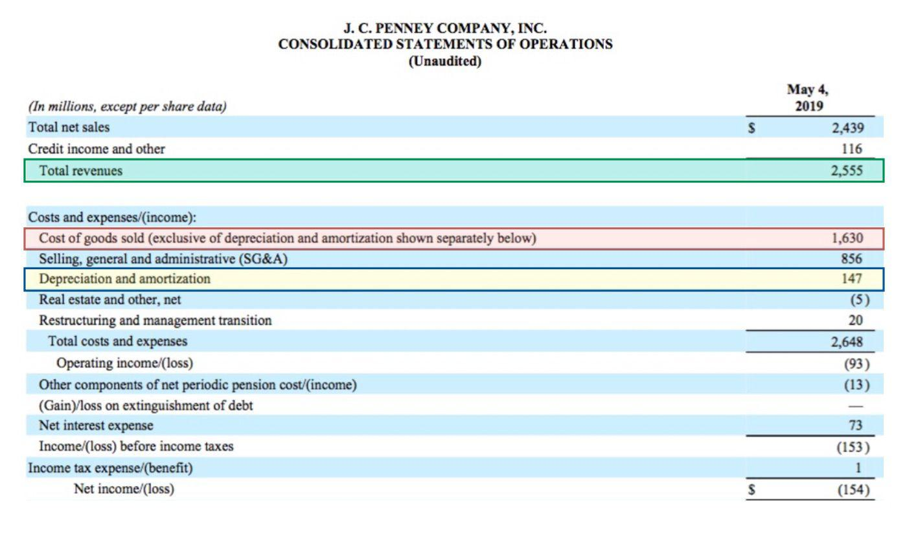

The retail sector has undergone significant upheaval in recent years, with department store giants Kohl's and J.C. Penney navigating serious financial turmoils. These challenges are emblematic of the larger shifts within the industry, where traditional retail models are increasingly pressured by evolving consumer preferences and the disruptive influence of e-commerce. Koh's, facing potential insolvency, highlights a stark reality for many traditional retailers. Meanwhile, J.C. Penney, which filed for bankruptcy in 2020 amidst a global pandemic, represents a case of both caution and optimism as it seeks recovery through strategic restructuring and partnerships.

This article examines the factors contributing to Kohl's precarious financial situation and evaluates the role J.C. Penney's restructuring might play in shaping the future of department store chains. We will also explore the transformative impact of algorithmic trading on retail financial stability, a technology-driven approach that provides vast implications for supply chain management, pricing strategies, and market forecasting.

Understanding these multifaceted dynamics is vital for consumers and investors aiming to navigate the complexities of the retail market. This discussion will encompass the intersection of financial distress, strategic corporate decisions, and technological innovation, offering insights into the evolving landscape facing department stores. Through a comprehensive analysis, we aim to illuminate the intricate relationship between these factors, empowering stakeholders with the knowledge needed to make prudent and informed decisions.

## Table of Contents

## Understanding the Challenges Faced by Kohl's

Kohl's, a prominent player in the American department store sector, has been grappling with numerous challenges that threaten its financial stability and long-term viability. As consumer behavior continues to evolve, driven largely by the rise of e-commerce and shifting preferences towards more personalized and convenient shopping experiences, Kohl's finds itself under mounting pressure to adapt.

**Online Retail Competition and Consumer Preferences**

The rapid expansion of online retailers such as Amazon and the heightened expectations for quick, seamless shopping experiences have disrupted traditional brick-and-mortar retail models. Consumers increasingly favor the convenience, variety, and competitive pricing offered by e-commerce platforms. This shift has significantly impacted foot traffic in physical stores, compelling retailers like Kohl's to rethink their strategy and operations. According to [Forbes](https://www.forbes.com/), this trend has resulted in a noticeable decline in in-store shopping, which has directly affected sales and revenue figures.

**Financial Strain and Innovation Initiatives**

Kohl's financial performance has shown signs of strain as it endeavors to compete with digital retail giants. In response, the company has undertaken numerous initiatives aimed at reinvigorating customer engagement and boosting store visits. These include partnerships with esteemed brands, refreshing store layouts, and integrating technological advancements such as mobile checkouts. Despite these efforts, financial metrics have been underwhelming, with stagnating growth and profitability posing substantial challenges.

**Investors' Pressure and Takeover Suggestions**

The dwindling financial returns have not gone unnoticed by investors, who have voiced concerns about Kohl's strategic direction. Some investors have labeled the company as stagnant, prompting discussions around potential takeover opportunities. The notion that a sale or merger might inject fresh business strategies and capital into Kohl's has been met with mixed reactions. A takeover could potentially lead to significant changes in management, operations, and market positioning.

**Analyzing Kohl's Vulnerabilities**

Kohl's vulnerability lies in its struggle to keep pace with the swift changes in consumer behavior and technological advancements. Externally, the competitive landscape continues to intensify with new entrants and innovations in the retail technology space. Internally, operational complexity, supply chain inefficiencies, and an inability to meaningfully differentiate from competitors exacerbate its financial woes. These factors collectively impair Kohl's potential to effectively respond to market demands, posing a risk to its economic health.

In summary, Kohl's is at a pivotal juncture where it needs to critically assess its strategic blueprint. The intersection of challenges from online competitors and internal operational hurdles creates an environment in which agility and innovation are indispensable. Failure to appropriately address these issues could further erode its market position, emphasizing the necessity for decisive and forward-thinking strategies.

## J.C. Penney's Post-Bankruptcy Strategy

J.C. Penney, a leading mid-tier American department store chain, encountered significant financial difficulties that culminated in its bankruptcy filing in 2020. This decision was exacerbated by the COVID-19 pandemic, which severely disrupted retail operations worldwide. The bankruptcy marked a pivotal point for J.C. Penney, a company with over a century-long legacy in the retail industry.

Following its bankruptcy filing, J.C. Penney underwent a restructuring process that involved a buyout by Simon Property Group and Brookfield Asset Management in a joint venture. This move generated optimism about the company's future, suggesting a path towards recovery and potential expansion. The buyout aimed to stabilize J.C. Penney's operations while preserving its considerable retail footprint across the United States.

Post-bankruptcy, J.C. Penney's strategic direction included efforts to streamline its operations and leverage shared resources with other department store chains, including a notable partnership with Kohl's. This collaboration focused on merging capabilities, optimizing supply chains, and potentially sharing store layouts or co-locating in existing retail spaces. Such partnerships hint at innovative models for retail survival, especially in an era where consumer behavior is rapidly evolving towards digital and experiential retailing.

A critical aspect of J.C. Penney's strategy involved redefining its brand identity. Historically, the company catered to middle-class consumers, offering a range of affordable apparel and home goods. Moving forward, J.C. Penney aimed to revamp its brand image to resonate with a more diverse and digital-savvy customer base. This involved enhancing its e-commerce platforms and integrating more agile marketing techniques to better engage potential customers.

Understanding J.C. Penney's post-bankruptcy strategy provides valuable insights into the potential trajectories available for other struggling department stores. As retailers navigate the aftermath of economic disruptions, the ability to adapt through strategic partnerships, brand reinvention, and digital transformation becomes crucial. These strategies are not only vital for survival but can also position companies to thrive in a highly competitive and fast-changing retail environment.

The future of J.C. Penney remains uncertain, yet its efforts post-bankruptcy highlight a broader narrative of resilience and adaptation within the retail industry. By analyzing J.C. Penney's strategic maneuvers, other traditional retailers can glean important lessons on navigating financial distress and harnessing opportunities for sustainable growth amidst adversity.

## The Role of Algorithmic Trading in Retail Industries

Algorithmic trading, a modern approach that employs computer-processed algorithms, has significantly transformed the financial trading environment. This advancement has allowed firms to process vast amounts of data and execute trades at lightning-fast speeds, often with minimal human intervention. The retail industry, facing immense pressure from online competitors and rapidly changing consumer demands, is increasingly turning to these technologies to remain competitive.

Retail giants have started integrating [algorithmic trading](/wiki/algorithmic-trading) strategies to enhance their operational efficiency. Techniques such as predictive analytics and [machine learning](/wiki/machine-learning) allow companies to optimize supply chain processes, dynamic pricing, and inventory management. For example, algorithms can analyze historical sales data, market trends, and consumer behavior to predict demand for certain products, ensuring that stock levels are managed more precisely. This not only reduces holding costs but also minimizes the risk of stockouts or overstock situations.

Kohl's and J.C. Penney, two major players in the retail sector, are poised to benefit from algorithmic trading in terms of operational efficiency and financial stability. By leveraging these advanced technologies, they can forecast market trends more accurately, optimize pricing strategies, and enhance customer engagement. For instance, algorithmic strategies can assist in deciding when to mark down products or introduce promotions, ensuring these actions align with consumer purchasing patterns and competition pricing.

Moreover, algorithmic trading can help these retailers to streamline their supply chain operations. Complex algorithms can analyze a variety of factors such as supplier performance, transportation costs, and demand variability to predict potential disruptions and optimize logistics. This approach not only reduces costs but also improves service delivery and customer satisfaction.

Despite its substantial benefits, the adoption of algorithmic trading is not without risks. The reliance on complex algorithms can lead to unforeseen issues such as system failures or errors in data input, which might result in inaccurate forecasts or financial losses. Furthermore, the use of personal data to power these algorithms has raised privacy concerns, necessitating stringent data security measures and compliance with data protection regulations.

In conclusion, the adoption of algorithmic trading by retailers such as J.C. Penney and Kohl's represents a significant opportunity to enhance their operational frameworks and maintain a competitive edge in the evolving retail landscape. By understanding and mitigating the associated risks, these companies can harness the full potential of algorithmic trading, leading to improved financial performance and customer satisfaction in an increasingly digital marketplace.

## Potential Outcomes and Implications for the Industry

Kohl’s potential bankruptcy and J.C. Penney's post-bankruptcy recovery highlight critical evolutions within the retail industry, presenting both challenges and opportunities. A successful leveraged buyout or strategic technology investment could redefine conventional retail models, potentially transforming how businesses operate and engage with customers. 

Leveraged buyouts, often involving borrowing capital to acquire a company, can provide immediate financial relief and allow for restructuring. However, they also introduce the risk of significant debt, requiring meticulous management to avoid future financial distress. If Kohl's pursues this path and succeeds, it could serve as a model for other struggling retailers on how to navigate fiscal challenges. The question remains whether Kohl's can innovate its business model to adapt to market demands while managing potential debt incurred through a buyout.

Strategic technological investments, especially in areas such as e-commerce platforms, AI, and data analytics, are proving pivotal for retail success. Companies integrating AI-driven algorithms can optimize supply chains and customer engagement, providing tailored shopping experiences that increase conversion rates and foster brand loyalty. By leveraging technology, retailers can gain deeper insights into consumer behaviors, allowing for precise inventory management and personalization strategies that drive revenue growth.

Consumer implications entail a possible shift in brand engagement as major retailers embrace technology. Enhanced personalization and streamlined shopping processes could elevate consumer satisfaction but may also lead to increased data privacy concerns. For investors, these shifts mean potential returns hinging on a company's adaptability to technological advancements and financial restructuring strategies. Companies perceived as tech-forward and nimble in financial strategy may attract more investor interest.

Competitors in the retail sector may be prompted to either accelerate their tech investments or look for acquisition opportunities among distressed retailers. This competitive pressure could stimulate innovation but also consolidate market players, impacting diversity and consumer choice.

Predicting future retail trends indicates a trajectory towards deeper integration of technology in every aspect of retail operations. Retailers that harness technology effectively and engage in prudent financial strategies will likely stabilize and succeed. Conversely, failing to adapt to these trends could result in further financial decline and potentially more bankruptcies.

Overall, Kohl's and J.C. Penney's scenarios embody critical lessons in financial and strategic adaptation. Stakeholders must consider the intricate balance between financial risk, strategic innovation, and consumer engagement when navigating the evolving retail landscape.

## Conclusion

Kohl's and J.C. Penney illustrate the enduring challenges that traditional retail businesses face amidst a rapidly evolving economic environment. Financial difficulties, coupled with the need for strategic adjustments, underscore the complexity of maintaining competitiveness in an age increasingly dominated by e-commerce and digital solutions. Both companies have confronted mounting pressure to modernize and align their business models with shifting consumer behavior and technological advances.

The integration of algorithmic trading and data analytics represents a double-edged sword, offering the potential to significantly improve operational efficiencies and strategic outcomes. At the same time, these technologies demand substantial investment and [carry](/wiki/carry-trading) inherent risks that require careful management. For businesses like Kohl's and J.C. Penney, whose financial situations are already precarious, the decision to leverage such innovations must be weighed against the possibility of exacerbating existing vulnerabilities.

Understanding these multifaceted dynamics is crucial for stakeholders aiming to navigate the future landscape of retail investing and consumption. Informed decisions hinge on a thorough grasp of market trends, technologies, and the strategic maneuvers employed by traditional retailers striving for relevance and success. As the retail sector continues to adapt and transform, maintaining awareness of financial and technological developments will be vital.

For investors, consumers, and competitors alike, recognizing the signs of successful adaptation or impending failure offers the chance to mitigate risks and capitalize on opportunities within the industry. As the stories of Kohl's and J.C. Penney continue to unfold, they provide valuable insights into the broader narrative of retail evolution, prompting stakeholders to remain vigilant and adaptable.

## References & Further Reading

[1]: Eisen, B. (2020). ["J.C. Penney to Be Acquired by Simon and Brookfield in Rescue Deal"](https://corporate.jcpenney.com/2020/09/09/jcpenney-reaches-agreement-in-principle-with-brookfield-property-group-and-simon-property-group-to-acquire-retail-and-operating-assets/). The Wall Street Journal.

[2]: LaVecchia, O. & Mitchell, S. (2016). ["Amazon’s Stranglehold: How the Company’s Tightening Grip on the Economy Is Stifling Competition, Eroding Jobs, and Threatening Communities"](https://ilsr.org/articles/amazon-stranglehold/). Institute for Local Self-Reliance.

[3]: Yeomans, J. (2020). ["The Fall of J.C. Penney – How a 118-year-old U.S. Retail Giant Collapsed"](https://gis.vgsi.com/framinghamma/Parcel.aspx?pid=14452). Forbes.

[4]: Chamberlain, T. W. (2019). ["Kohl's: Restructuring For A Tough Retail Environment"](https://jamanetwork.com/journals/jamanetworkopen/fullarticle/2828223). Seeking Alpha.

[5]: Mullins, B. (2021). ["How Kohl's Beat Back the Activist Hedge Funds Wanting to Take Over Its Board"](https://www.modernretail.co/retailers/a-timeline-of-kohls-activist-investor-battle/). The Wall Street Journal.