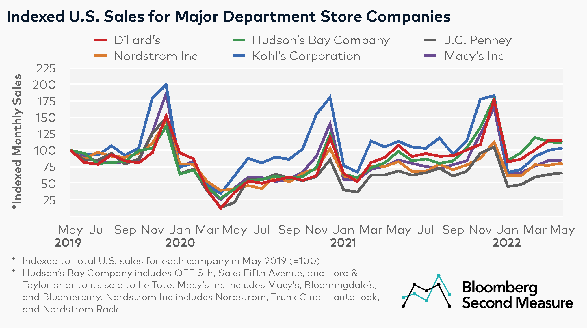

## Table of Contents

## What is bankruptcy and how does it affect a company like J.C. Penney?

Bankruptcy is when a person or a company cannot pay back the money they owe. It's like telling everyone that you can't pay your bills and need help to fix your money problems. There are different types of bankruptcy, but they all mean that the person or company is in big financial trouble. When a company goes bankrupt, it might have to close some stores, sell things it owns, or even stop doing business completely.

For a company like J.C. Penney, bankruptcy can be really tough. J.C. Penney is a big store that sells clothes and other things. If J.C. Penney goes bankrupt, it might have to close some of its stores to save money. This means fewer people can shop there, and some workers might lose their jobs. The company might also try to make deals with the people it owes money to, so it can keep going. But if things don't get better, J.C. Penney might have to close down for good.

## When did J.C. Penney file for bankruptcy and what was the immediate impact?

J.C. Penney filed for bankruptcy on May 15, 2020. This was a big deal because it meant the company was in serious money trouble and needed help to keep going. The company had been struggling for a while, and the bankruptcy was a way to try and fix things.

Right after filing for bankruptcy, J.C. Penney had to close some of its stores. This was part of a plan to save money and pay back what they owed. Some people who worked at those stores lost their jobs, which was really hard for them. The company also started talking to the people it owed money to, trying to make deals so it could keep running.

## How has J.C. Penney's bankruptcy process unfolded over time?

After J.C. Penney filed for bankruptcy in May 2020, the company started working on a plan to fix its money problems. They closed a lot of stores, about 150 of them, to save money. This was tough because it meant fewer places for people to shop and some workers lost their jobs. J.C. Penney also got help from a company called Simon Property Group and Brookfield Property Partners. These companies bought J.C. Penney and helped it stay open by giving it money and new ideas.

Over time, J.C. Penney kept working on getting better. They focused on selling things online more, because a lot of people were shopping that way. They also tried to make their stores nicer and sell things that people really wanted. By the end of 2020, J.C. Penney came out of bankruptcy. This meant they had a new plan and were ready to keep going, but they had to keep working hard to make sure they didn't get into money trouble again.

## What are the key differences between Chapter 11 and Chapter 7 bankruptcy, and which did J.C. Penney use?

Chapter 11 and Chapter 7 are two types of bankruptcy that help people and companies with money problems, but they work in different ways. Chapter 11 is like a plan to fix things. It lets a company keep running while it figures out how to pay back what it owes. The company might close some stores or sell things it owns to get money. It's all about making a new plan to keep the business going. Chapter 7 is more like giving up. It means the company can't fix its money problems and has to stop doing business. Everything the company owns gets sold to pay back what it owes, and then the company closes down for good.

J.C. Penney used Chapter 11 bankruptcy. When they filed for bankruptcy in May 2020, they wanted to keep the company going, not close it down. They made a plan to close some stores, get help from other companies, and focus more on selling things online. By the end of 2020, J.C. Penney came out of bankruptcy with a new plan to keep going.

## How has J.C. Penney's store operations and customer experience changed post-bankruptcy?

After coming out of bankruptcy, J.C. Penney made big changes to how their stores work and how they treat customers. They closed a lot of stores to save money, so now there are fewer places for people to shop. But the stores that stayed open got a makeover. They tried to make the stores look nicer and easier to shop in. J.C. Penney also started selling more things that people really want, like clothes and home stuff. They wanted to make sure that when people came to their stores, they found things they liked.

J.C. Penney also focused a lot on selling things online. They knew that more and more people were shopping on the internet, so they made their website better and easier to use. They also started offering things like free shipping and easy returns to make shopping online better for customers. All these changes were part of J.C. Penney's plan to make sure they didn't get into money trouble again and to keep their customers happy.

## What financial restructuring has J.C. Penney undergone during its bankruptcy?

During its bankruptcy, J.C. Penney went through a big financial change to fix its money problems. They closed about 150 stores to save money and pay back what they owed. This was a tough choice because it meant fewer places for people to shop and some workers lost their jobs. J.C. Penney also got help from Simon Property Group and Brookfield Property Partners. These companies bought J.C. Penney and gave it money to keep going. They also helped J.C. Penney make a new plan to do better in the future.

J.C. Penney also worked on making deals with the people it owed money to. This was important because it helped them keep the business running while they figured out how to pay everyone back. By the end of 2020, J.C. Penney came out of bankruptcy with a new plan. They focused more on selling things online and making their stores nicer. All these changes were part of their big financial fix to make sure they didn't get into money trouble again.

## How does J.C. Penney's bankruptcy compare to other retail bankruptcies in terms of scale and outcome?

J.C. Penney's bankruptcy was a big deal in the world of retail. When they filed for bankruptcy in May 2020, they had to close a lot of stores, about 150 of them, to save money. This was one of the biggest retail bankruptcies in terms of how many stores they closed. But J.C. Penney got help from companies like Simon Property Group and Brookfield Property Partners, who bought them and gave them money to keep going. By the end of 2020, J.C. Penney came out of bankruptcy with a new plan to focus more on selling things online and making their stores nicer.

Compared to other retail bankruptcies, J.C. Penney's outcome was better than some but not as good as others. For example, Toys "R" Us filed for bankruptcy in 2017 and ended up closing all their stores in the U.S. They couldn't fix their money problems and had to stop doing business completely. On the other hand, companies like Macy's and Neiman Marcus also went through bankruptcy around the same time as J.C. Penney, but they managed to keep most of their stores open and came out of bankruptcy with new plans to do better. J.C. Penney's bankruptcy was in the middle - they had to close a lot of stores, but they managed to keep going and make a new plan to fix their money problems.

## What role have creditors played in J.C. Penney's bankruptcy proceedings?

Creditors are the people or companies that J.C. Penney owed money to when they filed for bankruptcy. During the bankruptcy, these creditors played a big role in helping J.C. Penney figure out how to pay them back. J.C. Penney had to talk to their creditors and make deals with them. This was important because it helped J.C. Penney keep running while they worked on fixing their money problems. The creditors agreed to let J.C. Penney pay them back over time instead of all at once, which gave J.C. Penney the time they needed to make a new plan.

Some creditors, like Simon Property Group and Brookfield Property Partners, did more than just make deals. They actually bought J.C. Penney and gave them money to help them stay open. This was a big help because it meant J.C. Penney could keep going and try to get better. By working with their creditors, J.C. Penney was able to come out of bankruptcy with a new plan to focus on selling things online and making their stores nicer. The creditors' help was a key part of J.C. Penney's plan to fix their money problems and keep the business going.

## How has Kohl's financial health and strategy differed from J.C. Penney leading up to and during J.C. Penney's bankruptcy?

Kohl's and J.C. Penney had different financial health and strategies leading up to and during J.C. Penney's bankruptcy. Kohl's was in better shape financially. They didn't have as much money trouble as J.C. Penney. Kohl's focused on selling things that people really wanted, like clothes and home stuff. They also made their stores nicer and easier to shop in. Kohl's also worked on selling more things online, because they knew more people were shopping that way. This helped them stay strong even when other stores were struggling.

During J.C. Penney's bankruptcy, Kohl's kept doing well. They didn't have to close a lot of stores like J.C. Penney did. Kohl's kept making deals with the people they owed money to, but they didn't need to file for bankruptcy. They kept working on their plan to sell more things online and make their stores better. This helped Kohl's stay out of money trouble and keep going strong, while J.C. Penney had to work hard to fix their problems and come out of bankruptcy with a new plan.

## What market and consumer trends have affected J.C. Penney and Kohl's differently?

Market and consumer trends have hit J.C. Penney and Kohl's in different ways. J.C. Penney struggled a lot because more people started shopping online instead of going to big stores. This trend hurt J.C. Penney because they didn't change fast enough to sell more things online. Also, people wanted to buy different things, like clothes and home stuff, but J.C. Penney didn't always have what people wanted. This made it hard for them to keep up with what customers wanted, and it led to big money problems.

On the other hand, Kohl's did a better job at keeping up with these trends. They saw that more people were shopping online, so they made their website better and easier to use. Kohl's also focused on selling the things that people really wanted, like clothes and home stuff. They made their stores nicer and easier to shop in, which helped them keep customers happy. Because Kohl's was able to change with the market and consumer trends, they didn't have the same money problems as J.C. Penney and were able to stay strong.

## What are the long-term prospects for J.C. Penney post-bankruptcy compared to Kohl's current trajectory?

After coming out of bankruptcy, J.C. Penney is trying to get better and stay in business. They closed a lot of stores to save money and are now focusing more on selling things online. This is important because more people are shopping on the internet. J.C. Penney also wants to make their stores nicer and sell things that people really want. But it's going to be hard for them. They need to keep working on their new plan and make sure they don't get into money trouble again. If they can do this, they might be able to do well in the future, but it's not going to be easy.

Kohl's is doing better right now. They didn't have to go through bankruptcy like J.C. Penney did. Kohl's saw that people were shopping online more, so they made their website better and easier to use. They also focused on selling the things that people really wanted, like clothes and home stuff. Kohl's made their stores nicer and easier to shop in, which helped them keep customers happy. Because Kohl's was able to change with what people wanted, they are in a good spot and likely to keep doing well in the future.

## How have expert analyses and predictions about J.C. Penney's recovery varied, and what are the key factors they consider?

Expert analyses and predictions about J.C. Penney's recovery have been mixed. Some experts think J.C. Penney can do well if they keep working on their new plan. They say that focusing on selling things online and making their stores nicer is a good idea. These experts believe that if J.C. Penney can keep up with what people want and stay out of money trouble, they might be able to get better over time. But other experts are not so sure. They think it will be hard for J.C. Penney to compete with other stores that are already doing well online. They worry that J.C. Penney might not be able to change fast enough to keep up with what people want.

The key factors that experts consider when talking about J.C. Penney's recovery are how well they can sell things online, what they sell in their stores, and how they manage their money. Selling things online is really important because more people are shopping that way. If J.C. Penney can make their website better and easier to use, it could help them a lot. What they sell in their stores also matters. If they can sell things that people really want, like clothes and home stuff, it could help them keep customers happy. And managing their money well is crucial. J.C. Penney needs to make sure they don't get into money trouble again, so they can keep going and get better over time.

## References & Further Reading

[1]: Eisen, B. (2020). ["J.C. Penney to Be Acquired by Simon and Brookfield in Rescue Deal"](https://corporate.jcpenney.com/2020/09/09/jcpenney-reaches-agreement-in-principle-with-brookfield-property-group-and-simon-property-group-to-acquire-retail-and-operating-assets/). The Wall Street Journal.

[2]: LaVecchia, O. & Mitchell, S. (2016). ["Amazon’s Stranglehold: How the Company’s Tightening Grip on the Economy Is Stifling Competition, Eroding Jobs, and Threatening Communities"](https://ilsr.org/articles/amazon-stranglehold/). Institute for Local Self-Reliance.

[3]: Yeomans, J. (2020). ["The Fall of J.C. Penney – How a 118-year-old U.S. Retail Giant Collapsed"](https://gis.vgsi.com/framinghamma/Parcel.aspx?pid=14452). Forbes.

[4]: Chamberlain, T. W. (2019). ["Kohl's: Restructuring For A Tough Retail Environment"](https://jamanetwork.com/journals/jamanetworkopen/fullarticle/2828223). Seeking Alpha.

[5]: Mullins, B. (2021). ["How Kohl's Beat Back the Activist Hedge Funds Wanting to Take Over Its Board"](https://www.modernretail.co/retailers/a-timeline-of-kohls-activist-investor-battle/). The Wall Street Journal.