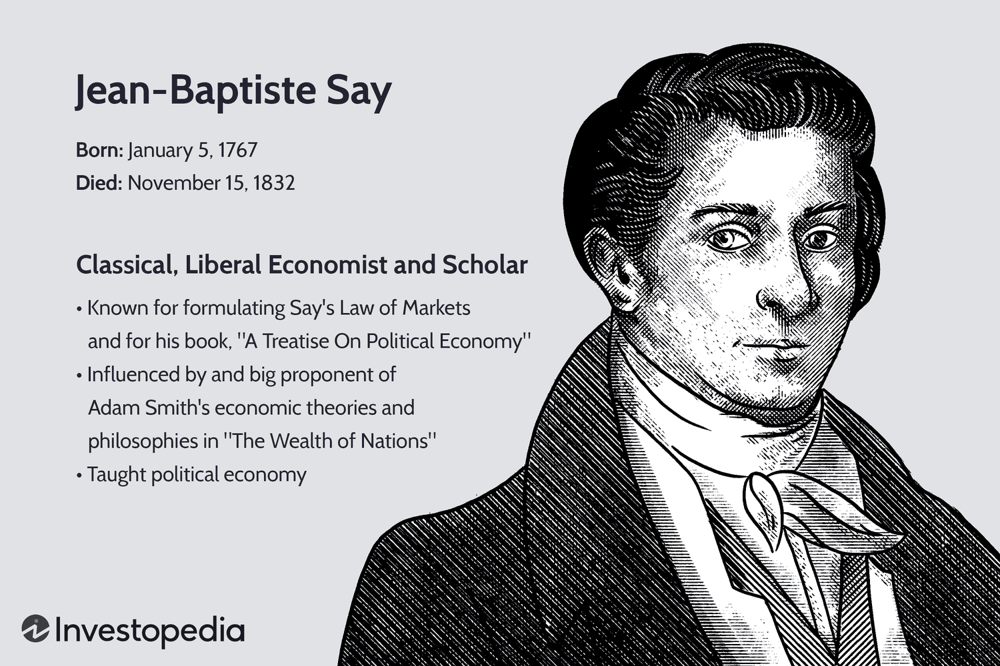

Jean-Baptiste Say, a renowned French classical liberal economist, has had a profound and lasting impact on economic thought. Prominently known for formulating 'Say's Law of Markets,' he proposed a principle that challenges and enhances our understanding of economic functions and growth. This law, which argues that supply creates its own demand, not only shifted the perceptions of market dynamics during his time but also laid the groundwork for future economic theories.

Say's explorations into entrepreneurship showcased his forward-thinking views that emphasized the crucial role of production and innovation in driving economic progress. His ideas were pivotal in advocating for free trade and market self-regulation, influencing neoclassical economic thought.



In today's rapidly evolving economic environment, Say's principles find renewed significance. The advent of modern technologies, particularly algorithmic trading, highlights the fundamental elements of his theories. Algorithmic trading, which automates transactions based on pre-defined criteria, mirrors Say's notion of a market reaching equilibrium through the natural interplay of supply and demand. This technology exemplifies how markets can indeed regulate themselves effectively, a concept that Say fervently supported. 

This article seeks to explore Say's contributions in depth, tracing their implications for our contemporary economic landscape. By examining these connections, particularly within the context of algorithmic trading, we can gain a deeper appreciation for Jean-Baptiste Say's enduring legacy and its influence on modern economic practices.

## Table of Contents

## Early Life and Career

Jean-Baptiste Say was born on January 5, 1767, in Lyon, France, into a Protestant family, which likely influenced his progressive thinking and openness to the economic ideas that would later shape his career. His early education took place in England, a country that was then undergoing significant economic and industrial changes, offering Say perspectives on economic theory and practice that were pioneering for his time. It was during his time in England that Say encountered the seminal works of Adam Smith, particularly "The Wealth of Nations," which had a profound impact on his economic philosophy. Smith's ideas on the invisible hand and the self-regulating nature of markets were foundational in shaping Say's later theoretical contributions, including his most well-known concept, Say's Law of Markets.

Upon returning to France, Say embarked on a career in journalism and became a notable political economist. His work as a journalist allowed him to observe and critique economic policies, providing him with practical insights into economic systems. Say contributed articles and essays that examined the economic transformations occurring in France and beyond, critiquing policies and offering alternatives that emphasized free markets and competition. His writings and observations from this period formed the basis for his later economic theories, which would emphasize the importance of production as a driver of economic prosperity.

Say's early career was marked by an active engagement with the economic thought of his time, enabling him to synthesize various ideas into coherent theories that would influence economic thinking for generations. His exposure to influential economic theories, combined with his practical experience as a journalist, prepared him to make significant contributions to economic thought and policy. His interactions with contemporary economists and thinkers, along with his keen observations of the economic landscape, laid a sturdy foundation for his later works, which continue to resonate in economic discussions today.

## Say's Law of Markets

Jean-Baptiste Say's most widely recognized contribution to economic thought is encapsulated in Say's Law of Markets, a principle often summarized by the phrase "supply creates its own demand." This assertion fundamentally suggests that the act of producing goods and services inherently generates the necessary demand for them. In essence, production is seen as the original source of economic demand. The law is rooted in the classical idea that a healthy economy is characterized by a natural balance between production and consumption, facilitated by the flexibility of prices.

Say's approach to market equilibrium emphasizes the self-regulatory nature of free markets. He postulated that economic equilibrium is attainable when supply and demand are harmonized through price adjustments. This mechanism allows markets to correct themselves without external intervention. When a surplus of goods is produced, prices tend to decrease, subsequently stimulating demand. Conversely, when there is insufficient supply, prices rise, encouraging production. This dynamic interplay between supply and demand operates under the assumption that markets are flexible and responsive to changes.

The principle underlying Say's Law posits that the exchange process in an economy revolves around the concept that goods are ultimately paid for with goods. This idea underscores the interconnectedness of production and consumption, where the output of one industry becomes the input for another. The law suggests that the aggregate supply of goods should theoretically equal the aggregate demand, with money acting merely as a medium of exchange rather than a standalone determinant of demand. Therefore, production is vital because it creates the means for consumption through income generation.

Say's Law implies a level of optimism in market functionality, arguing against the long-term existence of general gluts or widespread overproduction. According to this perspective, temporary imbalances may occur, but the market system contains intrinsic mechanisms to restore balance through price flexibility and resource reallocation. This theoretical framework has significantly influenced classical and neoclassical economic thought, advocating the position that supply-side policies can effectively drive economic growth and stability.

Overall, Say's Law illustrates a vital link between production and market dynamics, highlighting the importance of production as a driver of demand and economic activity. While it has faced criticism and debate, especially in the context of Keynesian economics, Say's formulation continues to offer valuable insights into understanding economic processes and the flow of goods and services within a market.

## Contribution to Economic Thought

Jean-Baptiste Say's contributions to economic thought encompass both theoretical innovations and practical engagements, particularly in the areas of teaching and entrepreneurship. He was a fervent advocate for free trade and competition, postulating that economic growth flourishes best under minimal restrictions on business activities. Say argued that when entrepreneurs and businesses are allowed to operate in a competitive environment with limited interference, innovation and efficiency thrive, leading to overall economic prosperity. 

This perspective was in line with his broader belief in market self-regulation, where individual actors, driven by self-interest, inadvertently contribute to economic balance and growth. Say’s advocacy for free markets was grounded in his faith in the power of competition to regulate prices and allocate resources efficiently. He believed that restrictive trade practices and excessive governmental control could stifle innovation and economic dynamism, thereby hindering development.

Moreover, Say's insights into entrepreneurship were pioneering for his time. He viewed the entrepreneur as a crucial agent of change and innovation within the economy. Entrepreneurs, according to Say, possess the ability to identify opportunities, organize resources, and create value by transforming ideas into viable business ventures. Say highlighted that entrepreneurs bear the risks associated with business activities and, in doing so, play a vital role in driving technological advancement and economic growth.

His discussions on entrepreneurship introduced concepts that resonate with current entrepreneurial theory, underscoring notions of risk-taking, innovation, and value creation. These discussions precede many modern theories of entrepreneurship that emphasize the vital contribution of entrepreneurs to economic systems through the introduction of new products, processes, and business models.

In summary, Jean-Baptiste Say's contributions to economic thought, particularly his advocacy for free trade and his insights into entrepreneurship, laid a foundation that continues to impact economic theory and practice today. His work underscores the critical role of competitive markets and entrepreneurial activities in fostering economic development and innovation.

## Legacy and Modern Implications

Jean-Baptiste Say's impact on economic thought extends well beyond his lifetime, particularly through his influence on neoclassical economics. The principles set forth by Say advocated for market self-regulation, a concept that underlies much of modern economic practice. According to Say, production is central to economic activity, highlighting the critical role it plays in creating demand. This notion resonates today in various market operations that rely on the interplay between supply and demand to maintain equilibrium.

In recent years, Say's insights have found renewed significance in the context of [algorithmic trading](/wiki/algorithmic-trading). This form of trading utilizes advanced algorithms to execute orders based on predefined criteria. Algorithmic trading systems are designed to operate under the core tenets of supply and demand, automating the process to enhance efficiency and responsiveness within markets. By doing so, these systems echo Say's belief that market dynamics can achieve balance through production and consumption activities.

Algorithmic trading platforms use sophisticated computational techniques to analyze market data and execute trades at optimal times, leveraging the efficiencies Say championed. For instance, high-frequency trading ([HFT](/wiki/high-frequency-trading-strategies)) algorithms process vast amounts of data in milliseconds to capitalize on fleeting market opportunities, demonstrating a modern implementation of Say’s vision of dynamic market interactions. These algorithms adhere to principles akin to Say's market self-regulation, as they aim to optimize the interaction between supply (available securities) and demand (trade executions).

Moreover, Say’s focus on innovation as a driver of economic progress aligns with the technological advancements embedded in algorithmic trading. The continuous development and refinement of trading algorithms showcase how modern economic systems prioritize innovation to achieve greater precision and effectiveness. Algorithmic trading’s reliance on cutting-edge technology and data processing mirrors the innovative spirit that Say deemed essential for economic growth.

In conclusion, Jean-Baptiste Say's legacy is evident in his foundational contribution to neoclassical economics and its contemporary applications. His insights into market self-regulation and the centrality of production remain pertinent, providing valuable lessons for modern economic mechanisms like algorithmic trading. These technologies reflect the ongoing relevance of Say's economic philosophy in an ever-evolving digital marketplace.

## Algorithmic Trading: A Modern Parallel

Algorithmic trading has revolutionized the financial markets by transforming the way trades are executed. This form of trading, which uses algorithms to automate the decision-making and execution process, mirrors Jean-Baptiste Say's principle that supply must meet demand. Within this highly automated environment, trades are executed based on a pre-set sequence of instructions, which ensures a seamless interaction of supply (trading opportunities) and demand (executed trades).

The principles championed by Say, particularly those relating to economic equilibrium being achieved through the natural balance of supply and demand, find a modern parallel in algorithmic trading. These algorithms are designed to swiftly adjust to market conditions, much like how economic [agents](/wiki/agents) in Say's view would naturally stabilize markets by responding to price signals. As such, algorithmic trading enhances market efficiency and precision – essential components of Say's vision of balanced and self-regulating markets.

In financial algorithms, the emphasis lies on capturing trading opportunities efficiently. For example, a trading algorithm might operate based on the moving average crossover strategy, which triggers buy or sell signals when short-term average price crosses the long-term average. Here is a simple example in Python:

```python
import pandas as pd

def moving_average_strategy(data, short_window=40, long_window=100):
    signals = pd.DataFrame(index=data.index)
    signals['signal'] = 0.0

    # Create short simple moving average (SMA)
    signals['short_mavg'] = data['price'].rolling(window=short_window, min_periods=1, center=False).mean()

    # Create long simple moving average (SMA)
    signals['long_mavg'] = data['price'].rolling(window=long_window, min_periods=1, center=False).mean()

    # Generate trading signals based on the crossover condition
    signals['signal'][short_window:] = np.where(signals['short_mavg'][short_window:] 
                                                > signals['long_mavg'][short_window:], 1.0, 0.0)
    # Calculate trading orders
    signals['positions'] = signals['signal'].diff()

    return signals
```

This program aims to capture the essence of Say's Law by ensuring that supply (opportunities indicated by short/long average crossovers) effectively meets demand (execution of buy/sell orders). Consequently, market participants acting through these algorithms replicate Say's idea of creating demand through productive activity—represented here by continuous trading and [liquidity](/wiki/liquidity-risk-premium) provision.

Furthermore, examining Say's Law within digital markets sheds light on the nature of automated economic interactions. In this context, production equates to the generation of trading signals and the execution of orders, emphasizing the interconnectedness of actions within fully automated financial ecosystems. By ensuring trades are executed with minimal delay and maximum clarity, algorithmic trading embodies Say's principles, showcasing how production (efficient trade execution) inherently drives demand and contributes to modern market equilibrium.

## Conclusion

Jean-Baptiste Say's economic theories have demonstrated enduring relevance, providing significant insights into the structure and operation of modern economic systems. His exploration of market dynamics, particularly through the lens of Say's Law of Markets, emphasizes the intrinsic relationship between production and demand. This perspective underlines that economic equilibrium is attainable through the natural balance of supply and demand, guided by price flexibility. 

In contemporary contexts, Say's emphasis on entrepreneurship and innovation continues to resonate, particularly in the technological advancements seen in algorithmic trading. This modern trading mechanism mirrors Say's principles, where automated and efficient processes strive for equilibrium in digital markets. Algorithmic trading exemplifies how supply, through trading opportunities, must align with demand, through executed trades, to maintain market stability—a concept central to Say's understanding of economic interactions.

By reflecting on Say's principles, one gains a comprehensive understanding of the foundational mechanisms propelling today's economic environments. These insights not only reinforce the validity of classical economic thought but also foster an appreciation for the evolving nature of markets amidst technological progress. Say's work, thus, remains a cornerstone in the study of economics, guiding both academic inquiry and practical application in contemporary finance.

## References & Further Reading

[1]: Say, J.-B. (1971). *A Treatise on Political Economy*. [Tr. C. R. Prinsep]. Augustus M. Kelley Publishers.

[2]: Blaug, M. (1997). *Economic Theory in Retrospect*. Cambridge University Press.

[3]: Schumpeter, J. A. (1954). *History of Economic Analysis*. Oxford University Press.

[4]: Lopez de Prado, M. (2018). ["Advances in Financial Machine Learning"](https://www.amazon.com/Advances-Financial-Machine-Learning-Marcos/dp/1119482089). John Wiley & Sons.

[5]: Chan, E. (2009). *Quantitative Trading: How to Build Your Own Algorithmic Trading Business*. John Wiley & Sons.