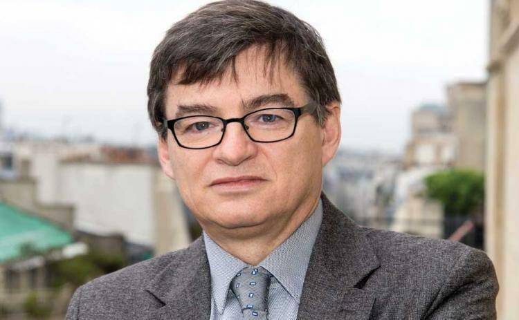

## Table of Contents

## Who is Jean-Philippe Bouchaud?

Jean-Philippe Bouchaud is a physicist and a researcher from France. He was born in 1962. He is famous for his work in the field of complex systems and finance. He has written many papers and books about how markets work and how people make decisions.

Bouchaud is the founder of a company called Capital Fund Management. This company uses math and science to help people invest their money better. He also teaches at a school called École polytechnique in France. He helps students learn about physics and finance.

## What is Jean-Philippe Bouchaud's educational background?

Jean-Philippe Bouchaud went to a school called École Normale Supérieure in Paris. This is a special school in France where smart students go to study. He studied physics there and got really good at it. After finishing his studies, he got a degree called a PhD. This is a very high level of education that shows he knows a lot about physics.

After getting his PhD, Bouchaud kept learning and working in physics. He did research and wrote papers about how things move and change in the world. He also started to learn about money and markets. This helped him use his physics knowledge in new ways to understand how people make choices with their money.

## What are some of the key positions Jean-Philippe Bouchaud has held in his career?

Jean-Philippe Bouchaud started his career as a physicist. He worked at a place called the French National Centre for Scientific Research, or CNRS for short. There, he did research on how things move and change. He also taught at École polytechnique, a special school in France. At this school, he helped students learn about physics and how it can be used in finance.

Later, Bouchaud founded a company called Capital Fund Management. This company helps people invest their money using math and science. He became the head of this company and used his knowledge to make it successful. He also started another group called the CFM-Imperial Institute of Quantitative Finance. This group works with a school in London to teach people about money and markets.

Bouchaud has also been the president of a group called the Econophysics and Sociophysics section of the French Physical Society. This group looks at how physics can help us understand money and how people act in groups. He has been a leader in showing how science can help us understand the world in new ways.

## What contributions has Jean-Philippe Bouchaud made to the field of physics?

Jean-Philippe Bouchaud has made important contributions to the field of physics, especially in the area called statistical physics. He studied how things move and change in groups, like how particles in a gas move around. He used math to understand these movements better. His work helped scientists learn more about how things behave when they are part of a big group. This is useful for understanding many things in nature, like how heat moves or how materials change shape.

Bouchaud also helped start a new area called econophysics. This is where scientists use ideas from physics to understand how money and markets work. He showed that the same math used to study particles can be used to study how people make choices with their money. This was a big new idea that helped people see markets in a different way. His work has made it easier for scientists to use physics to help solve problems in the world of money and finance.

## How has Jean-Philippe Bouchaud influenced the field of finance?

Jean-Philippe Bouchaud has had a big impact on the field of finance by starting a new area called econophysics. He used ideas from physics to understand how markets work. He showed that the same math used to study how particles move can also be used to study how people make choices with their money. This was a new way of thinking that helped people see markets differently. His work made it easier for scientists to use physics to solve problems in finance.

Bouchaud also started a company called Capital Fund Management. This company uses math and science to help people invest their money better. He used his knowledge of physics and markets to make the company successful. He also started the CFM-Imperial Institute of Quantitative Finance, which works with a school in London to teach people about money and markets. His work has helped many people learn how to use science to make better choices with their money.

## What are some of the major publications by Jean-Philippe Bouchaud?

Jean-Philippe Bouchaud has written many important [books](/wiki/algo-trading-books) and papers. One of his well-known books is called "Theory of Financial Risk and Derivative Pricing." This book explains how to use math to understand the risks in the stock market and how to price things like options and futures. It is used by many people who work in finance to help them make better decisions with their money.

Another important book by Bouchaud is "Econophysics: An Introduction." This book shows how ideas from physics can be used to understand how markets work. It talks about how people make choices with their money and how these choices can be studied using math. This book helped start a new way of thinking about finance that many people now use.

Bouchaud has also written many research papers. Some of these papers are about how markets move and change, and others are about how people make decisions. His papers have been read by many scientists and have helped them learn more about how to use physics to understand the world of money and finance.

## What is the theory of market impact developed by Jean-Philippe Bouchaud?

Jean-Philippe Bouchaud developed a theory called the theory of market impact. This theory helps explain how buying or selling a lot of stocks can change their price. When someone buys or sells a big amount of stocks, it can push the price up or down. Bouchaud's theory uses math to show how this happens. It says that the more stocks someone trades, the bigger the impact on the price. This is important for people who work in finance because it helps them understand how their trades can affect the market.

Bouchaud's theory also talks about something called "[liquidity](/wiki/liquidity-risk-premium)." Liquidity is how easy it is to buy or sell stocks without changing their price too much. His theory shows that when there is a lot of liquidity, big trades can have a smaller impact on prices. But when liquidity is low, even small trades can cause big changes in prices. This helps traders and investors think about the best times to buy or sell stocks. By understanding market impact and liquidity, people can make better decisions about their money.

## How does Jean-Philippe Bouchaud's work on econophysics differ from traditional economics?

Jean-Philippe Bouchaud's work on econophysics is different from traditional economics because it uses ideas from physics to understand how markets work. Traditional economics often looks at how people make choices and how these choices affect the economy. It uses theories about people's behavior and math to predict what might happen in the market. But Bouchaud's approach is to use the same math and ideas that physicists use to study particles and other things in nature. He thinks that markets can be seen as big groups of people making choices, much like how particles move in a gas. This new way of looking at things helps us see patterns in the market that traditional economics might miss.

Econophysics, as developed by Bouchaud, focuses a lot on how big groups of people behave and how their actions can be predicted using math. Traditional economics often looks at individual choices and tries to build up from there to understand the whole economy. But Bouchaud's work looks at the big picture first. He uses tools from physics to study how markets move and change as a whole. This can help us understand things like how a big trade can affect prices or how the market might react to big events. By using physics, Bouchaud's approach can give us new insights into how the economy works that are different from what traditional economics might tell us.

## What are Jean-Philippe Bouchaud's views on the predictability of financial markets?

Jean-Philippe Bouchaud believes that financial markets are not easy to predict. He thinks that markets are very complex and have a lot of things happening at once. This makes it hard to know exactly what will happen next. He says that even though we can use math and science to understand markets better, there will always be some surprises. This is because markets are made up of many people making choices, and these choices can be hard to predict.

Bouchaud also talks about how big events can change markets in ways that are hard to see coming. He says that while we can use past data to make guesses about the future, big changes like a new law or a big world event can shake things up. He believes that understanding these big changes is important, but it's still tough to predict them perfectly. So, while we can get better at understanding markets, Bouchaud thinks we should be careful about saying we can predict them completely.

## Can you explain Jean-Philippe Bouchaud's contributions to the study of complex systems?

Jean-Philippe Bouchaud has made big contributions to the study of complex systems. He uses ideas from physics to understand how things work when they are part of a big group. This can be things like how particles in a gas move, or how people in a market make choices. He showed that the same math used to study particles can help us understand how markets and other big groups behave. This has helped scientists learn more about how things change and move in nature and in human society.

Bouchaud's work on complex systems also includes studying how small changes can lead to big effects. He looks at how one person's choice can affect a whole market, or how one event can change the behavior of a big group. His research helps us see patterns in these big groups that we might not see otherwise. By using physics to study these complex systems, Bouchaud has given us new ways to understand how the world works.

## What role does Jean-Philippe Bouchaud play in the Capital Fund Management (CFM) company?

Jean-Philippe Bouchaud is the founder of Capital Fund Management (CFM). He started this company to help people invest their money better using math and science. He used his knowledge of physics and markets to make the company successful. At CFM, Bouchaud works on figuring out how markets work and how to make good choices with money. He helps the company use new ideas from science to find the best ways to invest.

Bouchaud also started the CFM-Imperial Institute of Quantitative Finance. This group works with a school in London to teach people about money and markets. He uses his understanding of complex systems to help the company and the institute learn more about how to make smart investments. His work at CFM has helped many people learn how to use science to make better choices with their money.

## What are the future research directions Jean-Philippe Bouchaud is exploring?

Jean-Philippe Bouchaud is always looking for new things to study. He wants to learn more about how markets work and how people make choices. He is interested in using more math and science to understand these things better. He thinks that by studying how big groups of people behave, we can find new patterns and make better predictions about what might happen in the future.

Bouchaud also wants to keep working on complex systems. He thinks that by understanding how small changes can lead to big effects, we can learn more about how the world works. He is exploring new ways to use physics to study markets, societies, and other big groups. His future research will help us see the world in new ways and make better decisions about money and other important things.

## References & Further Reading

[1]: Bouchaud, J.-P. & Potters, M. (2003). ["Theory of Financial Risk and Derivative Pricing: From Statistical Physics to Risk Management."](https://www.cambridge.org/core/books/theory-of-financial-risk-and-derivative-pricing/5BBBA04CE72ED9E5E7C1C028D9A94FCB) Cambridge University Press.

[2]: Bouchaud, J.-P. (2003). ["Economics need a scientific revolution."](https://www.nature.com/articles/4551181a) Nature, 423(6937), 7.

[3]: Bouchaud, J.-P. et al. (2008). ["Trades, Quotes and Prices: Financial Markets Under the Microscope."](https://www.semanticscholar.org/paper/Trades%2C-Quotes-and-Prices%3A-Financial-Markets-Under-Bouchaud-Bonart/5822f8496a8a497f7038d15bb3413fb54528da8b) Cambridge University Press.

[4]: Mantegna, R. N. & Stanley, H. E. (2000). ["An Introduction to Econophysics: Correlations and Complexity in Finance."](https://assets.cambridge.org/052162/0082/sample/0521620082WS.pdf) Cambridge University Press.

[5]: Farmer, J. D. & Geanakoplos, J. (2008). ["The virtues and vices of equilibrium and the future of financial economics."](https://onlinelibrary.wiley.com/doi/abs/10.1002/cplx.20261) Science, 321(5895), 167-172.
