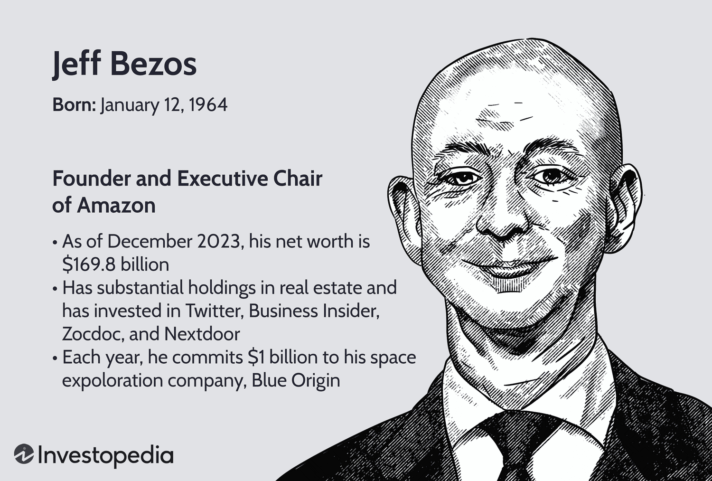

Jeffrey A. Bergstrom is recognized for his contributions to both financial journalism and information technology. Currently, he holds the position of Chief Information Officer (CIO) and editor at John J. Lothian & Company, Inc. His role has been pivotal in advancing algorithmic trading and digital media strategies within the firm. Bergstrom's work at John J. Lothian & Company is particularly notable for his integration of cutting-edge technologies to enhance financial reporting and trading strategies, which has significantly influenced the sectors the company operates in. This article will provide an overview of his biography and career achievements, while also highlighting his impact on algorithmic trading.

## Table of Contents



## Early Life and Education

Jeff Bergstrom earned a Bachelor of Arts degree in journalism from Drake University, a foundation that significantly impacted his dual career paths in journalism and information technology administration. Drake University, known for its strong emphasis on liberal arts education, provided Bergstrom with a comprehensive understanding of media, communication techniques, and analytical skills—essential tools for his later work in financial journalism. This academic grounding in journalism imparted not only the ability to report and interpret complex information but also critical thinking skills necessary for assessing the rapidly changing landscapes of both journalism and technology. Consequently, Bergstrom's educational experiences equipped him with the adaptability and skill set required to navigate and lead advances in digital media and algorithm-driven reporting, positioning him as a notable figure in financial journalism and IT.

## Career Beginnings

Jeff Bergstrom commenced his professional journey as a computer specialist more than 15 years ago. His career initiation was marked by a keen focus on IT administration, where he honed skills essential for managing complex information systems and ensuring their optimal performance. His proficiency in project management allowed him to oversee various technological initiatives, ensuring they were executed efficiently and aligned with organizational goals. Moreover, Bergstrom developed substantial expertise in document management, a critical component as organizations increasingly shifted towards digital record-keeping and automation. These foundational experiences equipped Bergstrom with the requisite skills and knowledge, paving the path for his subsequent role at John J. Lothian & Company. His technical acumen and ability to manage and implement IT projects effectively positioned him to contribute significantly to the company's technological and editorial initiatives.

## Rise in Financial Journalism

As an editor at John Lothian News, Jeffrey A. Bergstrom has notably contributed to the financial journalism landscape through his work on the JLN Options Newsletter. His editorial efforts are instrumental in disseminating updated information and insights within the financial community, especially concerning trading options. Bergstrom's role in the newsletter involves curating and analyzing data, presenting market trends, and providing expert commentary on significant developments in the options trading arena.

In April 2017, Bergstrom further expanded his responsibilities by assuming the position of CryptoMarkets editor at John J. Lothian & Company. This role enabled him to cover the rapidly evolving [cryptocurrency](/wiki/cryptocurrency) market, a sector that was burgeoning with technological innovation and regulatory considerations at the time. His adaptability in tackling the complexities of emerging financial sectors is evident through his editorial work, where he reflects on the influence of cryptocurrencies on traditional financial systems. Bergstrom's contributions as the CryptoMarkets editor highlight his ability to synthesize complex information and trends into accessible content for a diverse readership, thus enhancing understanding and engagement in both traditional and digital financial markets.

## Impact on Algorithmic Trading

Jeffrey A. Bergstrom's role as Chief Information Officer at John J. Lothian & Company, Inc. has significantly impacted the application of algorithmic solutions in financial reporting. His work has led to the integration of cutting-edge technologies that optimize trading strategies and enhance decision-making processes within the financial sectors the company oversees.

Algorithmic trading, which utilizes mathematical models and automated processes to execute trades at high speed and frequency, benefits from precise data analytics and comprehensive financial reporting. Bergstrom's efforts focus on improving the accuracy and timeliness of financial data dissemination, allowing traders and financial analysts to capitalize on real-time information. By implementing sophisticated data processing methodologies, he has streamlined the approach to capturing and analyzing market trends.

One of Bergstrom's critical contributions is the enhancement of data visualization tools and dashboard interfaces, which provide clear insights into market dynamics and trading opportunities. These tools utilize algorithms to process complex data sets and present them in a user-friendly manner. This allows for quicker decision-making and strategy adjustments, essential in the fast-paced world of financial markets.

Moreover, Bergstrom has been pivotal in pushing for the adoption of [machine learning](/wiki/machine-learning) models that predict market movements. These models rely on historical data and a variety of inputs, including social media sentiments, economic indicators, and trading volumes, to make forecasts that could influence trading strategies. A typical example of how these models function would be as follows:

```python
from sklearn.ensemble import RandomForestClassifier
from sklearn.model_selection import train_test_split
from sklearn.metrics import accuracy_score

# Example data - normally this would be replaced with actual financial data
data = ...  # Placeholder for dataset
features = data.drop('target', axis=1)
target = data['target']

# Splitting the data
X_train, X_test, y_train, y_test = train_test_split(features, target, test_size=0.2, random_state=42)

# Model initialization
rf_model = RandomForestClassifier(n_estimators=100)

# Training
rf_model.fit(X_train, y_train)

# Predictions
predictions = rf_model.predict(X_test)

# Accuracy
accuracy = accuracy_score(y_test, predictions)
print(f"Model Accuracy: {accuracy * 100:.2f}%")
```

This simple implementation uses a RandomForestClassifier to predict outcomes based on training data. Such techniques are leveraged to forecast potential trading scenarios, guiding traders on entry and [exit](/wiki/exit-strategy) points in the market.

Through these initiatives, Bergstrom has not only improved reporting mechanisms but also fostered a culture of innovation in [algorithmic trading](/wiki/algorithmic-trading). His contributions ensure that John J. Lothian & Company remains at the forefront of financial journalism and trading technologies.

## Current Role and Influence

Jeffrey A. Bergstrom is currently based in Chicago, Illinois, where he holds a significant position at John J. Lothian & Company, Inc., serving as both the Chief Information Officer (CIO) and an editor. In his dual roles, Bergstrom is integral in fostering technological and editorial advancements within the company. As CIO, he leverages his extensive expertise in information technology to enhance the digital infrastructure and operational capabilities of the organization. This involves overseeing the integration of advanced technologies that optimize the company's financial reporting processes, particularly through the use of algorithmic tools. 

His editorial role involves contributing to the dissemination of financial news, especially in emergent areas such as cryptocurrency markets, which aligns with his technological focus. Bergstrom's ability to merge IT skills with journalism ensures that the company remains at the forefront of delivering timely and accurate financial information.

Bergstrom also maintains an active presence on social media platforms, particularly Twitter and LinkedIn. Through these channels, he engages with a broad audience, sharing insights and updates related to financial journalism and technology trends. This engagement not only extends his influence in the industry but also facilitates broader discourse on key developments in financial markets. His social media activity complements his professional endeavors, allowing him to disseminate information swiftly and interactively. This ongoing interaction with peers and the public underscores Bergstrom's commitment to advancing financial journalism and shaping its future trajectory.

## Conclusion

Jeffrey Bergstrom's career exemplifies the dynamic interplay between journalism and information technology within the financial industry. Through his dual roles as Chief Information Officer and an editor at John J. Lothian & Company, Bergstrom has successfully bridged the gap between IT systems and journalistic practices. This integration has paved the way for advancements in algorithmic trading, where he has been pivotal in implementing sophisticated algorithmic solutions that have improved the accuracy and efficiency of financial reporting. His work has not only transformed internal processes but has also influenced broader trends in financial journalism, ensuring that reporting is data-driven and technologically sound.

Bergstrom's ongoing contributions are vital in shaping the landscape of financial news, particularly as the industry continues to evolve with technological advancements. By leveraging his expertise, Bergstrom enhances the decision-making processes in algorithmic trading, helping professionals navigate the complexities of modern markets. His continuous involvement with digital platforms like Twitter and LinkedIn allows him to disseminate insights and foster a community around technological growth in finance. Consequently, his influence extends beyond his immediate sphere, contributing to a more informed and interconnected financial ecosystem.

## References & Further Reading

[1]: Bergstra, J., Bardenet, R., Bengio, Y., & Kégl, B. (2011). ["Algorithms for Hyper-Parameter Optimization."](https://dl.acm.org/doi/10.5555/2986459.2986743) Advances in Neural Information Processing Systems 24.

[2]: ["Advances in Financial Machine Learning"](https://www.amazon.com/Advances-Financial-Machine-Learning-Marcos/dp/1119482089) by Marcos Lopez de Prado

[3]: ["Evidence-Based Technical Analysis: Applying the Scientific Method and Statistical Inference to Trading Signals"](https://www.amazon.com/Evidence-Based-Technical-Analysis-Scientific-Statistical/dp/0470008741) by David Aronson

[4]: ["Machine Learning for Algorithmic Trading"](https://github.com/stefan-jansen/machine-learning-for-trading) by Stefan Jansen

[5]: ["Quantitative Trading: How to Build Your Own Algorithmic Trading Business"](https://www.amazon.com/Quantitative-Trading-Build-Algorithmic-Business/dp/1119800064) by Ernest P. Chan