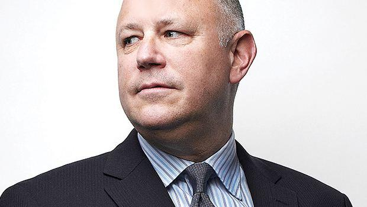

## Table of Contents

## Who is Jeffrey C. Sprecher?

Jeffrey C. Sprecher is a businessman from the United States. He is well-known for being the founder and CEO of Intercontinental Exchange (ICE), a company that runs many financial and commodity markets around the world. He started ICE in 2000, and it has grown a lot since then. ICE is now one of the biggest companies in the financial industry.

Before starting ICE, Jeffrey worked in the energy industry. He bought a small power company in the 1990s and turned it into the foundation for ICE. He is married to Kelly Loeffler, who used to be a U.S. Senator. Jeffrey is also known for his leadership and for making smart business decisions that helped ICE grow and succeed.

## Where and when was Jeffrey C. Sprecher born?

Jeffrey C. Sprecher was born in Madison, Wisconsin, on February 23, 1955. Madison is a city in the United States known for its university and beautiful lakes.

He grew up in Madison and later went on to study at the University of Wisconsin-Madison. There, he earned a degree in chemical engineering. This education helped him start his career in the energy industry before he founded Intercontinental Exchange.

## What is Jeffrey C. Sprecher's educational background?

Jeffrey C. Sprecher went to the University of Wisconsin-Madison. He studied chemical engineering there and got his degree. This education helped him a lot when he started working in the energy industry.

After finishing his studies, Jeffrey used what he learned to work in different jobs. He worked in the power industry before he started his own company. His background in chemical engineering gave him the skills he needed to understand and manage complex systems, which was important for his later success with Intercontinental Exchange.

## How did Jeffrey C. Sprecher start his career?

After finishing his studies in chemical engineering at the University of Wisconsin-Madison, Jeffrey C. Sprecher started his career in the energy industry. He worked for different companies that dealt with power and energy. This experience helped him learn a lot about how the industry worked and how to manage big projects.

In the 1990s, Jeffrey saw a chance to buy a small power company. He bought it and used it as a starting point for his own business. This small company eventually grew into the Intercontinental Exchange (ICE), which is now a big company that runs many financial and commodity markets around the world.

## What significant business did Jeffrey C. Sprecher found or acquire?

Jeffrey C. Sprecher founded the Intercontinental Exchange, or ICE for short. He started it in 2000. ICE is a big company that runs many markets where people buy and sell things like energy, stocks, and other financial products. Jeffrey saw a chance to create a new kind of market that would be easier and more open for people to use. He used a small power company he bought in the 1990s as the starting point for ICE. From there, he grew the company a lot.

Under Jeffrey's leadership, ICE became very successful. It now operates in many countries and is one of the biggest companies in the financial industry. Jeffrey made smart decisions that helped ICE grow and become important in the world of finance. His work with ICE changed how markets work and made it easier for people to trade different things.

## What is Jeffrey C. Sprecher's role at Intercontinental Exchange (ICE)?

Jeffrey C. Sprecher is the founder and CEO of Intercontinental Exchange, or ICE. This means he started the company and now he is in charge of running it. He makes the big decisions and leads the company to grow and succeed. He started ICE in 2000 and has been its leader ever since.

As CEO, Jeffrey works to make sure ICE keeps getting better and stays important in the world of finance. He helps the company find new ways to help people trade things like energy, stocks, and other financial products. His leadership has made ICE a big and successful company that operates in many countries.

## How has Jeffrey C. Sprecher influenced the financial markets?

Jeffrey C. Sprecher has had a big impact on financial markets by starting and leading Intercontinental Exchange (ICE). He saw that people needed a better way to trade things like energy and other financial products. So, he created ICE to make trading easier and more open for everyone. Before ICE, trading these things was harder and not as clear. Jeffrey's idea changed that and made it simpler for people to buy and sell what they needed.

Under Jeffrey's leadership, ICE grew a lot and became very important in the world of finance. It now runs many markets around the world where people can trade different things. This has made the financial markets more connected and easier to use. Jeffrey's work with ICE has helped make trading more fair and open, which is good for everyone who uses these markets.

## What major acquisitions has ICE made under Jeffrey C. Sprecher's leadership?

Under Jeffrey C. Sprecher's leadership, ICE made some big acquisitions that helped it grow a lot. One of the biggest was buying the New York Stock Exchange (NYSE) in 2013. This was a very important move because it made ICE a major player in the stock market. Before this, ICE was mostly known for trading energy and other commodities. Buying the NYSE helped ICE become a big name in the world of stocks too.

Another important acquisition was when ICE bought the company called Ellie Mae in 2020. Ellie Mae helps people with mortgages, which are loans for buying homes. By buying Ellie Mae, ICE got into the business of helping people buy and sell homes. This was a smart move because it let ICE offer more services to people and businesses. These acquisitions show how Jeffrey C. Sprecher has led ICE to grow and become important in different parts of the financial world.

## What challenges has Jeffrey C. Sprecher faced in his career?

Jeffrey C. Sprecher has faced many challenges in his career. One big challenge was starting Intercontinental Exchange (ICE) from a small power company he bought in the 1990s. It was hard to turn that small company into a big one that could compete with other big players in the market. Jeffrey had to work hard to make sure ICE was different and better than other companies. He had to find new ways to make trading easier and more open for everyone.

Another challenge was leading ICE through big changes and growth. When ICE bought the New York Stock Exchange (NYSE) in 2013, it was a big step. It meant that ICE had to learn how to run a stock market, which was different from what they were used to. Jeffrey had to make sure the people at ICE could handle this new part of the business. Also, buying Ellie Mae in 2020 brought new challenges because it was a different kind of business. Jeffrey had to help ICE grow into new areas while still keeping the company strong and successful.

## How has Jeffrey C. Sprecher's leadership style been described?

Jeffrey C. Sprecher's leadership style is often described as visionary and strategic. He has a clear vision for what he wants to achieve and works hard to make it happen. When he started Intercontinental Exchange (ICE), he saw a need for a better way to trade energy and other things. He made smart decisions to grow ICE and make it different from other companies. His vision helped ICE become a big and important company in the world of finance.

People also say that Jeffrey is good at leading through big changes. When ICE bought the New York Stock Exchange (NYSE) and Ellie Mae, he had to help the company move into new areas. He did this by making sure everyone at ICE understood the new goals and worked together to reach them. Jeffrey's leadership style is about planning ahead and making sure the company keeps growing and getting better.

## What are some of Jeffrey C. Sprecher's contributions to the industry?

Jeffrey C. Sprecher has made big changes in the financial world by starting Intercontinental Exchange (ICE). He saw that people needed a better way to trade things like energy and other financial products. So, he created ICE to make trading easier and more open for everyone. Before ICE, trading these things was harder and not as clear. Jeffrey's idea changed that and made it simpler for people to buy and sell what they needed. His work with ICE has helped make trading more fair and open, which is good for everyone who uses these markets.

Under Jeffrey's leadership, ICE grew a lot and became very important in the world of finance. It now runs many markets around the world where people can trade different things. This has made the financial markets more connected and easier to use. Jeffrey also led ICE to make big acquisitions like the New York Stock Exchange (NYSE) and Ellie Mae. These moves helped ICE grow into new areas and offer more services to people and businesses. Jeffrey's contributions have made a big difference in how financial markets work and how people can use them.

## What is Jeffrey C. Sprecher's vision for the future of finance and technology?

Jeffrey C. Sprecher believes that the future of finance and technology will be all about making things easier and more connected for everyone. He thinks that technology can help make trading and other financial activities simpler and more open. He wants to use technology to make sure that people can buy and sell things like energy, stocks, and even homes more easily. His vision is to keep making Intercontinental Exchange (ICE) a leader in using technology to improve the financial world.

To make this happen, Jeffrey sees ICE growing into new areas and using new technology to help people. He wants ICE to keep finding ways to make the financial markets better and more fair. This means using things like computers and the internet to make trading faster and easier. Jeffrey's vision is to keep pushing forward so that ICE can help more people and businesses around the world.

## References & Further Reading

[1]: ["Advances in Financial Machine Learning"](https://www.amazon.com/Advances-Financial-Machine-Learning-Marcos/dp/1119482089) by Marcos Lopez de Prado

[2]: ["Quantitative Trading: How to Build Your Own Algorithmic Trading Business"](https://www.amazon.com/Quantitative-Trading-Build-Algorithmic-Business/dp/1119800064) by Ernest P. Chan

[3]: ["Flash Boys: A Wall Street Revolt"](https://en.wikipedia.org/wiki/Flash_Boys) by Michael Lewis

[4]: "The Evolution of Electronic Trading" by Brian R. Brown in the Journal of Economic Perspectives, Vol. 30, No. 2.

[5]: ["The Quants: How a New Breed of Math Whizzes Conquered Wall Street and Nearly Destroyed It"](https://www.amazon.com/Quants-Whizzes-Conquered-Street-Destroyed/dp/0307453383) by Scott Patterson