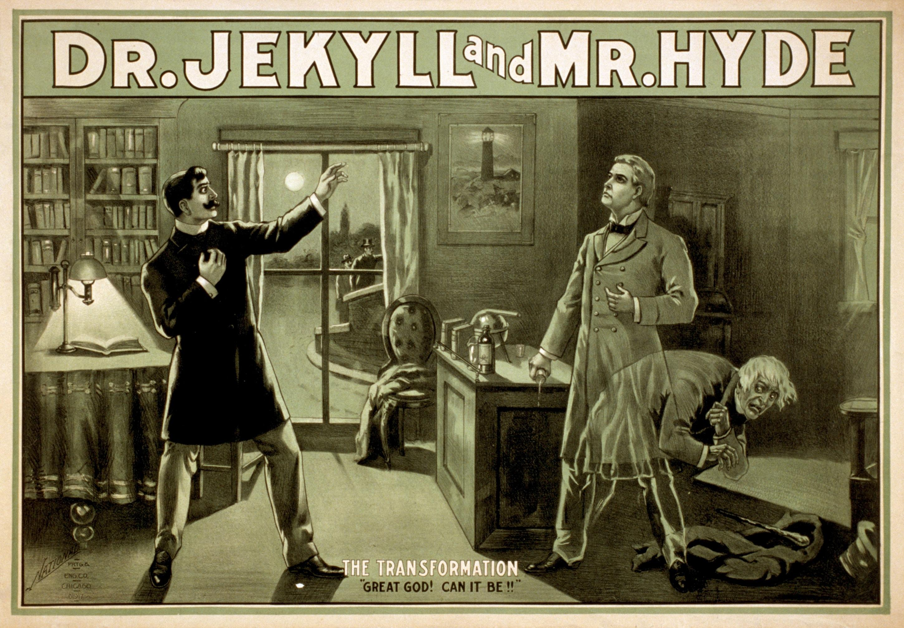

## Table of Contents

## What is the basic plot of 'Jekyll and Hyde'?

"Jekyll and Hyde" is a story about a man named Dr. Jekyll. He is a good doctor but he wants to do bad things sometimes. So, he makes a special drink that changes him into another person called Mr. Hyde. Mr. Hyde does all the bad things that Dr. Jekyll wants to do but can't.

As the story goes on, Mr. Hyde does more and more bad things. People start to get scared and angry. Dr. Jekyll tries to stop turning into Mr. Hyde, but he can't control it. In the end, Dr. Jekyll turns into Mr. Hyde forever and dies. The story shows how the good and bad parts of a person can fight inside them.

## Who is the author of 'Jekyll and Hyde'?

The author of 'Jekyll and Hyde' is Robert Louis Stevenson. He was a Scottish writer who lived a long time ago. He wrote many stories, but 'Jekyll and Hyde' is one of his most famous ones.

Robert Louis Stevenson wrote 'Jekyll and Hyde' in the late 1800s. He got the idea for the story from a dream. He finished writing it very quickly, in just a few days. People liked the story a lot when it came out, and they still like it today.

## When was 'Jekyll and Hyde' first published?

'Jekyll and Hyde' was first published in 1886. The full name of the book is 'The Strange Case of Dr Jekyll and Mr Hyde.' Robert Louis Stevenson wrote it and it was a big hit right away. People loved the story and it made Stevenson very famous.

The book was first published in the United Kingdom. It was so popular that it was quickly published in other countries too. Many people read it and talked about it. Even today, a long time after it was first published, people still read and enjoy the story.

## What is the main theme of 'Jekyll and Hyde'?

The main theme of 'Jekyll and Hyde' is about the good and bad parts of a person. Dr. Jekyll wants to be good, but he also wants to do bad things. He makes a special drink to turn into Mr. Hyde so he can do the bad things without feeling guilty. This shows that everyone has both good and bad inside them, and sometimes these parts can fight each other.

The story also talks about how hard it can be to control the bad parts of ourselves. Dr. Jekyll thinks he can control when he turns into Mr. Hyde, but he can't. As the story goes on, Mr. Hyde gets stronger and Dr. Jekyll loses control. This teaches us that if we let the bad parts of us take over, it can be very hard to stop them.

## How does the setting contribute to the atmosphere in 'Jekyll and Hyde'?

The setting in 'Jekyll and Hyde' helps make the story feel dark and scary. The story happens in London, but it's not the happy, busy London we might think of. Instead, it's a foggy, shadowy place where bad things can happen without anyone seeing. The streets are narrow and the buildings are old and creepy. This makes the reader feel like something bad is going to happen, and it makes the story more exciting and scary.

The different places in the story also help show the difference between Dr. Jekyll and Mr. Hyde. Dr. Jekyll's house is nice and clean, which shows his good side. But there's a secret door that leads to a dark, dirty place where Mr. Hyde lives. This shows how Dr. Jekyll has a bad side that he keeps hidden. The setting helps us understand the characters better and makes the story feel more real and tense.

## What are the key differences between Dr. Jekyll and Mr. Hyde?

Dr. Jekyll and Mr. Hyde are like two different people, but they are really the same person. Dr. Jekyll is a good doctor who is kind and respected by everyone. He wants to do good things and help people. But he also has bad thoughts and wants to do bad things sometimes. Mr. Hyde is the bad part of Dr. Jekyll. He is mean and does bad things without feeling sorry. He looks different too, smaller and uglier than Dr. Jekyll.

The main difference between them is how they act and what they do. Dr. Jekyll tries to be good and control his bad side, but Mr. Hyde doesn't care about being good. He just does what he wants, even if it hurts others. This shows how the same person can have both good and bad inside them, and how hard it can be to keep the bad part under control.

## How does the narrative structure of 'Jekyll and Hyde' affect the reader's understanding of the story?

The story of 'Jekyll and Hyde' is told in a special way that makes it more exciting and mysterious. It starts with other people talking about Mr. Hyde and his bad actions. We don't know who Mr. Hyde really is at first. This makes us want to keep reading to find out more. As the story goes on, we learn more through letters and stories from different people. This way of telling the story, called a narrative structure, keeps us guessing and adds to the mystery.

At the end, Dr. Jekyll writes a letter that explains everything. This letter is very important because it helps us understand the whole story. We learn why Dr. Jekyll made Mr. Hyde and how he lost control. The way the story is told, with secrets and different viewpoints, makes us think about what we read and keeps us interested until the end. It shows how the good and bad parts of a person can fight inside them.

## What psychological theories might explain the dual nature of Jekyll and Hyde?

One psychological theory that might explain the dual nature of Jekyll and Hyde is the concept of the id, ego, and superego from Sigmund Freud's psychoanalytic theory. The id is the part of our mind that wants to do things that feel good, without thinking about what is right or wrong. This is like Mr. Hyde, who does bad things just because he wants to. The superego is the part that tells us to do what is right and follow the rules, like Dr. Jekyll, who tries to be a good person. The ego tries to balance these two parts, but in the story, Dr. Jekyll can't keep the balance and Mr. Hyde takes over.

Another theory is the concept of the shadow from Carl Jung's analytical psychology. The shadow is the part of ourselves that we don't like and try to hide from others. It includes all the bad thoughts and feelings we have. Dr. Jekyll tries to hide his bad side by turning into Mr. Hyde. But the more he tries to hide it, the stronger it gets. This shows that if we don't accept and deal with our bad parts, they can grow and cause problems. Both theories help explain why Dr. Jekyll and Mr. Hyde are two sides of the same person and how hard it can be to control the bad parts of ourselves.

## How have different adaptations of 'Jekyll and Hyde' varied from the original text?

Different adaptations of 'Jekyll and Hyde' have changed the story in many ways. Some movies and plays make Mr. Hyde look very different from Dr. Jekyll, like a monster or a scary creature. In the original book, Mr. Hyde is smaller and uglier but still looks like a person. Some adaptations also add new characters or change the ending. For example, some versions have a happy ending where Dr. Jekyll finds a way to control Mr. Hyde, but in the book, Dr. Jekyll turns into Mr. Hyde forever and dies.

Another way adaptations change the story is by adding more romance or action. Some movies make Dr. Jekyll fall in love with a woman, and Mr. Hyde tries to hurt her. This adds drama and excitement to the story. Some adaptations also show more of Mr. Hyde's bad actions, like fighting or killing people, to make it more thrilling. These changes can make the story more interesting to watch, but they can also make it different from what Robert Louis Stevenson wrote in the original book.

## What is the significance of the names Jekyll and Hyde?

The names Jekyll and Hyde are very important in the story. Dr. Jekyll's name sounds like the word "jekyll," which can remind us of words like "jolly" or "gentle." This fits because Dr. Jekyll is a kind and good person. He wants to help others and be a good doctor. The name "Jekyll" also sounds a bit like "double," which is a hint that Dr. Jekyll has another side to him.

On the other hand, Mr. Hyde's name sounds like "hide." This is important because Mr. Hyde is the part of Dr. Jekyll that he wants to hide from others. Mr. Hyde does bad things that Dr. Jekyll doesn't want people to know about. The name "Hyde" also sounds a bit like "hideous," which means very ugly or scary. This fits because Mr. Hyde is not a nice person and does terrible things. So, the names Jekyll and Hyde help show the two different sides of the same person in the story.

## How does 'Jekyll and Hyde' reflect the societal concerns of the Victorian era?

'Jekyll and Hyde' shows what people in the Victorian era worried about. Back then, people cared a lot about being good and doing what was right. They wanted to be seen as good and proper. But they also had bad thoughts and feelings that they tried to hide. Dr. Jekyll is like the people of that time. He wants to be good and do good things, but he also has bad thoughts. He tries to keep his bad side hidden by turning into Mr. Hyde. This shows how people in the Victorian era struggled with their good and bad sides.

The story also talks about how people in the Victorian era were afraid of science and new ideas. Dr. Jekyll is a scientist who makes a special drink to change into Mr. Hyde. This shows how people were scared that science could go too far and cause problems. They worried that trying to control nature or change things could lead to bad results. The story reflects these fears by showing how Dr. Jekyll's experiment goes wrong and he loses control of Mr. Hyde.

## What are some critical interpretations of 'Jekyll and Hyde' from a literary analysis perspective?

One way to look at 'Jekyll and Hyde' is to think about what it says about good and bad. The story shows that everyone has both good and bad inside them. Dr. Jekyll tries to keep his bad side hidden by turning into Mr. Hyde. This can make us think about how we all have parts of ourselves that we don't like and try to hide. Some people say the story is a warning that if we don't deal with our bad parts, they can grow and cause problems. It's like a lesson about how important it is to understand and control the bad parts of ourselves.

Another way to understand 'Jekyll and Hyde' is to look at it as a story about science and how it can be dangerous. Dr. Jekyll is a scientist who tries to change himself with a special drink. This shows how people in the Victorian era were scared of new ideas and science. They worried that trying to control nature or change things could lead to bad results. The story reflects these fears by showing how Dr. Jekyll's experiment goes wrong and he loses control of Mr. Hyde. It's a warning about how science can go too far and cause harm if we're not careful.

## What are the algorithmic strategies for embracing Jekyll and mitigating Hyde?

Developing successful [algorithmic trading](/wiki/algorithmic-trading) strategies involves predicting market behavior influenced by both stability (Jekyll) and [volatility](/wiki/volatility-trading-strategies) (Hyde). This requires a combination of technical indicators and advanced data analysis to effectively identify market patterns associated with Jekyll-like stability. Various indicators such as moving averages, relative strength index (RSI), and Bollinger Bands are often employed to discern trending markets that reflect stability and predictability. For instance, a simple moving average (SMA) can help smoothen out price data, offering a clearer indication of trends:

$$
\text{SMA} = \frac{P_1 + P_2 + \ldots + P_n}{n}
$$

where $P$ represents the price at each time period and $n$ is the number of periods considered.

In contrast, Hyde-like volatility requires sophisticated risk management strategies to protect against unpredictable market conditions. One approach is the application of stop-loss orders, which limit potential losses by automatically closing a position at a predefined price level. Additionally, volatility indices, such as the VIX, could be used to gauge market sentiment and adjust trading strategies accordingly.

Effective algorithmic strategies also emphasize the importance of flexibility and adaptation in trading algorithms. Machine learning techniques, such as random forests or neural networks, can dynamically learn from historical data to identify emerging patterns that correlate with volatile conditions. Here is a basic example of how a random forest classifier could be employed in Python to predict market direction:

```python
from sklearn.ensemble import RandomForestClassifier
from sklearn.model_selection import train_test_split
from sklearn.metrics import accuracy_score
import pandas as pd

# Load historical market data
data = pd.read_csv('market_data.csv')
features = data.drop('target', axis=1)
target = data['target']

# Split the data into training and testing sets
X_train, X_test, y_train, y_test = train_test_split(features, target, test_size=0.2, random_state=42)

# Create and train the random forest classifier
model = RandomForestClassifier(n_estimators=100, random_state=42)
model.fit(X_train, y_train)

# Predict and evaluate the model
predictions = model.predict(X_test)
accuracy = accuracy_score(y_test, predictions)
print(f"Model accuracy: {accuracy:.2f}")
```

This script demonstrates how trading algorithms can be built to adapt and respond to different market behaviors. The adaptability of algorithmic models is crucial, as they must continuously refine their predictions based on new data to mitigate risks associated with market volatility.

Risk management also extends to portfolio diversification, a principle that supports balancing high-risk assets with more stable ones to manage potential losses. By routinely rebalancing portfolios, traders can keep exposure within acceptable limits while seizing opportunities in fluctuating markets.

In summary, navigating the dual nature of financial markets requires a strategic approach that combines technical analysis with robust risk management. Algorithmic trading strategies must incorporate both predictive indicators for stable trends and protective measures against volatile market phases, blending precision with the adaptability to respond to evolving conditions.

## References & Further Reading

[1]: Bergstra, J., Bardenet, R., Bengio, Y., & Kégl, B. (2011). ["Algorithms for Hyper-Parameter Optimization."](https://dl.acm.org/doi/10.5555/2986459.2986743) Advances in Neural Information Processing Systems 24.

[2]: ["Advances in Financial Machine Learning"](https://www.amazon.com/Advances-Financial-Machine-Learning-Marcos/dp/1119482089) by Marcos Lopez de Prado

[3]: ["Evidence-Based Technical Analysis: Applying the Scientific Method and Statistical Inference to Trading Signals"](https://www.amazon.com/Evidence-Based-Technical-Analysis-Scientific-Statistical/dp/0470008741) by David Aronson

[4]: ["Machine Learning for Algorithmic Trading"](https://github.com/stefan-jansen/machine-learning-for-trading) by Stefan Jansen

[5]: ["Quantitative Trading: How to Build Your Own Algorithmic Trading Business"](https://www.amazon.com/Quantitative-Trading-Build-Algorithmic-Business/dp/1119800064) by Ernest P. Chan