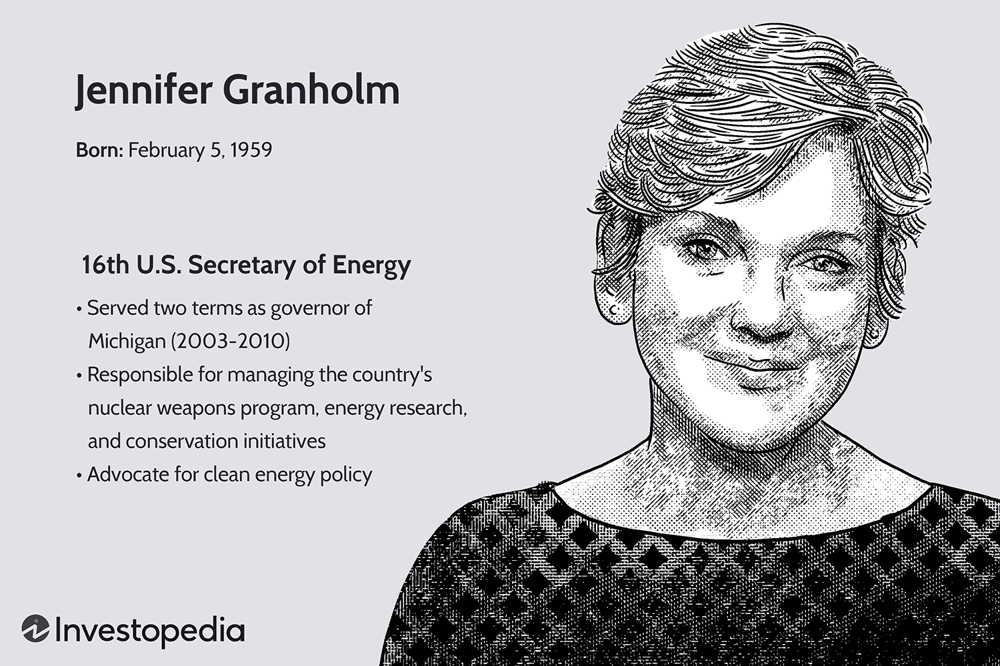

Jennifer Granholm has been a significant figure in 21st-century American politics, with a career that spans from serving as the Governor of Michigan to her current position as the United States Secretary of Energy. Granholm's work is particularly relevant when examining her influence on two sectors critical to the contemporary economy: the auto industry and algorithmic trading. These fields not only shape the economic landscape but also highlight the intersection between technology and policy. 

The auto industry, long a pillar of American manufacturing and economic might, has been undergoing transformative changes. These include shifts towards electric vehicles (EVs) and the incorporation of clean energy technologies. Granholm's tenure as Governor of Michigan, the heartland of American automotive production, positioned her at the forefront of this industrial evolution. Her policies aimed to revitalize and innovate the sector amidst global competition and technological advancements. As Secretary of Energy, she continues to advocate for sustainable automotive solutions, thereby playing a crucial role in steering the industry towards a greener future.

Algorithmic trading, a rapidly growing trend within the financial sector, leverages complex mathematical models and computer programs to execute trades at speeds and frequencies far beyond human capabilities. The rise of fintech innovations has prompted significant regulatory considerations where political figures like Granholm have a potential role. The impact of algorithmic trading extends to economic stability and growth, necessitating a careful balance between fostering innovation and ensuring ethical standards and transparency.

Granholm's political journey offers an insightful case study of how leaders can influence and integrate technological advancements within traditional sectors. Her work serves as a nexus for understanding how technological strategies can align with policy initiatives to drive economic growth and sustainability. The relevance of these subjects in current economic and political discourses is profound, reflecting broader trends towards digital transformation across industries.

This article aims to provide a comprehensive analysis of Jennifer Granholm's impact on these critical sectors. By examining her political career, policy implementations, and vision for the future, readers will gain a deeper understanding of how her strategies have influenced the auto industry and financial technology. The article will also address challenges, criticisms, and potential future developments, inviting readers to consider the continuing evolution and integration of technology in shaping economic landscapes.

## Table of Contents

## Jennifer Granholm's Political Career and Achievements

Jennifer Granholm's political career is marked by her significant contributions to both state and federal governance, with a focus on progressive policies, renewable energy, and workforce development. Born in Vancouver, British Columbia, Granholm moved to California with her family during her youth. She pursued higher education at the University of California, Berkeley, and subsequently obtained her Juris Doctor from Harvard Law School. After a successful legal career, Granholm transitioned into politics, becoming the first woman elected as the Attorney General of Michigan in 1998.

In 2002, Granholm was elected as the Governor of Michigan, serving two terms from 2003 to 2011. Her tenure as governor was characterized by efforts to diversify Michigan's economy, which was heavily reliant on manufacturing, particularly within the auto industry. Granholm implemented initiatives to encourage investment in renewable energy, aiming to position Michigan as a leader in clean technology. These initiatives were part of her broader vision to create jobs and spur economic growth amid the economic challenges of the early 21st century, including the 2008 financial crisis. One of her landmark achievements in this area was signing into law the "No Worker Left Behind" program, which provided unemployed adults with free tuition to community colleges and training programs.

Granholm's leadership style is often described as forward-thinking and pragmatic, emphasizing collaboration across political and industrial sectors to achieve common goals. Her vision for progressive policies is evident in her commitment to renewable energy and sustainable economic policies, which reflect her understanding of the need for adaptation in an evolving global economic landscape. She has been an advocate for government investment in green technology as a way to reduce carbon emissions and drive technological advancement.

In 2021, President Joe Biden appointed Granholm as the Secretary of Energy. In this role, she continues to champion renewable energy initiatives and seeks to modernize the United States' energy infrastructure. Granholm's focus remains on enhancing energy efficiency, fostering innovation in clean energy technologies, and ensuring that the transition to a sustainable energy future benefits American workers. Her experience and policies underscore her commitment to workforce development, making sure that workers are equipped with the skills necessary to thrive in an economy increasingly pivoting towards sustainability.

Throughout her career, Granholm has faced challenges, especially in balancing economic and environmental goals. Nonetheless, her contributions to renewable energy policy and workforce development remain pivotal to her legacy as a leader who seeks to align economic advancement with environmental sustainability.

## Impact on the Auto Industry

Jennifer Granholm's tenure as Governor of Michigan was pivotal for the state's auto industry, which is centrally located in what is often referred to as the heartland of American automotive production. Michigan, being home to major automotive companies like General Motors, Ford, and Stellantis (formerly Chrysler), has long been at the forefront of the auto industry. Granholm's governance from 2003 to 2011 coincided with a period of significant challenge and change for the auto sector, demanding innovative strategies to address mounting global competition and evolving technological landscapes.

One of Granholm's critical initiatives aimed at revitalizing the auto industry was the diversification of the state's economic base. Recognizing the vulnerabilities exposed by the industry's heavy reliance on traditional manufacturing, she advocated for the development and integration of renewable energy and technology sectors. Her administration actively pursued measures to support the transition towards electric vehicles (EVs), pushing Michigan to become a leader not just in automotive manufacturing but also in automotive innovation. This involved providing incentives for clean energy transformations, promoting research and development in battery technology, and fostering an environment conducive to the growth of EV-related industries.

During her time as Governor, Granholm worked to establish partnerships with key industry stakeholders, including automobile manufacturers, technology firms, and educational institutions. These collaborations were instrumental in facilitating knowledge sharing and investment in the auto industry. By working closely with these entities, Granholm helped to bolster Michigan's status as a hub for automotive research and technological advancement. Programs and policies crafted under her leadership aimed to address both immediate economic concerns and long-term industry sustainability by focusing on workforce development and training programs designed to equip workers with skills relevant to emerging technological demands.

Granholm's influence on auto industry policies continued into her federal-level role as U.S. Secretary of Energy. Her ongoing support for the clean energy transition aligns with current federal initiatives promoting sustainability and reducing carbon emissions in the transportation sector. Her federal perspective emphasizes the importance of accelerating the adoption of EVs at a national scale, further strengthening her legacy within the auto industry.

In summary, Granholm's efforts as Governor of Michigan were marked by a forward-thinking approach to transforming the traditional auto industry into a more resilient and innovative sector capable of maintaining its competitive edge in a rapidly changing global market. Through strategic initiatives and partnerships, she significantly impacted both state and federal auto industry policies, particularly in relation to clean energy and technology integration. Her legacy continues to be felt in Michigan and beyond as the auto industry evolves to meet the demands of the future.

## Algorithmic Trading and Financial Technology

Algorithmic trading, which involves the use of computer algorithms to execute trades at high speeds and frequencies, has revolutionized the financial sector. It leverages mathematical models and complex algorithms to make decisions and execute trades within fractions of a second, often faster than human traders. This technological advancement has increased market efficiency, [liquidity](/wiki/liquidity-risk-premium), and accessibility while also presenting challenges such as market [volatility](/wiki/volatility-trading-strategies) and systemic risks.

Politicians and regulators, including figures like Jennifer Granholm, play crucial roles in shaping the regulatory frameworks that govern [algorithmic trading](/wiki/algorithmic-trading) and fintech innovations. While Granholm's primary focus has been on energy policy and the auto industry, her influence extends to discussions about the technology-driven evolution of financial markets. Regulators must ensure that these systems operate fairly and transparently, minimizing risks without stifling innovation.

Algorithmic trading's impact on economic stability and growth is significant. By enabling faster transaction speeds and expanding market participation, it can lead to more efficient price discovery and reduced trading costs. However, it also poses risks such as flash crashes, wherein prices fall rapidly and unexpectedly due to automated trades. These events highlight the need for effective oversight to maintain market integrity and protect investors.

Existing policies on algorithmic trading are often centered around ensuring transparency, stability, and equitable access. Regulatory bodies, like the U.S. Securities and Exchange Commission (SEC), impose rules on the use of algorithms and high-frequency trading to mitigate risks and abuses. While Granholm may not directly influence these regulations, her advocacy for technology-driven economic solutions aligns with efforts to advance regulatory frameworks that support fintech while safeguarding economic interests.

Looking to the future, the regulatory landscape for trading technology is expected to evolve to accommodate new developments such as [artificial intelligence](/wiki/ai-artificial-intelligence) and [machine learning](/wiki/machine-learning) within financial markets. Granholm's broader vision for integrating technology with industry and policy could contribute to dialogues about balancing innovation with regulation. This involves encouraging cutting-edge financial technologies while ensuring they contribute positively to economic stability and growth.

In summary, algorithmic trading stands at the intersection of technology and finance, demanding careful regulatory oversight to maximize benefits and minimize risks. Political leaders contribute to these conversations by advocating policies that foster innovation while protecting public and economic interests. As technology advances, continued collaboration between policymakers, industry leaders, and regulatory bodies will be essential in steering the future of financial markets.

## Interplay Between Auto Industry and Algorithmic Trading

The intersection between advancements in the auto industry and algorithmic trading offers significant opportunities for innovation and optimization. Auto manufacturing has traditionally relied on precise data modeling and production efficiency, while financial trading has evolved with the integration of complex algorithms designed to analyze vast datasets for strategic decision-making.

Algorithmic solutions can play a pivotal role in optimizing operations and investments within the auto industry. Machine learning algorithms can predict maintenance needs, optimize supply chain logistics, and improve production scheduling. For example, predictive analytics can forecast demand for specific vehicle models based on historical sales data and current market trends, thereby guiding investment and production strategies. Additionally, algorithms applied to inventory management can reduce waste and enhance the efficiency of resource use.

Jennifer Granholm has consistently advocated for integrating technology-driven strategies across the auto and finance sectors. Her vision includes fostering collaborations between automotive manufacturers and tech companies to harness data analytics for industry advancement. By deploying data-driven decision-making processes, the auto industry is positioned to increase competitiveness and sustainability in a rapidly evolving market.

Data and analytics serve as transformative tools in traditional industries. In the auto sector, extensive use of data allows for real-time monitoring of vehicle performance and consumer preferences. This transformation is mirrored in financial trading, where algorithms analyze tick data to make millisecond-level trading decisions. Industries utilizing comprehensive analytics can enhance their operational efficiency and financial performance, leading to smarter investments and innovation.

Consider the collaboration between auto manufacturers like Tesla and tech companies specializing in artificial intelligence. By employing advanced neural networks, Tesla has optimized its autonomous driving technologies, which are continually refined through data collection and analysis from each vehicle. This model demonstrates successful integration, where data-driven algorithms not only enhance product offerings but also influence market positioning and investor strategies.

Similarly, companies in the financial sector leverage algorithms to predict market behavior, guiding investments in automotive stocks or commodities related to automobile production, like metal futures. As the auto industry integrates more technology, it creates a feedback loop that enhances both manufacturing and financial sectors, driving further advancement and market synergy.

In summary, the synergy between auto manufacturing advances and financial trading technologies demonstrates how informed data strategies can lead to substantial improvements in operational efficiency, investment return, and strategic growth. This integration illustrates the dynamic potential when industries collaborate to embrace cutting-edge technological solutions.

## Challenges and Criticisms

Jennifer Granholm, a prominent political figure, has faced several challenges and criticisms concerning her initiatives in the auto industry. During her tenure as the Governor of Michigan, a state synonymous with the auto industry, Granholm advocated for the transition towards electric vehicles (EVs) and clean energy solutions. While these policies were forward-thinking in addressing climate change and aligning with global trends, they were met with skepticism from various stakeholders. Critics argue that her emphasis on clean energy transformation may not fully address the immediate economic needs of regions heavily reliant on traditional auto manufacturing. The auto industry's shift towards electrification required significant investment in new technologies and infrastructure, which some viewed as a risk to existing jobs that depended on internal combustion engine (ICE) vehicles.

The rapid pace of technological change and the necessity for robust regulatory frameworks presented additional challenges during her governance. Algorithmic trading, characterized by the use of complex algorithms to expedite trading decisions in financial markets, exemplifies such a challenge. While algorithmic trading enhances market efficiency, this sector faces regulatory hurdles to ensure stability and prevent market manipulation. The technological advancements juxtaposed with regulatory bottlenecks pose difficulties in establishing a balanced framework that promotes innovation while safeguarding economic integrity.

Public and industry reactions to Granholm's energy and technological policies varied. Supporters hailed her vision for a sustainable future, while detractors were concerned about long-term economic impacts, especially regarding job security and economic equity. The transition to clean energy and technology-driven solutions necessitated a re-skilling of the workforce. Granholm's policies aimed to equip workers with new competencies; however, executing large-scale workforce development programs in short timeframes remains a challenge. 

Balancing innovation with worker protections and economic equity is a complex task. Ensuring that technological progress benefits all societal segments requires targeted policies that bridge the gap between innovation and traditional industry jobs. Granholm's approach of fostering collaborations between government bodies, industry players, and educational institutions aimed at creating new job opportunities and equitable economic growth.

Sustainability and ethical considerations present another dimension to her critiques. While advancing technological frontiers, ethical issues such as data privacy, environmental impact, and equitable access to technological benefits are paramount. Granholm's policies advocate for sustainably harnessing technology; however, deploying these principles on a systemic level remains contentious. Sustainable practices must be intricately woven into policy frameworks to ensure that economic progress does not come at an undue environmental or social cost.

Overall, Jennifer Granholm's policies mark a significant step towards integrating technology within the auto industry and financial markets. Despite the criticisms and challenges, her work lays the groundwork for future discourse on balancing technological innovation with socio-economic considerations.

## Conclusion

Jennifer Granholm's influence on the auto industry and algorithmic trading represents a significant intersection of policy-making and technological advancement. Her strategies as a political leader, particularly her advocacy for renewable energy and workforce development, have been pivotal in steering the automotive sector toward a more sustainable and innovative future. Granholm's efforts to promote electric vehicles and clean energy initiatives have not only helped rejuvenate the auto industry but also set a precedent for integrating technology and sustainability in traditional sectors.

The broader implications of her work are evident in how these strategies can shape future political and economic landscapes. By fostering a regulatory environment conducive to technological advancements, Granholm has provided a framework that other leaders might emulate. Her approach underlines the importance of aligning national policies with global trends, ensuring economic competitiveness, and encouraging sustainable practices. This has implications beyond the automotive industry, affecting how other sectors might leverage technological innovations for growth and sustainability.

Granholm's vision calls for continued innovation and collaboration across sectors. Encouraging partnerships between government bodies, private enterprises, and research institutions can facilitate the development of new technologies and the refinement of existing ones. Such collaborations are crucial for addressing the challenges of rapid technological change and ensuring that economic advancements do not leave behind social equity and workforce development.

Ultimately, Granholm's legacy is likely to be one of transformative influence, characterized by her commitment to integrating technology within the framework of societal benefit. Her efforts contribute to a future where economic progress does not come at the expense of environmental sustainability or social justice. As the energy landscape continues to evolve, her policies and initiatives will remain relevant, offering valuable insights and directions for future leaders and policymakers seeking to balance innovation with ethical considerations and worker protections.

## References & Further Reading

[1]: "Granholm's Clean Energy Policy Initiatives." National Renewable Energy Laboratory. Available at: https://www.nrel.gov/

[2]: "Jennifer Granholm's Impact on the Automotive Industry." Automotive News. Available at: https://www.autonews.com/

[3]: Lopez de Prado, M. (2018). "Advances in Financial Machine Learning." Wiley. Available at: https://www.amazon.com/dp/1119482089

[4]: Chan, E. P. (2008). "Quantitative Trading: How to Build Your Own Algorithmic Trading Business." Wiley. Available at: https://www.amazon.com/dp/0470284889

[5]: Jansen, S. (2020). "Machine Learning for Algorithmic Trading: Predictive Models to Extract Signals from Market and Alternative Data for Systematic Trading Strategies with Python." Packt Publishing. Available at: https://www.packtpub.com/

[6]: Aronson, D. R. (2007). "Evidence-Based Technical Analysis: Applying the Scientific Method and Statistical Inference to Trading Signals." Wiley. Available at: https://www.wiley.com/en-gb/Evidence+Based+Technical+Analysis:p-9780470008744