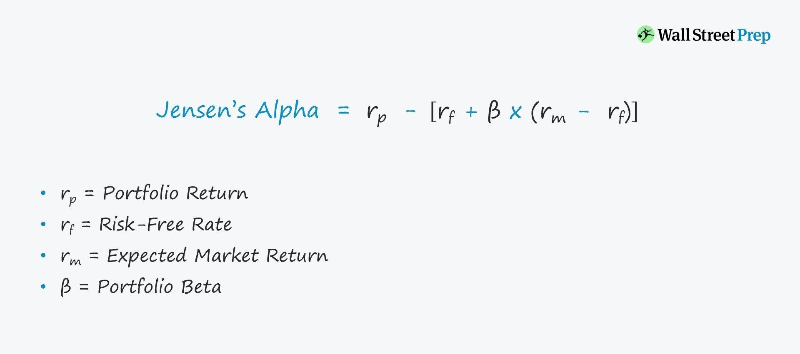

## Table of Contents

## What is Jensen's alpha?

Jensen's alpha is a way to measure how well a portfolio or investment is doing compared to what you would expect it to do. It looks at the difference between the actual returns of the portfolio and the returns you would expect based on its level of risk. The expected return is calculated using a model called the Capital Asset Pricing Model (CAPM), which takes into account the risk-free rate of return and the market's overall return.

If Jensen's alpha is positive, it means the portfolio is doing better than expected for its level of risk. This could suggest that the portfolio manager is making good decisions or has a good strategy. On the other hand, if Jensen's alpha is negative, the portfolio is not doing as well as it should be for the amount of risk taken. This might mean the portfolio manager needs to rethink their approach. Jensen's alpha helps investors see if a portfolio is truly adding value beyond just taking on more risk.

## Who developed Jensen's alpha?

Jensen's alpha was developed by Michael Jensen, an economist, in the 1960s. He wanted to find a way to see if investment managers were doing a good job. He thought that just looking at how much money they made was not enough. He wanted to know if they were making more money than they should, considering the risks they were taking.

So, Jensen came up with a measure that compares the actual returns of a portfolio to what you would expect those returns to be, based on the risk of the portfolio. This measure is called Jensen's alpha. If the alpha is positive, it means the manager is doing better than expected. If it's negative, they're not doing as well as they should be for the risks they're taking. This helps investors decide if a manager is really adding value.

## How is Jensen's alpha calculated?

Jensen's alpha is a way to see if a portfolio is doing better or worse than you would expect based on its risk. To calculate it, you start with the actual return of the portfolio. Then, you subtract the expected return. The expected return is figured out using something called the Capital Asset Pricing Model, or CAPM for short. CAPM looks at the risk-free rate of return, which is like the return you get from super safe investments like government bonds, and the return of the whole market. It also considers how risky the portfolio is compared to the market, which is called the portfolio's beta.

So, the formula for Jensen's alpha is: Alpha = Actual Return - Expected Return. The expected return part of the formula is: Expected Return = Risk-Free Rate + Beta * (Market Return - Risk-Free Rate). If the alpha is positive, it means the portfolio did better than expected for its level of risk. If it's negative, the portfolio did worse than expected. This helps investors see if a portfolio manager is really good at picking investments or if they're just taking on a lot of risk.

## What does a positive Jensen's alpha indicate?

A positive Jensen's alpha means that the portfolio did better than expected for the amount of risk it took. It's like getting more reward than you thought you would for the risks you took. When you see a positive alpha, it suggests that the person managing the portfolio is doing a good job. They might be picking the right investments or timing the market well.

This can be really helpful for investors. If they see a portfolio with a positive alpha, they might feel more confident that the manager is adding value. It's not just about taking on more risk; it's about making smart choices that lead to better returns. So, a positive Jensen's alpha is a good sign that the portfolio is doing well beyond what you would normally expect.

## What does a negative Jensen's alpha indicate?

A negative Jensen's alpha means that the portfolio did worse than expected for the amount of risk it took. It's like getting less reward than you thought you would for the risks you took. When you see a negative alpha, it suggests that the person managing the portfolio might not be doing a good job. They might be picking the wrong investments or not timing the market well.

This can be a warning sign for investors. If they see a portfolio with a negative alpha, they might start to worry that the manager is not adding value. It's not just about taking on more risk; it's about making smart choices that lead to better returns. So, a negative Jensen's alpha is a sign that the portfolio is not doing as well as it should be, given the risks involved.

## How does Jensen's alpha differ from the Sharpe ratio?

Jensen's alpha and the Sharpe ratio are both ways to see how well a portfolio is doing, but they look at different things. Jensen's alpha looks at how much better or worse a portfolio is doing compared to what you would expect it to do for the amount of risk it takes. It uses something called the Capital Asset Pricing Model (CAPM) to figure out what the expected return should be. If the actual return is higher than the expected return, you get a positive alpha, which means the portfolio is doing better than expected. If it's lower, you get a negative alpha, which means it's not doing as well as it should.

The Sharpe ratio, on the other hand, looks at how much extra return you get for each bit of risk you take. It compares the difference between the portfolio's return and the risk-free rate to the portfolio's risk, which is measured by something called standard deviation. A higher Sharpe ratio means you're getting more return for the risk you're taking, which is good. A lower Sharpe ratio means you're not getting much extra return for the risk, which is not so good. So, while Jensen's alpha focuses on how well the portfolio does compared to what you expect, the Sharpe ratio focuses on how much return you get for the risk you take.

## What are the limitations of using Jensen's alpha?

Jensen's alpha is a good way to see if a portfolio is doing better than expected, but it has some problems. One big problem is that it uses the Capital Asset Pricing Model (CAPM) to figure out what the expected return should be. But, the CAPM is based on some ideas that might not always be true in the real world. For example, it assumes that everyone can borrow and lend money at the same risk-free rate, which isn't always the case. Also, it assumes that all investors have the same information and make the same choices, which isn't realistic either. So, if the CAPM isn't right, then Jensen's alpha might not be right either.

Another problem with Jensen's alpha is that it only looks at how well a portfolio does compared to the market as a whole. It doesn't take into account other things that might affect how well the portfolio does, like the type of investments it has or how those investments are spread out. For example, a portfolio might do well because it's invested in a certain industry that's doing really well, not because the portfolio manager is making smart choices. So, Jensen's alpha might give you a good idea of how well a portfolio is doing, but it doesn't tell you the whole story.

## Can Jensen's alpha be used to compare different types of investments?

Jensen's alpha can be used to compare different types of investments, but it has some limits. It looks at how well an investment does compared to what you would expect it to do for the amount of risk it takes. This means you can see if one investment is doing better than another, even if they are different kinds of investments. For example, you could compare a stock portfolio to a bond portfolio to see which one is doing better than expected.

However, there are some things to keep in mind. Jensen's alpha uses a model called the Capital Asset Pricing Model (CAPM) to figure out what the expected return should be. This model makes some guesses about the world that might not always be right. For example, it assumes that everyone can borrow and lend money at the same safe rate, which isn't always true. Also, Jensen's alpha doesn't look at other things that might affect how well an investment does, like what kind of investments it has or how those investments are spread out. So, while Jensen's alpha can give you a good idea of how well different investments are doing, it doesn't tell you the whole story.

## How does Jensen's alpha relate to the Capital Asset Pricing Model (CAPM)?

Jensen's alpha is closely tied to the Capital Asset Pricing Model (CAPM). CAPM is a way to figure out what return you should expect from an investment based on how risky it is. It looks at the risk-free rate, which is the return you get from super safe investments like government bonds, and the return of the whole market. It also considers how risky the investment is compared to the market, which is called the investment's beta. Jensen's alpha uses this expected return from CAPM and compares it to the actual return of the investment. If the actual return is higher than the expected return, you get a positive alpha, which means the investment did better than expected. If it's lower, you get a negative alpha, meaning it didn't do as well as it should have.

However, because Jensen's alpha relies on CAPM, it also has some of the same problems. CAPM makes some guesses about the world that might not always be right. For example, it assumes everyone can borrow and lend money at the same safe rate, which isn't always true. It also assumes all investors have the same information and make the same choices, which isn't realistic. So, if CAPM isn't accurate, then Jensen's alpha might not be accurate either. But even with these problems, Jensen's alpha can still be a useful tool to see if an investment is doing better or worse than expected for its level of risk.

## What role does the risk-free rate play in calculating Jensen's alpha?

The risk-free rate is a key part of figuring out Jensen's alpha. It's the return you get from super safe investments, like government bonds. When you calculate Jensen's alpha, you use the risk-free rate to find out what return you should expect from a portfolio. This expected return is figured out using the Capital Asset Pricing Model (CAPM), which looks at the risk-free rate, the return of the whole market, and how risky the portfolio is compared to the market. The risk-free rate helps set a starting point for what you should expect to earn, no matter how risky the portfolio is.

Once you know the expected return, you can compare it to the actual return of the portfolio. Jensen's alpha is the difference between these two numbers. If the actual return is higher than the expected return, you get a positive alpha, which means the portfolio did better than expected. If it's lower, you get a negative alpha, meaning it didn't do as well as it should have. So, the risk-free rate is important because it helps you figure out what you should expect to earn, and then you can see if the portfolio is doing better or worse than that.

## How can Jensen's alpha be used in portfolio management?

Jensen's alpha is a helpful tool for people who manage portfolios. It tells them if they are doing a good job or not. By using Jensen's alpha, a portfolio manager can see if the investments they pick are doing better than what you would expect for the amount of risk they take. If the alpha is positive, it means the portfolio is doing better than expected, which is a good sign. The manager might feel happy about this and keep doing what they are doing. But if the alpha is negative, it means the portfolio is not doing as well as it should. This might make the manager want to change their strategy or pick different investments.

Jensen's alpha can also help when comparing different portfolios or investment managers. If an investor is trying to decide which portfolio to put their money in, they can look at the Jensen's alpha of each one. A portfolio with a higher positive alpha might be more attractive because it shows that the manager is doing a good job of picking investments that do better than expected. But it's important to remember that Jensen's alpha is not perfect. It uses a model called the Capital Asset Pricing Model, which makes some guesses about the world that might not always be right. So, while Jensen's alpha can give a good idea of how well a portfolio is doing, it's best to use it along with other tools to get the full picture.

## What advanced statistical considerations should be taken into account when interpreting Jensen's alpha?

When you look at Jensen's alpha, you need to think about some advanced statistical stuff to make sure you understand it right. One important thing is the idea of statistical significance. Just because you see a positive or negative alpha doesn't mean it's real. It could just be a random thing that happened by chance. To figure out if the alpha is really meaningful, you need to do some tests to see if it's statistically significant. This means checking if the alpha is big enough that it's not likely to be just a fluke.

Another thing to think about is the time period you're looking at. Jensen's alpha can change a lot depending on whether you're looking at a short time or a long time. If you only look at a few months, the alpha might look really good or really bad just because of some short-term luck. But if you look at several years, you might get a better idea of how the portfolio is really doing. Also, you need to think about how the returns are spread out. If the returns jump around a lot, that can make the alpha less reliable. So, it's important to look at things like the standard deviation of the returns to get a full picture of what the alpha really means.

## What is Jensen's Ratio and how can it be understood?

Jensen’s Alpha is a crucial metric used to measure a portfolio's performance by calculating its excess returns against expected returns, taking market risk into account. This metric is pivotal in investment analysis, offering insights into the performance of a portfolio on a risk-adjusted basis. It evaluates how well a portfolio manager or trading algorithm has performed relative to a theoretical prediction of performance derived from the Capital Asset Pricing Model (CAPM).

Integral to the CAPM, Jensen's Alpha considers the expected return of an asset based on its inherent risk. The CAPM posits that the expected return of an asset or portfolio is a function of risk-free rates, market return expectations, and the asset's sensitivity to market movements, represented by Beta (β). This sensitivity, or Beta, measures how much the asset's returns are expected to change with a change in market returns. The expected return computation can be represented by the formula:

$$
E(R_p) = R_f + \beta \times (R_m - R_f)
$$

where:

- $R_f$ is the risk-free rate,
- $\beta$ represents the portfolio's sensitivity to market movements,
- $R_m$ signifies the expected market return,
- $E(R_p)$ is the expected return of the portfolio.

Jensen's Alpha ($\alpha$) is calculated using the formula:

$$
\alpha = R_p - [R_f + \beta(R_m - R_f)]
$$

Here, $R_p$ denotes the actual portfolio return. Jensen's Alpha, thus, identifies the difference between the portfolio's realized return and the anticipated return, according to CAPM assumptions. A positive Alpha suggests that the portfolio has outperformed its expected returns, indicating that the portfolio manager or strategy possesses skill beyond market factors. Conversely, a negative Alpha implies underperformance relative to the given level of risk.

In practical financial analysis, Jensen’s Alpha helps investors and traders assess whether their investment strategies are generating adequate returns for the risks undertaken. It not only reflects the manager's ability to generate risk-adjusted returns but also aids in the comparison of different portfolios or trading strategies to determine which managers or models genuinely add value relative to market expectations.

## How is Jensen's Alpha calculated?

The calculation of Jensen's Alpha involves quantifying a portfolio's risk-adjusted return using the well-established Capital Asset Pricing Model (CAPM) formula. To accurately compute Jensen's Alpha, one must gather several key financial metrics: the portfolio return (Rp), the risk-free rate (Rf), the portfolio beta (β), and the market return (Rm).

The formula for Jensen's Alpha (α) is expressed as:

$$
\alpha = Rp - [Rf + \beta(Rm - Rf)]
$$

This calculation subtracts the expected return, as predicted by CAPM, from the actual portfolio return. The expected return is determined by adjusting the market's excess return (Rm - Rf) by the portfolio's beta (β), which measures the portfolio's sensitivity to market movements, and then adding the risk-free rate (Rf).

A positive Alpha signifies that the portfolio has exceeded its expected performance when adjusted for risk, highlighting successful investment strategies or the skill of a portfolio manager. Conversely, a negative Alpha indicates underperformance against expectations.

Automation of this calculation is feasible through programming languages like Python. By utilizing libraries such as NumPy or Pandas, traders can efficiently compute and analyze Jensen's Alpha across various portfolios. Here's a simple Python code snippet demonstrating the calculation:

```python
def calculate_jensens_alpha(portfolio_return, risk_free_rate, portfolio_beta, market_return):
    expected_return = risk_free_rate + portfolio_beta * (market_return - risk_free_rate)
    alpha = portfolio_return - expected_return
    return alpha

# Example usage:
Rp = 0.12  # 12% portfolio return
Rf = 0.03  # 3% risk-free rate
β = 1.2    # Portfolio beta
Rm = 0.10  # 10% market return

alpha = calculate_jensens_alpha(Rp, Rf, β, Rm)
print("Jensen's Alpha:", alpha)
```

This calculation forms a foundational aspect of portfolio analysis, providing essential insights into a strategy's effectiveness in contributing superior risk-adjusted returns. Through automation, traders can rapidly evaluate numerous portfolios, thereby facilitating enhanced investment decision-making processes.

## What is the significance of Jensen’s Alpha in algo trading?

Jensen’s Alpha is an essential tool in [algorithmic trading](/wiki/algorithmic-trading) for evaluating the relative performance of trading strategies. By assessing a strategy's return in comparison to its inherent risk, traders gain valuable insights into the efficiency of their models. Jensen’s Alpha is defined as the excess return of a portfolio compared to the expected return based on the Capital Asset Pricing Model (CAPM). The formula used is:

$$
\alpha = R_p - \left[ R_f + \beta \times (R_m - R_f) \right]
$$

where $R_p$ is the portfolio return, $R_f$ is the risk-free rate, $\beta$ is the portfolio's beta, and $R_m$ is the market return. A positive Alpha suggests that a trading strategy is outperforming its benchmark, hence indicating superior design and execution skills.

In practice, strategies that consistently exhibit a positive Jensen's Alpha are often prioritized for resource allocation and operational execution. This prioritization allows firms to focus resources on strategies that are statistically proven to generate higher risk-adjusted returns. Furthermore, the ongoing analysis of Jensen’s Alpha enables continuous refinement of trading models. Historical performance can be systematically analyzed to fine-tune strategies, improving their effectiveness and adaptability to changing market conditions.

Algorithmic trading systems benefit significantly from employing Jensen's Alpha to validate and adjust strategies. As such, traders can make informed decisions on which models warrant further development or occlusion based on their relative performance insights provided by this metric.

## References & Further Reading

Jensen, M.C. (1968). 'The Performance of Mutual Funds in the Period 1945-1964.' Journal of Finance. This seminal paper introduced the concept of Jensen's Alpha, providing a framework for evaluating mutual fund performance relative to market expectations.

Fama, E.F., & French, K.R. (2004). 'The Capital Asset Pricing Model: Theory and Evidence.' Journal of Economic Perspectives. This paper critically examines the Capital Asset Pricing Model (CAPM), integral for Jensen's Alpha, discussing its theoretical foundations and empirical evidence.

Sharpe, W.F. (1964). 'Capital Asset Prices: A Theory of Market Equilibrium under Conditions of Risk.' The Journal of Finance. This foundational work lays out the CAPM, a crucial element for assessing risk-adjusted returns in relation to market performance, which is central to calculating Jensen's Alpha.

Lintner, J. (1965). 'The Valuation of Risk Assets and the Selection of Risky Investments in Stock Portfolios and Capital Budgets.' This paper further explores CAPM's application in evaluating risky investments and forming capital budgets, complementing Sharpe’s development of the model.

Bodie, Z., Kane, A., & Marcus, A.J. (2014). 'Investments.' McGraw-Hill Education. This textbook covers comprehensive investment strategies, including risk assessment and portfolio management, essential for applying Jensen's Alpha in financial analysis and algorithmic trading.

