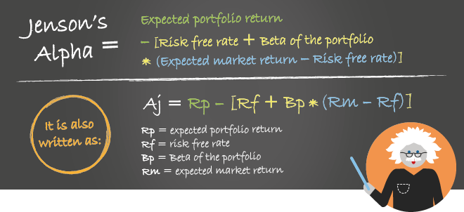

Jensen's Alpha, also commonly referred to as Jensen's Ratio, is a fundamental financial metric employed to assess the risk-adjusted performance of investment portfolios and trading strategies. This measure is particularly useful in algorithmic trading, where it indicates a strategy's ability to deliver returns surpassing those of a benchmark index, after adjusting for the associated risk. Originating from the work of economist Michael Jensen, the concept relies on the Capital Asset Pricing Model (CAPM) to ascertain whether a portfolio's returns exceed market expectations.

The formula for Jensen's Alpha is given by:



$$
\alpha = R_p - [R_f + \beta (R_m - R_f)]
$$

where:
- $R_p$ is the portfolio's return,
- $R_f$ is the risk-free rate,
- $\beta$ is the portfolio's beta,
- $R_m$ is the market return.

Algorithmic traders use Jensen’s Alpha to evaluate the effectiveness and skill inherent in their trading models. Through this evaluation, traders can gain valuable insights into whether their strategies provide superior performance relative to the market, once the accompanying risks have been factored in. This article will thoroughly explore the calculation, significance, and application of Jensen's Alpha, particularly in the context of algorithmic trading, providing a detailed overview of its utility and importance in this dynamic field.

## Table of Contents

## Understanding Jensen’s Ratio

Jensen’s Alpha is a crucial metric used to measure a portfolio's performance by calculating its excess returns against expected returns, taking market risk into account. This metric is pivotal in investment analysis, offering insights into the performance of a portfolio on a risk-adjusted basis. It evaluates how well a portfolio manager or trading algorithm has performed relative to a theoretical prediction of performance derived from the Capital Asset Pricing Model (CAPM).

Integral to the CAPM, Jensen's Alpha considers the expected return of an asset based on its inherent risk. The CAPM posits that the expected return of an asset or portfolio is a function of risk-free rates, market return expectations, and the asset's sensitivity to market movements, represented by Beta (β). This sensitivity, or Beta, measures how much the asset's returns are expected to change with a change in market returns. The expected return computation can be represented by the formula:

$$
E(R_p) = R_f + \beta \times (R_m - R_f)
$$

where:

- $R_f$ is the risk-free rate,
- $\beta$ represents the portfolio's sensitivity to market movements,
- $R_m$ signifies the expected market return,
- $E(R_p)$ is the expected return of the portfolio.

Jensen's Alpha ($\alpha$) is calculated using the formula:

$$
\alpha = R_p - [R_f + \beta(R_m - R_f)]
$$

Here, $R_p$ denotes the actual portfolio return. Jensen's Alpha, thus, identifies the difference between the portfolio's realized return and the anticipated return, according to CAPM assumptions. A positive Alpha suggests that the portfolio has outperformed its expected returns, indicating that the portfolio manager or strategy possesses skill beyond market factors. Conversely, a negative Alpha implies underperformance relative to the given level of risk.

In practical financial analysis, Jensen’s Alpha helps investors and traders assess whether their investment strategies are generating adequate returns for the risks undertaken. It not only reflects the manager's ability to generate risk-adjusted returns but also aids in the comparison of different portfolios or trading strategies to determine which managers or models genuinely add value relative to market expectations.

## Calculation of Jensen's Alpha

The calculation of Jensen's Alpha involves quantifying a portfolio's risk-adjusted return using the well-established Capital Asset Pricing Model (CAPM) formula. To accurately compute Jensen's Alpha, one must gather several key financial metrics: the portfolio return (Rp), the risk-free rate (Rf), the portfolio beta (β), and the market return (Rm).

The formula for Jensen's Alpha (α) is expressed as:

$$
\alpha = Rp - [Rf + \beta(Rm - Rf)]
$$

This calculation subtracts the expected return, as predicted by CAPM, from the actual portfolio return. The expected return is determined by adjusting the market's excess return (Rm - Rf) by the portfolio's beta (β), which measures the portfolio's sensitivity to market movements, and then adding the risk-free rate (Rf).

A positive Alpha signifies that the portfolio has exceeded its expected performance when adjusted for risk, highlighting successful investment strategies or the skill of a portfolio manager. Conversely, a negative Alpha indicates underperformance against expectations.

Automation of this calculation is feasible through programming languages like Python. By utilizing libraries such as NumPy or Pandas, traders can efficiently compute and analyze Jensen's Alpha across various portfolios. Here's a simple Python code snippet demonstrating the calculation:

```python
def calculate_jensens_alpha(portfolio_return, risk_free_rate, portfolio_beta, market_return):
    expected_return = risk_free_rate + portfolio_beta * (market_return - risk_free_rate)
    alpha = portfolio_return - expected_return
    return alpha

# Example usage:
Rp = 0.12  # 12% portfolio return
Rf = 0.03  # 3% risk-free rate
β = 1.2    # Portfolio beta
Rm = 0.10  # 10% market return

alpha = calculate_jensens_alpha(Rp, Rf, β, Rm)
print("Jensen's Alpha:", alpha)
```

This calculation forms a foundational aspect of portfolio analysis, providing essential insights into a strategy's effectiveness in contributing superior risk-adjusted returns. Through automation, traders can rapidly evaluate numerous portfolios, thereby facilitating enhanced investment decision-making processes.

## Significance of Jensen’s Alpha in Algo Trading

Jensen’s Alpha is an essential tool in [algorithmic trading](/wiki/algorithmic-trading) for evaluating the relative performance of trading strategies. By assessing a strategy's return in comparison to its inherent risk, traders gain valuable insights into the efficiency of their models. Jensen’s Alpha is defined as the excess return of a portfolio compared to the expected return based on the Capital Asset Pricing Model (CAPM). The formula used is:

$$
\alpha = R_p - \left[ R_f + \beta \times (R_m - R_f) \right]
$$

where $R_p$ is the portfolio return, $R_f$ is the risk-free rate, $\beta$ is the portfolio's beta, and $R_m$ is the market return. A positive Alpha suggests that a trading strategy is outperforming its benchmark, hence indicating superior design and execution skills.

In practice, strategies that consistently exhibit a positive Jensen's Alpha are often prioritized for resource allocation and operational execution. This prioritization allows firms to focus resources on strategies that are statistically proven to generate higher risk-adjusted returns. Furthermore, the ongoing analysis of Jensen’s Alpha enables continuous refinement of trading models. Historical performance can be systematically analyzed to fine-tune strategies, improving their effectiveness and adaptability to changing market conditions.

Algorithmic trading systems benefit significantly from employing Jensen's Alpha to validate and adjust strategies. As such, traders can make informed decisions on which models warrant further development or occlusion based on their relative performance insights provided by this metric.

## Applying Jensen’s Ratio in Financial Analysis

Jensen's Ratio, or Jensen's Alpha, is a critical metric in financial analysis for evaluating the effectiveness of trading strategies. It is particularly beneficial in [backtesting](/wiki/backtesting), where strategies that exhibit a higher Jensen's Alpha signify historical outperformance compared to benchmarks. This outperformance is determined by the capacity of a strategy to generate returns above the expected level, adjusted for market risk.

When applied in financial analysis, Jensen's Alpha facilitates the comparison of different trading strategies. By evaluating the Alpha values across various strategies, analysts can identify those with true competitive advantage or those that consistently outperform benchmark indices. This comparison allows traders and portfolio managers to make informed decisions on which strategies to adopt, enhance, or discontinue based on their risk-adjusted performance.

Moreover, Jensen's Ratio extends beyond historical analysis into real-time applications within trading platforms. By integrating Jensen's Alpha into real-time tracking systems, traders can continuously monitor strategy performance and adjust tactics in response to market shifts, optimizing their trading decisions. The real-time application of Jensen's Alpha ensures that traders maintain an updated view of strategy efficacy in relation to current market conditions and expected risks.

In practice, computing Jensen's Alpha involves a formula derived from the Capital Asset Pricing Model (CAPM):  
$$
\alpha = R_p - [R_f + \beta(R_m - R_f)] \]  
where $R_p$ is the portfolio's return, $R_f$ is the risk-free rate, $\beta$ is the portfolio beta, and $R_m$ is the market return. Utilizing programming environments like Python, traders can automate this calculation, leveraging libraries such as NumPy or Pandas for efficient data processing.

Ultimately, Jensen's Ratio aligns trading strategies with market performance relative to expected risks, enabling traders to refine their decision-making processes for optimized financial outcomes.

## Criticisms and Limitations of Jensen’s Ratio

A positive Jensen's Alpha may not always indicate genuine skill in managing a portfolio or trading strategy. Often, it could result from statistical anomalies or noise, leading to misleading interpretations of a strategy's effectiveness. This underscores the importance of rigorous statistical testing to distinguish between true skill and random variations in performance.

Jensen's Alpha is specifically designed to measure market risk, utilizing the Capital Asset Pricing Model (CAPM). However, it fails to account for other types of risks that are prevalent in financial markets, such as credit risk, [liquidity](/wiki/liquidity-risk-premium) risk, and operational risk. This limitation is crucial, as ignoring non-market risks could result in an incomplete assessment of a portfolio's or strategy's performance.

The reliance on CAPM assumptions for calculating Jensen’s Alpha poses another significant limitation. CAPM assumes a perfect market where all investors have access to the same information and can borrow or lend at a risk-free rate. Real-world markets, however, often deviate from these assumptions, thus affecting the reliability of Jensen's Alpha as a performance measure. For instance, CAPM’s assumption of beta as a constant measure of market risk is often challenged by the dynamic nature of financial markets.

Using Jensen’s Alpha as a standalone metric could result in an incomplete evaluation of a portfolio's performance. It is advisable to use it alongside other performance metrics such as the Sharpe Ratio, Treynor Ratio, or Sortino Ratio to derive a comprehensive understanding of risk-adjusted returns. Each metric offers unique insights, and their combined application can provide a more balanced overview of financial performance.

Additionally, the Efficient Market Hypothesis (EMH) poses critical theoretical challenges to the consistent generation of Alpha. According to EMH, it is difficult, if not impossible, to consistently achieve returns above average market returns on a risk-adjusted basis, because asset prices already reflect all available information. This challenges the notion that active management can regularly produce positive Alpha, and indicates that observed Alpha may be hard to sustain over the long term.

In summary, while Jensen's Alpha is a useful tool for financial analysis, its limitations must be carefully considered. Portfolio managers and algorithmic traders should apply this metric with an understanding of its constraints and complement it with other analytical tools for a more robust assessment of investment performance.

## Conclusion

Jensen's Alpha presents a robust framework for evaluating trading strategies within the algorithmic trading domain. It offers a detailed risk-adjusted assessment of performance, enabling traders to understand better the effectiveness and skill underlying their strategies. Despite facing some criticisms, such as potential over-reliance on the Capital Asset Pricing Model (CAPM) assumptions and limitations in addressing non-market risks, Jensen's Alpha continues to be a valuable tool. By providing insights beyond mere returns, it allows traders to make informed decisions that enhance strategy development and execution.

Integrating Jensen’s Alpha into analytical frameworks augments the refinement of trading models, offering a quantitative basis for tweaking and improving algorithmic strategies. Its application enables traders to align their objectives with the reality of market conditions, helping identify areas for strategy improvements and performance optimizations. Effective use of Jensen's Alpha can guide resource allocation toward strategies displaying consistent positive Alpha, indicative of superior performance.

To ensure a well-rounded performance evaluation, it is crucial that traders do not rely solely on Jensen's Alpha. Combining it with other performance metrics, such as the Sharpe Ratio or Sortino Ratio, provides a more comprehensive understanding of a strategy's success and the multifaceted nature of market risks. This balanced approach ensures that traders can holistically assess the credibility and sustainability of their strategies, ultimately leading to more successful and resilient trading operations.

## FAQs

**What is Jensen's Alpha or Jensen's Ratio?**

Jensen's Alpha, also referred to as Jensen's Ratio, is a financial metric that assesses the risk-adjusted performance of an investment portfolio or trading strategy. It evaluates whether a portfolio has achieved returns that exceed the expected benchmark, given the amount of market risk as characterized by the portfolio's beta. Derived from the Capital Asset Pricing Model (CAPM), Jensen's Alpha is calculated using the formula: $\alpha = Rp - [Rf + \beta(Rm - Rf)]$, where $Rp$ is the portfolio return, $Rf$ is the risk-free rate, $\beta$ is the portfolio's beta, and $Rm$ is the market return.

**How does Jensen's Ratio reveal a portfolio's performance relative to market expectations?**

Jensen's Ratio reveals a portfolio's performance relative to market expectations by comparing the actual returns of the portfolio to the returns forecasted by the CAPM. The CAPM estimates what the portfolio returns should be, given its beta and the market risk premium. If the actual returns exceed these expected returns, secured through a positive Jensen's Alpha ($\alpha > 0$), it indicates that the portfolio has outperformed its benchmark on a risk-adjusted basis. Conversely, a negative Jensen's Alpha suggests underperformance.

**Why is Jensen's Alpha a measure of a portfolio manager's or trading algorithm's skill?**

Jensen's Alpha serves as a measure of a portfolio manager's or trading algorithm's skill because it isolates the manager's ability to yield excess risk-adjusted returns beyond what is expected from passive exposure to the market. A consistently positive Alpha suggests that the portfolio manager or algorithm possesses exceptional skill in selecting investments or adjusting strategy to capture inefficiencies that generate additional returns, all beyond those achieved simply by taking on more risk.

**How can Jensen's Alpha be applied practically in algorithmic trading?**

In algorithmic trading, Jensen's Alpha can be applied by evaluating the effectiveness of different trading algorithms in generating excess returns adjusted for risk. By calculating Alpha for each strategy, traders and analysts can identify which algorithms consistently outperform benchmarks after accounting for market risk as depicted by beta. This insight assists in decision-making for resource allocation, strategy refinement, and real-time strategy adjustments. Algorithm developers often use scripting languages like Python to automate the analysis and backtest strategies for historical performance using Jensen's Alpha.

**What are the limitations of relying solely on Jensen's Alpha for performance evaluation?**

Relying solely on Jensen's Alpha for performance evaluation has several limitations. First, a positive Alpha may be the result of statistical anomalies or random chance rather than actual skill. Secondly, Jensen's Alpha is contingent upon CAPM assumptions, which may not always accurately reflect market complexities or non-market risks such as liquidity or credit risks. Lastly, it does not consider other metrics, such as the Sharpe Ratio or Sortino Ratio, which may provide a more comprehensive view of an investment’s risk-return profile. A robust performance assessment should involve a combination of various financial metrics to mitigate these limitations.

## References & Further Reading

Jensen, M.C. (1968). 'The Performance of Mutual Funds in the Period 1945-1964.' Journal of Finance. This seminal paper introduced the concept of Jensen's Alpha, providing a framework for evaluating mutual fund performance relative to market expectations.

Fama, E.F., & French, K.R. (2004). 'The Capital Asset Pricing Model: Theory and Evidence.' Journal of Economic Perspectives. This paper critically examines the Capital Asset Pricing Model (CAPM), integral for Jensen's Alpha, discussing its theoretical foundations and empirical evidence.

Sharpe, W.F. (1964). 'Capital Asset Prices: A Theory of Market Equilibrium under Conditions of Risk.' The Journal of Finance. This foundational work lays out the CAPM, a crucial element for assessing risk-adjusted returns in relation to market performance, which is central to calculating Jensen's Alpha.

Lintner, J. (1965). 'The Valuation of Risk Assets and the Selection of Risky Investments in Stock Portfolios and Capital Budgets.' This paper further explores CAPM's application in evaluating risky investments and forming capital budgets, complementing Sharpe’s development of the model.

Bodie, Z., Kane, A., & Marcus, A.J. (2014). 'Investments.' McGraw-Hill Education. This textbook covers comprehensive investment strategies, including risk assessment and portfolio management, essential for applying Jensen's Alpha in financial analysis and algorithmic trading.

