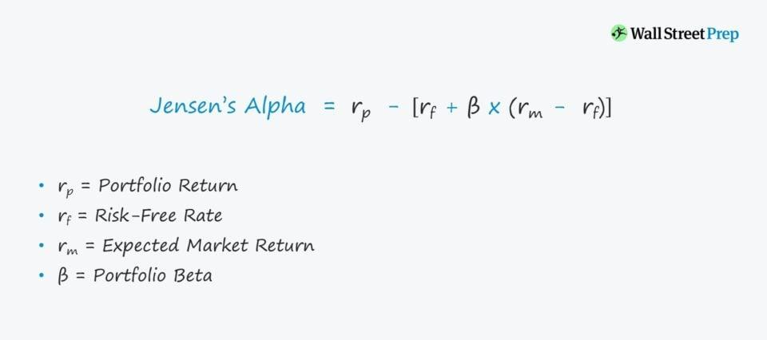

## Table of Contents

## What is Jensen's Measure?

Jensen's Measure, also known as Jensen's Alpha, is a way to figure out how well a portfolio or an investment is doing compared to what you would expect from the market. It was created by Michael Jensen. The measure looks at the difference between the actual returns of the portfolio and the expected returns based on the market's performance. If the result is positive, it means the portfolio did better than expected. If it's negative, the portfolio didn't do as well as the market suggested it should.

To calculate Jensen's Alpha, you start with the actual return of the portfolio. Then, you subtract the expected return. The expected return is found using a model like the Capital Asset Pricing Model (CAPM), which considers the risk-free rate of return, the overall market return, and the portfolio's sensitivity to market movements (beta). A positive alpha shows that the portfolio manager has added value by making smart investment choices, while a negative alpha indicates that the portfolio underperformed relative to its risk level.

## Who developed Jensen's Measure and when?

Jensen's Measure, also known as Jensen's Alpha, was developed by Michael Jensen. He introduced this measure in the 1960s. Michael Jensen is an American economist who has made significant contributions to the field of finance and corporate governance.

Jensen's Alpha is a way to see if an investment or a portfolio is doing better or worse than what the market would predict. It compares the actual returns of the investment to the expected returns based on market performance. If the Alpha is positive, it means the investment did better than expected. If it's negative, the investment didn't do as well as the market thought it should.

## What is the purpose of using Jensen's Measure in finance?

Jensen's Measure, or Jensen's Alpha, is used in finance to see if a portfolio or an investment is doing better or worse than what the market would predict. It helps investors understand if their investments are performing well compared to the overall market. This is important because it shows whether the people managing the investments, like fund managers, are making good choices that add value to the portfolio.

By calculating Jensen's Alpha, investors can see if the returns they are getting are due to smart investment decisions or just because the market is doing well. If Jensen's Alpha is positive, it means the portfolio is doing better than expected, which is a good sign that the investment strategy is working. If it's negative, it means the portfolio isn't doing as well as it should, and investors might want to think about changing their strategy or finding a different manager.

## How does Jensen's Measure differ from other performance measures like the Sharpe Ratio?

Jensen's Measure, also known as Jensen's Alpha, and the Sharpe Ratio are both used to see how well an investment is doing, but they look at different things. Jensen's Alpha compares the actual returns of a portfolio to what you would expect from the market. It uses a model like the Capital Asset Pricing Model (CAPM) to figure out what the expected returns should be. If the Alpha is positive, it means the portfolio did better than the market expected. If it's negative, it means the portfolio didn't do as well as expected. This measure helps investors see if the people managing the investments are making good choices.

The Sharpe Ratio, on the other hand, looks at how much return you are getting for the risk you are taking. It compares the return of the portfolio to the risk-free rate, like the return on government bonds, and then divides that by the standard deviation of the portfolio's returns. The standard deviation shows how much the returns go up and down. A higher Sharpe Ratio means you are getting more return for the risk you are taking. Unlike Jensen's Alpha, the Sharpe Ratio doesn't compare the portfolio's performance to the market's performance; it just looks at the return compared to the risk.

So, Jensen's Alpha is about comparing your portfolio's performance to the market, while the Sharpe Ratio is about looking at the return you get for the risk you take. Both measures are useful, but they give you different information about your investments.

## What are the key components needed to calculate Jensen's Measure?

To calculate Jensen's Measure, or Jensen's Alpha, you need three main things: the actual return of the portfolio, the risk-free rate, and the portfolio's beta. The actual return is just how much money the portfolio made over a certain time. The risk-free rate is the return you would get from a very safe investment, like government bonds. The portfolio's beta shows how much the portfolio's returns move with the market's returns. A beta of 1 means the portfolio moves exactly with the market, while a beta higher or lower than 1 means the portfolio moves more or less than the market.

Once you have these three pieces of information, you can use them to figure out the expected return of the portfolio. The expected return is calculated using a model like the Capital Asset Pricing Model (CAPM). The formula for the expected return is the risk-free rate plus the portfolio's beta times the difference between the market return and the risk-free rate. After you find the expected return, you subtract it from the actual return of the portfolio. The result is Jensen's Alpha. If it's positive, the portfolio did better than expected. If it's negative, the portfolio didn't do as well as expected.

## Can you explain the formula for calculating Jensen's Measure?

Jensen's Measure, or Jensen's Alpha, is a way to see if a portfolio is doing better or worse than what the market would predict. To calculate it, you need to know three things: the actual return of the portfolio, the risk-free rate, and the portfolio's beta. The actual return is how much money the portfolio made over a certain time. The risk-free rate is the return you would get from a very safe investment, like government bonds. The portfolio's beta shows how much the portfolio's returns move with the market's returns. A beta of 1 means the portfolio moves exactly with the market, while a beta higher or lower than 1 means the portfolio moves more or less than the market.

Once you have these three pieces of information, you can use them to figure out the expected return of the portfolio. The expected return is calculated using a model called the Capital Asset Pricing Model (CAPM). The formula for the expected return is the risk-free rate plus the portfolio's beta times the difference between the market return and the risk-free rate. After you find the expected return, you subtract it from the actual return of the portfolio. The result is Jensen's Alpha. If it's positive, the portfolio did better than expected. If it's negative, the portfolio didn't do as well as expected.

## What does a positive Jensen's Measure indicate about a portfolio's performance?

A positive Jensen's Measure, or Jensen's Alpha, means that a portfolio is doing better than what the market expected. It shows that the people managing the portfolio are making smart choices and [picking](/wiki/asset-class-picking) investments that are doing well. This is a good sign because it means the portfolio is beating the market, not just following it.

When you see a positive Jensen's Alpha, it tells you that the extra returns are coming from the skill of the portfolio manager, not just from the general ups and downs of the market. Investors like to see a positive Alpha because it means their money is being managed well and they are getting more return than they would have just by investing in the market as a whole.

## How can Jensen's Measure be used to compare different investment portfolios?

Jensen's Measure, or Jensen's Alpha, is a great way to compare different investment portfolios. It helps you see which portfolio is doing better than the market expects. To use Jensen's Measure for comparison, you calculate the Alpha for each portfolio. If one portfolio has a higher positive Alpha than another, it means that portfolio is doing better at beating the market's expectations. This can help investors decide which portfolio is being managed better and might be a better choice for their money.

For example, if you have two portfolios, Portfolio A and Portfolio B, and Portfolio A has a Jensen's Alpha of 2% while Portfolio B has a Jensen's Alpha of 1%, Portfolio A is doing better than expected by the market by a larger amount. This suggests that the manager of Portfolio A is making smarter investment choices. By looking at the Jensen's Alpha of different portfolios, investors can get a clear picture of which ones are adding more value and might be worth investing in.

## What are the limitations of using Jensen's Measure for performance evaluation?

One big problem with using Jensen's Measure, or Jensen's Alpha, to see how well an investment is doing is that it depends a lot on the model used to figure out what the expected return should be. Usually, people use the Capital Asset Pricing Model (CAPM) for this, but the CAPM has its own issues. It assumes that everyone can borrow and lend at the risk-free rate, and it doesn't think about other risks that might affect returns. If the model used to find the expected return isn't right, then Jensen's Alpha won't be right either.

Another issue is that Jensen's Alpha can be affected by luck. Just because a portfolio has a positive Alpha doesn't mean the manager is always making good choices. Sometimes, they might just get lucky with their investments. Also, Jensen's Alpha doesn't tell you anything about how risky the investments are. A portfolio could have a high Alpha but also be very risky, which might not be what all investors want. So, it's important to use Jensen's Alpha along with other measures to get a full picture of how well an investment is doing.

## How does the choice of benchmark affect the results of Jensen's Measure?

The choice of benchmark is really important when you're using Jensen's Measure, or Jensen's Alpha, to see how well an investment is doing. The benchmark is what you compare the investment's returns to. If you pick a benchmark that doesn't match the investment well, the Alpha you get might not be very useful. For example, if you're looking at a portfolio that invests in tech stocks, using a broad market index like the S&P 500 as your benchmark might not be the best choice. A tech-specific index would be a better fit because it would give you a more accurate idea of how the portfolio is doing compared to similar investments.

If you use the wrong benchmark, you might think a portfolio is doing better or worse than it really is. Let's say you use a very safe benchmark for a portfolio that takes a lot of risks. The portfolio might look like it's doing great because it's beating the safe benchmark, but it's actually just taking on more risk. On the other hand, if you use a very risky benchmark for a safe portfolio, the portfolio might look like it's not doing well, even though it's doing fine for how safe it is. So, picking the right benchmark is key to making sure Jensen's Alpha gives you a true picture of how well the portfolio is doing.

## What statistical considerations should be taken into account when interpreting Jensen's Measure?

When you're using Jensen's Measure, also known as Jensen's Alpha, to see how well an investment is doing, you need to think about a few statistical things. One important thing is the amount of data you have. If you only have a little bit of data, your results might not be very reliable. It's like trying to guess the weather for the whole year by only looking at a few days. The more data you have, the better you can trust the results. Another thing to consider is the standard error of the Alpha. This tells you how much your Alpha might be off because of random chance. If the standard error is big, your Alpha might not be as meaningful as you think.

Another statistical thing to think about is the significance of the Alpha. Just because you see a positive or negative Alpha doesn't mean it's important. You need to do a test, like a t-test, to see if the Alpha is really different from zero in a way that matters. If the Alpha isn't statistically significant, it might just be due to luck and not because the portfolio manager is doing a good or bad job. Also, you should think about how the returns are spread out, or the distribution. If the returns don't follow a normal pattern, the usual ways of figuring out significance might not work well. So, it's a good idea to check the distribution of returns before you put too much trust in the Alpha.

## How can Jensen's Measure be integrated with other risk-adjusted performance metrics for a comprehensive analysis?

Jensen's Measure, or Jensen's Alpha, can be used together with other risk-adjusted performance metrics to get a better idea of how well an investment is doing. One popular metric to use with Jensen's Alpha is the Sharpe Ratio. The Sharpe Ratio looks at how much return you are getting for the risk you are taking. While Jensen's Alpha compares your portfolio's returns to what the market expects, the Sharpe Ratio tells you if you're being rewarded enough for the risk you're taking. By using both measures, you can see if your portfolio is beating the market and if it's doing so in a way that's worth the risk. For example, a portfolio might have a positive Jensen's Alpha but a low Sharpe Ratio, which means it's doing better than expected but not giving you enough return for the risk involved.

Another useful metric to consider alongside Jensen's Alpha is the Treynor Ratio. The Treynor Ratio is similar to the Sharpe Ratio but uses beta instead of standard deviation to measure risk. Beta shows how much the portfolio's returns move with the market's returns. The Treynor Ratio helps you see how well your portfolio is doing compared to the market, considering its sensitivity to market movements. When you look at Jensen's Alpha and the Treynor Ratio together, you get a fuller picture of the portfolio's performance. A high Treynor Ratio along with a positive Jensen's Alpha suggests that the portfolio is not only beating the market but also doing so in a way that's smart about managing market risk. By combining these different metrics, investors can make more informed decisions about their investments.

## What is Jensen's Measure and how can it be understood?

Jensen's Measure, commonly known as Jensen's Alpha, is a performance metric used predominantly in finance to evaluate the ability of a portfolio manager or trading strategy to generate returns in excess of a benchmark index. It was proposed by Michael Jensen in the late 1960s as a way to appraise the performance of mutual fund managers by accounting for the risk undertaken. The measure has since become a cornerstone in financial analysis, forming part of the broader framework of performance evaluation.

At its core, Jensen's Alpha is calculated by computing the excess returns a trading strategy or portfolio achieves over what would be predicted by the Capital Asset Pricing Model (CAPM). The formula for Jensen’s Alpha ($\alpha$) is expressed as follows:

$$

\alpha = R_i - \left( R_f + \beta_i \times (R_m - R_f) \right) 
$$

Here, $R_i$ represents the actual return of the portfolio, $R_f$ is the risk-free rate of return, $\beta_i$ denotes the portfolio's beta, and $R_m$ is the market return. The equation essentially measures the excess return ($R_i - R_f$) that remains after accounting for the expected return predicted by a linear relationship with the market ($\beta_i \times (R_m - R_f)$). A positive Jensen's Alpha suggests that the portfolio has outperformed the benchmark on a risk-adjusted basis, while a negative Alpha indicates underperformance.

Jensen's Measure fits within the suite of performance metrics by offering insights into whether a trader or investment manager is adding value above that of simply following the market trend. It incorporates key components like the risk-free rate, often represented by the return on government bonds, which serves as a baseline for risk-free investment. Additionally, the market beta ($\beta_i$) is integral for understanding how much of the excess return can be attributed to the inherent risk assumed relative to the market.

Despite its widespread use, Jensen’s Measure is not without limitations. It relies significantly on the assumptions of the CAPM, including the notion that returns are linearly related to the market and that perfect capital markets exist. Moreover, Jensen’s Alpha is sensitive to the choice of risk-free rate and market index, which can introduce biases. It also does not account for other risk factors beyond market risk, such as [liquidity](/wiki/liquidity-risk-premium) risk or credit risk, which contemporary multi-[factor](/wiki/factor-investing) models attempt to incorporate.

In summary, Jensen’s Measure provides a robust mechanism for assessing performance but should ideally be complemented by other metrics to form a holistic view of a trading strategy's efficacy. Its ability to pinpoint value-addition above market predictions makes it a valuable tool in performance evaluation, albeit with a mindful consideration of its computational assumptions and limitations.

## What is the role of Alpha in Algorithmic Trading?

Alpha, often synonymous with excess returns, is crucial in understanding the performance of investment strategies, including [algorithmic trading](/wiki/algorithmic-trading). It represents the difference between a portfolio's actual returns and its expected performance, given its risk level, as measured by beta. In mathematical terms, Alpha ($\alpha$) can be expressed as:

$$
\alpha = R_i - \left( R_f + \beta \times (R_m - R_f) \right)
$$

where $R_i$ is the portfolio return, $R_f$ is the risk-free rate, $\beta$ is the portfolio's beta, and $R_m$ is the market return.

Algorithmic trading systems strive to achieve a positive Alpha, signifying superior performance relative to the market. By leveraging advanced algorithms, these systems analyze vast datasets at high speeds, identifying trading opportunities that potentially outperform standard benchmarks. Positive Alpha is a testament to the system’s ability to exploit inefficiencies or trends effectively.

The significance of Alpha in distinguishing successful algorithms lies in its role as a performance indicator. A high Alpha suggests that a trading strategy is not only offsetting risks inherent in market [volatility](/wiki/volatility-trading-strategies) but is doing so more effectively than average market participants. Consequently, it serves as a critical measure for investors and fund managers in evaluating which trading algorithms yield the best returns adjusted for risk.

Case studies highlight various scenarios where algorithmic trading systems have successfully generated Alpha. For instance, high-frequency trading ([HFT](/wiki/high-frequency-trading-strategies)) firms use proprietary algorithms to capitalize on minute price discrepancies. Such strategies require robust infrastructure capable of executing trades in microseconds, exploiting short-term opportunities that contribute to Alpha generation.

Nevertheless, maintaining consistent Alpha remains challenging in a rapidly evolving market environment. Algo trading systems must constantly adapt to changes in market dynamics, regulatory shifts, and technological advancements. Factors like sudden economic events, increased competition among trading firms, and changes in liquidity can affect an algorithm's capacity to sustain positive Alpha over time. Moreover, high transaction costs and market impact must be carefully managed to prevent erosion of returns.

In conclusion, Alpha remains a pivotal concept in algorithmic trading. While achieving and sustaining positive Alpha is challenging, it is essential for traders and analysts aiming for superior investment performance. Recognizing its importance allows for more refined strategy development and optimization in the pursuit of consistent, risk-adjusted returns.

## How can we evaluate algo trading performance using Jensen’s Measure?

Applying Jensen's Measure to evaluate algorithmic trading performance involves several steps. Jensen's Measure, or Alpha, represents the excess return of an investment compared to its expected return based on the Capital Asset Pricing Model (CAPM). It is a critical gauge in determining the effectiveness of trading strategies.

### Step-by-Step Process

1. **Data Collection and Preparation**: Historical data is paramount. You'll need data on the returns of the trading algorithm, the benchmark index returns, and the risk-free rate. Ensure this data is clean and spans a suitable time frame.

2. **Calculation of Expected Returns**: Using the CAPM formula:
$$
   \text{Expected Return} = R_f + \beta \times (R_m - R_f)

$$
   where $R_f$ is the risk-free rate, $\beta$ is the beta of the trading strategy, and $R_m$ is the return of the market.

3. **Determine Actual Returns**: Calculate the actual returns generated by the algorithm over the period.

4. **Compute Jensen's Alpha**: 
$$
   \alpha = R_a - (R_f + \beta \times (R_m - R_f))

$$
   where $R_a$ is the actual return of the trading algorithm. This formula measures the excess return after adjusting for the expected risk.

5. **Interpretation of Results**: A positive Alpha indicates that the trading strategy has outperformed the benchmark index after adjusting for risk, whereas a negative Alpha suggests underperformance.

### Optimizing Trading Strategies

When interpreting results, a positive Jensen's Alpha suggests that the strategy is adding value, while a negative or zero Alpha raises red flags about the strategy's validity or the need for adjustments.

### Integration into Trading Platforms

Implementing Jensen’s Measure within trading platforms can enhance performance evaluation. Many platforms now integrate APIs that automate the calculation, streamlining the process for real-time analysis.

### Importance of Historical Data and Back-Testing

Historical data and back-testing are crucial for validating the consistency and reliability of the trading strategy. They help in verifying whether the observed Alpha is sustainable or a result of favorable market conditions.

### Implications of Negative or Zero Alpha

Negative or zero Alpha in trading strategies signals potential issues in the algorithm. This might be an indication that the algorithm is not capturing market inefficiencies or is too aligned with the market movements, offering no additional value after accounting for risk. Adjusting such algorithms may involve reassessing risk parameters, optimizing trade execution, or revisiting the underlying model assumptions.

In conclusion, applying Jensen's Measure in evaluating algorithmic trading performance provides valuable insights into a strategy’s risk-adjusted returns. Automated integration into trading systems enables real-time performance tracking, while rigorous back-testing ensures robustness in changing market dynamics. Understanding the implications of the Alpha value is crucial for making informed decisions and refining trading strategies.

## How does Jensen's Measure compare to other performance metrics?

Jensen’s Measure, also known as Alpha, serves as a cornerstone in evaluating the performance of investment strategies, especially in algorithmic trading. It provides a framework for assessing a strategy's ability to generate returns in excess of a benchmark, adjusting for systematic risk. However, it is crucial to contrast Jensen’s Measure with other prevalent performance metrics like the Sharpe Ratio and Sortino Ratio to appreciate its unique applications and limitations.

The Sharpe Ratio, formulated by William F. Sharpe, measures the risk-adjusted return of an investment portfolio. It is calculated by subtracting the risk-free rate from the portfolio return and dividing the result by the portfolio's standard deviation:

$$
\text{Sharpe Ratio} = \frac{R_p - R_f}{\sigma_p}
$$

where $R_p$ is the portfolio return, $R_f$ is the risk-free rate, and $\sigma_p$ is the standard deviation of the portfolio's excess return. The Sharpe Ratio is advantageous as it considers both the excess return and the total risk, making it a holistic measure of performance. Nonetheless, it assumes that returns are normally distributed and may penalize portfolios with asymmetric returns.

The Sortino Ratio, a modification of the Sharpe Ratio, addresses some of these limitations by focusing on downside risk, using the standard deviation of negative asset returns, or downside deviation, in the denominator:

$$
\text{Sortino Ratio} = \frac{R_p - R_f}{\sigma_{d}}
$$

where $\sigma_{d}$ is the downside deviation. This ratio is particularly useful in scenarios where the risk of negative returns is more relevant than total volatility, providing a more realistic risk assessment for traders concerned with downside risk.

Contrasting these metrics, Jensen’s Measure is particularly effective when evaluating strategies against a specific benchmark adjusted for risk, as it isolates the manager's contribution to returns. It is computed using the Capital Asset Pricing Model (CAPM):

$$
\alpha = R_p - [R_f + \beta (R_m - R_f)]
$$

where $\beta$ represents the portfolio's sensitivity to market movements and $R_m$ is the market return. Jensen’s Measure is limited in scenarios where identifying an appropriate benchmark is problematic or where non-systematic risk factors significantly impact returns.

The divergence between Jensen’s Measure and other performance metrics lies in their interpretation of risk and return. While the Sharpe and Sortino Ratios offer insights into overall and downside risk-adjusted returns, respectively, Jensen’s Measure focuses on excess returns relative to a benchmark, accounting for market risk. This coherence and divergence necessitate a comprehensive approach to performance analysis, where employing multiple metrics provides a robust perspective, such as comparing Alpha for excess returns with the Sharpe Ratio for risk-adjusted returns.

The future of performance metrics in financial technology is poised for innovation. With advancements in data analysis, [machine learning](/wiki/machine-learning), and [artificial intelligence](/wiki/ai-artificial-intelligence), integrating comprehensive metrics like Jensen's Measure with real-time analytics can unlock deeper insights into strategy performance. As financial markets evolve, the development of new metrics or enhancements to existing ones will be pivotal in addressing the complexities of algorithmic trading. Consequently, exploring and possibly combining Jensen’s Measure with emerging analytics tools is crucial for future-ready trading strategies.

## What are the challenges and considerations in using Jensen’s Measure?

Applying Jensen's Measure in practical scenarios presents several challenges. While it is a powerful tool for evaluating the performance of trading algorithms, there are significant considerations that traders and analysts must address.

One key limitation of Jensen’s Measure is its reliance on historical data, which may not always reflect future market conditions. Jensen's Measure calculates Alpha by considering the risk-adjusted returns over a benchmark, typically represented by the Capital Asset Pricing Model (CAPM). The formula is:

$$
\alpha = R_i - [R_f + \beta_i \times (R_m - R_f)]
$$

where $R_i$ is the realized return of the portfolio, $R_f$ is the risk-free rate, $\beta_i$ is the portfolio beta, and $R_m$ is the market return. However, historical betas used in this calculation might change as market dynamics shift, thereby affecting the reliability of the estimated Alpha.

Market volatility and external economic factors also play crucial roles in influencing Jensen’s Alpha. During periods of high volatility, the assumptions underpinning CAPM, such as constant betas, can fail. Changes in interest rates, geopolitical events, or economic crises can lead to rapid shifts in market behavior, making it difficult to assess true algorithmic performance using Jensen's Measure alone.

Transaction costs and market impacts are additional considerations that can skew the evaluation of trading strategies when using Jensen's Measure. These costs can significantly affect net returns, especially in high-frequency trading contexts, where small margins are critical. Failing to account for these costs can result in overestimating Alpha. Incorporating these factors requires adjustments to the standard formula, possibly through simulations or amended calculations that consider these operational costs.

To overcome the challenges associated with using Jensen’s Measure, several strategies can be implemented. Diversifying the metrics used to evaluate performance is one effective approach. Complementing Jensen’s Measure with other performance metrics like the Sharpe Ratio or the Information Ratio can provide a more holistic view of a trading strategy’s performance. Additionally, robust back-testing with diverse datasets can help identify potential discrepancies arising from changes in beta or unexpected market shifts.

Moreover, integrating technological advancements, such as machine learning algorithms, can enhance the adaptability of Jensen's Measure. These technologies can aid in predicting changes in market conditions and adjusting betas dynamically, providing a more accurate evaluation of Alpha.

In summary, while Jensen's Measure is a valuable tool for assessing algorithmic trading performance, its effectiveness can be hampered by practical challenges. By understanding and addressing these challenges, and by using a combination of different evaluation techniques, traders can make more informed decisions and optimize their trading strategies.

## References & Further Reading

[1]: Jensen, M. C. (1968). ["The Performance of Mutual Funds in the Period 1945–1964."](https://onlinelibrary.wiley.com/doi/full/10.1111/j.1540-6261.1968.tb00815.x) Journal of Finance, 23(2), 389-416.

[2]: Sharpe, W. F. (1966). ["Mutual Fund Performance."](https://www.jstor.org/stable/pdf/2351448.pdf) Journal of Business, 39(1), 119-138.

[3]: Black, F., Jensen, M. C., & Scholes, M. (1972). ["The Capital Asset Pricing Model: Some Empirical Tests."](https://papers.ssrn.com/sol3/papers.cfm?abstract_id=908569) In M.C. Jensen (Ed.), Studies in the Theory of Capital Markets. Praeger Publishers Inc.

[4]: Jorion, P. (2007). ["Value at Risk: The New Benchmark for Managing Financial Risk."](https://link.springer.com/article/10.1007/s11408-007-0057-3) McGraw-Hill Education.

[5]: Sortino, F. A., & Van der Meer, R. (1991). ["Downside Risk."](https://www.pm-research.com/content/iijpormgmt/17/4/27) Journal of Portfolio Management, 17(4), 27-31.

[6]: Markowitz, H. (1952). ["Portfolio Selection."](https://onlinelibrary.wiley.com/doi/abs/10.1111/j.1540-6261.1952.tb01525.x) Journal of Finance, 7(1), 77-91.

[7]: Carhart, M. M. (1997). ["On Persistence in Mutual Fund Performance."](https://onlinelibrary.wiley.com/doi/full/10.1111/j.1540-6261.1997.tb03808.x) The Review of Financial Studies, 11(1), 57-82.

[8]: Lo, A. W., & MacKinlay, A. C. (1999). ["A Non-Random Walk Down Wall Street."](https://www.jstor.org/stable/j.ctt7tccx) Princeton University Press.