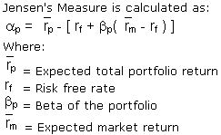

In the fast-paced world of finance, algorithmic trading is pivotal in contemporary investment and portfolio management practices. As investors seek methods to enhance their returns, performance evaluation becomes critical, especially with the growing reliance on algorithms in trading. One of the key metrics for assessing performance in this context is Jensen's Measure, often referred to simply as Alpha. This article provides an in-depth exploration of how Jensen's Measure is utilized to evaluate the effectiveness of trading algorithms, offering valuable insights into their capacity to generate excess returns over a benchmark.

Jensen's Measure, a fundamental concept originating from the Capital Asset Pricing Model (CAPM), evaluates the return on an investment relative to its risk-adjusted expected return. It allows traders and financial analysts to quantify the extent to which a trading strategy outperforms or underperforms the expected returns, distinguishing successful strategies from those needing adjustments. By understanding the intricacies of Jensen's Measure, both traders and analysts can refine their strategies, optimizing returns in a competitive market environment.

Join us as we unpack the significance of Jensen's Measure in algo trading, exploring its role in the quest for superior returns and its implications for strategy optimization. Through this exploration, we aim to shed light on the potential for enhanced decision-making and strategic growth within algorithmic trading systems.

## Table of Contents

## Understanding Jensen’s Measure

Jensen's Measure, commonly known as Jensen's Alpha, is a performance metric used predominantly in finance to evaluate the ability of a portfolio manager or trading strategy to generate returns in excess of a benchmark index. It was proposed by Michael Jensen in the late 1960s as a way to appraise the performance of mutual fund managers by accounting for the risk undertaken. The measure has since become a cornerstone in financial analysis, forming part of the broader framework of performance evaluation.

At its core, Jensen's Alpha is calculated by computing the excess returns a trading strategy or portfolio achieves over what would be predicted by the Capital Asset Pricing Model (CAPM). The formula for Jensen’s Alpha ($\alpha$) is expressed as follows:

$$

\alpha = R_i - \left( R_f + \beta_i \times (R_m - R_f) \right) 
$$

Here, $R_i$ represents the actual return of the portfolio, $R_f$ is the risk-free rate of return, $\beta_i$ denotes the portfolio's beta, and $R_m$ is the market return. The equation essentially measures the excess return ($R_i - R_f$) that remains after accounting for the expected return predicted by a linear relationship with the market ($\beta_i \times (R_m - R_f)$). A positive Jensen's Alpha suggests that the portfolio has outperformed the benchmark on a risk-adjusted basis, while a negative Alpha indicates underperformance.

Jensen's Measure fits within the suite of performance metrics by offering insights into whether a trader or investment manager is adding value above that of simply following the market trend. It incorporates key components like the risk-free rate, often represented by the return on government bonds, which serves as a baseline for risk-free investment. Additionally, the market beta ($\beta_i$) is integral for understanding how much of the excess return can be attributed to the inherent risk assumed relative to the market.

Despite its widespread use, Jensen’s Measure is not without limitations. It relies significantly on the assumptions of the CAPM, including the notion that returns are linearly related to the market and that perfect capital markets exist. Moreover, Jensen’s Alpha is sensitive to the choice of risk-free rate and market index, which can introduce biases. It also does not account for other risk factors beyond market risk, such as [liquidity](/wiki/liquidity-risk-premium) risk or credit risk, which contemporary multi-[factor](/wiki/factor-investing) models attempt to incorporate.

In summary, Jensen’s Measure provides a robust mechanism for assessing performance but should ideally be complemented by other metrics to form a holistic view of a trading strategy's efficacy. Its ability to pinpoint value-addition above market predictions makes it a valuable tool in performance evaluation, albeit with a mindful consideration of its computational assumptions and limitations.

## Alpha in Algorithmic Trading

Alpha, often synonymous with excess returns, is crucial in understanding the performance of investment strategies, including [algorithmic trading](/wiki/algorithmic-trading). It represents the difference between a portfolio's actual returns and its expected performance, given its risk level, as measured by beta. In mathematical terms, Alpha ($\alpha$) can be expressed as:

$$
\alpha = R_i - \left( R_f + \beta \times (R_m - R_f) \right)
$$

where $R_i$ is the portfolio return, $R_f$ is the risk-free rate, $\beta$ is the portfolio's beta, and $R_m$ is the market return.

Algorithmic trading systems strive to achieve a positive Alpha, signifying superior performance relative to the market. By leveraging advanced algorithms, these systems analyze vast datasets at high speeds, identifying trading opportunities that potentially outperform standard benchmarks. Positive Alpha is a testament to the system’s ability to exploit inefficiencies or trends effectively.

The significance of Alpha in distinguishing successful algorithms lies in its role as a performance indicator. A high Alpha suggests that a trading strategy is not only offsetting risks inherent in market [volatility](/wiki/volatility-trading-strategies) but is doing so more effectively than average market participants. Consequently, it serves as a critical measure for investors and fund managers in evaluating which trading algorithms yield the best returns adjusted for risk.

Case studies highlight various scenarios where algorithmic trading systems have successfully generated Alpha. For instance, high-frequency trading ([HFT](/wiki/high-frequency-trading-strategies)) firms use proprietary algorithms to capitalize on minute price discrepancies. Such strategies require robust infrastructure capable of executing trades in microseconds, exploiting short-term opportunities that contribute to Alpha generation.

Nevertheless, maintaining consistent Alpha remains challenging in a rapidly evolving market environment. Algo trading systems must constantly adapt to changes in market dynamics, regulatory shifts, and technological advancements. Factors like sudden economic events, increased competition among trading firms, and changes in liquidity can affect an algorithm's capacity to sustain positive Alpha over time. Moreover, high transaction costs and market impact must be carefully managed to prevent erosion of returns.

In conclusion, Alpha remains a pivotal concept in the realm of algorithmic trading. While achieving and sustaining positive Alpha is challenging, it is essential for traders and analysts aiming for superior investment performance. Recognizing its importance allows for more refined strategy development and optimization in the pursuit of consistent, risk-adjusted returns.

## Evaluating Algo Trading Performance with Jensen’s Measure

Applying Jensen's Measure to evaluate algorithmic trading performance involves several steps. Jensen's Measure, or Alpha, represents the excess return of an investment compared to its expected return based on the Capital Asset Pricing Model (CAPM). It is a critical gauge in determining the effectiveness of trading strategies.

### Step-by-Step Process

1. **Data Collection and Preparation**: Historical data is paramount. You'll need data on the returns of the trading algorithm, the benchmark index returns, and the risk-free rate. Ensure this data is clean and spans a suitable time frame.

2. **Calculation of Expected Returns**: Using the CAPM formula:
$$
   \text{Expected Return} = R_f + \beta \times (R_m - R_f)

$$
   where $R_f$ is the risk-free rate, $\beta$ is the beta of the trading strategy, and $R_m$ is the return of the market.

3. **Determine Actual Returns**: Calculate the actual returns generated by the algorithm over the period.

4. **Compute Jensen's Alpha**: 
$$
   \alpha = R_a - (R_f + \beta \times (R_m - R_f))

$$
   where $R_a$ is the actual return of the trading algorithm. This formula measures the excess return after adjusting for the expected risk.

5. **Interpretation of Results**: A positive Alpha indicates that the trading strategy has outperformed the benchmark index after adjusting for risk, whereas a negative Alpha suggests underperformance.

### Optimizing Trading Strategies

When interpreting results, a positive Jensen's Alpha suggests that the strategy is adding value, while a negative or zero Alpha raises red flags about the strategy's validity or the need for adjustments.

### Integration into Trading Platforms

Implementing Jensen’s Measure within trading platforms can enhance performance evaluation. Many platforms now integrate APIs that automate the calculation, streamlining the process for real-time analysis.

### Importance of Historical Data and Back-Testing

Historical data and back-testing are crucial for validating the consistency and reliability of the trading strategy. They help in verifying whether the observed Alpha is sustainable or a result of favorable market conditions.

### Implications of Negative or Zero Alpha

Negative or zero Alpha in trading strategies signals potential issues in the algorithm. This might be an indication that the algorithm is not capturing market inefficiencies or is too aligned with the market movements, offering no additional value after accounting for risk. Adjusting such algorithms may involve reassessing risk parameters, optimizing trade execution, or revisiting the underlying model assumptions.

In conclusion, applying Jensen's Measure in evaluating algorithmic trading performance provides valuable insights into a strategy’s risk-adjusted returns. Automated integration into trading systems enables real-time performance tracking, while rigorous back-testing ensures robustness in changing market dynamics. Understanding the implications of the Alpha value is crucial for making informed decisions and refining trading strategies.

## Comparing Jensen’s Measure to Other Performance Metrics

Jensen’s Measure, also known as Alpha, serves as a cornerstone in evaluating the performance of investment strategies, especially in algorithmic trading. It provides a framework for assessing a strategy's ability to generate returns in excess of a benchmark, adjusting for systematic risk. However, it is crucial to contrast Jensen’s Measure with other prevalent performance metrics like the Sharpe Ratio and Sortino Ratio to appreciate its unique applications and limitations.

The Sharpe Ratio, formulated by William F. Sharpe, measures the risk-adjusted return of an investment portfolio. It is calculated by subtracting the risk-free rate from the portfolio return and dividing the result by the portfolio's standard deviation:

$$
\text{Sharpe Ratio} = \frac{R_p - R_f}{\sigma_p}
$$

where $R_p$ is the portfolio return, $R_f$ is the risk-free rate, and $\sigma_p$ is the standard deviation of the portfolio's excess return. The Sharpe Ratio is advantageous as it considers both the excess return and the total risk, making it a holistic measure of performance. Nonetheless, it assumes that returns are normally distributed and may penalize portfolios with asymmetric returns.

The Sortino Ratio, a modification of the Sharpe Ratio, addresses some of these limitations by focusing on downside risk, using the standard deviation of negative asset returns, or downside deviation, in the denominator:

$$
\text{Sortino Ratio} = \frac{R_p - R_f}{\sigma_{d}}
$$

where $\sigma_{d}$ is the downside deviation. This ratio is particularly useful in scenarios where the risk of negative returns is more relevant than total volatility, providing a more realistic risk assessment for traders concerned with downside risk.

Contrasting these metrics, Jensen’s Measure is particularly effective when evaluating strategies against a specific benchmark adjusted for risk, as it isolates the manager's contribution to returns. It is computed using the Capital Asset Pricing Model (CAPM):

$$
\alpha = R_p - [R_f + \beta (R_m - R_f)]
$$

where $\beta$ represents the portfolio's sensitivity to market movements and $R_m$ is the market return. Jensen’s Measure is limited in scenarios where identifying an appropriate benchmark is problematic or where non-systematic risk factors significantly impact returns.

The divergence between Jensen’s Measure and other performance metrics lies in their interpretation of risk and return. While the Sharpe and Sortino Ratios offer insights into overall and downside risk-adjusted returns, respectively, Jensen’s Measure focuses on excess returns relative to a benchmark, accounting for market risk. This coherence and divergence necessitate a comprehensive approach to performance analysis, where employing multiple metrics provides a robust perspective, such as comparing Alpha for excess returns with the Sharpe Ratio for risk-adjusted returns.

The future of performance metrics in financial technology is poised for innovation. With advancements in data analysis, [machine learning](/wiki/machine-learning), and [artificial intelligence](/wiki/ai-artificial-intelligence), integrating comprehensive metrics like Jensen's Measure with real-time analytics can unlock deeper insights into strategy performance. As financial markets evolve, the development of new metrics or enhancements to existing ones will be pivotal in addressing the complexities of algorithmic trading. Consequently, exploring and possibly combining Jensen’s Measure with emerging analytics tools is crucial for future-ready trading strategies.

## Challenges and Considerations in Using Jensen’s Measure

Applying Jensen's Measure in practical scenarios presents several challenges. While it is a powerful tool for evaluating the performance of trading algorithms, there are significant considerations that traders and analysts must address.

One key limitation of Jensen’s Measure is its reliance on historical data, which may not always reflect future market conditions. Jensen's Measure calculates Alpha by considering the risk-adjusted returns over a benchmark, typically represented by the Capital Asset Pricing Model (CAPM). The formula is:

$$
\alpha = R_i - [R_f + \beta_i \times (R_m - R_f)]
$$

where $R_i$ is the realized return of the portfolio, $R_f$ is the risk-free rate, $\beta_i$ is the portfolio beta, and $R_m$ is the market return. However, historical betas used in this calculation might change as market dynamics shift, thereby affecting the reliability of the estimated Alpha.

Market volatility and external economic factors also play crucial roles in influencing Jensen’s Alpha. During periods of high volatility, the assumptions underpinning CAPM, such as constant betas, can fail. Changes in interest rates, geopolitical events, or economic crises can lead to rapid shifts in market behavior, making it difficult to assess true algorithmic performance using Jensen's Measure alone.

Transaction costs and market impacts are additional considerations that can skew the evaluation of trading strategies when using Jensen's Measure. These costs can significantly affect net returns, especially in high-frequency trading contexts, where small margins are critical. Failing to account for these costs can result in overestimating Alpha. Incorporating these factors requires adjustments to the standard formula, possibly through simulations or amended calculations that consider these operational costs.

To overcome the challenges associated with using Jensen’s Measure, several strategies can be implemented. Diversifying the metrics used to evaluate performance is one effective approach. Complementing Jensen’s Measure with other performance metrics like the Sharpe Ratio or the Information Ratio can provide a more holistic view of a trading strategy’s performance. Additionally, robust back-testing with diverse datasets can help identify potential discrepancies arising from changes in beta or unexpected market shifts.

Moreover, integrating technological advancements, such as machine learning algorithms, can enhance the adaptability of Jensen's Measure. These technologies can aid in predicting changes in market conditions and adjusting betas dynamically, providing a more accurate evaluation of Alpha.

In summary, while Jensen's Measure is a valuable tool for assessing algorithmic trading performance, its effectiveness can be hampered by practical challenges. By understanding and addressing these challenges, and by using a combination of different evaluation techniques, traders can make more informed decisions and optimize their trading strategies.

## Conclusion

Jensen's Measure, also known as Alpha, serves as a critical tool in evaluating algorithmic trading performance by providing insights into the efficacy of trading strategies to achieve excess returns. This measure quantifies the value added by a trading strategy compared to a benchmark, allowing analysts to isolate the skill of an algorithm from the underlying market movements. By effectively using Jensen's Measure, traders can refine strategies to improve performance outcomes.

The strategic use of Jensen’s Measure alongside other performance metrics such as the Sharpe Ratio or Sortino Ratio can offer a more comprehensive understanding of an algorithm's performance in varying market conditions. Including multiple metrics ensures a well-rounded evaluation, considering different aspects such as risk-adjusted returns and downside risk, leading to more effective portfolio and strategy management.

In the rapidly advancing field of financial technology, performance evaluation techniques continue to evolve. Modern trading environments benefit from integrating Jensen’s Measure within advanced analytic platforms and utilizing machine learning for more precise predictions. Such integration enables the dynamic adjustment of trading strategies in response to real-time market conditions, enhancing the adaptability and success rate of algorithmic trading systems.

Looking ahead, the role of Jensen's Measure is expected to expand with technological advancements. Greater computational power and data availability will likely lead to more sophisticated applications of Jensen’s Measure, enabling traders to better capture and interpret complex market signals. As algo trading systems advance, Jensen's Measure can be further developed, potentially leading to novel enhancements in performance evaluation methodologies that accommodate increasingly complex financial instruments and trading environments.

## References & Further Reading

[1]: Jensen, M. C. (1968). ["The Performance of Mutual Funds in the Period 1945–1964."](https://onlinelibrary.wiley.com/doi/full/10.1111/j.1540-6261.1968.tb00815.x) Journal of Finance, 23(2), 389-416.

[2]: Sharpe, W. F. (1966). ["Mutual Fund Performance."](https://www.jstor.org/stable/pdf/2351448.pdf) Journal of Business, 39(1), 119-138.

[3]: Black, F., Jensen, M. C., & Scholes, M. (1972). ["The Capital Asset Pricing Model: Some Empirical Tests."](https://papers.ssrn.com/sol3/papers.cfm?abstract_id=908569) In M.C. Jensen (Ed.), Studies in the Theory of Capital Markets. Praeger Publishers Inc.

[4]: Jorion, P. (2007). ["Value at Risk: The New Benchmark for Managing Financial Risk."](https://link.springer.com/article/10.1007/s11408-007-0057-3) McGraw-Hill Education.

[5]: Sortino, F. A., & Van der Meer, R. (1991). ["Downside Risk."](https://www.pm-research.com/content/iijpormgmt/17/4/27) Journal of Portfolio Management, 17(4), 27-31.

[6]: Markowitz, H. (1952). ["Portfolio Selection."](https://onlinelibrary.wiley.com/doi/abs/10.1111/j.1540-6261.1952.tb01525.x) Journal of Finance, 7(1), 77-91.

[7]: Carhart, M. M. (1997). ["On Persistence in Mutual Fund Performance."](https://onlinelibrary.wiley.com/doi/full/10.1111/j.1540-6261.1997.tb03808.x) The Review of Financial Studies, 11(1), 57-82.

[8]: Lo, A. W., & MacKinlay, A. C. (1999). ["A Non-Random Walk Down Wall Street."](https://www.jstor.org/stable/j.ctt7tccx) Princeton University Press.