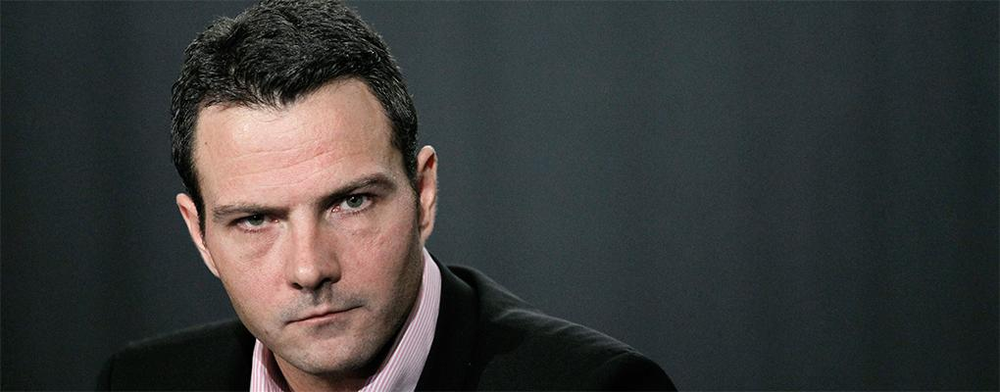

## Table of Contents

## Who is Jerome Kerviel?

Jerome Kerviel is a French man who used to work at a big bank called Societe Generale. He became famous because he made very risky bets with the bank's money. He did this without the bank knowing, and he lost a lot of money. In the end, he lost about 4.9 billion euros. This was one of the biggest financial frauds ever.

After people found out what he did, Jerome was arrested and went to jail. He spent five years in prison. After he got out, he had to do community service and pay back the money he lost. But it is very hard for him to pay back such a huge amount. Now, he works at a different job and tries to live a normal life.

## What was Jerome Kerviel's role at Societe Generale?

Jerome Kerviel worked at Societe Generale as a junior trader in the bank's Delta One division. His job was to make small bets on the stock market to help the bank make a little bit of money. He was supposed to follow strict rules and not take big risks.

But Jerome started making big bets without telling anyone. He used the bank's money to do this, and he hid what he was doing by making fake trades. He thought he could win back the money if he kept going, but he ended up losing a huge amount of money for the bank.

## How did Jerome Kerviel start his career in the banking industry?

Jerome Kerviel started his career in the banking industry after he finished school. He studied finance at the University of Lyon and then got a master's degree in finance from the University of Paris. After finishing his studies, he got a job at Societe Generale, a big bank in France. He started working there in 2000 as a junior trader in the bank's Delta One division.

At first, Jerome did what he was supposed to do. He made small bets on the stock market to help the bank make a little bit of money. He followed the rules and did not take big risks. But over time, he started to make bigger bets without telling anyone. He used the bank's money to do this and hid what he was doing by making fake trades. This is how he got into big trouble.

## What are derivatives and how do they work?

Derivatives are financial contracts that get their value from something else, like stocks, bonds, or even things like oil or gold. Imagine you want to bet on whether the price of a stock will go up or down. Instead of buying the stock itself, you can buy a derivative that will give you money if the stock goes up, or cost you money if it goes down. This way, you can make money without actually owning the stock.

Derivatives can be used to protect against risk or to make bets on future prices. For example, a farmer might use a derivative to lock in a price for his crops before he harvests them. This way, he knows how much money he will get, even if the price of crops goes down. But derivatives can also be very risky. If you bet wrong, you can lose a lot of money. This is what happened to Jerome Kerviel. He made big bets with derivatives and lost billions of euros for his bank.

## What specific types of derivatives did Jerome Kerviel trade?

Jerome Kerviel mainly traded futures and options, which are types of derivatives. Futures are contracts where you agree to buy or sell something at a certain price on a specific date in the future. For example, you might agree to buy a stock for $100 in three months. If the stock price goes up to $120, you make money because you can buy it for less. But if the price goes down to $80, you lose money because you have to buy it for more than it's worth.

Options are similar, but they give you the right, not the obligation, to buy or sell something at a certain price. You can choose to use the option if it's good for you, or just let it expire if it's not. Jerome used these derivatives to make big bets on whether the stock market would go up or down. He thought he could make a lot of money, but he ended up losing billions of euros for his bank because his bets went the wrong way.

## How did Jerome Kerviel manage to hide his unauthorized trades?

Jerome Kerviel managed to hide his unauthorized trades by using his knowledge of the bank's systems. He knew how to make fake trades that looked real. He would make a big bet on the stock market, and then he would make another trade to cancel it out. This way, it looked like he was not taking any risks, but he was actually making big bets with the bank's money.

He also used other people's computer passwords to make his trades. This made it hard for the bank to know it was him making the trades. He worked long hours and did not take holidays, so he could keep an eye on his trades and make sure no one found out. But in the end, his big bets went wrong, and he lost a lot of money for the bank.

## What was the total amount of losses caused by Jerome Kerviel's actions?

Jerome Kerviel's actions led to huge losses for Societe Generale, the bank he worked for. The total amount of money lost because of his unauthorized trades was about 4.9 billion euros. This was one of the biggest financial frauds ever recorded.

Jerome thought he could win back the money if he kept making big bets, but he was wrong. His risky trades went the wrong way, and the bank ended up losing a lot of money. This big loss shocked the financial world and showed how dangerous it can be when someone makes big bets with other people's money.

## How did Societe Generale respond to the discovery of Kerviel's unauthorized trading?

When Societe Generale found out about Jerome Kerviel's unauthorized trading, they were shocked and acted quickly. They started an investigation right away to find out how much money was lost and how it happened. They also told the police about what Jerome did, and he was arrested. The bank had to tell everyone about the huge loss, which was about 4.9 billion euros. This news made a lot of people worried about the bank and the whole financial system.

Societe Generale worked hard to fix the problems that let Jerome do what he did. They changed their rules and systems to make sure it would be harder for someone to do something like that again. They also had to deal with a lot of bad publicity and try to regain people's trust. The bank took a big hit, but they kept going and tried to make things right.

## What were the legal consequences faced by Jerome Kerviel?

Jerome Kerviel faced serious legal consequences for his actions. After his unauthorized trading was discovered, he was arrested and charged with breach of trust, forgery, and unauthorized use of computer systems. In 2010, he was found guilty and sentenced to five years in prison. He also had to pay back the 4.9 billion euros he lost for the bank, which is a huge amount of money that he could never fully repay.

While in prison, Jerome worked on his appeal and tried to explain his actions. He said that the bank's culture encouraged risky behavior and that they should share some of the blame. In 2014, he was released from prison early for good behavior, but he still had to do community service. Even after his release, the legal battle continued, and he was ordered to pay back the money he lost. Jerome now lives a quiet life, working at a different job and trying to move on from his past.

## How has Jerome Kerviel's case impacted the regulation of derivatives trading?

Jerome Kerviel's case showed everyone how risky derivatives trading can be. After his big loss, banks and governments started to think more about how to keep this kind of trading safe. They made new rules to make sure traders could not hide their bets and to stop them from taking too many risks. These rules made banks watch their traders more closely and use better systems to catch any problems early.

The case also made people talk more about how banks should act. It showed that banks needed to change their ways to stop big losses like this from happening again. Banks started to be more careful about who they hired and how they trained their traders. They also worked on making their rules clearer and stronger, so everyone knew what was okay and what was not. This helped make the whole financial system safer for everyone.

## What lessons can financial institutions learn from the Jerome Kerviel scandal?

The Jerome Kerviel scandal teaches financial institutions that they need to have strong rules and checks to stop people from making big, risky bets without permission. Banks should watch their traders closely and use good computer systems to see what they are doing. If someone starts making big bets, the bank should know about it right away. This way, they can stop it before it causes a huge loss like what happened with Jerome.

Another lesson is that banks need to be careful about the kind of people they hire and how they train them. They should make sure everyone knows the rules and understands what is okay and what is not. Banks also need to create a culture where people feel safe to speak up if they see something wrong. By doing this, they can stop problems before they get too big. The Jerome Kerviel case showed how important it is for banks to keep an eye on everything and make sure everyone follows the rules.

## How has Jerome Kerviel's case influenced risk management practices in the banking sector?

Jerome Kerviel's case made banks realize they needed better ways to manage risk. They started using more advanced computer systems to watch what traders were doing. These systems can spot big bets and strange trades quickly. Banks also made their rules stricter, so traders could not hide what they were doing. They set up teams to check trades all the time and make sure no one was taking too many risks. This helped banks catch problems early and stop them from getting worse.

The case also changed how banks thought about their culture. They started to focus more on training their employees about the dangers of risky trading. Banks wanted to make sure everyone knew the rules and understood why they were important. They also worked on creating an environment where people felt okay to speak up if they saw something wrong. By doing this, banks hoped to prevent big losses like the one caused by Jerome Kerviel.

## References & Further Reading

[1]: Kerviel, J. (2010). ["L'engrenage: Mémoires d'un trader"](https://www.amazon.fr/Lengrenage-m%C3%A9moires-trader-J%C3%A9r%C3%B4me-Kerviel/dp/2081238861) by Jérôme Kerviel

[2]: MacKenzie, D. (2008). [An Engine, Not a Camera: How Financial Models Shape Markets](https://academic.oup.com/mit-press-scholarship-online/book/20588) MIT Press.

[3]: Lewis, M. (2014). [Flash Boys: A Wall Street Revolt](https://en.wikipedia.org/wiki/Flash_Boys) W. W. Norton & Company.

[4]: Tett, G. (2009). [Fool's Gold: How the Bold Dream of a Small Tribe at J.P. Morgan Was Corrupted by Wall Street Greed and Unleashed a Catastrophe](https://www.jstor.org/stable/44151037) Free Press.

[5]: McTague, J. (2008). ["Trading with the Enemy: Lessons from Kerviel's Case"](https://kluwerlawonline.com/api/Product/CitationPDFURL?file=Journals%5CTRAD%5CTRAD2024003.pdf) Barron's.