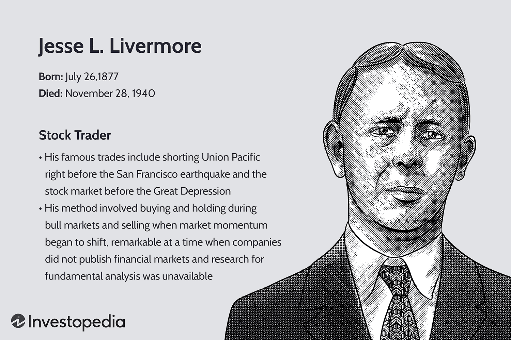

Jesse Livermore, often hailed as one of the greatest stock traders of the early 20th century, profoundly impacted the development of modern trading strategies. His life, marked by both monumental financial successes and devastating setbacks, offers key insights into the psychology and methodologies of trading. Livermore's approach to trading was characterized by meticulous market analysis, a deep understanding of market trends, and an ability to capitalize on market inefficiencies. His philosophy emphasized the importance of following market trends, managing risk, and maintaining emotional discipline.

Algorithmic trading, which has become the backbone of modern financial markets, shares several principles with Livermore's strategies. This form of trading uses computer algorithms to execute trades at high speed and volume, relying on mathematical models and statistical analyses. While Livermore operated in a pre-digital era, his emphasis on trends and data-driven decision-making laid the groundwork for today's automated trading systems. He famously employed a trend-following strategy, a method that is integral to many algorithmic trading models. Trend-following involves identifying and capitalizing on the directional movement of asset prices, a strategy that resonates with the predictive analytics used in algorithms today.



Livermore's contributions to trading strategies remain relevant as traders continue to seek effective methods for navigating complex markets. His successful trades, such as short selling during the 1929 stock market crash, demonstrated the power of adhering to robust trading rules and strategies. These principles, including the significance of timing, cutting losses, and letting profits run, are foundational to both traditional and algorithmic trading frameworks.

Furthermore, Livermore's life serves as a cautionary tale about the dangers of excessive risk-taking. His experiences underscore the critical need for risk management, a fundamental aspect of algorithmic trading systems that are designed to minimize financial exposure while maximizing returns. By integrating Livermore's insights into algorithmic models, traders can develop strategies that are both sophisticated and grounded in time-tested principles.

In summary, Jesse Livermore's legacy in trading is characterized by his innovative approach to market analysis and his foresight into the principles that underpin modern trading. His life and strategies offer enduring lessons in market dynamics, risk management, and the psychological factors influencing trade decisions, all of which continue to shape the ever-evolving landscape of algorithmic trading.

## Table of Contents

## Jesse Livermore's Early Life and Education

Jesse Lauriston Livermore was born on July 26, 1877, in Shrewsbury, Massachusetts. Raised in a rural environment, Livermore's early life was marked by financial hardship. His father was a farmer, which necessitated that Livermore contribute to the family income from a young age. Contrary to prevailing societal expectations for rigorous formal education, Livermore's early schooling was brief due to economic needs, and he left home at the age of 14.

Livermore moved to Boston, where he secured employment as a chalkboard boy at Paine Webber & Co., a brokerage firm. His role involved marking stock prices on large boards to communicate real-time market changes to brokers and traders. This position, though menial, exposed him to the dynamism of financial markets and the nascent principles of stock trading. It was at Paine Webber & Co. that Livermore began developing an understanding and instinct for stock price movements, an ability that stemmed more from observation and analysis than from formal education.

Despite his limited formal education, Livermore's inquisitive and analytical nature played a pivotal role in shaping his trading strategies. His early experiences at the brokerage firm enabled him to hone an intuitive sense for trends and market [momentum](/wiki/momentum). Observing patterns over time, he began making small trades at bucket shops—establishments allowing speculation on stock price movements without the owner needing to purchase the actual stock.

The sum of Livermore's early experiences contributed significantly to his development as a trader known for a trend-following approach. He employed a rudimentary system of data collection and analysis, relying heavily on arithmetic and pattern recognition rather than sophisticated mathematical models or technical analysis that typifies modern [algorithmic trading](/wiki/algorithmic-trading). His informal education and firsthand market experience fostered a keen capacity for risk assessment and strategic positioning, capabilities that would underpin his later success in financial markets. 

Livermore's early life, seasoned by direct exposure to trading mechanics and his self-motivated learning, laid the foundation for his future endeavors and strategies, demonstrating how practical market insights can rival formal educational credentials in financial acumen development.

## Trading during the Early 20th Century

The early 20th century marked a transformative period for financial markets, closely aligning with the career of Jesse Livermore. Trading during this era was characterized by less regulation and the prevalence of bucket shops, which played a critical role in Livermore's early trading exploits. Bucket shops were informal settings where individuals could place small bets on stock price movements without actually purchasing the equities. They operated outside the formal exchanges, and their less prohibitive costs and minimal regulatory oversight attracted traders like Livermore. These establishments provided Livermore the foundation to formulate his renowned trading strategies, which focused on price fluctuations rather than long-term investments.

During this period, Livermore demonstrated a unique ability to predict market trends and capitalize on short-term price movements—a skill that sparked his initial successes. Early in his career, he gained substantial profits by betting against the trend when he perceived a reversal on the horizon. This intuition was grounded in his meticulous observation of price patterns, leading him to establish a reputation as a "Boy Plunger."

Despite his early success, Livermore faced significant challenges as he transitioned to trading within formal stock exchanges. The speculative nature of his methods, particularly his use of leverage, resulted in extreme [volatility](/wiki/volatility-trading-strategies) in his fortunes. While in bucket shops he was able to profit with relatively small amounts of capital, trading on official exchanges required larger capital reserves and exposed him to broader market risks.

Livermore's trading tactics during the early 20th century were distinct from modern practices. His approach involved hands-on, intuitive trading without the technical analysis tools available today. Modern trading, particularly algorithmic trading, relies on sophisticated software to analyze market data and execute trades based on predefined criteria. Livermore, by contrast, depended on his personal experience and judgment, supported by a set of self-defined trading rules rather than complex algorithms.

The difference is further highlighted by the fact that today's traders often use a combination of high-frequency trading ([HFT](/wiki/high-frequency-trading-strategies)) algorithms and data-driven strategies to predict and act on market movements almost instantaneously. While Livermore focused on trend recognition and market psychology, modern traders depend heavily on computational power and statistical models.

Livermore's early 20th-century trading environment and his pioneering methods laid the groundwork for many of the concepts and strategies that inform today's trading practices. Although technology has transformed these strategies into more systematic and less emotional processes, the core principles of understanding market behavior and trends remain relevant, echoing Livermore's early experiences in the bucket shops.

## Livermore's Trading Strategies and Rules

Jesse Livermore's trading strategies were seminal in developing the principles of technical analysis and trend-following that many traders adopt today. Livermore was a pioneer of the "trend-following strategy," which involves identifying and capitalizing on market trends. This approach requires a trader to recognize the direction of prices, whether rising or falling, and make trades that align with that direction. Livermore emphasized the importance of following the prevailing market sentiment and price action, not relying on external opinions or forecasts.

His trading philosophy is encapsulated in several rules that remain pertinent to traders:

1. **Buy Rising Stocks, Sell Falling Stocks**: Livermore advocated for buying stocks that were already in an established uptrend and selling those in a downtrend. This rule highlights his belief in momentum trading, a strategy extensively used in modern trading systems.

2. **Timing is Crucial**: Livermore stressed the importance of timing when entering and exiting trades. He believed that even the best trading ideas could falter when executed at the wrong moment. This timing aspect resonates with today's algorithmic trading, where precise entry and exit points are determined based on complex algorithms.

3. **Cut Losses Quickly and Let Profits Run**: One of Livermore's most famous rules is to cut losses quickly while letting profits accumulate. This risk management principle is vital to modern trading strategies, including algorithmic models that incorporate stop-loss orders to manage risk.

4. **Don't Trade on Tips or Rumors**: Livermore advocated for independent thinking and analysis, cautioning against relying on tips from others. This idea underscores the importance of data-driven decision-making in current trading practices.

5. **Recognize and Act on Historical Cycles**: Livermore understood that markets move in cycles and that recognizing these cycles can be advantageous. His study of historical price patterns informed his strategic decisions, similar to the analysis used in quantitative trading.

A notable demonstration of Livermore's strategies was his decision to short the market before the stock market crash of 1929. By observing the market conditions and trends, Livermore recognized that the market was due for a significant correction. His successful short positions during this period reportedly yielded him profits exceeding $100 million, cementing his reputation as a legendary trader.

These principles and the ability to adapt them to different market conditions showcase the timeless quality of Livermore's strategies. Today, his ideas find relevance in algorithmic trading, where sophisticated computer algorithms attempt to identify trends and implement trades with efficiency and precision. Techniques like trend-following and robust risk management, derived from Livermore's original rules, form the bedrock of many trading systems employed in contemporary financial markets.

## Challenges and Setbacks

Jesse Livermore's journey through the financial markets was marked by significant challenges and setbacks, many stemming from his high-risk strategies. These strategies, while sometimes yielding immense profits, frequently left him vulnerable to substantial financial losses.

Livermore's approach to trading was inherently speculative, involving large positions and leveraged trades. Such methods amplified both potential returns and risks, making his financial journey highly volatile. This volatility manifested in several dramatic phases of wealth accumulation followed by near-total losses. For instance, after achieving immense success in the early 20th century, Livermore faced significant financial distress multiple times, sometimes losing his entire fortune due to bold market positions that went awry.

One of the most notable aspects of Livermore's career was his ability to capitalize on market downturns, most famously during the 1929 Wall Street Crash. By taking a massive short position, Livermore profited enormously as the market plummeted, reportedly [earning](/wiki/earning-announcement) over $100 million. However, the aftermath of such aggressive strategies often led to financial instability. The very nature of his high-stakes approach meant that subsequent market crashes or misjudgments could, and did, wipe out his wealth. It is important to note that his downfall was not entirely due to market dynamics; personal decisions and psychological factors also played significant roles.

The impact of market crashes on Livermore's career was profound. The 1907 Panic, the 1929 Crash, and subsequent market fluctuations each acted as double-edged swords. While these events offered opportunities for profit, they also brought periods of introspection and forced resetting of his financial state. For example, following the spectacular profits from the 1929 Crash, Livermore faced mounting pressures and eventually declared bankruptcy in 1934. His repeated financial collapses, despite earlier successes, highlight the perilous balance between risk and reward and the psychological toll of such a lifestyle.

In modern terms, Livermore's experiences illustrate the critical importance of risk management, a concept now embedded in algorithmic trading systems. His life underscores that maintaining longevity in trading requires not only skill in identifying market trends but also an ability to navigate the inherent uncertainties and personal limitations of trading.

## Impact on Modern Algorithmic Trading

Jesse Livermore, renowned for his trading acumen during the early 20th century, has inadvertently laid foundational principles that correlate closely with modern algorithmic trading. His methodologies, particularly trend-following and strategic risk management, resonate significantly in today's technologically driven market landscape. This section examines Livermore’s influence on contemporary algorithmic trading, drawing parallels between his trading principles and current algorithmic methods.

### Analysis of Livermore’s Influence on Algorithmic Trading

Jesse Livermore's trading strategies were primarily based on observing market trends, which remains a cornerstone of algorithmic trading today. His ability to anticipate price movements and market directions closely aligns with the objectives of algorithmic models that employ trend analysis.

Trend-following, an integral part of Livermore’s approach, is widely utilized in various algorithmic strategies. Algorithms are designed to detect trends by analyzing historical price data and identifying patterns that signify significant upward or downward movements. Livermore’s principle of buying and holding during upward trends and short selling during downward ones parallels the automated execution mechanisms in algorithms, which are programmed to execute trades when certain criteria or indicators are met.

Moreover, Livermore’s approach to risk management is akin to modern algorithms that integrate complex risk assessments. He emphasized the importance of cutting losses quickly and letting profits run, a principle that informs the stop-loss and take-profit parameters automated systems adhere to. By integrating stop-loss orders, algorithms prevent excessive financial losses, embodying Livermore's strategy of minimizing risk.

### Comparison with Current Algorithmic Methods

Contemporary algorithmic trading employs sophisticated mathematical models and computational techniques to execute trades at high speeds and volumes. Despite the technological advancements, the core principles of trend-following and risk management advocated by Livermore remain central.

For instance, moving average strategies used in algorithmic trading echo Livermore's trend-following methods. Moving averages can help smooth out price data to identify the direction of the trend. When the short-term average crosses above the long-term average, it could signal an upward trend (a buy signal), similar to Livermore’s practice of buying into strength.

```python
# Example of a simple moving average crossover strategy
short_window = 40
long_window = 100

# Sample stock price data
stock_data = [/* Historical price data */]

# Calculating the moving averages
short_mavg = stock_data.rolling(window=short_window, min_periods=1).mean()
long_mavg = stock_data.rolling(window=long_window, min_periods=1).mean()

# Generating buy and sell signals
stock_data['Signal'] = 0.0
stock_data['Signal'][short_window:] = np.where(short_mavg[short_window:] > long_mavg[short_window:], 1.0, 0.0)
stock_data['Positions'] = stock_data['Signal'].diff()
```

# to Algorithmic Strategies

Basic algorithmic strategies often incorporate fundamental Livermore principles. For instance, a [breakout](/wiki/breakout-trading) strategy, which involves entering a position when the price breaks through a predefined level of support or resistance, mirrors Livermore’s tactic of “pivot points.”

Risk management in algorithmic strategies is another domain where Livermore's influence is visible. Algorithms today are designed to analyze not just potential profit but also risk exposure, adjusting position sizes based on volatility and pre-set risk limits. This is a reflection of Livermore’s foresight into the impact of risk on trading success.

In conclusion, while algorithmic trading has evolved beyond manual trading methods, the principles established by Jesse Livermore continue to underpin effective trading strategies. His insights into trend-following, breakout positions, and risk management remain integral to building and optimizing contemporary algorithmic systems.

## Legacy and Contemporary Relevance

Jesse Livermore, a towering figure in the history of financial trading, has left an indelible imprint on the methodologies and pedagogies of trading education. His strategies and trading rules, forged in an era without the computational tools available today, remain relevant and are revered as foundational elements for both novice and seasoned traders. His legacy extends beyond his successful trades, encapsulating both the innovation and pitfalls inherent in trading.

Livermore's principles, such as trend-following and rigorous risk management, are echoed in the practices of contemporary traders. His emphasis on understanding market psychology and the importance of timing persists in modern trading education. Livermore advocated for a disciplined approach, warning against hasty decisions and emphasizing patience—key virtues still taught in trading curricula today. His philosophy of not committing all resources to a single trade underscores the perennial risk of over-leverage, a lesson reinforced by his own financial fluctuations.

The life lessons Livermore imparted remain pertinent: the vital need for emotional discipline, the acceptance and management of risk, and the recognition that even the most informed predictions involve uncertainty. His narrative serves as a case study in the perils of excessive speculation and the necessity of strategic risk assessment. Livermore's journey illustrates the balance between bravado and caution, underscoring the unpredictable nature of markets and the importance of learning from past mistakes.

Livermore's legacy is multifaceted. His successes, such as his famed short position during the 1929 market crash, exemplify strategic brilliance, while his failures highlight the hazards of deviation from discipline and harmony with market trends. Consequently, his life story acts not only as a source of inspiration but also as a cautionary tale, reminding traders of the need for continuous learning and adaptation.

In contemporary contexts, Livermore's principles resonate with the core of algorithmic trading. Algorithms built on trend-following methodologies reflect his insights, organized into instructive models that quantify his intuitive approach. The integration of risk management principles, much like those Livermore championed, into algorithmic frameworks underscores his lasting influence on the domain.

In essence, Jesse Livermore's contributions persist as timeless cornerstones of trading philosophy. His blend of innovation, acute understanding of market psychology, and cautionary experiences offer valuable lessons, enriching the education of traders and informing the ongoing evolution of trading practices.

## Conclusion

Jesse Livermore's contributions to the world of trading are enduring and significant. His pioneering techniques, particularly in trend-following and risk management, have left an indelible mark on both individual traders and the broader financial markets. Livermore's strategies, though developed in the early 20th century, continue to resonate in today's trading environment. His principles emphasize the importance of market psychology, timing, and discipline, elements that remain vital in the contemporary trading landscape.

The relevance of Livermore's methods is evident in modern algorithmic trading systems that often incorporate trend-following strategies similar to those Livermore employed. These systems utilize mathematical models and computational power to mimic the decision-making process that Livermore executed manually. For instance, algorithmic traders program systems to identify and capitalize on market trends, echoing Livermore's approach to "waiting for the line of least resistance" before making a trade. 

Livermore's trading philosophy also highlights the necessity of robust risk management. His storied career included significant triumphs and devastating losses, underscoring the critical need for strategies to mitigate financial risk. This aspect of his philosophy remains timeless, as traders today must navigate volatile markets with caution and strategic foresight.

In conclusion, Jesse Livermore's blend of innovation, strategic acumen, and cautionary insights provide invaluable lessons for modern traders. His story serves not only as a testament to the potential rewards of trading but also as a reminder of the inherent risks. As financial markets continue to evolve, the fundamental principles established by Livermore endure, reaffirming his lasting influence on the discipline of trading.

## References & Further Reading

[1]: ["Reminiscences of a Stock Operator"](https://en.wikipedia.org/wiki/Reminiscences_of_a_Stock_Operator) by Edwin Lefèvre

[2]: ["Jesse Livermore: World's Greatest Stock Trader"](https://www.amazon.com/Jesse-Livermore-Worlds-Greatest-Trader/dp/0471023264) by Richard Smitten

[3]: Lo, A. W., & MacKinlay, A. C. (1999). ["A Non-Random Walk Down Wall Street."](https://www.jstor.org/stable/j.ctt7tccx) Princeton University Press.

[4]: ["Trend Following: How to Make a Fortune in Bull, Bear, and Black Swan Markets"](https://www.amazon.com/Trend-Following-5th-Fortune-Markets/dp/1119371872) by Michael W. Covel

[5]: Schwager, Jack D. (1993). ["The New Market Wizards: Conversations with America's Top Traders."](https://archive.org/details/newmarketwizards00jack) HarperBusiness.