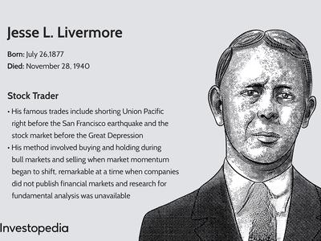

In the world of stock trading, legendary figures often provide insights that transcend time and market conditions. Jesse Livermore, a trader from the early 20th century, is one such figure whose strategies and lessons continue to resonate with traders today. Livermore's achievements and failures offer a comprehensive study of market psychology, risk management, and strategic execution. His keen understanding of price movements and market dynamics is especially relevant for contemporary traders operating in the complex landscape of algorithmic trading. 

As algorithmic trading systems increasingly dominate financial markets, the timeless principles espoused by Livermore remain essential. These include an acute knowledge of market trends, pivotal points, and the art of timing—a crucial skill in today's high-frequency trading environment where decisions must be made in fractions of a second. The interplay between historical trading strategies and modern technology highlights how core trading philosophies can be adapted to suit new methodologies.



This article explores the lessons from Jesse Livermore's trading career and examines their applicability to algorithmic trading practices. We will assess Livermore's trading strategies, techniques, and the enduring relevance of his 21 trading rules in today's market landscapes. Through this assessment, the objective is to illustrate how these classic principles can be integrated into data-driven, automated trading frameworks, providing modern traders with enhanced adaptability and a strategic edge.

## Table of Contents

## Who Was Jesse Livermore?

Jesse Livermore was born in 1877 and emerged as one of the most legendary traders in the history of financial markets, albeit a figure not widely recognized in contemporary times. His life story and trading philosophies significantly influenced the literary world, notably inspiring Edwin Lefèvre to write "Reminiscences of a Stock Operator," which remains a foundational text for traders studying market behavior.

Livermore's trading journey is characterized by his autonomous approach, utilizing his capital and innovating his methodologies independently. This autonomy allowed him to develop a profound understanding of market mechanics, enabling him to make substantial profits in his trading career. At the height of his success in 1929, Jesse Livermore's fortune was equivalent to approximately $1.5 billion today, a testament to his skill in anticipating and capitalizing on market trends.

Despite his monumental successes, Livermore's career was not devoid of setbacks. He faced several financial downturns, attributed primarily to deviations from his established trading rules. These experiences underscored the importance of discipline in trading, serving as a cautionary tale for traders who stray from their strategic frameworks. Livermore's story is both an inspiration and a lesson in the value of adhering to personal trading rules to maintain financial stability and growth over time.

## Jesse Livermore’s Trading Strategies

Jesse Livermore was a prominent advocate of trading trends, basing his strategies on analyzing pivotal points in stock movements. These pivotal points, which he often referred to as crucial price levels, significantly influenced his trading decisions. Livermore's strategy was particularly focused on identifying and acting upon these critical levels within a stock's price cycle to optimize his returns.

To navigate market [volatility](/wiki/volatility-trading-strategies) effectively, Livermore deliberately avoided trading in highly volatile and unpredictable markets unless he was capitalizing on market breakouts. This cautious approach was a key component of his trading methodology, as it allowed him to minimize unnecessary risks and focus on opportunities with higher potential for profit.

Rigorous risk management and profit preservation techniques defined Livermore's trading style. He understood the importance of protecting his capital and maintaining strict discipline in executing trades. This involved setting specific loss limits and adhering to them without exception, ensuring that small losses did not escalate into significant financial setbacks.

The interplay between price patterns and [volume](/wiki/volume-trading-strategy) analysis was another critical aspect of Livermore's strategy. By studying these elements together, he could assess whether a trade should be maintained or exited. This combined approach provided a more comprehensive understanding of market dynamics, enabling Livermore to make informed decisions based on the underlying strength or weakness of the market.

Understanding Livermore’s strategies requires acknowledging his preference for trading stocks based on their trending behavior. He recognized that trends, whether bullish or bearish, present opportunities for profit, and he adapted his trades accordingly. This trend-focused approach underpins many modern trading strategies, including those used in [algorithmic trading](/wiki/algorithmic-trading), where identifying and capitalizing on trends remain fundamental principles.

## Price Patterns and Timing

Jesse Livermore developed an acute understanding of price patterns without the aid of modern charting tools. His approach relied heavily on identifying pivotal points, which are crucial price levels that greatly influence stock movements. These pivotal points helped him determine optimal entry and [exit](/wiki/exit-strategy) points, guiding his trading decisions with precision. Livermore's strategy involved closely monitoring stocks to discern these critical levels of support and resistance, enabling him to anticipate potential shifts in market sentiment.

Livermore placed a significant emphasis on market timing, advocating that traders should allow price movements to validate their trading hypotheses before committing significant capital. This means waiting for the market to confirm expected trends or reversals, thus reducing the risk of premature entry. His philosophy highlighted reactionary trading, where decisions were made based on corroborative market actions rather than speculative anticipation.

This principle of market confirmation is mirrored in contemporary algorithmic trading, where algorithms are designed to analyze extensive data and confirm price patterns automatically before executing trades. In algorithmic systems, such validation processes might involve statistical measures or [machine learning](/wiki/machine-learning) models to predict and confirm market movements. For example, a Python script using a simple moving average (SMA) can be utilized to identify trends:

```python
import pandas as pd

# Function to determine buy/sell signals based on SMAs
def sma_strategy(prices, short_window=40, long_window=100):
    signals = pd.DataFrame(index=prices.index)
    signals['price'] = prices
    signals['short_sma'] = prices.rolling(window=short_window, min_periods=1).mean()
    signals['long_sma'] = prices.rolling(window=long_window, min_periods=1).mean()
    signals['signal'] = 0.0
    signals['signal'][short_window:] = np.where(signals['short_sma'][short_window:] 
                                                > signals['long_sma'][short_window:], 1.0, 0.0)   
    signals['positions'] = signals['signal'].diff()
    return signals

# Example usage:
# Assume `data` is a DataFrame with a 'Close' column of stock prices
signals = sma_strategy(data['Close'])
```

In this example, the moving averages serve as an analogue to Livermore’s pivotal points, providing a systematic way to confirm trends before taking positions. By employing such methods, modern traders can operationalize Livermore's timeless insights into disciplined, data-driven trading strategies.

## Livermore’s 21 Trading Rules

Jesse Livermore's 21 trading rules elucidate the methodology and disciplined approach that constituted his success in the stock market. Key among these rules is the emphasis on trading with the prevailing market trend. Livermore's philosophy was that aligning trades with the dominant market direction improves the likelihood of success, reflecting a fundamental tenet in trading strategy known broadly as trend-following.

Allowing profits to run while cutting losses short is another critical rule underscored by Livermore. This principle is about maximizing gains from successful trades and minimizing the impact of unsuccessful ones—a strategy that is especially pertinent in trend-following systems. The mathematical expectation is improved when traders adhere to this principle: if $\text{win ratio}$ represents the proportion of winning trades and $\text{CRR}$ represents the average ratio of $$average\;win$$ to $$average\;loss$$, the mathematical expectation $E$ is defined as:

$$
E = \text{win ratio} \times \text{CRR} - (1 - \text{win ratio})
$$

By strategically letting profits run, $\text{CRR}$ is effectively increased, thus enhancing $E$.

Livermore also advised against averaging down on losing positions. The rationale is to avoid increasing exposure to a losing trade, which contravenes his principle of cutting losses. This rule stresses the importance of respecting market signals rather than stubbornly adhering to one's analysis against prevailing market dynamics.

Further, Livermore cautioned against making trades based merely on a stock reaching perceived high or low price levels. This advice stems from understanding that market conditions, rather than absolute price values, should inform trading decisions. Markets may trade higher or lower than expected levels for extended periods, and relying solely on price extremes can lead to premature or erroneous trading actions.

Livermore's focus on trading sector leaders rather than tracking numerous stocks highlights the importance of concentrating resources on securities with higher probabilities of significant price movement, reflecting streamlined decision-making that is critical for effective trading. This approach minimizes informational noise and allows for deeper analysis and understanding of fewer stocks.

These principles collectively underscore the necessity of discipline and strategic consistency, both of which are essential for traders, especially those utilizing algorithmic models. The structured nature of Livermore's rules can be effectively translated into algorithmic systems by implementing conditional logic and systematic criteria for trend analysis, risk management, and trade execution. For instance, trading systems can employ Python-based algorithms to screen for trend-following opportunities, automate stop-loss placements, and execute timely capital allocations, thereby integrating Livermore's timeless insights into modern trading frameworks.

## Lessons for Algorithmic Trading

Modern algorithmic trading, with its reliance on data analysis and computational speed, can effectively incorporate lessons derived from Jesse Livermore's approach to the markets. Livermore's principles, particularly his focus on price patterns and volume analysis, resonate with algorithmic traders looking to develop automated, resilient strategies.

By interpreting price patterns and volume dynamics, algo trading systems can execute strategies that mirror Livermore's method of identifying pivotal points—key price levels that significantly impact trading decisions. This involves continuously monitoring price movements and volumes to dictate entry and exit points, a concept that can be mathematically modeled using algorithms.

For example, consider employing a simple moving average (SMA) crossover strategy to identify trends—a fundamental aspect of Livermore's trading philosophy. An algorithm can be designed to buy a stock when a short-term SMA crosses above a long-term SMA, signifying a potential upward trend. Conversely, it can sell when the short-term SMA crosses below the long-term SMA, indicating a downward trend. Python implementation might look like this:

```python
import pandas as pd

# Sample function for SMA Crossover Strategy
def SMA_crossover_strategy(data, short_window, long_window):
    signals = pd.DataFrame(index=data.index)
    signals['signal'] = 0.0

    # Create short simple moving average
    signals['short_mavg'] = data['Close'].rolling(window=short_window, min_periods=1, center=False).mean()

    # Create long simple moving average
    signals['long_mavg'] = data['Close'].rolling(window=long_window, min_periods=1, center=False).mean()

    # Create signals
    signals['signal'][short_window:] = \
        np.where(signals['short_mavg'][short_window:] > signals['long_mavg'][short_window:], 1.0, 0.0)   

    # Generate trading orders
    signals['positions'] = signals['signal'].diff()

    return signals
```

Patience and market timing, emphasized by Livermore, are crucial in algorithmic trading where trades are executed based on specific conditions rather than instinctual reactions. Algorithms can wait for confirmation of market conditions before acting, thereby reducing impulsive decision-making that often leads to losses.

Risk management, a cornerstone of Livermore's strategy, remains vital. Algorithms can incorporate stop-loss orders and position sizing to mitigate potential losses. For instance, employing a technique such as the Kelly Criterion can help determine the optimal size of a trade, balancing potential reward and risk.

```python
# Kelly Criterion Calculation
def kelly_criterion(win_probability, win_loss_ratio):
    return win_probability - ((1 - win_probability) / win_loss_ratio)
```

By leveraging these time-tested principles within algorithmic systems, traders can fortify their strategies against the unpredictability of market dynamics. The synthesis of Livermore's insights with modern technological advances allows for more robust, adaptable trading mechanisms that can thrive in a swiftly changing financial landscape.

## Conclusion

Jesse Livermore's legacy as a trader offers timeless lessons that are crucial to today's algorithmic trading landscape. His acute understanding of market behavior, characterized by his analysis of price patterns and pivotal points, lays a foundational framework for interpreting complex market dynamics. These insights remain invaluable tools, enabling modern traders to navigate the often unpredictable market environments effectively.

Risk management, a cornerstone of Livermore's trading philosophy, emphasizes the necessity of preserving capital through disciplined strategies. In an era where algorithmic trading systems execute trades at high velocity, the principles of cutting losses short and allowing profits to run are even more pertinent. By adopting such strategies, traders can mitigate potential losses while capitalizing on profitable opportunities.

Despite the rapid technological advancements that have transformed trading practices, the core principles championed by Livermore continue to resonate across various market strategies. As algorithmic trading entails intricate technical analysis, integrating Livermore’s disciplined approach can enhance the robustness and efficiency of these systems.

By incorporating the lessons learned from historical figures such as Livermore, traders can blend this timeless wisdom with advanced techniques. This hybrid approach enables traders to achieve success by ensuring their strategies are informed by long-standing market truths while leveraging modern computational tools. As such, Livermore's enduring contributions offer a rich resource for those seeking a deeper understanding of market mechanics and how these principles can be adapted for contemporary use in algorithmic trading.

## Jesse Livermore FAQs

Was Jesse Livermore a Day Trader? Initially, yes, but he eventually evolved into a swing and long-term trader. During the early stages of his career, Livermore engaged in [day trading](/wiki/day-trading-spy), which involves buying and selling securities within the same trading day. This style allowed him to capitalize on short-term market movements. However, as he gained more experience and understanding of market dynamics, he transitioned to a more sophisticated approach, incorporating swing and long-term trading strategies. This shift enabled him to profit from larger market trends and price movements over extended periods, reflecting a deeper strategic insight into market behavior.

How did Jesse Livermore manipulate the stock market? He influenced prices of thinly traded stocks before stricter regulations. In the pre-regulation era of the stock market, Livermore was known to implement tactics that would be considered manipulative by today's standards. He used strategies like “pool operations,” where he would form syndicates to facilitate coordinated buying to drive up stock prices. This technique, particularly effective with thinly traded stocks, involved first creating an appearance of active market interest and then liquidating positions at a profit. Such actions were feasible before the establishment of regulatory bodies like the Securities and Exchange Commission (SEC), which now actively monitors and prevents such market manipulations.

Who taught Jesse Livermore? He was a self-taught trader, learning from experience and mistakes over time. Livermore did not have formal education or mentors in trading. Instead, he relied on keen observation, analysis, and trial and error to develop his strategies. His experiences, including significant losses and gains, were his primary teachers. Livermore meticulously recorded his trades and reviewed his mistakes, using them as learning opportunities to refine his techniques. This process of self-education and adaptation was crucial to his development as a successful trader.

How much did Jesse Livermore make during the Great Depression? He profited $100 million during the 1929 crash by shorting. Livermore is famous for his foresight during the 1929 stock market crash, where he adeptly used short selling—a process where a trader borrows shares to sell them at a high price, plans to buy them back at a lower price, and returns them— to capitalize on the market collapse. By predicting the market downturn and strategically positioning his trades, Livermore accumulated extraordinary profits in a period when many investors suffered massive losses. His success during this time solidified his reputation as a market visionary, although subsequent periods of financial difficulty reminded traders of the risks inherent in market speculation.

## References & Further Reading

[1]: Lefèvre, E. (1923). ["Reminiscences of a Stock Operator."](https://archive.org/details/reminiscencesofs0000edwi) John Wiley & Sons. 

[2]: Wieland, T., & Sorkin, A. R. (2009). ["How Jesse Livermore’s Experience Correlates to Modern Trading."](https://www.taylorfrancis.com/books/edit/10.4324/9781315740430/dissociation-traumatized-children-adolescents-sandra-wieland) The New York Times.

[3]: Pring, M. J. (2014). ["Technical Analysis Explained: The Successful Investor's Guide to Spotting Investment Trends and Turning Points."](https://www.amazon.com/Technical-Analysis-Explained-Fifth-Successful/dp/0071825177) McGraw-Hill Education.

[4]: Elder, A. (1993). ["Trading for a Living: Psychology, Trading Tactics, Money Management."](https://www.amazon.com/Trading-Living-Psychology-Tactics-Management/dp/0471592242) John Wiley & Sons.

[5]: Niederhoffer, V. (1997). ["The Education of a Speculator."](https://archive.org/details/educationofspecu0000nied) John Wiley & Sons.