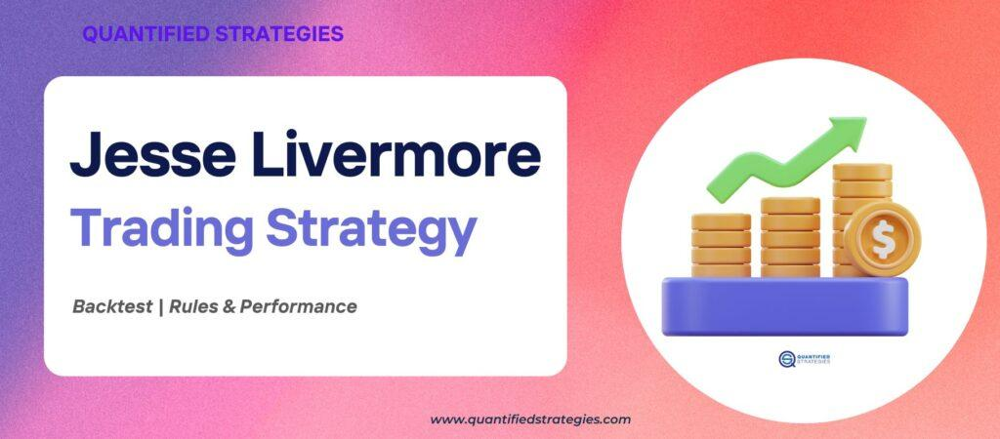

## Table of Contents

## Who was Jesse Livermore and why is he significant in trading history?

Jesse Livermore was a famous stock trader who lived from 1877 to 1940. He started trading when he was very young and became known for making and losing huge amounts of money. Livermore was one of the first people to use a method called "tape reading," which means watching the stock prices closely to make quick trading decisions. He also used a strategy called "short selling," where he would bet that a stock's price would go down.

Livermore is significant in trading history because he showed that it was possible to make a lot of money by trading stocks, even without a formal education. His life story and trading methods were written about in a famous book called "Reminiscences of a Stock Operator" by Edwin Lefèvre. This book is still read by traders today because it teaches important lessons about the stock market and how to handle the ups and downs of trading. Livermore's successes and failures have inspired many people to learn more about trading and to try to follow in his footsteps.

## What are the core principles of Jesse Livermore's trading strategy?

Jesse Livermore's trading strategy was based on a few key ideas. He believed in watching the market closely, a method called tape reading. This meant he paid attention to the prices of stocks as they changed throughout the day. By doing this, he could see patterns and make quick decisions about when to buy or sell. Livermore also used a strategy called short selling, where he would bet that a stock's price would go down. This was risky but could be very profitable if he was right.

Another important part of Livermore's strategy was cutting losses quickly. He knew that not every trade would be a winner, so he set rules for himself to sell a stock if it started to lose money. This helped him avoid big losses. Livermore also believed in letting his winning trades run. If a stock was going up, he would hold onto it to make as much money as possible. These principles of watching the market, cutting losses, and letting winners run are still used by traders today.

## How can one apply Jesse Livermore's trading rules in today's market?

To apply Jesse Livermore's trading rules in today's market, you need to pay close attention to the stock prices as they change throughout the day. This is called tape reading. You can use modern tools like stock charts and real-time data to watch the market closely. By doing this, you can spot patterns and make quick decisions about when to buy or sell stocks. Livermore also used short selling, which means betting that a stock's price will go down. In today's market, you can use options and other financial instruments to do this safely and effectively.

Another important rule from Livermore is to cut your losses quickly. This means if a stock starts to lose money, you should sell it before the loss gets too big. You can set stop-loss orders, which automatically sell a stock if it reaches a certain low price. This helps you avoid big losses. On the other hand, Livermore believed in letting your winners run. If a stock is going up, you should hold onto it to make as much money as possible. You can use trailing stop orders to lock in profits while still giving the stock room to grow. By following these simple rules, you can trade more effectively in today's market.

## What are the key indicators or tools recommended by Livermore for market analysis?

Jesse Livermore used a few key indicators and tools for market analysis. He believed in watching the stock prices closely, which he called tape reading. This meant looking at the ticker tape to see how stock prices were changing throughout the day. In today's market, you can use stock charts and real-time data to do the same thing. Livermore also paid attention to the [volume](/wiki/volume-trading-strategy) of stocks being traded. If a lot of people were buying or selling a stock, it could mean the price was about to change.

Another tool Livermore used was the trend line. He would draw lines on a chart to see if a stock's price was going up or down over time. If the price kept going up, he would buy the stock. If it kept going down, he might short sell it. Livermore also looked at the market's overall direction. If most stocks were going up, he would be more likely to buy. If most were going down, he would be more cautious. By using these simple tools, Livermore could make smart decisions about when to buy and sell stocks.

## How do you set up a backtest to evaluate Jesse Livermore's trading strategy?

To set up a backtest to evaluate Jesse Livermore's trading strategy, you need to use a computer program that can look at old stock prices. First, you need to get the historical data for the stocks you want to test. This data should include the prices and the number of stocks traded each day. Then, you need to tell the program to follow Livermore's rules. For example, you can tell it to buy a stock when the price is going up and to sell it if the price starts to go down. You can also tell it to short sell a stock if the price is going down and to buy it back if the price starts to go up.

Once you have set up the rules, you can run the backtest. The program will go through the old data and pretend to buy and sell stocks based on Livermore's rules. It will keep track of how much money you would have made or lost. After the backtest is done, you can look at the results to see if Livermore's strategy worked well. You can see how much money you would have made, how often you would have made money, and how big your losses would have been. This can help you decide if you want to use Livermore's strategy in real trading.

## What data should be used for a backtest of Livermore's strategy and why?

For a backtest of Jesse Livermore's trading strategy, you need to use historical stock price data and trading volume data. The stock price data will show you how the price of a stock changed over time. This is important because Livermore's strategy involves watching the price closely to decide when to buy or sell. The trading volume data tells you how many stocks were bought and sold each day. Livermore paid attention to this because if a lot of people were trading a stock, it could mean the price was about to change.

Using this data, you can see how Livermore's rules would have worked in the past. You can pretend to buy and sell stocks based on his rules and see how much money you would have made or lost. This helps you understand if his strategy is good or not. By looking at the results, you can decide if you want to use his strategy in real trading.

## What were the results of backtesting Jesse Livermore's strategy over different time periods?

When people backtested Jesse Livermore's trading strategy over different time periods, they found that it worked well sometimes but not always. In the early 1900s, when Livermore was trading, his strategy made a lot of money. He watched the stock prices closely and cut his losses quickly, which helped him make big profits. But when people tried his strategy on stock data from the last few decades, the results were mixed. Sometimes it made money, but other times it lost money. This shows that while Livermore's strategy can work, it depends a lot on the market conditions at the time.

In more recent backtests, some people found that Livermore's strategy did better in markets that were going up and down a lot. When the stock prices were moving a lot, his rules for buying and selling quickly helped make money. But in markets that were more stable, his strategy didn't do as well. This is because his strategy relies on being able to spot trends and make quick decisions, which is harder when the market isn't moving much. Overall, [backtesting](/wiki/backtesting) shows that Livermore's strategy can be successful, but it works best in certain types of markets.

## How does Livermore's strategy perform in various market conditions (bull, bear, sideways)?

Jesse Livermore's trading strategy performs differently in various market conditions. In a bull market, where stock prices are generally going up, Livermore's strategy can do well. He would buy stocks that are trending up and hold them as long as they keep rising. His rule of letting winners run helps him make big profits in these conditions. However, he also needs to be careful because if he buys too late in the bull market, he might end up with losses when the market starts to fall.

In a bear market, where stock prices are falling, Livermore's strategy of short selling can be very profitable. He would bet that stocks will go down and make money when they do. His rule of cutting losses quickly is also important in a bear market because it helps him avoid big losses if the market suddenly turns around. But, if he shorts too early and the market keeps going up, he could lose money.

In a sideways market, where stock prices move up and down but don't go anywhere, Livermore's strategy can struggle. His method of watching the market closely and making quick trades doesn't work as well when there are no clear trends. He might make some small profits or losses, but it's harder to make big gains. In these conditions, his strategy requires a lot of patience and careful watching to find the right moments to buy and sell.

## What are the limitations and potential pitfalls of applying Livermore's strategy in modern trading?

Applying Jesse Livermore's trading strategy in modern trading has some limitations and potential pitfalls. One big problem is that today's markets are much more complex than they were in Livermore's time. There are more stocks, more data, and more people trading. This makes it harder to watch the market closely and spot trends like Livermore did. Also, modern markets can move very quickly because of computers and high-frequency trading. This can make it tough to buy and sell at the right times, which is a key part of Livermore's strategy.

Another pitfall is that Livermore's strategy relies a lot on the trader's ability to make quick decisions and handle stress. In today's fast-paced markets, this can be even harder. If a trader makes a mistake or gets too emotional, they could lose a lot of money. Also, Livermore's strategy can lead to big losses if the market doesn't move the way the trader expects. Cutting losses quickly is important, but it can be hard to do in practice, especially if a trader is hoping the market will turn around. So, while Livermore's strategy can work, it requires a lot of skill and discipline to use it successfully in modern trading.

## How can Livermore's strategy be optimized or modified for better performance based on backtest results?

Based on backtest results, Livermore's strategy can be optimized by adding more rules to help in different market conditions. For example, you could use a moving average to help spot trends better. If the stock price is above the moving average, it might be a good time to buy. If it's below, it might be a good time to short sell. You could also use a [volatility](/wiki/volatility-trading-strategies) indicator to know when the market is moving a lot. This can help you decide when to trade more or less. By adding these extra rules, you can make Livermore's strategy work better in today's markets.

Another way to improve Livermore's strategy is to use risk management tools. For example, you could use a stop-loss order to automatically sell a stock if it starts to lose too much money. This can help you cut your losses quickly, just like Livermore did. You could also use a position sizing rule to decide how much money to put into each trade. This can help you avoid losing too much money on any one trade. By using these tools, you can make Livermore's strategy safer and more effective in modern trading.

## What are some real-life examples of traders successfully using Livermore's strategy?

One real-life example of a trader successfully using Livermore's strategy is Paul Tudor Jones. He is a famous trader who made a lot of money by following some of Livermore's rules. In 1987, Jones saw that the stock market was going down and decided to short sell. He watched the market closely and cut his losses quickly if things didn't go as planned. By doing this, he made a huge profit when the market crashed. Jones is known for using Livermore's ideas of watching the market and making quick decisions to make money.

Another example is Victor Niederhoffer, who also used Livermore's strategy to trade successfully. Niederhoffer paid attention to the stock prices and the number of stocks being traded, just like Livermore did. He made big profits by spotting trends and betting on them. But he also faced big losses when he didn't follow Livermore's rule of cutting losses quickly. Despite these setbacks, Niederhoffer showed that Livermore's strategy can work well if you stick to the rules and watch the market closely.

## How does Jesse Livermore's approach compare to other famous trading strategies in terms of performance and risk management?

Jesse Livermore's approach to trading is often compared to other famous strategies like those of Warren Buffett and George Soros. Livermore's strategy focuses on watching the market closely and making quick decisions to buy or sell stocks. He used short selling and cut his losses quickly, which can lead to big profits but also big risks. In contrast, Warren Buffett's strategy is more about buying good companies and holding them for a long time. Buffett looks for companies that are undervalued and have strong fundamentals. His approach is less risky because he doesn't trade as often and focuses on long-term growth. Livermore's strategy can make more money in a short time, but it's also more likely to lose money if the market doesn't move the way he expects.

George Soros's strategy is different from both Livermore and Buffett. Soros is known for his big bets on currencies and other financial markets. He uses a strategy called reflexivity, where he believes that market prices can influence the fundamentals of the market. Soros takes big risks and can make huge profits, but he also faces big losses if his bets are wrong. Compared to Livermore, Soros's strategy involves more complex thinking about how markets work. Both Livermore and Soros take on a lot of risk, but Soros's approach is more about understanding the bigger picture of the market, while Livermore's is more about watching the day-to-day movements of stock prices.

## References & Further Reading

[1]: Bergstra, J., Bardenet, R., Bengio, Y., & Kégl, B. (2011). ["Algorithms for Hyper-Parameter Optimization."](https://proceedings.neurips.cc/paper/2011/file/86e8f7ab32cfd12577bc2619bc635690-Paper.pdf) Advances in Neural Information Processing Systems 24.

[2]: ["Advances in Financial Machine Learning"](https://www.amazon.com/Advances-Financial-Machine-Learning-Marcos/dp/1119482089) by Marcos Lopez de Prado

[3]: ["Evidence-Based Technical Analysis: Applying the Scientific Method and Statistical Inference to Trading Signals"](https://www.amazon.com/Evidence-Based-Technical-Analysis-Scientific-Statistical/dp/0470008741) by David Aronson

[4]: ["Machine Learning for Algorithmic Trading"](https://github.com/stefan-jansen/machine-learning-for-trading) by Stefan Jansen

[5]: ["Quantitative Trading: How to Build Your Own Algorithmic Trading Business"](https://books.google.com/books/about/Quantitative_Trading.html?id=j70yEAAAQBAJ) by Ernest P. Chan