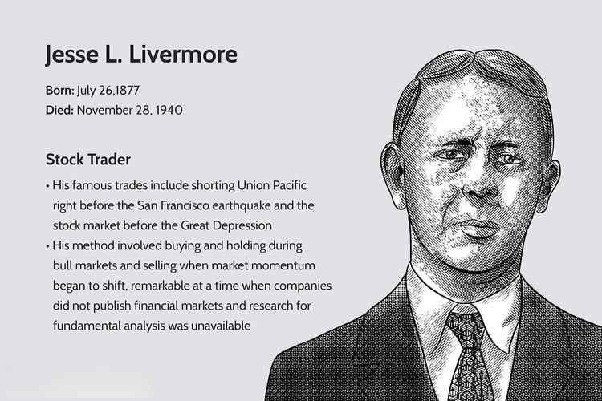

Jesse Livermore is often hailed as one of the most iconic figures in the history of trading. Known as the 'Boy Plunger,' he managed to amass and subsequently lose multimillion-dollar fortunes. Despite his tumultuous financial journey, he left an indelible mark on the trading world, influencing generations of traders. Livermore's trading exploits and strategies reflect a genius intertwined with the inherent unpredictability of financial markets. 

Operating during the early 20th century, Livermore pioneered techniques that continue to underpin modern trading practices, blending intuition with analysis in a manner that foresees today's algorithmic strategies. His life's lessons remain instructive today, shedding light on both the potential and perils of the trading world. Livermore's emphasis on risk management, market psychology, and trend-following resonates with contemporary practices in algorithmic trading, demonstrating the timelessness of his insights.



In this article, we explore Livermore's life journey, his innovative trading approaches, and the fluctuation of his net worth at its peak. Furthermore, we assess his influence on the evolved landscape of algorithmic trading, offering a comprehensive look at his enduring legacy.

## Table of Contents

## Early Life and Introduction to Trading

Jesse Livermore was born in 1877 in Shrewsbury, Massachusetts, into a modest farming family. From an early age, he displayed a keen interest in mathematics and numbers, skills that would later become pivotal in his trading career. At the age of 14, Livermore took up a position as a board boy at Payne Webber, a brokerage firm. His job involved posting the latest stock quotes on the firm's boards, a task that offered him an intimate view of market fluctuations and sparked his lifelong passion for trading.

Working as a board boy provided Livermore with a unique education in the mechanics of stock market trading, allowing him to observe first-hand the impacts of market news on stock prices. This experience laid the groundwork for his understanding of market dynamics and price movements. Eager to apply this knowledge, Livermore began testing his strategies in bucket shops, which were prevalent at the time. These establishments allowed patrons to place bets on stock price movements without actually buying the stocks.

In these bucket shops, Livermore honed his skills and developed techniques that anticipated several principles of modern trading. He focused on patterns in stock price movements and applied mathematical calculations to predict market behavior, aspects that form the crux of technical analysis utilized in today's trading strategies. His early ventures into trading were marked by early successes, setting the stage for his later achievements in the stock market.

## Livermore’s Trading Strategies

Jesse Livermore is renowned for his innovative trading strategies, especially his trend-following approach. This strategy involves identifying and capitalizing on the prevailing direction of asset prices. Livermore meticulously studied price action, which refers to the movement of an asset's price plotted over time. He believed that by focusing on patterns and trends within these price movements, traders could make informed decisions about when to enter or [exit](/wiki/exit-strategy) the market.

A crucial component of Livermore's strategy was the analysis of [volume](/wiki/volume-trading-strategy) patterns. Volume, or the number of shares or contracts traded in a security or market during a given period, provides insights into the strength of a trend. For instance, increasing volume in the direction of a trend often indicates that the trend is likely to continue. Livermore recognized that volume patterns could validate price trends and help predict potential reversals or continuations, a practice still prevalent in modern [algorithmic trading](/wiki/algorithmic-trading) systems.

One of Livermore’s most celebrated trades was his successful bet against the market during the 1929 crash. Observing the unsustainable rise in stock prices and speculative excesses, he sensed an impending market downturn. His intuition and analysis led him to short the market, a decision that capitalized on the ensuing crash and significantly increased his wealth. This trade is often cited as a testament to the effectiveness of his trend-following strategy combined with acute market observation.

Livermore's methods laid foundational principles that resonate with contemporary trading models. His focus on trend identification and volume analysis remains integral to many algorithmic trading systems, which use quantitative methods and automated processes to execute trades. This legacy underscores the enduring applicability of his strategies in today's technologically advanced trading environments.

## Net Worth at His Peak

At the height of his financial prowess in 1929, Jesse Livermore's net worth was estimated to be around \$100 million. This staggering sum, during an era when the U.S. economy was far less inflated compared to today, is roughly equivalent to approximately \$1.5 billion in contemporary terms when adjusted for inflation. This wealth was not accumulated through the management of external funds, which is typical for many [hedge fund](/wiki/hedge-fund-trading-strategies) managers today. Instead, Livermore's fortune was solely derived from his own capital and the trading system he meticulously developed.

Livermore's trading acumen during this period primarily stemmed from his adept handling of market trends and his anticipation of the stock market crash in 1929. His success was largely attributed to his unique trading strategies, which emphasized understanding price actions and volume patterns, akin to focusing on underlying market psychology rather than just [fundamental analysis](/wiki/fundamental-analysis).

His impressive net worth was a testament to his skill in navigating financial markets with high-risk maneuvers that capitalized on extreme market conditions. He successfully shorted stocks during the tumultuous period leading to the 1929 crash, a move that yielded substantial profits when many others faced significant losses. Despite the immense financial gain, Livermore's approach underscored a commitment to leveraging his own resources, showcasing an independence rarely seen among traders who often rely on external investors to amplify their wealth.

## Livermore’s Influence on Modern Algorithmic Trading

Jesse Livermore, despite trading in a bygone era, provides valuable insights that align with contemporary algorithmic trading. His trading principles, particularly on trend-following, risk management, and pattern recognition, underpin many of today's sophisticated algorithmic systems.

Trend-following was a cornerstone of Livermore's strategy; he was adept at identifying and capitalizing on market trends. This principle is central to numerous algorithmic trading models that utilize moving averages, [momentum](/wiki/momentum) indicators, and regression analysis to track and exploit price trends. The ability to recognize when to ride a trend and when to exit was crucial to Livermore's success and remains a critical component in algorithms that execute strategies based on trend-following logic.

Livermore’s attention to risk management is another aspect that resonates with modern algorithms. He emphasized the importance of cutting losses quickly and letting profits accumulate, a strategy that reflects the stop-loss and take-profit mechanisms in algorithmic trading. These elements are crucial for maintaining profitable trading models, ensuring that losses do not accumulate to destabilize the trading system.

Pattern recognition, a skill in which Livermore excelled, forms the basis of many algorithmic strategies today. He analyzed price action and volume patterns to anticipate market movements, an approach that has been enhanced by current [machine learning](/wiki/machine-learning) and [artificial intelligence](/wiki/ai-artificial-intelligence) techniques. Algorithms today leverage these advanced tools to evaluate historical data, identify patterns, and predict future price movements with a level of precision that was unattainable in Livermore's era.

In Python, a basic implementation of a trend-following strategy might include using a moving average crossover to signal buy or sell actions, as illustrated below:

```python
import pandas as pd
import pwb_toolbox.datasets as pwb_ds  # see https://paperswithbacktest.com/datasets

def calculate_moving_average(prices, window):
    return prices.rolling(window=window).mean()

df = pwb_ds.load_dataset("Stocks-Daily-Price", ["AAPL"])
df.set_index("date", inplace=True)
short_term = calculate_moving_average(df.close, window=50)
long_term = calculate_moving_average(df.close, window=200)

signal = []
for short, long in zip(short_term, long_term):
    if short > long:
        signal.append("Buy")
    elif short < long:
        signal.append("Sell")
    else:
        signal.append("Hold")
```

This algorithm triggers buy signals when the short-term moving average crosses above the long-term average and sell signals when it crosses below, embodying Livermore's trend-following philosophy.

In conclusion, while Jesse Livermore operated in a pre-digital marketplace, his approaches to trading are remarkably aligned with the principles underlying modern algorithmic trading systems. These enduring strategies demonstrate the timelessness of certain trading fundamentals, even as technology advances.

## Challenges and Setbacks

Jesse Livermore, despite his unparalleled success in trading, encountered significant financial challenges throughout his career, culminating in multiple declarations of bankruptcy. Livermore's trading strategy was characterized by high-risk ventures, which although potentially profitable, exposed him to considerable financial [volatility](/wiki/volatility-trading-strategies).

Livermore's approach often included leveraging large sums of money to amplify returns, a tactic inherent with substantial risk. This could magnify losses when the markets did not perform as anticipated. His bold speculative strategies enabled him to amass significant wealth but also precipitated enormous financial losses. For example, he experienced profound losses after the Great Crash of 1929, an event which, although initially profitable for him due to his short positions, eventually led to overwhelming losses due to his subsequent investments and market positions.

The inherent volatility of the stock market posed a constant threat to Livermore's financial standing. His approach was highly dependent on the accurate prediction of market trends, yet in the face of unforeseen economic changes or incorrect assessments, his high-stakes positions often resulted in catastrophic financial downturns. These downturns were compounded by the lack of sophisticated risk management techniques available during his time, unlike the algorithms and models used in modern trading, which provide more robust strategies for managing such risks.

Livermore's financial troubles were further exacerbated by personal issues and possible psychological struggles, which may have impacted his decision-making processes and ability to operate under stress. The cumulative effect of these challenges ultimately led him to declare bankruptcy on multiple occasions throughout his lifetime, illustrating the precarious nature of his financial successes and the perilous brink at which he often operated. This aspect of his life serves as a potent reminder of the risks inherent in aggressive trading strategies, underscoring the critical importance of risk management and psychological resilience in the world of trading.

## Legacy and Lessons for Traders

Jesse Livermore's legacy in trading is marked by both remarkable success and profound cautionary tales. His story offers crucial lessons for modern traders, emphasizing the significance of adherence to a trading system and effective risk management. Livermore's approach to trading was characterized by his unwavering discipline in following his own well-established strategies. Despite the allure of deviating when markets presented unexpected opportunities or threats, his success largely stemmed from his commitment to his proven methodologies.

A key aspect of Livermore's strategy was his focus on risk management. He famously advocated for cutting losses quickly and letting profits run, a practice that resonates with modern trading principles. By limiting losses and maximizing gains, traders could protect their capital and enhance the potential for profit. This principle is encapsulated in what is often referred to as the "risk-to-reward ratio", a critical concept that helps traders assess the potential risks and rewards of a trade before execution.

For modern traders, Livermore's experiences underscore the importance of maintaining a disciplined approach, even amidst market volatility. The advent of technology and algorithmic trading has introduced sophisticated tools and techniques that allow traders to automate and rigorously test their strategies. However, the core tenets of Livermore's teachings remain relevant: a robust trading system and disciplined risk management are vital to navigating the complexities of the markets.

Python code can assist in implementing these lessons. For instance, a simple algorithm can be developed to backtest a trading strategy and ensure risk parameters are adhered to. Here's an example of how such a Python script might look:

```python
import numpy as np
import pandas as pd
import pwb_toolbox.datasets as pwb_ds  # see https://paperswithbacktest.com/datasets

def backtest_strategy(prices, stop_loss, take_profit):
    initial_balance = 1000
    balance = initial_balance
    position = 0

    # iterate over the price data
    for price in prices:
        if position == 0:  # no open position
            position = balance / price  # buy
        else:
            change = (price - entry_price) / entry_price
            if change <= -stop_loss or change >= take_profit:
                balance = position * price  # sell
                position = 0

    # calculate the return on investment
    roi = ((balance / initial_balance) - 1) * 100
    return roi

# Example usage:
df = pwb_ds.load_dataset("Stocks-Daily-Price", ["AAPL"])
df.set_index("date", inplace=True)
prices = df.close.values
roi = backtest_strategy(prices, stop_loss=0.05, take_profit=0.1)
print(f"Return on Investment: {roi:.2f}%")
```

This script models a simple trading strategy where trades are exited based on predefined stop-loss and take-profit levels, reflecting Livermore's principle of cutting losses and letting profits run. Through rigorous [backtesting](/wiki/backtesting) and disciplined execution, traders can draw on Livermore's enduring wisdom to enhance their trading performances.

## Conclusion

Jesse Livermore's enduring legacy in the world of trading is a testament to his extraordinary impact and the timeless nature of his strategies. Known for his intuitive understanding of market dynamics, Livermore's life story embodies both remarkable success and cautionary tales. His strategies, particularly the emphasis on trend-following, risk management, and pattern recognition, continue to inspire modern traders and are deeply ingrained in the principles of algorithmic trading systems today.

Livermore's ability to amass and lose fortunes highlights the volatile nature of trading, underscoring the critical importance of discipline and adherence to a well-devised trading system. For contemporary traders, his life offers valuable insights into the necessity of managing risk effectively and the perils of deviating from established trading plans. Despite the advancements in trading technology and the shift towards digital and algorithmic methods, the core principles that defined Livermore's approach remain relevant. His story serves as a powerful reminder that while tools and methods may evolve, the fundamental nature of trading, driven by human psychology and market forces, remains constant.

In conclusion, Jesse Livermore's legacy is not just about the wealth he once commanded but also about the enduring lessons his experiences impart. His story continues to be a source of inspiration and education for traders who seek to navigate the complexities of financial markets with both ambition and caution.

## References & Further Reading

[1]: Sincere, M. (2012). ["Understanding Stocks."](https://www.amazon.com/Understanding-Stocks-Third-Michael-Sincere/dp/1264267258) McGraw-Hill Education.

[2]: Lefèvre, E. (1923). ["Reminiscences of a Stock Operator."](https://en.wikipedia.org/wiki/Reminiscences_of_a_Stock_Operator) George H. Doran Company.

[3]: Schwager, J.D. (1993). ["Market Wizards: Interviews with Top Traders."](https://www.amazon.com/Market-Wizards-Jack-D-Schwager/dp/0887306101) HarperBusiness.

[4]: Elder, A. (1993). ["Trading for a Living: Psychology, Trading Tactics, Money Management."](https://www.amazon.com/Trading-Living-Psychology-Tactics-Management/dp/0471592242) John Wiley & Sons.

[5]: Tharp, V.K. (2006). ["Trade Your Way to Financial Freedom."](https://www.amazon.com/Trade-Your-Way-Financial-Freedom/dp/007147871X) McGraw-Hill Education.