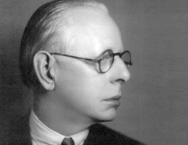

## Table of Contents

## Who was Jesse Livermore?

Jesse Livermore was a famous stock trader and speculator who lived from 1877 to 1940. He started trading when he was very young, and he became well-known for making a lot of money in the stock market. Livermore was good at understanding market trends and he used this skill to make big profits. He was also known for his book, "Reminiscences of a Stock Operator," which shares his experiences and lessons in trading.

Livermore had a lot of ups and downs in his life. He made millions of dollars several times, but he also lost a lot of money. His biggest success came during the stock market crash of 1929, when he made around $100 million by betting that the market would go down. However, he struggled with personal problems and financial losses later in his life. Sadly, Livermore took his own life in 1940, leaving behind a legacy as one of the greatest traders in history.

## What time period did Jesse Livermore live and trade in?

Jesse Livermore lived from 1877 to 1940. He started trading when he was just 14 years old, in the late 1800s. This was a time when the stock market was growing fast and many people were trying to make money from it. Livermore traded through many big events, like the Panic of 1907 and the stock market crash of 1929.

During his life, the world was changing a lot. New technology, like the telegraph, helped traders get information faster. Livermore used this to his advantage. He also lived through the Great Depression, which started after the 1929 crash. This was a very hard time for many people, but Livermore was able to make a lot of money by predicting the crash.

## What were Jesse Livermore's early experiences in trading?

Jesse Livermore started trading when he was just 14 years old. He left school to work at a stock brokerage firm called Paine Webber in Boston. There, he learned about the stock market by watching the ticker tape, which showed the prices of stocks. He was good at understanding patterns and started making his own trades. At first, he traded small amounts of money, but he quickly got better and started making more money.

Livermore's early trades were often in bucket shops, which were places where people could bet on stock prices without actually owning the stocks. He would go from one bucket shop to another, using what he learned to make money. By the time he was 15, he had made around $1,000, which was a lot of money back then. His success in these early years showed that he had a natural talent for trading, and it set the stage for his later achievements in the stock market.

## How did Jesse Livermore develop his trading strategies?

Jesse Livermore developed his trading strategies by paying close attention to the stock market and learning from his experiences. He started trading at a very young age and spent a lot of time watching the ticker tape, which showed stock prices. This helped him understand how the market moved and what patterns to look for. He also learned from his early trades in bucket shops, where he could bet on stock prices without owning the stocks. These experiences taught him to be patient and to wait for the right opportunities to make big trades.

Livermore's strategies were based on understanding market trends and using them to his advantage. He believed in following the market's direction rather than fighting against it. He would wait for clear signs that the market was going up or down before making a trade. Livermore also used stop-loss orders to limit his losses if a trade went against him. Over time, he developed a set of rules that he followed strictly, which helped him make big profits during his career.

## What were some of Jesse Livermore's most famous trades?

One of Jesse Livermore's most famous trades happened during the Panic of 1907. He saw that the market was going down and decided to bet against it. He made a lot of money by selling stocks short, which means he made money when the prices went down. This trade made him a millionaire at the age of 30. It showed how good he was at understanding the market and making big moves at the right time.

Another famous trade was during the stock market crash of 1929. Livermore saw that the market was going to crash and he bet against it again. He sold stocks short and made around $100 million, which is a huge amount of money. This trade made him very rich, but it also showed how risky his strategies could be. Even though he made a lot of money, he also lost a lot at other times in his life.

## What principles did Jesse Livermore follow in his trading?

Jesse Livermore followed some important principles in his trading. One big rule was to always follow the market's trend. He believed that if the market was going up, you should buy stocks, and if it was going down, you should sell them short. He waited for clear signs that the market was moving in one direction before making a trade. This helped him avoid making bad trades based on guesses.

Another principle was to use stop-loss orders. These are orders that automatically sell a stock if its price drops to a certain level. This helped Livermore limit his losses if a trade went against him. He also believed in being patient and waiting for the right opportunities. He knew that big profits often came from waiting for the right moment to make a big trade. These principles helped him make a lot of money during his career, even though he also faced many challenges.

## How did Jesse Livermore's personal life influence his trading career?

Jesse Livermore's personal life had a big impact on his trading career. He was married three times, and his relationships were often troubled. His second wife, Dorothy, spent a lot of money, which put pressure on Livermore to keep making big profits. This stress sometimes made him take more risks in his trading, which led to big losses. His personal life also made it hard for him to focus on his trading strategies and follow his own rules.

Livermore also struggled with depression and other personal problems. These issues affected his ability to make good trading decisions. Sometimes, he would make big trades based on emotions rather than careful analysis. This led to big wins but also big losses. In the end, his personal struggles and financial ups and downs were too much for him, and he took his own life in 1940. His personal life shows how important it is for traders to manage their emotions and keep a clear mind when making decisions.

## What were the major successes and failures in Jesse Livermore's trading career?

Jesse Livermore had some big successes in his trading career. One of his biggest wins was during the Panic of 1907. He saw that the market was going down and bet against it by selling stocks short. This made him a millionaire at the age of 30. His biggest success came during the stock market crash of 1929. He again bet that the market would go down and made around $100 million. These trades showed how good he was at understanding market trends and making big moves at the right time.

But Livermore also had some big failures. He lost a lot of money several times in his life. After his big win in 1929, he lost most of his money in the early 1930s. He tried to make it back but kept losing more. His personal life also made things harder. His second wife spent a lot of money, which put pressure on him to keep making big profits. This stress made him take more risks, which led to more losses. In the end, his ups and downs were too much, and he took his own life in 1940.

## How did Jesse Livermore's strategies influence modern trading?

Jesse Livermore's strategies have had a big impact on modern trading. One of his main ideas was to follow the market's trend. He believed that if the market was going up, you should buy stocks, and if it was going down, you should sell them short. This idea is still used by many traders today. They watch the market closely and try to make trades that go with the trend. Livermore also used stop-loss orders to limit his losses. This is a common practice now, where traders set a point at which they will sell a stock if it starts to lose too much value.

Another way Livermore's strategies influence modern trading is through his emphasis on patience and waiting for the right opportunities. He knew that big profits often came from waiting for the right moment to make a big trade. This idea is important for traders today, who often have to wait for the right time to make their moves. Livermore's book, "Reminiscences of a Stock Operator," also shares many of his lessons and experiences. It is still read by traders today, helping them learn from his successes and failures.

## What can traders learn from Jesse Livermore's approach to the market?

Traders can learn a lot from Jesse Livermore's approach to the market. One big lesson is to always follow the market's trend. Livermore believed that if the market was going up, you should buy stocks, and if it was going down, you should sell them short. This means traders should watch the market closely and make trades that go with the trend, not against it. He also used stop-loss orders to limit his losses. This is a smart way to protect your money if a trade goes wrong. By setting a point to sell a stock if it loses too much value, traders can avoid big losses.

Another important lesson from Livermore is to be patient and wait for the right opportunities. He knew that big profits often came from waiting for the right moment to make a big trade. This means traders should not rush into trades but wait for clear signs that the market is moving in one direction. Livermore's life also shows how important it is to manage emotions and keep a clear mind. His personal struggles and the pressure to make money sometimes made him take big risks, which led to big losses. Traders today can learn from this and try to stay calm and focused when making decisions.

## What were the reasons behind Jesse Livermore's financial ups and downs?

Jesse Livermore's financial ups and downs came from a mix of his trading strategies and his personal life. He was very good at understanding the market and making big profits when he followed his own rules. For example, he made a lot of money during the Panic of 1907 and the stock market crash of 1929 by betting that the market would go down. But he also lost a lot of money because he sometimes took big risks. After his big win in 1929, he lost most of his money in the early 1930s because he kept trying to make it back with risky trades.

His personal life also played a big role in his financial ups and downs. Livermore's second wife, Dorothy, spent a lot of money, which put pressure on him to keep making big profits. This stress made him take more risks in his trading, which led to more losses. He also struggled with depression and other personal problems, which made it hard for him to make good trading decisions. Sometimes, he would make big trades based on emotions rather than careful analysis. In the end, these personal and financial struggles were too much for him, and he took his own life in 1940.

## How did Jesse Livermore's life end, and what impact did it have on his legacy?

Jesse Livermore's life ended sadly. He took his own life in 1940 at the age of 63. He had made a lot of money in the stock market, but he also lost a lot. His personal problems and financial ups and downs were too much for him. He left behind a note saying he was tired of fighting. His death was a big shock to many people who knew him and followed his career.

Even though his life ended sadly, Jesse Livermore left a big mark on the world of trading. He is remembered as one of the greatest traders ever. His book, "Reminiscences of a Stock Operator," is still read by traders today. It shares his experiences and lessons, helping others learn from his successes and failures. His strategies, like following the market's trend and using stop-loss orders, are still used by traders. Livermore's life shows how important it is to manage emotions and keep a clear mind when making trading decisions.

## References & Further Reading

[1]: Sincere, M. (2012). ["Understanding Stocks."](https://www.amazon.com/Understanding-Stocks-Third-Michael-Sincere/dp/1264267258) McGraw-Hill Education.

[2]: Lefèvre, E. (1923). ["Reminiscences of a Stock Operator."](https://en.wikipedia.org/wiki/Reminiscences_of_a_Stock_Operator) George H. Doran Company.

[3]: Schwager, J.D. (1993). ["Market Wizards: Interviews with Top Traders."](https://www.amazon.com/Market-Wizards-Jack-D-Schwager/dp/0887306101) HarperBusiness.

[4]: Elder, A. (1993). ["Trading for a Living: Psychology, Trading Tactics, Money Management."](https://www.amazon.com/Trading-Living-Psychology-Tactics-Management/dp/0471592242) John Wiley & Sons.

[5]: Tharp, V.K. (2006). ["Trade Your Way to Financial Freedom."](https://www.amazon.com/Trade-Your-Way-Financial-Freedom/dp/007147871X) McGraw-Hill Education.