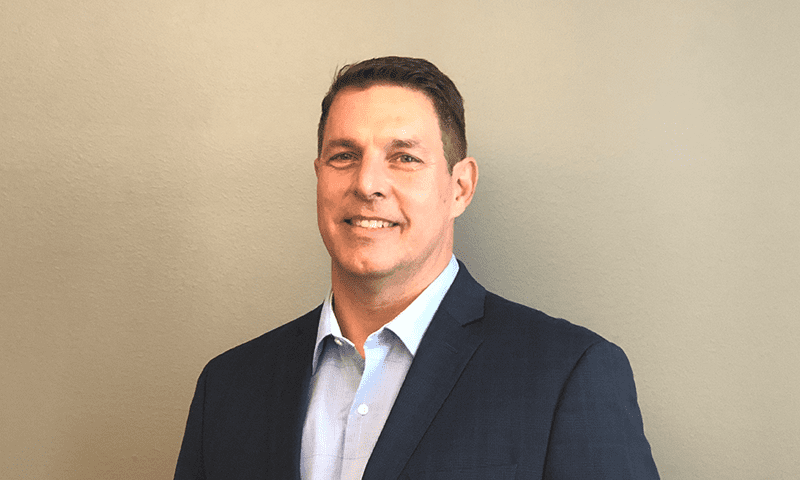

## Table of Contents

## Who is Jim Kharouf?

Jim Kharouf is a journalist and editor who works in the field of finance and commodities. He has a lot of experience writing about markets, trading, and investments. He has worked for many different newspapers and websites, like the Wall Street Journal and Futures Magazine.

Currently, Jim is the editor-in-chief at John J. Lothian & Company, Inc. There, he helps create content about financial markets and trading. He also hosts a podcast called "The Spread" where he talks about market news and trends with experts. Jim is known for making complex financial topics easy to understand.

## What is Jim Kharouf's background in journalism?

Jim Kharouf has been a journalist for a long time, focusing on finance and commodities. He started his career working for different newspapers and websites. Some of the places he worked at include the Wall Street Journal and Futures Magazine. Over the years, he has written a lot about markets, trading, and investments.

Currently, Jim is the editor-in-chief at John J. Lothian & Company, Inc. In this role, he oversees the creation of content about financial markets and trading. He also hosts a podcast called "The Spread," where he discusses market news and trends with experts. Jim is good at explaining complicated financial topics in a way that is easy to understand.

## What industries does Jim Kharouf specialize in?

Jim Kharouf specializes in the finance and commodities industries. He has spent a lot of time writing about markets, trading, and investments. He worked at places like the Wall Street Journal and Futures Magazine, where he learned a lot about these topics.

Now, Jim is the editor-in-chief at John J. Lothian & Company, Inc. He helps make content about financial markets and trading. He also hosts a podcast called "The Spread," where he talks about market news and trends with experts. Jim is good at explaining hard financial ideas in a simple way.

## What are some notable publications Jim Kharouf has written for?

Jim Kharouf has written for many well-known places. He used to work at the Wall Street Journal, which is a big newspaper that talks about business and money. He also wrote for Futures Magazine, which focuses on trading and investments.

Now, Jim is the editor-in-chief at John J. Lothian & Company, Inc. There, he helps make content about financial markets and trading. He also hosts a podcast called "The Spread," where he talks about market news and trends with experts.

## What kind of articles does Jim Kharouf typically write?

Jim Kharouf usually writes articles about finance and commodities. He likes to talk about markets, trading, and investments. He makes these topics easy to understand, even if they can be complicated. He has written for big places like the Wall Street Journal and Futures Magazine.

Now, Jim is the editor-in-chief at John J. Lothian & Company, Inc. There, he helps make content about financial markets and trading. He also hosts a podcast called "The Spread," where he talks about market news and trends with experts. His articles help people learn more about how money and markets work.

## How has Jim Kharouf contributed to the field of journalism?

Jim Kharouf has made big contributions to journalism by focusing on finance and commodities. He has written for important newspapers and websites like the Wall Street Journal and Futures Magazine. Jim makes complex financial topics easy to understand, which helps a lot of people learn about markets, trading, and investments.

Now, Jim is the editor-in-chief at John J. Lothian & Company, Inc. He helps create content about financial markets and trading. He also hosts a podcast called "The Spread," where he talks about market news and trends with experts. Jim's work helps people stay informed and understand how money and markets work.

## What are some of Jim Kharouf's most impactful stories?

Jim Kharouf has written many important stories about finance and commodities. One of his impactful stories was about how changes in regulations can affect trading markets. He explained how new rules can make things better or worse for traders. This story helped a lot of people understand why rules matter in the world of trading.

Another impactful story Jim wrote was about trends in the commodities market. He talked about how the prices of things like oil and gold can change and why that matters to everyone. This story was important because it showed how big changes in commodity prices can affect the economy and people's lives.

## How does Jim Kharouf stay updated with industry trends?

Jim Kharouf stays updated with industry trends by reading a lot of news every day. He looks at websites, newspapers, and reports that talk about finance and commodities. This helps him know what's happening in the markets and what people are talking about. He also talks to experts in the field to get their thoughts on new trends and changes.

Besides reading and talking to people, Jim goes to conferences and events where he can learn more about the industry. These events help him meet other people who know a lot about finance and commodities. By listening to what they say and asking questions, Jim can stay on top of the latest news and trends.

## What awards or recognitions has Jim Kharouf received in his career?

Jim Kharouf has been recognized for his work in journalism. He won an award from the American Society of Business Publication Editors for his writing about finance and commodities. This award showed that people in the industry thought his work was very good and helpful.

He also got a mention from the Society of Professional Journalists for his podcast, "The Spread." They liked how he made complex financial topics easy to understand for everyone. These awards and mentions show that Jim's work is respected and valued in the world of journalism.

## How does Jim Kharouf use his expertise to influence industry practices?

Jim Kharouf uses his expertise to influence industry practices by writing articles and hosting a podcast that explain complex financial topics in a simple way. He talks about how new rules and trends can change the way markets work. By doing this, he helps traders and investors understand what's happening and how they can make better choices. His work at John J. Lothian & Company, Inc. lets him share important information with a lot of people in the finance and commodities industries.

Jim also goes to conferences and events where he can talk to other experts. He shares his knowledge and learns from them too. This helps him stay up-to-date and influence how people in the industry think about new ideas and changes. By being a part of these discussions, Jim helps shape the way the industry works and grows.

## What are Jim Kharouf's views on the future of journalism?

Jim Kharouf thinks the future of journalism will be different because of new technology. He believes that more people will read news on their phones and computers instead of newspapers. He also thinks that videos and podcasts will become more important. Jim says that journalists will need to learn how to use these new ways to tell stories and share information.

Jim also believes that trust is very important for the future of journalism. He thinks that people need to trust the news they read, so journalists must be honest and check their facts carefully. He says that good journalism will always be about telling the truth and helping people understand the world around them. Jim hopes that even with all the changes, journalists will keep doing their important work.

## How can someone interested in similar fields learn from Jim Kharouf's career path?

Someone interested in finance and commodities journalism can learn a lot from Jim Kharouf's career path. Jim started by writing for big newspapers like the Wall Street Journal and Futures Magazine. This shows that getting experience at well-known places can help you learn a lot about your field. He also focused on making complex topics easy to understand, which is important for helping people learn about markets and trading. By reading his articles and listening to his podcast, "The Spread," you can see how he explains things in a simple way.

Jim also shows the importance of staying updated with industry trends. He reads a lot of news and talks to experts to keep learning. Going to conferences and events helped him meet other people in the field and learn from them. If you want to follow a similar path, you should also keep learning and talking to people in your industry. Jim's work at John J. Lothian & Company, Inc. as editor-in-chief shows that taking on leadership roles can help you influence how the industry works and grows. By following these steps, you can build a successful career in finance and commodities journalism.

## References & Further Reading

[1]: Bergstra, J., Bardenet, R., Bengio, Y., & Kégl, B. (2011). ["Algorithms for Hyper-Parameter Optimization."](https://proceedings.neurips.cc/paper/2011/file/86e8f7ab32cfd12577bc2619bc635690-Paper.pdf) Advances in Neural Information Processing Systems 24.

[2]: ["Advances in Financial Machine Learning"](https://www.amazon.com/Advances-Financial-Machine-Learning-Marcos/dp/1119482089) by Marcos Lopez de Prado

[3]: ["Evidence-Based Technical Analysis: Applying the Scientific Method and Statistical Inference to Trading Signals"](https://books.google.com/books/about/Evidence_Based_Technical_Analysis.html?id=jbD47VkOHAEC) by David Aronson

[4]: ["Machine Learning for Algorithmic Trading"](https://github.com/stefan-jansen/machine-learning-for-trading) by Stefan Jansen

[5]: ["Quantitative Trading: How to Build Your Own Algorithmic Trading Business"](https://www.amazon.com/Quantitative-Trading-Build-Algorithmic-Business/dp/1119800064) by Ernest P. Chan