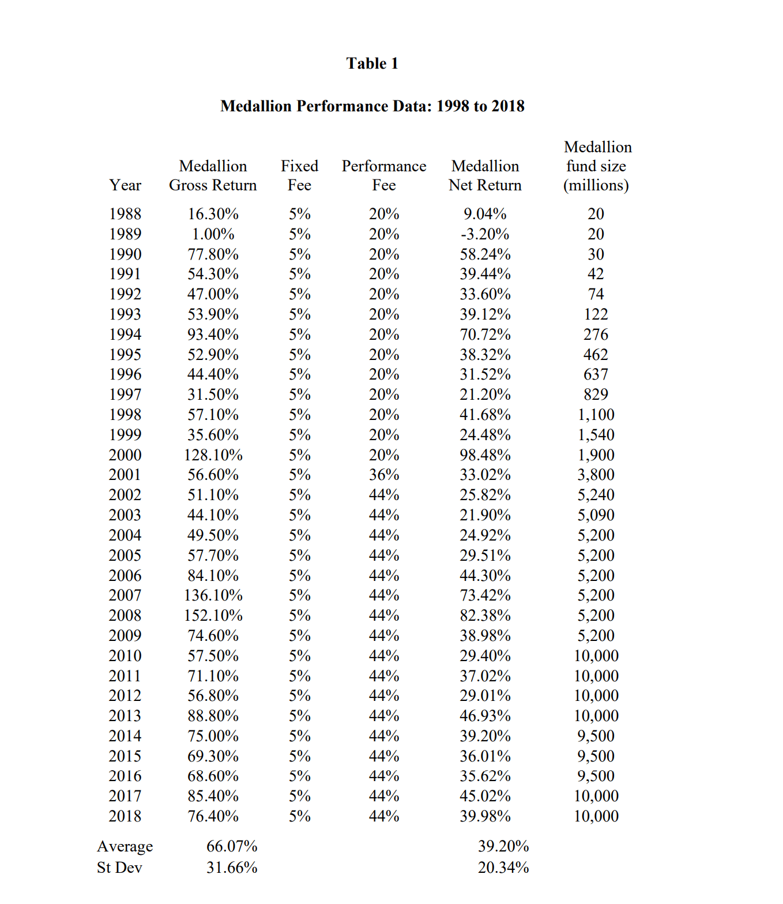

Jim Simons, often regarded as the "Quant King," stands as a monumental figure in the world of trading. With a background deeply rooted in mathematics and academia, Simons diverged from the traditional trajectory to redefine the landscape of the financial industry. As the founder of Renaissance Technologies, one of the world's most successful hedge funds, his approach to investing has been nothing short of revolutionary.

His pioneering efforts in [quantitative trading, which involves using mathematical algorithms](https://paperswithbacktest.com/) and computational models to identify and exploit market patterns, have set him apart from his peers. This method starkly contrasts the more subjective and traditional ways of trading, where human judgment, rather than data-driven algorithms, is paramount.

Understanding Simons' trading strategies is not merely an exercise in academic curiosity; it offers a window into the future of trading and investing. In an industry dominated by traditional thought processes, Simons' strategies underscore the increasing relevance of technology, [data](https://paperswithbacktest.com/datasets), and algorithms in driving investment decisions. By delving deep into his methodologies, one gains insight into the direction in which the trading world is inexorably moving.

For anyone aspiring to grasp the intricacies of the financial market or seeking to comprehend the transformative power of quantitative analysis in trading, Simons' journey and strategies present a masterclass in innovation and forward-thinking.

## Table of Contents

## Early Life and Background

Born in 1938 in Newton, Massachusetts, Jim Simons exhibited a prodigious aptitude for mathematics from a young age. His prowess in the subject led him to the Massachusetts Institute of Technology (MIT), where he completed his bachelor's degree in mathematics. Further nurturing his mathematical talents, Simons went on to earn a Ph.D. in the discipline from the University of California, Berkeley, at the age of 23.

His early career saw him deep dive deep into the world of academia. Simons became a renowned figure in mathematics, notably making significant contributions to the field of differential geometry. One of his most influential works was the Chern-Simons form, which found applications not only in mathematics but also in theoretical physics[1].

However, Simons' trajectory took an unexpected turn in the late 1970s. Recognizing the potential of applying mathematical models to the financial markets, he began to explore the world of trading. His mathematical background provided him with a unique lens through which to view the complexities of financial markets.

In 1978, Simons took a definitive step away from academia when he founded Renaissance Technologies[2]. This [hedge fund](/wiki/hedge-fund-trading-strategies) would go on to become one of the most successful in the world, primarily due to its heavy reliance on quantitative models developed by Simons and his team. His ability to bridge the gap between the abstract world of mathematics and the tangible realm of trading not only revolutionized his personal career trajectory but also set a precedent for the entire trading industry. The financial world would never be the same after Simons demonstrated the immense potential of harnessing mathematical algorithms to navigate the market's unpredictable waters.

## Renaissance Technologies and Medallion Fund

In 1982, the world of finance witnessed the inception of a firm that would go on to redefine the landscape of [quantitative trading](/wiki/quantitative-trading): Renaissance Technologies[3]. Founded by Jim Simons, Renaissance was not just another hedge fund; it represented the crossroads of science, mathematics, and finance. Nestled in East Setauket, New York, far from the hustle and bustle of Wall Street, the firm thrived on its quantitative approach, viewing the market as a complex system that could be understood through mathematical models.

At the heart of Renaissance Technologies is its flagship fund, the Medallion Fund. Launched in 1988, the fund has consistently delivered unparalleled returns, averaging around 66% before fees and 39% after fees annually, making it one of the most successful hedge funds in history. Its name, "Medallion," is inspired by the mathematical models and algorithms that lay the groundwork for its trading strategy.

What sets Renaissance apart from its contemporaries is the collaborative genius of its team. While Simons was undoubtedly the driving force behind its inception, the subsequent joining of key figures like Robert Mercer and Peter Brown added immense value to the firm. Mercer, a computational linguist, and Brown, a computer scientist, both formerly from IBM, played pivotal roles in honing the firm's data-driven methodologies. Their expertise in processing [vast amounts of data](https://paperswithbacktest.com/datasets) helped Renaissance develop models that could predict price changes with exceptional accuracy.

However, the success of Renaissance and the Medallion Fund isn't solely attributed to algorithms or models. It lies in the firm's ability to continuously adapt and refine its strategies in an ever-changing market environment. The combination of a dedicated research team, an i[nsatiable thirst for data](https://paperswithbacktest.com/datasets), and the application of cutting-edge technology gave Renaissance a competitive edge that few could match.

As the years went by, Renaissance Technologies became synonymous with the power and potential of quantitative trading. The firm's approach – blending rigorous scientific research with financial acumen – stands as a testament to the fact that the financial market, often deemed unpredictable, can be understood and navigated with the right tools and mindset.

## Pioneering Quant Trading

Quantitative trading, commonly referred to as "quant trading," harnesses mathematical models and advanced computational techniques to identify trading opportunities in financial markets[4]. By analyzing vast amounts of data, these models can predict price movements and optimize [trading strategies](https://paperswithbacktest.com/), offering a more systematic and data-driven approach to trading than traditional methods.

Jim Simons, with his profound mathematical background and visionary mindset, was instrumental in ushering in the Quant Era on Wall Street. While the concept of using math in finance wasn't new, Simons and his team at Renaissance Technologies elevated it to unprecedented heights. Through their relentless pursuit of refining and adapting their algorithms, they set the gold standard for quantitative hedge funds and demonstrated the [immense potential of combining math, data, and technology in trading](https://paperswithbacktest.com/[course](/wiki/best-algorithmic-trading-courses))[5].

Renaissance Technologies' approach stands distinct from many other hedge funds in several ways. While most hedge funds often mix quantitative techniques with [fundamental analysis](/wiki/fundamental-analysis) or rely on human intuition, Renaissance's models are almost purely data-driven. The firm's dedication to removing human biases, its vast data acquisition efforts, and its application of cutting-edge technologies, allowed it to develop models of unparalleled precision. Moreover, Renaissance places heavy emphasis on continuous research and adaptation. In an industry where strategies can become obsolete overnight, the firm's commitment to innovation has been a significant [factor](/wiki/factor-investing) in its sustained success.

Renaissance's groundbreaking work in quant trading not only reaped substantial profits but also changed the landscape of the financial industry. Many hedge funds and financial institutions took note, leading to an increased emphasis on quantitative methodologies and the rise of the quant trader as a pivotal figure in modern finance.

## Unraveling Jim Simons’ Trading Strategy

At the heart of Simons' trading strategy lies an unwavering belief in the power of numbers. By treating markets as vast and complex systems, Simons posited that with enough data and computational power, patterns could be discerned even amidst what appeared to be random market noise.

Data, as a result, has been the lifeblood of Renaissance Technologies. The firm's algorithms thrive on massive datasets spanning decades, covering everything from global stock prices to weather patterns, aiming to find hidden relationships and subtle anomalies. This data-driven approach is a stark departure from traditional hedge fund strategies, which often prioritize human intuition or macroeconomic analysis.

**Statistical arbitrage**

The basic strategy is statistical [arbitrage](/wiki/arbitrage) at portfolio level, pushed to the limit and extremely well executed. Basically, portfolios of long (buy) and short (sell) positions are created to hedge market risk, sector risk and any other type of risk that Renaissance can statistically predict.

The extreme degree of hedging reduces the net rate of return. But portfolio [volatility](/wiki/volatility-trading-strategies) is reduced by an even more important factor. The standard deviation of the portfolio's value at a future date is much lower than its expected value. Consequently, with a large number of transactions, the law of large numbers ensures that the probability of a loss is very low. In such a situation, leverage multiplies expected return and volatility by the same multiple. So, even with high leverage, the probability of a loss remains very low.

**Multi-factor pricing**

The strategy's general properties can be deduced from Renaissance's statement for the Senate Permanent Subcommittee on Investigations hearing, dated July 22, 2014.

It notes that [Renaissance collects "all publicly available data](https://blog.paperswithbacktest.com/p/how-to-collect-data-for-[backtesting](/wiki/backtesting)) that it believes can influence the evolution of tradable instrument prices: news articles, analyst reports, energy reports, crop reports, weather reports, regulatory agency findings, accounting data and, of course, quotes and transactions on markets around the world".

It also notes that their models "use this data to make predictions about future price changes".

**High frequency**

The hearing specifically concerned the Medallion fund. The statement says: "The model developed by Renaissance for Medallion makes predictions that are only marginally profitable."

According to Robert Mercer, one of the lead managers, Medallion was only right on about 50.75% of its trades. Nevertheless, from the millions of transactions, this percentage helped the company earn billions.

This approach is not unique in the market. Market maker Timber Hill (founded by Thomas Peterffy), now acquired by Two Sigma, used the same approach. On the other hand, the execution of Medallion's strategy is particularly meticulous. Medallion excels at predicting the cost of a transaction.

**Hedging**

Renaissance does not hesitate to implement a highly sophisticated hedging system. Thanks to years of use and refinement, Renaissance knows that its models are highly reliable. There is always a risk of something happening that is not covered by the models. In particular, there's always the risk of something outside previous experience. This is known as a "black swan" event (see Nassim Taleb's excellent book on the subject).

**Leverage**

In terms of portfolio management, the Medallion Fund is known for its aggressive use of leverage. By confidently backing their algorithms, the fund magnifies its positions to achieve higher returns. However, this also means the fund is exposed to higher risks. The firm's rigorous risk management protocols and swift adaptation to changing market conditions have thus far effectively mitigated these risks.

To further reduce its risk, Renaissance takes out a call option on the portfolio it has designed. This call option idea is therefore excellent. It is highly leveraged and offers protection against both the very low probability of a loss greater than the option premium and the unknown probability of a potentially catastrophic loss due to a black swan event.

This approach to trading, steeped in continuous learning and adaptation, has not only generated consistent returns for Renaissance but also revolutionized the way the world thinks about finance and investment.

## The Special Sauce: Renaissance's Team

A vast portion of Renaissance Technologies' unparalleled success can be attributed to its team – a select ensemble of exceptionally gifted individuals, often plucked from non-finance backgrounds like physics, mathematics, and computational linguistics. In the world of quantitative trading, it's less about predicting the future and more about identifying patterns in vast amounts of data. To do that, you need people who think differently, who see the world through a lens of equations, algorithms, and statistical models.

From its inception, Renaissance didn’t just seek traders; it aimed to build a team of scientists. The firm’s recruitment strategy was and remains unique: it avoids finance graduates and MBAs, instead seeking out specialists with no background in finance but deep expertise in their respective fields. This approach ensures that the team isn't blinded by the prevailing wisdom of the financial world and can approach problems without preconceived notions.

This assemblage of exceptional minds is nestled in the heart of Long Island, away from the hustle and bustle of Wall Street. The somewhat secluded environment has cultivated a culture of quiet introspection and innovation, where the cross-pollination of ideas between different disciplines occurs.

Of course, attracting such talent requires more than just a compelling work challenge. The firm's compensation structure is one of the most lucrative in the industry. Renaissance doesn’t just pay its employees; it makes them partners in the firm's success. High bonuses and a stake in the Medallion Fund ensure that every team member has a vested interest in the fund's performance.

In sum, the formidable combination of diverse expertise, a unique workplace culture, and a reward system tied directly to success has allowed Renaissance Technologies to craft a team that stands unrivaled in the world of quantitative trading.

## Performance and Achievements

The Medallion Fund, managed by Renaissance Technologies, stands as one of the most successful hedge funds in history. From its inception in 1988 through to the early 2020s, it has averaged a remarkable 66% annual return before fees and 39% after fees[6]. To put this in perspective, if someone had invested $1,000 in the fund when it started, it would have grown to more than $20 million by 2020[7].

When benchmarked against the broader market, the Medallion Fund's performance is even more extraordinary. For instance, during the same period, the S&P 500 Index, an indicator of the overall U.S. stock market performance, delivered an average annual return of roughly 10%. Compared to other hedge funds, Medallion stands out too. The average hedge fund, as reported by the HFRI Fund Weighted Composite Index, returned about 7.5% annually over the past two decades, making Medallion’s returns almost nine times better.

However, the journey wasn't without its challenges. In its early years, the Medallion Fund faced significant hurdles, especially between 1989 and 1990, when it grappled with losses due to unpredicted market shifts. Instead of sticking to the same model, the team, under Simons’ leadership, chose to re-evaluate and enhance their mathematical models. This adaptability was pivotal. They recognized that while their models were sophisticated, the financial markets were a dynamic beast. Over time, with iterative refining of their algorithms and adapting to new data, they steered the ship back on course.

Even with these setbacks, the Medallion Fund's resilience and ability to bounce back underscores its management's brilliance and the robustness of its trading strategy. It's a testament to the importance of continuous learning, adaptation, and the sheer prowess of quantitative trading when done right.

## Secrets of the Medallion Fund’s Returns

Achieving sustained, extraordinary returns as the Medallion Fund has done is no small feat. A significant factor behind this prowess lies in their proprietary algorithms and the veil of secrecy surrounding their operations. While the exact details of their trading algorithms remain a closely guarded secret, some insights can be gleaned from various sources.

Renaissance Technologies' approach is founded upon collecting vast amounts of data and feeding this information into sophisticated mathematical models. From historical stock prices to weather patterns, from global shipment data to trends in social media—no data is too obscure if it can provide a predictive edge. This massive data repository allows their algorithms to discern patterns that are invisible to the human eye or traditional analysts.

The algorithms employed by the Medallion Fund are not static. They evolve, learn, and adapt. Using techniques from advanced fields such as signal processing, statistical physics, and [machine learning](/wiki/machine-learning), Renaissance’s models are continuously refined to better predict price movements.

Another notable aspect of Renaissance's strategy is the short-term nature of their trades. Rather than predicting [long-term trends](https://paperswithbacktest.com/paper/does-trend-following-work-on-stocks), the Medallion Fund often focuses on capturing small inefficiencies in the market, profiting from minuscule price discrepancies that may exist for just fractions of a second. This high-frequency trading strategy, combined with their predictive algorithms, allows them to execute a vast number of trades, each yielding a tiny profit that cumulatively amounts to significant returns.

However, it's not just the algorithms that are responsible for the Medallion Fund’s success; it's the people behind them. The firm's hiring practices prioritize physicists, statisticians, and other scientists over traditional finance professionals. This eclectic mix of talent, each bringing a unique perspective to problem-solving, further refines and enhances the capability of their algorithms.

The mystique surrounding the Medallion Fund's operations has only added to its allure. Renaissance Technologies is known for its stringent confidentiality protocols, with employees bound by rigorous non-disclosure agreements. This opacity ensures that their trade secrets remain protected, allowing them to maintain their competitive edge in the high-stakes world of quantitative trading.

While the exact nature of the algorithms and the full extent of data sources they use remain elusive, it's undeniable that their approach—a blend of technology, data, science, and talent—has revolutionized the finance industry and set the gold standard for quantitative trading.

## Key Lessons for Aspiring Traders

Embarking on a journey in the trading world demands more than just knowledge of market fluctuations. Jim Simons, through his illustrious career, has imparted a wealth of lessons that can guide those aspiring to succeed in this challenging domain.

Jim Simons often emphasizes the importance of a **solid foundation in mathematics and [statistics](/wiki/bayesian-statistics)**. For those looking to deep dive into quantitative trading, it's not the rudimentary knowledge of finance, but a deep understanding of complex mathematical models that provides a competitive edge.

Renaissance Technologies' success with the Medallion Fund underscores the importance of employing an **evidence-based approach**. Rather than relying on intuition or traditional market wisdom, they bank on rigorous data analysis. Aspiring traders should remember that in the modern trading landscape, data is the new oil. Harnessing it effectively can lead to informed, profitable decisions.

The Medallion Fund's strategy wasn't set in stone. It evolved, adapted, and transformed as markets changed. This highlights the crucial lesson of **flexibility**. It's essential to remain nimble, [adapting strategies](https://paperswithbacktest.com/) when market dynamics shift. What worked a decade ago might not yield the same results today. Adaptation is the key to survival and success in the tumultuous world of trading.

Continuous learning stands at the core of Renaissance Technologies' ethos. The world of trading is in a state of perpetual flux, with new technologies, regulations, and global events constantly reshaping the landscape. As Simons once said, "You have to keep learning every day, unlearning old stuff and replacing it with new knowledge." For those stepping into trading, embracing a mindset of lifelong learning can be the difference between fleeting success and sustained excellence.

Lastly, Simons often alludes to the psychological aspects of trading. While algorithms and data play a pivotal role, managing one's emotions, biases, and impulses is equally vital. Overconfidence, fear, or greed can cloud judgment, leading to suboptimal decisions. Aspiring traders should cultivate a disciplined mindset, staying objective and grounded even in the face of market volatility.

In essence, the journey of Jim Simons and the unparalleled success of the Medallion Fund offers a blueprint for those eager to carve a niche in trading. While there's no one-size-fits-all strategy, embracing mathematical rigor, data-driven decisions, adaptability, continuous learning, and emotional intelligence can pave the way for trading excellence.

## Personal Insights & Quotes

Jim Simons, beyond his quantitative prowess, is a repository of wisdom. His life, laden with experiences ranging from academia to the stock market, offers valuable insights that resonate even outside the trading world.

One of Simons' most quoted remarks touches upon the essence of prediction: "It's not about being right or wrong; it's about how much money you make when you're right and how much you lose when you're wrong." This sentiment underscores the importance of managing risk in trading and, by extension, in all decision-making scenarios.

Delving deeper into his beliefs on trading, Simons once highlighted the futility of relying on experts, noting, "The advantage scientists bring into the game is less their mathematical or computational skills than their ability to think scientifically.". Here, he underscores the importance of a structured, evidence-based approach to problem-solving, an attitude rooted in his background as a scientist.

In one of his rare interviews, Simons reminisced about his transition from academia to trading: "I liked math, but I didn't want to be a mathematician for my whole life. And I didn't want to be a teacher. So, I went into business, and I loved it. It's creative. It's not just about making money.". This reflection paints a picture of a man driven by passion and curiosity, rather than mere financial gain.

It's also well-known within close circles that Simons was deeply affected by the tragic loss of two of his children. These personal tragedies, while heart-wrenching, gave him a unique perspective on life and loss. He became a staunch advocate for advancing research on autism and founded the Simons Foundation, aiming to "advance the frontiers of research in mathematics and the basic sciences.".

In conversations about his life's philosophy, Simons remarked, "Life is full of challenges. Sometimes it takes a while to overcome these challenges, but if you're persistent and keep at it, things usually work out for the best.". This optimistic yet pragmatic outlook encapsulates his journey, punctuated by adversities and triumphs.

Jim Simons is more than just a quant genius; he's a philosopher, a philanthropist, and a beacon of resilience. His quotes and stories serve not just as trading aphorisms but as life lessons, reminding us of the intertwined nature of success, struggle, and the human spirit.

## The Shift from Academia to Trading

Jim Simons, a name synonymous with [algorithmic trading](/wiki/algorithmic-trading) today, was once deeply entrenched in the world of academia. With a PhD from UC Berkeley at the age of 23 and a prestigious position as the chair of the mathematics department at Stony Brook University, Simons had built a formidable reputation as a mathematician. His work on Chern-Simons theory, a cornerstone in the field of theoretical physics and geometry, garnered international acclaim.

However, it was during his time at Stony Brook that Simons began dabbling in financial markets, initially using mathematical models to predict currency prices. The allure of the stock market's complexity, unpredictability, and potential rewards presented a challenge that was too enticing to resist.

This intrigue was not merely about the potential financial gains. The stock market, to Simons, was a vast, intricate puzzle waiting to be decoded. It offered a different kind of intellectual stimulation, one where mathematical theories could be applied in real-time to tangible, high-stakes outcomes.

The decisive shift came in 1978 when Simons founded Monemetrics in a modest office above a bank in Stony Brook. This early endeavor focused primarily on currency trading but laid the foundation for what would later become Renaissance Technologies. While many were perplexed by Simons' decision to leave the cloistered halls of academia for the chaotic world of finance, those who knew him best weren't surprised. His insatiable curiosity and penchant for tackling the most challenging problems made this transition seem like a natural evolution.

Despite early setbacks, including a significant trading loss that almost derailed the firm, Simons remained undeterred. Driven by a blend of mathematical rigor and a keen business acumen, he gradually assembled a team of scientists, mathematicians, and codebreakers. Together, they built the algorithms that would drive Renaissance's success and revolutionize the world of trading.

In essence, while many saw Simons' move from academia to trading as a departure, it was more of a fusion. He brought the rigor and discipline of academic research to the chaotic world of finance, demonstrating that with the right approach, even the most unpredictable markets could be tamed.

## Frequently Asked Questions

**Who is Jim Simons?**

Jim Simons is a mathematician and hedge fund manager, best known as the founder of Renaissance Technologies, a highly secretive and successful quantitative hedge fund. His application of complex mathematical models to financial markets has made him a pioneer in the quant trading revolution.

**What is Renaissance Technologies?**

Founded in 1982 by Simons, Renaissance Technologies is a private investment management company specializing in [systematic trading](https://paperswithbacktest.com/course) using quantitative models derived from mathematical and statistical analyses. Their trading strategies are driven by algorithms and are applied across a variety of asset classes.

**How successful is the Medallion Fund?**

The Medallion Fund, operated by Renaissance Technologies, is often hailed as one of the most successful hedge funds in history. It has averaged returns of over 35% annually after fees since its inception in 1988, outperforming the vast majority of its peers.

**What risks are associated with quantitative trading?**

Quantitative trading, while often profitable, is not without risks. Algorithms can react unpredictably to unforeseen market events, leading to significant losses. Additionally, as more entities adopt similar strategies, the edge provided by any particular algorithm may diminish. There's also the risk of "overfitting", where a strategy performs well on past data but fails in real-time trading.

**Wasn't Jim Simons a mathematician? How did he transition to finance?**

Yes, Simons began his career as a distinguished mathematician, making significant contributions to geometry and topology. His fascination with the stock market and the complexities within it led him to apply mathematical models to finance, marking his transition from academia to trading.

**Are the algorithms used by Renaissance Technologies public?**

No, the algorithms and trading strategies developed by Renaissance are closely guarded secrets. The firm is known for its intense privacy and has even bought back shares from external investors to maintain its secretive nature.

**Are there misconceptions about quant trading?**

Certainly. A common misconception is that quant trading guarantees success. While quantitative methods can provide an edge, they don't ensure profits. Additionally, many believe quant trading removes all human intervention, but human oversight is essential in developing, refining, and sometimes overriding algorithms.

## Conclusion

Jim Simons, a luminary in the trading realm, single-handedly shifted the paradigm of how the financial markets are approached. By leveraging his mathematical prowess, he birthed Renaissance Technologies, an institution that has consistently outperformed peers through its Medallion Fund. His journey from the corridors of academia to the high stakes of Wall Street serves as an emblematic testament to the power of quantitative analysis and its applicability beyond traditional realms.

But the narrative of Simons and Renaissance Technologies extends beyond mere profits. It's a story about the relentless pursuit of excellence, the melding of mathematics with market intuition, and the indomitable spirit of innovation. In a financial landscape that's perpetually shifting, the ethos of Renaissance—a foundation of continuous learning, adaptation, and innovation—emerges as a touchstone for all traders and institutions.

As the world of trading evolves, with algorithms becoming ever more sophisticated and data analytics increasingly crucial, the tale of Jim Simons stands as a beacon. It reminds us that at the confluence of intellect, innovation, and intuition, there lies the potential for unparalleled success. But, just as Simons and his team at Renaissance have done, one must always be ready to adapt, evolve, and re-invent in the face of new challenges.

## References & Further Reading

[1]: [Chern-Simons Theory, Matrix Models, and Topological Strings - Marcos Mariño](https://arxiv.org/abs/hep-th/0406005)

[2]: ["The Man Who Solved the Market: How Jim Simons Launched the Quant Revolution" - Gregory Zuckerman](https://www.amazon.com/Man-Who-Solved-Market-Revolution/dp/073521798X)

[3]: [Renaissance Technologies LLC - Company Profile](https://www.bloomberg.com/profile/company/19889Z:US)

[4]: ["Quantitative Trading: How to Build Your Own Algorithmic Trading Business" - Ernest P. Chan](https://www.wiley.com/en-us/Quantitative+Trading%3A+How+to+Build+Your+Own+Algorithmic+Trading+Business-p-9780470284889)

[5]: ["The Quants: How a New Breed of Math Whizzes Conquered Wall Street and Nearly Destroyed It" - Scott Patterson](https://www.penguinrandomhouse.com/books/302489/the-quants-by-scott-patterson/)

[6]: ["Inside the Black Box: A Simple Guide to Quantitative and High Frequency Trading" - Rishi K. Narang](https://www.wiley.com/en-us/Inside+the+Black+Box%3A+A+Simple+Guide+to+Quantitative+and+High+Frequency+Trading%2C+2nd+Edition-p-9781118415851)

[7]: ["Jim Simons, the Numbers King" - The New Yorker](https://www.newyorker.com/magazine/2017/12/18/jim-simons-the-numbers-king)