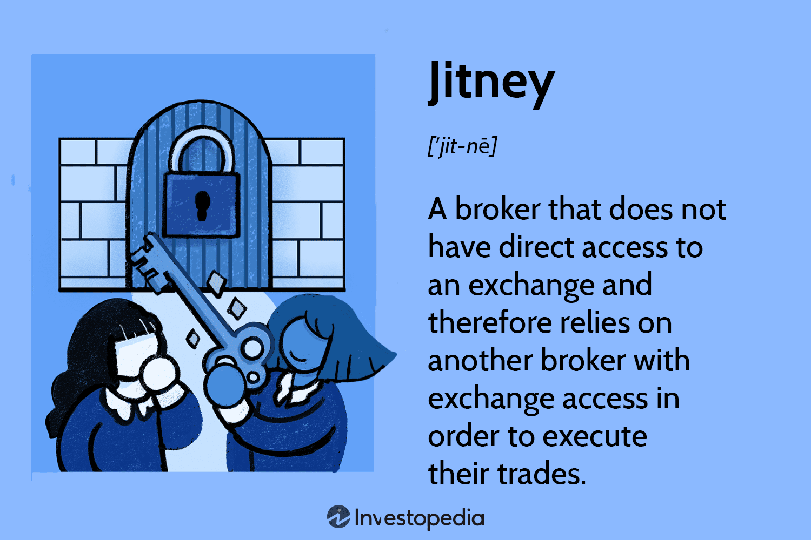

The landscape of public transportation is rapidly evolving with various innovative solutions emerging in response to urban congestion and environmental concerns. As metropolitan areas continue to expand and their populations increase, the demand for efficient and sustainable transit solutions grows ever more critical. Among these innovations, the concept of shared transport systems, such as jitneys, is gaining attention for its potential to reshape urban transit. Jitneys, typically involving flexible route services typically offered by minibuses or vans, serve as a bridge between private taxi services and traditional public transport, offering a more dynamic and economical alternative for urban commuters. By optimizing vehicle occupancy and reducing idle time, jitneys can contribute significantly to reducing traffic congestion and lowering emissions.

Simultaneously, the finance world is undergoing its own transformation with algorithmic trading, a phenomenon that leverages computational algorithms to execute trades at speeds far beyond human capability. This technology enables traders to make decisions based on data-driven insights, executing numerous trades within milliseconds, thus providing a distinct advantage in speed and precision. The intersection of automation and financial markets exemplifies how technology can revolutionize traditional trading practices, much like the way technology is poised to revolutionize urban transport systems.



This article explores the intersection of two seemingly disparate worlds: shared transport systems and algorithmic trading. While these sectors may appear unrelated at first glance, both strive for enhanced efficiency, improved resource management, and the integration of smart technology into everyday operations. By juxtaposing these concepts, the article aims to shed light on their respective impacts and the lessons they might share in terms of efficiency and innovation. Even as these fields evolve independently, the shared goal of overcoming systemic inefficiencies and embracing technological solutions underscores a common thread worth examining.

## Table of Contents

## Understanding Jitney Transport in Urban Mobility

Jitney transport is a form of shared public transportation characterized by its use of minibuses or vans operating on flexible routes dictated by passenger demand. This service model, which originated in the early 20th century, has evolved to serve as a vital intermediary between private taxis and conventional public transportation systems in numerous urban areas. Jitneys offer an economical and adaptable alternative, often filling the void left by traditional transit systems, particularly in cities with underdeveloped transport infrastructure or where such systems are not economically viable.

The operational essence of jitney transports focuses on enhancing vehicle utility. By minimizing idle time and avoiding empty rides, jitneys not only maximize economic efficiency but also contribute significantly to alleviating urban traffic congestion and lowering vehicle emissions. This efficiency is achieved through dynamic routing and real-time responsiveness to passenger needs, which differentiates jitneys from fixed-route buses or trains. This adaptability is possible due to advancements in technology such as GPS and mobile applications that facilitate quick route adjustments and passenger pickups.

Despite the evident advantages in flexibility and cost-effectiveness, jitneys are not without challenges. Regulatory and safety issues remain significant concerns. Since jitneys often operate outside standard public transport regulations, ensuring safety and service reliability can be difficult. This lack of formal oversight raises questions about driver qualifications, vehicle maintenance, and insurance coverage. Moreover, the competition from both regulated public transport systems and app-based ride-sharing services has led to debates around market fairness and sustainability, particularly regarding fare regulations and the legality of jitneys in certain jurisdictions.

Nevertheless, the contribution of jitney transport to urban mobility is substantial. In places where public transit options are limited or non-existent, jitneys provide an essential service by connecting communities to economic centers, schools, and healthcare facilities, thereby supporting both social and economic mobility. Their presence in the urban transport ecosystem underscores the need for a balanced approach to regulation that ensures safety and fair competition while embracing the innovative solutions jitneys offer to urban transit challenges.

## Algorithmic Trading: A New Era in Financial Markets

Algorithmic trading employs computer algorithms to execute trades following pre-defined instructions that consider variables such as timing, price, and [volume](/wiki/volume-trading-strategy). This approach enables traders to perform numerous transactions almost instantaneously, delivering a crucial advantage in the financial markets. The primary objective of [algorithmic trading](/wiki/algorithmic-trading) is to enhance precision and efficiency, akin to the operational aims of systems like jitney transport, where maximizing utility and minimizing waste are paramount.

Algorithmic trading draws its strength from its ability to eliminate human error, reduce emotional decision-making, and optimize transaction execution. By using sophisticated algorithms, traders can quickly respond to market conditions, capturing opportunities or mitigating risks with unprecedented speed. This high-frequency trading approach allows the execution of complex strategies that would be impractical manually.

Despite its potential for profit, algorithmic trading is not without risks and ethical concerns. Issues emerge around the transparency and fairness of markets, with some strategies leading to phenomena like ‘flash crashes.’ Moreover, certain market manipulation techniques, reminiscent of 'jitney games,' where securities are traded among brokers to create fake volume, pose ethical challenges. These practices can undermine market integrity and lead to unfair advantages, prompting scrutiny from regulators seeking to safeguard equitable trading environments.

Algorithmic trading also requires robust technological infrastructure and stringent risk management protocols to protect against technical glitches and unexpected market movements. The field is dynamic, continuously evolving with advances in [artificial intelligence](/wiki/ai-artificial-intelligence) and [machine learning](/wiki/machine-learning), which further refine trading strategies and predictive capabilities.

Ultimately, while algorithmic trading represents a significant leap forward in financial market operations, balancing innovation with ethical considerations remains crucial to its sustainable development. As in shared transport systems, fostering trust and transparency is essential to harnessing its full potential.

## Parallels Between Jitney Transport and Algorithmic Trading

Both jitney transport and algorithmic trading represent innovations driven by the goal of maximizing efficiency and optimizing operations. Jitney transport, which utilizes shared rides in minibuses or vans, focuses on enhancing public mobility by minimizing idle time and aligning with passenger demand. Similarly, algorithmic trading automates decision-making to execute trades at optimal times, maximizing returns and market responsiveness.

The use of technology and data analytics is a common thread that underscores a broader trend towards automation and intelligent systems. In jitney transport, data analytics can forecast passenger demand and optimize routes, enhancing the service's adaptability and efficiency. For algorithmic trading, the use of sophisticated algorithms and machine learning models enables rapid analysis of vast datasets, ensuring precise and profitable trading decisions without human intervention. 

A critical parallel between these two domains is the reliance on resource optimization. Jitney systems aim to maximize vehicle occupancy and minimize empty rides, similar to how algorithmic trading endeavors to execute trades with the best possible timing and volume to ensure profitability. This optimization is often achieved through the application of advanced computational techniques and predictive analytics, which can analyze trends and adjust operations dynamically.

These parallels open pathways for cross-sector innovation. For instance, algorithmic approaches used in trading might inspire advancements in public transport systems. By integrating predictive analytics and real-time data processing into jitney services, operators could achieve smarter route planning and resource allocation, reducing congestion and emissions further. Conversely, the efficiencies gained in jitney systems might offer insights into algorithmic trading, particularly in optimizing execution strategies under constraints akin to urban traffic conditions.

This intersection of jitney transport and algorithmic trading illustrates the potential of leveraging technology for enhanced efficiency across different fields. It suggests a future where advancements in one sector can inform and drive innovation in another, highlighting the interconnectedness of modern technological solutions.

## Challenges and Ethical Considerations

Both jitney transport systems and algorithmic trading, while innovative and offering significant benefits, present considerable challenges primarily centered on regulation and ethics.

For jitney systems, several critical issues need resolution to ensure these services can provide safe and equitable transportation solutions. One major concern is the issue of safety, as many jitneys operate outside the stringent regulatory frameworks that govern traditional public transportation systems. This lack of regulation often leads to insufficient oversight of vehicle maintenance and driver qualifications, potentially compromising passenger safety. Furthermore, as jitneys tend to operate in unregulated environments, there is often an absence of standardized practices, which can result in inconsistent service quality and reliability. Another challenge is the competitive landscape they inhabit. Jitneys frequently operate in markets where competition with other transport forms, such as city buses and ride-sharing services, is fierce. This competition can drive down prices but may also pressure jitney operators to cut costs, sometimes at the expense of safety and service standards.

Algorithmic trading, while revolutionizing the speed and efficiency of trading operations, also raises significant ethical and regulatory concerns. One primary challenge is the risk of market manipulation. Algorithms can be designed to exploit minute market inefficiencies, which, while profitable, can lead to unfair trading advantages and destabilize market systems. Furthermore, the complexity and opacity of algorithmic strategies often lead to a lack of transparency, making it difficult for regulators to ensure fair trading practices. This situation mirrors the reputational challenges faced by jitneys, where perception can outweigh actual performance. Moreover, the rapid pace of algorithmic trades can amplify market [volatility](/wiki/volatility-trading-strategies), raising concerns over systemic risk. Such trades may inadvertently contribute to events like flash crashes, where markets experience dramatic price declines in very short periods, affecting investor confidence.

Addressing these challenges requires the development of robust regulatory frameworks that can effectively oversee both jitney transport and algorithmic trading systems. For jitneys, this might include the introduction of licensing requirements, safety standards, and regular inspections to ensure vehicles meet necessary safety criteria. Enhanced regulatory oversight would also require collaboration with existing public transportation systems to integrate jitneys more effectively within urban mobility strategies, thereby improving service reliability and fairness. 

In the case of algorithmic trading, improved regulation could encompass clearer guidelines on the acceptable use of trading algorithms, enhanced transparency requirements, and better monitoring systems to detect and mitigate market manipulation attempts swiftly. Such frameworks would ideally include industry accountability measures, where financial institutions are required to maintain detailed audit trails of their algorithmic trades and conduct regular reviews to ensure compliance with ethical standards.

By addressing these concerns, both sectors can foster a more responsible environment for their continued innovation and growth, ensuring that technological advancements benefit broader society without compromising safety, fairness, or trust.

## Looking Ahead: The Future of Shared Transport and Trading Systems

The integration of artificial intelligence (AI) and machine learning (ML) promises significant advancements for both jitney transport and algorithmic trading, potentially revolutionizing their operational models and efficiencies. In jitney transport, predictive analytics can be employed to optimize routes and schedules dynamically. By analyzing real-time data such as traffic patterns, weather conditions, and passenger demand, AI algorithms can suggest the most efficient routes for drivers, reducing wait times and improving vehicle utilization. For instance, a [reinforcement learning](/wiki/reinforcement-learning) model could continuously adapt to new data, identifying patterns that can predict peak demand and suggest adjustments accordingly.

```python
import numpy as np
from sklearn.ensemble import RandomForestRegressor

# Assume X_train contains features like traffic density, weather conditions, and Y_train is the demand

model = RandomForestRegressor()
model.fit(X_train, Y_train)

# Predicting demand for a new set of conditions
X_new = np.array([[traffic_density, weather_condition]])
predicted_demand = model.predict(X_new)
```

In algorithmic trading, AI and ML can enhance strategies through improved decision-making. By leveraging vast datasets, algorithms can detect market trends and anomalies, making trading decisions at a speed and accuracy beyond human capability. Techniques such as [deep learning](/wiki/deep-learning) can be used to model complex market behaviors, allowing traders to anticipate price movements more effectively.

For urban planners and financial regulators, creating an environment that encourages innovation while safeguarding consumer protection and market fairness is crucial. Regulatory frameworks must evolve to manage the ethical and security implications of AI use in these domains, ensuring transparency and fairness. 

Both sectors offer critical insights into leveraging technology for enhanced efficiency and service quality. By sharing knowledge across these fields, organizations can adopt best practices and innovative strategies, learning from shared experiences in automation and data-driven decision-making. The symbiotic learning between shared transport and trading systems underscores the potential for cross-industry technological advances, which can improve service delivery and operational efficiency on a broad scale.

## Conclusion

The integration of technology into transportation and trading systems marks a significant evolution of traditional models, characterized by both promising opportunities and inherent challenges. Shared transport frameworks, such as jitneys, and the sophisticated mechanisms of algorithmic trading exemplify the transformative potential of data-driven automation across diverse sectors. These systems are emblematic of a broader technological shift towards greater efficiency, cost-effectiveness, and environmental consciousness.

As industries increasingly rely on automation, stakeholders face the crucial task of navigating intricate regulatory environments. This responsibility necessitates a balance between fostering innovation and ensuring ethical compliance and consumer protection. The rapid pace at which these systems advance underscores the necessity for flexible yet robust regulatory frameworks that support sustainable growth and market integrity.

The comparison between jitney shared transport and algorithmic trading underscores the potential for cross-sector innovation, suggesting that insights gleaned from one industry may lead to breakthrough solutions in another. The lessons drawn from these fields illustrate not only the transformative impact of technology but also the interconnectivity of modern industries. Despite differences in application, both systems reflect shared visions of efficiency and suggest a convergence point for future innovations driven by technology and data analytics.

## References & Further Reading

[1]: Cervero, R. (1997). ["Paratransit in America: Redefining Mass Transportation"](https://archive.org/details/paratransitiname0000cerv). Praeger Publishers.

[2]: Bertram, G. (1986). ["Jitneys: A Study in American Municipal and Transportation History."](https://trid.trb.org/view/132902) Journal of Economic History, 46(2), 455-457.

[3]: Aldridge, I., & Avellaneda, M. (2012). ["High-Frequency Trading: A Practical Guide to Algorithmic Strategies and Trading Systems"](https://www.ahmetbeyefendi.com/wp-content/uploads/2020/07/High-Frequency-Trading-Irene-Aldridge.pdf). Wiley Trading.

[4]: Narang, R. K. (2013). ["Inside the Black Box: A Simple Guide to Quantitative and High Frequency Trading"](https://onlinelibrary.wiley.com/doi/book/10.1002/9781118662717). Wiley.

[5]: Liu, Y., & Schivardi, F. (2017). ["Algorithmic Trading and Volatility: The Impact of High Frequency Trading."](https://link.springer.com/article/10.1007/s11408-019-00331-6) SSRN Electronic Journal.

[6]: Furuhata, M., Dessouky, M., Ordonez, F., Brunet, M. E., Wang, X., & Koenig, S. (2013). ["Ridesharing: The State-of-the-Art and Future Directions for Transportation Systems."](https://www.sciencedirect.com/science/article/pii/S0191261513001483) Transportation Research Part B: Methodological, 57, 28-46.