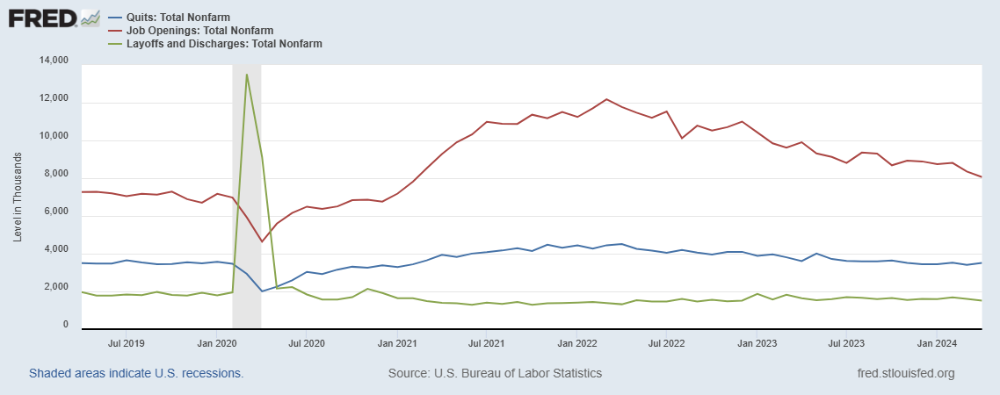

## Table of Contents

## What is the Job Openings and Labor Turnover Survey (JOLTS)?

The Job Openings and Labor Turnover Survey, or JOLTS, is a report put out by the U.S. Bureau of Labor Statistics. It gives information about the job market in the United States. JOLTS looks at how many job openings there are, how many people are being hired, how many people are leaving their jobs, and how many people are being let go or fired. This survey helps people understand what is happening in the job market and how workers and businesses are doing.

JOLTS is important because it helps economists and policymakers see trends in the job market. For example, if there are a lot of job openings but not many hires, it might mean that businesses are having trouble finding the right workers. On the other hand, if a lot of people are quitting their jobs, it could mean that workers feel confident about finding new jobs. By looking at this data, people can make better decisions about the economy and job policies.

## Who conducts the JOLTS and how often is it released?

The Job Openings and Labor Turnover Survey, or JOLTS, is conducted by the U.S. Bureau of Labor Statistics. This is a part of the U.S. Department of Labor. The people at the Bureau of Labor Statistics collect information from businesses all over the country to find out about job openings, hires, quits, and layoffs.

JOLTS is released every month. The report comes out on the second Tuesday of the following month. For example, the data for January is usually released in the middle of February. This regular schedule helps people keep up with changes in the job market and plan accordingly.

## What are the main components measured by JOLTS?

JOLTS measures four main things about the job market: job openings, hires, quits, and layoffs and discharges. Job openings are positions that are open and ready to be filled. Hires are when someone starts a new job. Quits are when someone decides to leave their job on their own. Layoffs and discharges are when a business lets someone go.

These components help us understand what is happening in the job market. If there are a lot of job openings, it might mean that businesses are growing and need more workers. A high number of hires can show that people are finding jobs easily. When many people are quitting, it might mean they feel confident about finding a better job. And if there are a lot of layoffs, it could mean that businesses are struggling and need to cut costs.

## How does JOLTS data help in understanding the labor market?

JOLTS data helps us understand the labor market by showing us how many jobs are open, how many people are starting new jobs, how many are leaving their jobs, and how many are being let go. This information tells us if businesses are growing or if they are having trouble. For example, if there are a lot of job openings but not many hires, it might mean that businesses can't find the right people for the jobs. This helps us see if the job market is strong or weak.

The data also shows us how workers feel about their jobs. If a lot of people are quitting, it might mean they think they can find a better job easily. This can show us if workers feel confident about the job market. On the other hand, if there are many layoffs, it might mean businesses are struggling and need to save money. By looking at all this information, we can understand what is happening in the job market and make better decisions about work and the economy.

## What is the significance of job openings data in JOLTS?

Job openings data in JOLTS is important because it shows how many jobs are available at any given time. This number tells us if businesses are looking to hire more people. If there are a lot of job openings, it means businesses might be growing and need more workers. This can be a good sign for the economy because it means more people might be able to find jobs.

On the other hand, if there are few job openings, it might mean that businesses are not doing well and don't need to hire more people. This can be a warning sign that the job market is not strong. By looking at job openings, we can get a sense of how healthy the job market is and make plans based on that information.

## How can JOLTS data influence economic policy decisions?

JOLTS data helps people who make rules about the economy. If they see a lot of job openings but not many people getting hired, they might think businesses can't find the right workers. This could lead them to make policies that help train people for these jobs. Or if they see a lot of people quitting their jobs, it might mean workers feel good about finding new jobs. This could make policymakers think the economy is doing well and they might not need to do much to help.

If JOLTS data shows a lot of layoffs, it might mean businesses are having a hard time. This could make policymakers want to help businesses by giving them money or making rules easier. They might also want to help workers who lost their jobs by giving them unemployment benefits. By looking at JOLTS data, people who make economic policies can decide what to do to make the job market better.

## What are the limitations of JOLTS data?

JOLTS data has some problems that can make it hard to use. One big problem is that it takes time to collect and put out the information. It can take about a month for the data to be ready. This means that by the time we see the numbers, the job market might have changed. Also, JOLTS only looks at certain businesses and might not include everyone. This can make the numbers not completely right for the whole country.

Another issue is that the data can have mistakes. Sometimes, businesses might not report their numbers correctly, or they might not report at all. This can make the JOLTS numbers less accurate. Also, JOLTS doesn't tell us why people are quitting or getting laid off. Without knowing the reasons, it's hard to understand the full story of what's happening in the job market.

## How does JOLTS data correlate with other economic indicators?

JOLTS data often goes hand in hand with other economic signs like the unemployment rate and the monthly jobs report from the Bureau of Labor Statistics. When JOLTS shows a lot of job openings, it usually means the unemployment rate might go down because more people can find jobs. On the other hand, if JOLTS shows a lot of layoffs, it can mean the unemployment rate might go up because more people are out of work. The monthly jobs report, which tells us how many jobs were added or lost, also matches up with JOLTS data. If JOLTS shows more hires, the jobs report will likely show more jobs were added.

JOLTS data also connects with other big economic numbers like the Gross Domestic Product (GDP). When JOLTS shows more job openings and hires, it can mean the economy is growing because businesses are doing well and need more workers. This growth can show up in a higher GDP. If JOLTS shows a lot of quits, it can mean workers feel good about the economy and are looking for better jobs, which can also be a sign of a strong economy. But if JOLTS shows many layoffs, it might mean businesses are struggling, which can lead to a lower GDP.

## Can you explain the methodology used in collecting JOLTS data?

The U.S. Bureau of Labor Statistics collects JOLTS data by asking businesses all over the country about their job openings, hires, quits, and layoffs. They send out a survey to about 21,000 businesses every month. These businesses come from different industries like manufacturing, construction, and services. The survey asks them to report the number of job openings they had on the last business day of the month, how many people they hired, how many people quit, and how many people were laid off or discharged during the month.

Once the businesses send back their answers, the Bureau of Labor Statistics looks at the data to make sure it's correct. They use special math to make sure the numbers represent the whole country, not just the businesses that answered the survey. This way, the JOLTS report can give a good picture of what's happening in the job market across the United States. The data is then put together and released on the second Tuesday of the following month, so everyone can see and use the information.

## How has the JOLTS data trended over the past decade?

Over the past decade, JOLTS data has shown some big ups and downs in the job market. From 2013 to 2019, the number of job openings slowly went up. This meant more businesses were looking for workers, and it was a good time for people looking for jobs. The number of hires also went up during this time, showing that more people were finding work. But the number of quits stayed pretty steady, which meant workers felt okay about their jobs but not super confident about finding new ones.

Then, in 2020, the job market changed a lot because of the COVID-19 pandemic. Job openings dropped a lot at the start of the year, and there were more layoffs. But as things got better, job openings started to go up again, and by 2021 and 2022, they were even higher than before the pandemic. The number of quits also went up a lot during this time, showing that workers felt more confident about finding new jobs. This trend continued into 2023, with job openings staying high and quits staying strong, showing a job market that was still recovering and growing.

## What are some common criticisms or controversies surrounding JOLTS?

Some people don't like JOLTS because they think it takes too long to get the information out. It can take about a month to see the numbers, and by then, the job market might have changed. This can make it hard for people who need to make quick decisions about the economy. Also, JOLTS only looks at certain businesses, so it might miss some parts of the job market. This can make the numbers not completely right for the whole country.

Another problem people talk about is that the data can have mistakes. Sometimes, businesses might not report their numbers correctly, or they might not report at all. This can make the JOLTS numbers less accurate. Also, JOLTS doesn't tell us why people are quitting or getting laid off. Without knowing the reasons, it's hard to understand the full story of what's happening in the job market.

## How can businesses and investors use JOLTS data to make strategic decisions?

Businesses can use JOLTS data to see if they should hire more people. If JOLTS shows a lot of job openings and hires, it means other businesses are growing and might need more workers. This can help a business decide if it's a good time to expand and hire more people too. If JOLTS shows a lot of quits, it might mean workers are happy to leave their jobs because they think they can find better ones. This can tell a business that it needs to offer better pay or benefits to keep its workers.

Investors can also use JOLTS data to make smart choices about where to put their money. If JOLTS shows a strong job market with lots of job openings and hires, it can mean the economy is doing well. This might make investors want to buy stocks in companies that are growing and need more workers. But if JOLTS shows a lot of layoffs, it can mean the economy is struggling. This might make investors more careful and look for safer places to put their money, like bonds.

## References & Further Reading

[1]: U.S. Bureau of Labor Statistics. ["Job Openings and Labor Turnover Survey (JOLTS)."](https://www.bls.gov/jlt/) 

[2]: Chan, Ernest P. ["Quantitative Trading: How to Build Your Own Algorithmic Trading Business."](https://github.com/ftvision/quant_trading_echan_book) Wiley, 2008.

[3]: Jansen, Stefan. ["Machine Learning for Algorithmic Trading."](https://github.com/stefan-jansen/machine-learning-for-trading) Packt Publishing, 2020.

[4]: Lopez de Prado, Marcos. ["Advances in Financial Machine Learning."](https://www.amazon.com/Advances-Financial-Machine-Learning-Marcos/dp/1119482089) Wiley, 2018.

[5]: Aronson, David R. ["Evidence-Based Technical Analysis: Applying the Scientific Method and Statistical Inference to Trading Signals."](https://onlinelibrary.wiley.com/doi/book/10.1002/9781118268315) Wiley, 2006.