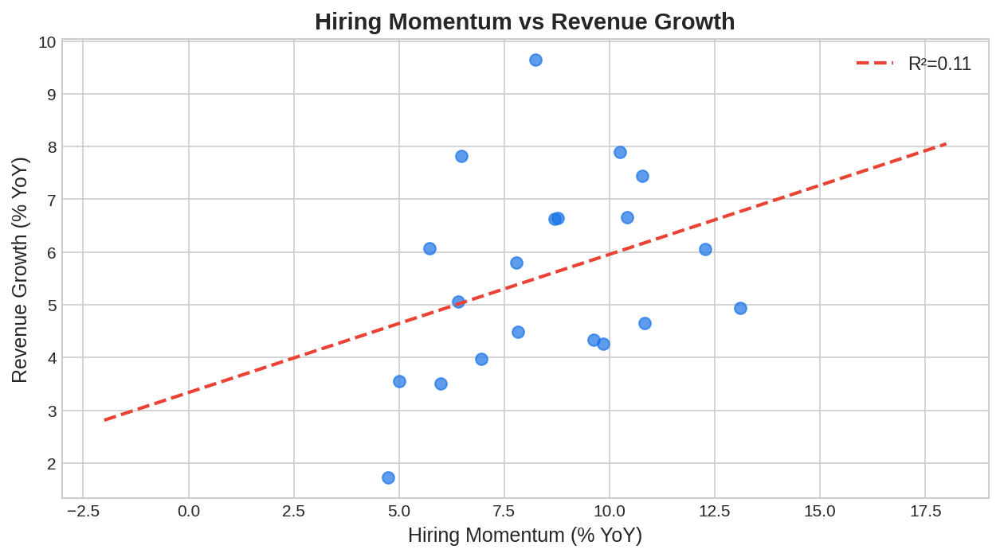

Job posting data is one of the most intuitive [alternative data](https://paperswithbacktest.com/wiki/best-alternative-data) signals for predicting company growth trajectories. When a company ramps up hiring — especially in engineering, sales, and R&D roles — it typically signals expansion, new product launches, or strong demand. Conversely, hiring freezes and layoff announcements indicate trouble. For algo traders, systematic [web scraping](https://paperswithbacktest.com/wiki/web-scraping-algo-trading-python) and analysis of job listings provides a 1–3 month leading indicator on revenue growth and earnings.

## What Is Job Posting Data in Trading?

Job posting data for trading consists of structured records of open positions published by companies on job boards (LinkedIn, Indeed, Glassdoor), company career pages, and specialized platforms. The key metrics are total open positions by company, posting velocity (new jobs per week), role distribution by department, seniority distribution, geographic expansion signals, and time-to-fill (how long positions stay open).

The trading thesis is direct: hiring is a capital allocation decision. Companies invest in headcount when they expect growth. Changes in hiring velocity are a leading indicator because they reflect management's forward-looking expectations.

## How Job Posting Signals Work

### Growth Signal

A sustained increase in job postings — particularly in revenue-generating roles (sales, customer success) and product development (engineering, data science) — correlates with expected revenue acceleration. Studies have shown that a 20%+ year-over-year increase in job postings predicts revenue beats with 60–65% accuracy.

### Contraction Signal

A sudden drop in job postings, removal of previously listed positions, or a shift from growth roles to cost-cutting roles (restructuring, compliance) signals potential earnings disappointment.

### Competitive Intelligence

Comparing hiring patterns across competitors reveals market share shifts. If Company A is aggressively hiring sales representatives in a region where Company B has frozen headcount, it suggests a competitive dynamics shift.


## Key Vendors and Data Sources

| Source | Type | Coverage | Cost |
|---|---|---|---|
| LinkUp | Crawled job boards | US + international, 60K+ companies | $50K–$200K/year |
| Revelio Labs | HR analytics platform | Global, multi-source | $50K–$300K/year |
| Thinknum | Web-scraped job data | US-focused | $30K–$100K/year |
| Burning Glass (Lightcast) | Labor market analytics | Global | Custom pricing |
| Indeed Hiring Lab | Research-grade indices | Public, free | Free (aggregated) |

## Python Implementation: Hiring Momentum Signal

```python
import numpy as np
import pandas as pd

def compute_hiring_momentum(
    job_data: pd.DataFrame,
    ticker: str,
    lookback_weeks: int = 8,
    growth_threshold: float = 0.15
) -> dict:
    """
    Compute hiring momentum signal from job posting counts.
    
    Parameters:
    - job_data: DataFrame with [date, ticker, total_postings, eng_postings, sales_postings]
    - ticker: Company to analyze
    - lookback_weeks: Comparison period
    - growth_threshold: Min YoY growth to trigger bullish signal
    """
    df = job_data[job_data["ticker"] == ticker].sort_values("date")
    
    if len(df) < lookback_weeks * 2:
        return {"signal": "INSUFFICIENT_DATA"}
    
    recent = df.tail(lookback_weeks)
    prior = df.iloc[-(2 * lookback_weeks):-lookback_weeks]
    
    total_growth = (recent["total_postings"].mean() - prior["total_postings"].mean()) / max(prior["total_postings"].mean(), 1)
    eng_growth = (recent["eng_postings"].mean() - prior["eng_postings"].mean()) / max(prior["eng_postings"].mean(), 1)
    sales_growth = (recent["sales_postings"].mean() - prior["sales_postings"].mean()) / max(prior["sales_postings"].mean(), 1)
    
    # Composite score: weight engineering and sales growth higher
    composite = 0.4 * total_growth + 0.35 * eng_growth + 0.25 * sales_growth
    
    return {
        "ticker": ticker,
        "total_posting_growth": f"{total_growth:+.1%}",
        "engineering_growth": f"{eng_growth:+.1%}",
        "sales_growth": f"{sales_growth:+.1%}",
        "composite_score": f"{composite:+.3f}",
        "signal": "LONG" if composite > growth_threshold else "SHORT" if composite < -growth_threshold else "NEUTRAL",
    }

# Simulated data
np.random.seed(42)
dates = pd.date_range("2025-01-01", periods=20, freq="W")
data = pd.DataFrame({
    "date": dates, "ticker": "MSFT",
    "total_postings": np.random.poisson(800, 20) + np.arange(20) * 15,
    "eng_postings": np.random.poisson(250, 20) + np.arange(20) * 8,
    "sales_postings": np.random.poisson(150, 20) + np.arange(20) * 5,
})

result = compute_hiring_momentum(data, "MSFT")
for k, v in result.items():
    print(f"  {k}: {v}")
```



## Advanced Signal: Role Composition Analysis

Beyond total counts, the *type* of hiring reveals strategic direction:

| Role Category | Signal Interpretation |
|---|---|
| Engineering / R&D | Product investment, innovation push |
| Sales / Business Dev | Revenue expansion expected |
| Marketing | Brand investment, new product launch |
| Finance / Compliance | Regulatory preparation, IPO readiness |
| Customer Support | Growing customer base |
| Restructuring / Ops | Cost-cutting, potential contraction |

A company shifting from engineering-heavy to sales-heavy hiring often signals transition from product development to commercialization — a positive revenue inflection.

## Limitations and Risks

**Posting ≠ Hiring**: Companies may post jobs they do not fill (aspirational hiring) or fill positions without public postings (internal promotions, referrals). The signal is directional, not absolute.

**Seasonal patterns**: Many companies have seasonal hiring cycles (campus recruiting in fall, budget-cycle hiring in Q1). Signals must be seasonally adjusted.

**Data lag**: Job postings may remain active for weeks after being filled. Conversely, some positions are unlisted. This creates noise in the raw data.

## Conclusion

Job posting data provides an intuitive, high-signal alternative data source that directly captures management's growth expectations. For algo traders focused on equity long/short strategies, hiring momentum — especially decomposed by role type — offers a 1–3 month leading indicator on revenue growth. Combine with [transaction data](https://paperswithbacktest.com/wiki/credit-card-transaction-data-trading) or [foot traffic](https://paperswithbacktest.com/wiki/geolocation-foot-traffic-trading) for higher-conviction signals.

---

**Explore further on PapersWithBacktest:**
- Browse [backtested growth strategies](https://paperswithbacktest.com/strategies) with Python code and performance metrics
- Access [clean historical market data](https://paperswithbacktest.com/datasets) for equities, crypto, and futures
- Take the [algo trading course](https://paperswithbacktest.com/course) — 60+ video lessons and notebooks
- Related wiki pages: [Web Scraping for Algo Trading](https://paperswithbacktest.com/wiki/web-scraping-algo-trading-python) · [Best Alternative Data Sources](https://paperswithbacktest.com/wiki/best-alternative-data)
