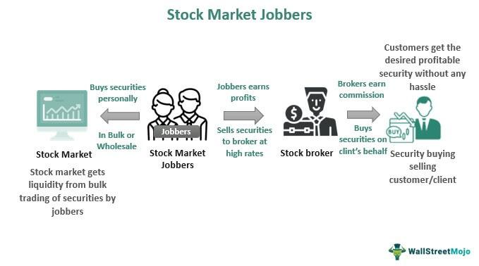

The stock market has undergone significant transformations over the centuries, largely shaped by the needs of the time and the adoption of advancing technologies. Historically, trading practices like stockjobbing played a crucial role in shaping financial markets. Stockjobbing involved individuals known as jobbers, who facilitated trades by buying and holding stock inventories to match buyers and sellers, thereby enhancing market liquidity. This system was instrumental in the functioning of stock markets before the advent of electronic trading.

In contemporary markets, algorithmic trading has emerged as a dominant force, revolutionizing how trades are executed. Unlike the manual processes of stockjobbing, algorithmic trading uses complex computer algorithms to perform trades at speeds and volumes that are unmanageable by human traders. This shift from human-driven trading to automated systems has increased the efficiency and transparency of financial markets. 



Appreciating the evolution from stockjobbing to algorithmic trading provides valuable insights into the sophistication of modern trading strategies. It highlights the continuous advancement and adaptation of financial markets to meet changing demands. Understanding these historical transitions is essential not only to grasp the complexities of today's markets but also to anticipate future developments in trading methodologies.

## Table of Contents

## The Concept and Role of Stockjobbing

Stockjobbing was an integral part of the London Stock Exchange's operations prior to the mid-1980s and played a crucial role in sustaining market liquidity. Stockjobbers, commonly known simply as jobbers, were individuals or firms whose primary function was to hold shares and facilitate the matching of buy and sell orders. This intermediary service was essential for market functionality before the advent of electronic trading systems.

Jobbers operated by holding inventories of stocks and continuously quoting prices for buying and selling. Their presence ensured that there was always a market for shares, thus enabling smoother transactions and reducing the time delay for executing trades. Before the electronic systems took over, this process helped maintain a level of stability and predictability in the market prices of shares, significantly enhancing market efficiency.

In practice, jobbers operated in a manner akin to modern-day market makers. Their dual role as holders and intermediaries of stock lent them a unique position of influence within the market. They profited from the spread between buying and selling prices, necessitating astute market judgment and risk management. By maintaining a ready supply and demand, jobbers ensured that the market remained liquid, facilitating continuous trading activity. This function was particularly beneficial in times of economic uncertainty when market liquidity might otherwise be hampered.

Despite their critical role in market operations, jobbers themselves did not directly deal with the public. Instead, they worked with brokers, who acted on behalf of investors. This distinction allowed jobbers to focus on maintaining tight spreads and consistent prices, while brokers could concentrate on servicing client orders and seeking investment opportunities.

The system of jobbing demonstrated an efficient allocation of trading roles, contributing significantly to the robust infrastructure of the London Stock Exchange during its time. It laid foundational practices that can still be seen in certain aspects of today’s trading landscape, albeit in a more technologically advanced form.

## Historical Context of Jobbing in Finance

The jobbing system in finance has its roots in England's Financial Revolution, which marked a significant period of economic and financial transformation that began in the late 17th century. This era laid the groundwork for modern financial markets by establishing the Bank of England in 1694, promoting public credit, and facilitating large-scale government borrowing. These developments necessitated more sophisticated trading systems and practices, among which was jobbing.

During the 18th and 19th centuries, stockjobbing became an integral part of the London Stock Exchange (LSE). Jobbers played a crucial role as intermediaries who held shares and matched buy and sell orders, thereby enhancing market [liquidity](/wiki/liquidity-risk-premium) and efficiency. This role was vital at a time when electronic trading was non-existent, and all transactions were reliant on personal negotiations and the physical exchange of share certificates. The presence of jobbers in the financial markets helped to smooth price fluctuations and provided a counterparty for trades, which was essential for the healthy functioning of the market.

Legislative changes over these centuries impacted the practice of jobbing. Efforts to regulate and sometimes restrict jobbing were influenced by broader market dynamics and the need to address financial stability. Periodic market disruptions, such as financial panics and asset bubbles, prompted lawmakers to scrutinize the activities of jobbers. Despite these legislative challenges, jobbing became institutionalized, surviving as a crucial component of trading due to its ability to adapt to changing market conditions.

The persistence of jobbing despite regulatory attempts to limit its scope highlights its significance in the trading world before the advent of electronic trading. Jobbers' adaptability and the critical role they played in maintaining market liquidity ensured that they remained a fixture in the financial landscape for decades. Their capacity to align with market demands and legislative requirements underscores how important jobbing was in evolving market structures and operations during this transformative period.

## The Decline of Stockjobbing

The decline of stockjobbing was significantly influenced by the rise of institutional investors in the 20th century. These investors—such as mutual funds, pension funds, and insurance companies—began to dominate the trading landscape by leveraging large pools of capital. Their presence increased market demands for more efficient and transparent trading mechanisms, sidelining the traditional role of jobbers who primarily dealt in smaller, individual transactions.

The pivotal moment came with the 'Big Bang' deregulation on October 27, 1986, in the United Kingdom. This transformative event was characterized by several crucial changes in the financial markets:

1. **Deregulation of Commissions**: Fixed commission charges were abolished, allowing market competition to dictate pricing. This led to lower transaction costs, attracting more private and institutional investors to the market.

2. **Introduction of Electronic Trading**: The move from floor-based trading to electronic systems drastically improved the speed and transparency of market operations. Computer-based systems allowed for quicker execution of trades, diminishing the need for the kind of human judgment and facilitation jobbers provided.

3. **Creation of Dual Capacity**: Firms were allowed to act as both brokers (buying and selling securities for clients) and dealers (trading on their own account), further reducing the reliance on jobbers as dedicated middlemen.

4. **Increased Competition**: With the entry of international banks and new financial institutions, the market dynamics shifted. The traditional jobbing model, which relied heavily on local, specific knowledge and personal connections, could not compete with the global reach and technological prowess of these new entities.

The result of these changes was a seismic shift in trading operations, marking the end of the jobber era and ushering in a new period characterized by more efficient and transparent market practices. The improved access to market information and faster transaction capabilities aligned with the increasing demands for accountability and efficiency from both regulators and investors. This transition laid the groundwork for the development of modern trading techniques, including [algorithmic trading](/wiki/algorithmic-trading), which continues to evolve in today's financial markets. 

The end of jobbing not only represented a structural transformation in market operations but also reflected a broader trend of globalization and digitization within the financial industry. As markets moved towards embracing technology and integration, the need for adaptive and resilient trading strategies became more pronounced, setting the stage for the sophisticated systems and methods used today.

## Emergence of Algorithmic Trading

Algorithmic trading, often referred to as algo trading, emerged as a critical force in the financial markets following the decline of traditional stockjobbing roles. Its development was closely tied to the broader technological advancements that enabled unprecedented speed and precision in executing trades. By utilizing sophisticated computer algorithms, traders could execute buy and sell orders based on a pre-defined set of criteria, thus significantly transforming trading strategies and the market landscape.

The primary advantage of algorithmic trading lies in its ability to process enormous volumes of data at rapid speeds, allowing traders to capitalize on market inefficiencies that are imperceptible to the human eye. These algorithms can analyze multiple markets simultaneously, identify [arbitrage](/wiki/arbitrage) opportunities, and execute orders in fractions of a second, significantly outpacing human capabilities. This shift not only enhanced the efficiency of financial markets but also led to substantial improvements in liquidity and transparency.

A typical algorithmic trading strategy might involve the following steps:

1. **Data Acquisition and Processing:** Gathering real-time and historical market data to identify trading signals.

2. **Signal Generation:** Using mathematical models and statistical techniques to detect trade opportunities. This can include mean reversion, trend following, or arbitrage strategies.

3. **Risk Management:** Implementing measures to manage exposure and potential losses, often through stop-loss orders or position sizing algorithms.

4. **Order Execution:** Sending orders to the market in a manner that minimizes market impact and transaction costs. This often involves breaking large orders into smaller pieces and distributing them across different trading venues.

Given the complexity of financial markets, the algorithms used in trading often employ [machine learning](/wiki/machine-learning) techniques to improve their predictions and enhance strategy performances over time. For instance, advanced algorithms can use supervised learning models to forecast price movements based on labeled historical data, while unsupervised learning can identify patterns or anomalies in the data that may indicate potential trading opportunities.

The rise of algorithmic trading also reflects a broader industry trend towards automation and the utilization of big data analytics. High-frequency trading ([HFT](/wiki/high-frequency-trading-strategies)), a subset of algorithmic trading, exemplifies this trend by focusing on extremely short-term strategies that require minimal human intervention. HFT firms often deploy co-location services, placing their servers close to stock exchange data centers to reduce latency, seeking the smallest competitive edge in execution speed.

Python, among other programming languages, is widely used in developing trading algorithms due to its robust libraries for data analysis, such as Pandas and NumPy, and machine learning frameworks like TensorFlow and scikit-learn. A simple example of a Python function for mean reversion might look like this:

```python
import numpy as np

def mean_reversion_strategy(prices, window):
    moving_avg = prices.rolling(window=window).mean()
    buy_signals = prices < moving_avg
    sell_signals = prices > moving_avg
    return buy_signals, sell_signals
```

In summary, the emergence of algorithmic trading marks a significant evolution in financial markets. By marrying technological advancements with trading strategies, this approach not only enhances the speed and accuracy of trades but also ushers in a new era of market efficiency and complexity. As the use of algorithms continues to expand, traders and institutions must continually iterate and adapt to stay competitive in this rapidly evolving landscape.

## Impact of Historical Practices on Modern Markets

The transition from stockjobbing to algorithmic trading highlights the necessity for continual adaptation in financial markets. Stockjobbing, prevalent in the London Stock Exchange before the mid-1980s, played a critical role in providing market liquidity. Jobbers, as they were known, facilitated trades by holding shares and matching buy and sell orders, thereby acting as intermediaries akin to modern-day market makers. However, as the trading world evolved with technology and institutional investment, the limitations of stockjobbing became apparent. 

The eventual decline of stockjobbing techniques paved the way for the onset of algorithmic trading. Algorithmic trading brought unprecedented speed and efficiency to stock markets, drastically altering trading landscapes and strategies. With computers executing trades based on predefined instructions, trading became significantly more precise and fast. This shift from human-mediated trades to automated processes reflects larger technological advancements and the increasing necessity for speed and accuracy in modern trading practices.

Understanding historical trading methods, such as stockjobbing, can provide valuable insights into the complexities of contemporary markets and the ongoing drive for innovation. These shifts provided a framework for current trading and market-making operations by laying the groundwork that emphasized the need for liquidity and efficient trade execution. The evolution from manual to digital trading mechanisms showcases the capacity for financial markets to integrate new technologies, adapt to evolving market demands, and continually enhance trading efficacy and transparency. 

Ongoing technological advancements suggest that financial markets will continue to evolve, taking cues from past practices while pushing forward into new, sophisticated innovations. As history has shown, adaptation and integration of technology in trading are crucial as markets become ever more complex and interconnected on a global scale.

## Conclusion

The history of stockjobbing and its transformation into today's algorithm-driven markets exemplifies the dynamic nature of financial systems. Stockjobbing, integral to the early stock exchange operations, served as a precursor to more advanced trading mechanisms by providing market liquidity and efficient transaction processing. Jobbers' role in matching buy and sell orders laid the groundwork for the modern market maker's function, a role now significantly enhanced by algorithmic trading technologies.

Algorithmic trading, which employs computer algorithms to execute trades at optimal prices, has introduced unparalleled speed and precision to financial markets. These capabilities have fundamentally altered market structures and trading strategies, responding to the demand for efficiency and innovation. The advent of algo trading is not an isolated phenomenon but a continuation of markets' inherent capacity for evolution and adaptation.

As markets continue to evolve, insights from historical trading practices remain invaluable. They offer a deeper understanding of contemporary financial strategies and underscore the importance of innovation in navigating complex trading environments. The legacy of jobbers reflects a foundational phase of financial evolution, while the rise of algorithms represents the ongoing quest for technological advancement.

Both stockjobbing and algorithmic trading highlight financial markets' ability to change and grow in response to new challenges and opportunities. This adaptability is crucial for sustaining market robustness and ensuring that financial systems remain responsive to future developments. Understanding these historical transitions is essential for guiding modern financial strategies and ensuring continuous improvement in trading practices.

## References & Further Reading

[1]: Michie, R. C. (1999). ["The London Stock Exchange: A History."](https://archive.org/details/londonstockexcha0000mich) Oxford University Press.

[2]: ["Algorithmic Trading: Winning Strategies and Their Rationale"](https://www.amazon.com/Algorithmic-Trading-Winning-Strategies-Rationale-ebook/dp/B00CY5HC0U) by Ernest P. Chan

[3]: Lyons, R. K. (2001). ["The Microstructure Approach to Exchange Rates."](https://direct.mit.edu/books/monograph/2004/The-Microstructure-Approach-to-Exchange-Rates) MIT Press.

[4]: Harris, L. (2003). ["Trading and Exchanges: Market Microstructure for Practitioners."](https://www.amazon.com/Trading-Exchanges-Market-Microstructure-Practitioners/dp/0195144708) Oxford University Press.

[5]: Schwartz, R. A., & Francioni, R. (2004). ["Equity Markets in Action."](https://books.google.com/books/about/Equity_Markets_in_Action.html?id=fPV16sxH8oUC) John Wiley & Sons.