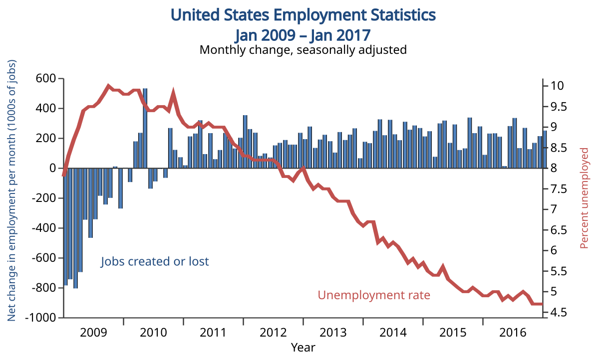

## Table of Contents

## What is jobless growth?

Jobless growth is when a country's economy grows, but it doesn't create more jobs. This means that even though the country is making more money, the number of people working doesn't go up. This can happen because companies might use more machines or technology instead of hiring more people. It can also happen if the jobs that are created are not good ones or if they are only temporary.

This situation can be a problem because it means that even though the economy is doing well, many people might still be out of work. When people don't have jobs, they have less money to spend, which can slow down the economy in the long run. Governments and policymakers often try to find ways to make sure that economic growth also leads to more and better jobs for people.

## How is jobless growth measured?

Jobless growth is measured by looking at two main things: the growth of the economy and the number of jobs. Economists use the Gross Domestic Product (GDP) to see how much the economy is growing. If the GDP goes up, it means the economy is doing better. At the same time, they look at employment numbers to see if more people are getting jobs. If the GDP is going up but the number of jobs is staying the same or going down, that's jobless growth.

To get a clearer picture, economists also look at other things like the unemployment rate, which shows the percentage of people who want to work but can't find a job. They might also look at the types of jobs being created to see if they are good, stable jobs or if they are temporary or low-paying. By comparing all these numbers, they can tell if the growth in the economy is leading to more jobs or if it's jobless growth.

## Can you provide examples of jobless growth in history?

One example of jobless growth happened in the United States during the early 2000s. After the dot-com bubble burst in 2000, the economy started to recover, and GDP began to grow again. However, the number of jobs did not increase at the same rate. Many people were still out of work even though the economy was getting better. This period showed that economic growth did not always mean more jobs for everyone.

Another example can be seen in India during the 2000s and 2010s. India's economy was growing very fast, and it was one of the fastest-growing economies in the world. But, the number of jobs did not grow as quickly. Many young people were graduating from school but could not find good jobs. This led to a lot of frustration because even though the country was doing well economically, many people were still struggling to find work.

## What are the main causes of jobless growth?

One main cause of jobless growth is the use of technology and automation. When companies use more machines and computers, they don't need to hire as many people. This means that even if the company is making more money, it's not creating more jobs. For example, a factory might use robots to make things faster and cheaper, but those robots take the place of workers who used to do those jobs.

Another cause is the type of jobs that are being created. Sometimes, the new jobs that come with economic growth are not good ones. They might be temporary or part-time, or they might not pay well. This means that even though there are more jobs, they don't help people as much as they should. Also, sometimes the jobs that are created are in industries that don't need a lot of workers, like finance or technology, so the overall number of jobs doesn't go up much.

Globalization can also play a role in jobless growth. When companies move their factories to other countries where labor is cheaper, they can make more money, but it means fewer jobs in their home country. This can lead to economic growth without more jobs at home. For example, a company might move its manufacturing to another country to save money, but that means people in the home country lose their jobs.

## How does jobless growth affect the economy?

Jobless growth can hurt the economy in many ways. When people don't have jobs, they don't have money to spend on things like food, clothes, or going out. This means that other businesses make less money because fewer people are buying their products. If businesses make less money, they might not grow or might even close down, which can make the economy even worse. Also, when people are out of work for a long time, they might lose skills and become less able to find good jobs later on, which can keep the economy from growing in the future.

On the other hand, jobless growth can also make the economy seem better than it really is. If the GDP is going up, the government and businesses might think the economy is doing well. But if a lot of people are still out of work, the economy isn't really helping everyone. This can lead to problems like more people needing help from the government, like unemployment benefits, which can cost a lot of money. In the end, jobless growth can make the economy seem healthy on the surface, but it can hide deeper problems that need to be fixed.

## What impact does jobless growth have on unemployment rates?

Jobless growth makes the unemployment rate stay high or even go up. When the economy grows but doesn't create new jobs, people who want to work can't find jobs. This means more people are out of work, so the unemployment rate goes up. The unemployment rate is the percentage of people who want to work but can't find a job, so if the number of jobless people stays the same or goes up, the unemployment rate will reflect that.

This situation can be really tough for people looking for work. They might have to look for jobs for a long time without finding anything. Sometimes, they might have to take jobs that don't pay well or are only temporary. This can make it hard for them to support themselves and their families. When a lot of people are out of work, it can also make the whole economy feel the strain because people have less money to spend on things they need.

## How does jobless growth influence income inequality?

Jobless growth can make income inequality worse. When the economy grows but doesn't create new jobs, people who are already working might get more money because their companies are doing better. But people who are out of work don't get any of that extra money. This means the gap between people who have good jobs and people who don't have jobs gets bigger. The rich get richer, and the poor stay poor or even get poorer.

This situation can lead to big problems in society. When a lot of people don't have jobs and can't make money, they might feel left out and unhappy. This can cause tension and make people feel like the system is unfair. Governments and businesses need to find ways to make sure that when the economy grows, everyone benefits, not just a few people at the top. If they don't, income inequality can keep getting worse, which can hurt the whole country in the long run.

## What are the social consequences of jobless growth?

Jobless growth can make people feel left out and unhappy. When the economy grows but doesn't create new jobs, many people can't find work. This can lead to a lot of stress and worry about money. People might feel like they are not important or that the system is unfair. This can cause tension in society and make people angry or sad. When a lot of people feel this way, it can lead to problems like more crime or even protests.

Another big problem is that jobless growth can make families struggle. If parents can't find jobs, they might not have enough money to take care of their kids. This can mean less food, fewer clothes, and no money for things like school trips or sports. Kids might feel bad about this and it can affect their future. They might not do as well in school or feel hopeful about their own futures. This can create a cycle where one generation's problems lead to more problems for the next generation.

## How do different countries experience jobless growth?

Different countries experience jobless growth in different ways. In the United States, jobless growth has happened when the economy got better after a bad time, like after the dot-com bubble burst in the early 2000s. Even though the economy was growing, many people couldn't find jobs. This made a lot of people feel left out because they didn't see the benefits of the growing economy. In India, jobless growth has been a big problem in the 2000s and 2010s. The country's economy was growing very fast, but not enough good jobs were being created. Many young people finished school but couldn't find work, which made them feel frustrated and unhappy.

In Europe, some countries have also seen jobless growth. For example, after the 2008 financial crisis, many European countries saw their economies start to grow again, but the number of jobs didn't go up as fast. This was especially hard in countries like Greece and Spain, where a lot of young people couldn't find work. In China, jobless growth has been a concern too. Even though the economy has been growing a lot, not all the new jobs are good ones. Many people have to take low-paying or temporary jobs, which doesn't help them as much as they need.

## What policies have been implemented to address jobless growth?

Many countries have tried different policies to deal with jobless growth. One common policy is to invest in education and training programs. This helps people learn new skills that are needed for the jobs that are being created. For example, if a country is growing in technology, the government might offer classes to teach people how to code or use new technology. This can help more people get good jobs and make the economy grow in a way that benefits everyone.

Another policy is to create jobs directly through government projects. This can mean building new roads, schools, or hospitals. By doing this, the government can create jobs right away and help the economy grow in a way that includes more people. Some countries also try to help small businesses grow by giving them loans or other support. This can lead to more jobs because small businesses often hire more people when they get bigger.

Lastly, some countries try to change their laws to make it easier for people to find work. This can mean making it easier for companies to hire people or changing rules about how long people can work. By doing this, the government hopes to make more jobs available and help the economy grow in a way that creates jobs for everyone. These policies can help make sure that when the economy grows, more people can find work and feel the benefits.

## How effective are these policies in mitigating the impacts of jobless growth?

The effectiveness of policies to address jobless growth can vary a lot. Education and training programs can help people learn new skills, which can lead to better jobs. But these programs need to match the jobs that are actually available. If the skills people learn don't match the jobs that companies need, then the programs won't help much. Also, these programs can take a long time to show results, so they might not help people who need jobs right away.

Government projects that create jobs directly can be more immediate. Building new roads or schools can give people jobs quickly and help the economy grow in a way that includes more people. But these projects can be expensive, and the jobs they create might not last long. If the projects stop, the jobs might go away too. So, while these projects can help in the short term, they might not solve the problem of jobless growth in the long run.

Helping small businesses grow can also be a good way to create more jobs. When small businesses get bigger, they often hire more people. But this can be hard to do because small businesses might need a lot of help to grow. Changing laws to make it easier for companies to hire people can help too, but it needs to be done carefully. If the laws change too much, it might hurt workers in other ways. Overall, these policies can help, but they need to be used together and in the right way to really make a difference.

## What are the future predictions regarding jobless growth and its potential impacts?

In the future, jobless growth might become a bigger problem because of technology and automation. More and more jobs could be done by machines and computers, which means fewer jobs for people. This could make it harder for people to find work, even if the economy is growing. Countries that rely a lot on technology might see this happen more than others. If this happens, it could lead to more people feeling left out and unhappy because they can't find good jobs.

To deal with this, governments and businesses might need to find new ways to create jobs. They could focus on industries that need more people, like health care or education. They might also need to help people learn new skills so they can do jobs that machines can't do. If they don't do this, jobless growth could make income inequality worse and cause more problems in society. People might feel more frustrated and angry if they see the economy growing but they don't benefit from it.

## References & Further Reading

[1]: Autor, D. H., Levy, F., & Murnane, R. J. (2003). ["The Skill Content of Recent Technological Change: An Empirical Exploration."](https://economics.mit.edu/sites/default/files/publications/the%20skill%20content%202003.pdf) The Quarterly Journal of Economics.

[2]: Brynjolfsson, E., & McAfee, A. (2011). ["Race Against the Machine: How the Digital Revolution is Accelerating Innovation, Driving Productivity, and Irreversibly Transforming Employment and the Economy."](https://www.semanticscholar.org/paper/Race-against-the-machine-:-how-the-digital-is-and-Brynjolfsson-McAfee/03a7a46c0ac38f1409a85c60e4395dabfef35f57) Digital Frontier Press.

[3]: Chiu, J., Koole, R., & Yang, J. J. (2012). ["Volatility in High-Frequency Trading."](https://www.sciencedirect.com/science/article/pii/S105905602100068X) Working paper.

[4]: "Flash Boys: A Wall Street Revolt" by Michael Lewis (2014).

[5]: Krugman, P. (1994). ["Past and Prospective Causes of High Unemployment."](https://www.kansascityfed.org/documents/3678/1994-S94KRUGM.pdf) Brookings Papers on Economic Activity.

[6]: Thomas, L., & Waters, A. (2020). ["The Rise of Financial Machines: Algorithmic Trading in the Global Financial Markets."](https://www.sciencedirect.com/science/article/pii/S0957417422006479) Routledge.