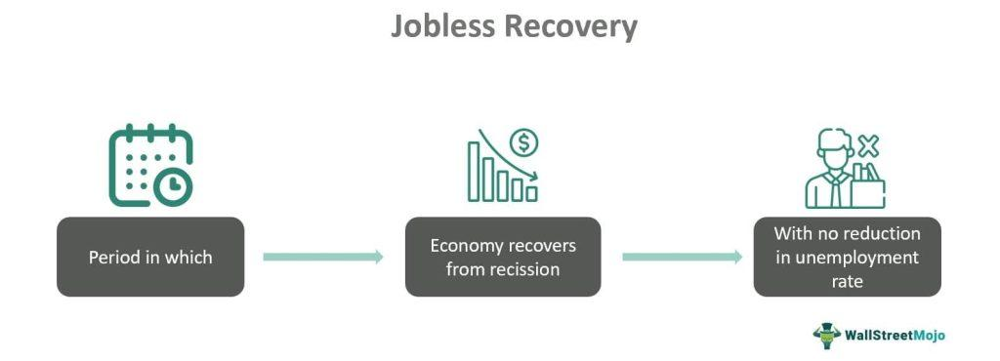

Economic recovery is a critical and multifaceted process that follows a recession, marked by efforts to restore and enhance economic activities to pre-recession levels. This phase involves a gradual increase in production, consumer spending, and investment, which are indicators of returning economic stability. However, this recovery can be complicated by the phenomenon known as a jobless recovery, where economic growth is not accompanied by an increase in employment opportunities. In such scenarios, businesses may focus on improving productivity and profit margins through cost-cutting strategies, often at the expense of hiring new employees. This leads to prolonged high unemployment rates even as the economy begins to recover.

This article explores the intricacies of jobless recovery and its broader implications on unemployment and economic growth. Understanding why employment levels do not immediately rebound with economic growth offers insights into policy measures that could address joblessness during recovery periods. Moreover, we examine the impact of algorithmic trading within the economic landscape. This modern trading approach, which leverages computer algorithms to make trading decisions at speeds and accuracies beyond human capabilities, plays a significant role in shaping market dynamics. Its influence on economic recovery highlights the need for effective regulatory frameworks to ensure that the benefits of increased market efficiency do not come at the expense of market stability and fairness.

By examining these interconnected elements, the article aims to provide a comprehensive understanding of economic recovery, highlighting the challenges and opportunities presented by jobless recovery and the transformative role of technology in modern financial markets.

## Table of Contents

## Understanding Economic Recovery

Economic recovery is the process where an economy undergoes transformation to regain its health and stability following a recession. A recession is characterized by a significant decline in economic activity, visible across measures such as GDP, income, employment, manufacturing, and wholesale-retail trade. The recovery phase marks the end of this downturn as economic activities appropriately resume their normal [course](/wiki/best-algorithmic-trading-courses).

Key indicators of economic recovery include the rise in Gross Domestic Product (GDP), which reflects the total market value of all final goods and services produced. An upward trajectory in GDP indicates that an economy is expanding, signifying recovery. Additionally, an increase in consumer spending is a crucial marker, as it suggests improved consumer confidence and financial stability. As households begin to spend more on goods and services, businesses can respond with higher production levels and hire more workers, bolstering economic growth.

Investment from businesses is another indicator of economic recovery. Companies that increase capital expenditures on infrastructure, technology, and equipment typically reflect optimism about future economic conditions. Such investments are critical for enhancing productivity and long-term economic stability.

Nevertheless, one significant complication that can arise during economic recovery is a jobless recovery. This occurs when the economy begins to rebound, but employment does not follow the same positive trajectory. Companies may adopt cost-cutting measures such as automation or outsourcing, leading them to delay rehiring or to expand their workforce at a slower rate. As a result, unemployment rates may remain high, even though other indicators suggest the economy is recovering.

In summary, while economic recovery is a sign of returning economic stability, the persistence of high unemployment rates during a jobless recovery can present challenges. Recognizing the distinction between GDP growth and employment improvements is crucial for understanding the comprehensive health of an economy post-recession.

## What is Jobless Recovery?

A jobless recovery occurs when an economy experiences growth following a recession, but this growth is not accompanied by a significant increase in employment opportunities. During such recoveries, key economic indicators, such as GDP, may show improvement, yet unemployment rates remain stubbornly high. This situation frequently arises because companies, in an effort to survive the recession, implement stringent cost-cutting measures. These measures often include workforce reductions and increased reliance on technology to maintain productivity with fewer employees.

Post-recession, many businesses are hesitant to rehire or add new positions despite experiencing revenue growth. This cautious approach is driven by the intent to maximize efficiency and minimize costs, helping to strengthen company balance sheets after the strain of an economic downturn. Consequently, the labor market lags behind economic recovery, leaving many workers unemployed or underemployed.

Understanding the underlying causes of a jobless recovery is essential for formulating strategies to combat unemployment during economic recovery phases. Factors contributing to this scenario often involve shifts in business practices and the broader economic landscape that occur during downturns. By identifying these shifts, policymakers and businesses can develop targeted interventions that encourage job creation and reduce the lag between economic growth and employment.

## Factors Contributing to Jobless Recovery

Investment in automation and outsourcing are pivotal factors contributing to a jobless recovery. In periods following a recession, businesses often adopt these strategies to enhance efficiency and reduce operational costs. Automation, the process of using technology to perform tasks that previously required human intervention, can lead to significant cost savings. However, it also results in fewer employment opportunities as machines or software take over functions traditionally performed by workers. This trend is evident in the rise of industries such as manufacturing and logistics, where robotics and AI have been integrated to optimize production processes.

Outsourcing, referring to the business practice of contracting out specific operations or services to external entities often located in regions with lower labor costs, further intensifies the issue. During economic downturns, companies may lay off workers and, upon recovery, opt to outsource these roles as a cost-effective alternative to rehiring domestically. This shift not only affects the local job market but also contributes to a global distribution of labor that may disadvantage countries with higher labor costs.

Global competition amplifies these strategies, as companies strive to maintain a competitive edge in increasingly interconnected markets. The pressure to deliver products and services efficiently at lower costs encourages firms to embrace automation and outsourcing, which although beneficial for business profitability, often results in sustained high levels of unemployment domestically. Consequently, while economic indicators such as GDP growth may signal recovery, the lack of job creation remains a critical challenge, underscoring the complex relationship between technological advancement, globalization, and local employment landscapes.

## Economic Impacts of Jobless Recovery

A jobless recovery occurs when economic growth resumes following a recession, but the unemployment rate remains stagnant or improves only marginally. This phenomenon has significant economic impacts, particularly concerning income distribution and long-term economic stability.

When an economy experiences a jobless recovery, the Gross Domestic Product (GDP) may show an upward trend, indicating growth. However, this growth does not translate into proportional improvements in employment levels. As businesses focus on efficiency and cost management, they may choose not to increase their workforce, often resorting to automation and outsourcing to maintain productivity. This disconnect between economic output and employment can exacerbate income inequality. Higher GDP levels might benefit capital owners and investors, while the lack of job creation leaves many individuals with stagnant or reduced incomes.

The persistence of high unemployment rates can lead to wider economic disparities. A rising GDP with unchanged employment levels means that economic gains are not evenly distributed, leading to a concentration of wealth among a small segment of the population. In such scenarios, individuals who are unemployed or underemployed see little to no improvement in their financial situations, while those with investments or assets benefit from the upturn in economic activities. This disparity can be represented by metrics such as the Gini coefficient, which measures income inequality within a population. An increasing Gini coefficient during a jobless recovery signals growing inequality.

Economic stability is also compromised when individuals do not experience income growth. Stable consumer spending is crucial for sustainable economic growth, and consumer confidence often hinges on job security and income prospects. When individuals face prolonged unemployment or underemployment, they are likely to cut back on spending, which in turn dampens demand for goods and services. This reduction in consumer demand can stymie further economic growth, creating a cycle of stagnation.

Additionally, the social implications of jobless recoveries can be profound. Widespread unemployment and underemployment can lead to social unrest, as frustration grows among those who do not benefit from economic recovery. This unrest can manifest in various forms, from protests to increased crime rates, further destabilizing the socio-economic landscape.

In summary, while a jobless recovery may reflect positive GDP growth, it poses challenges by not addressing unemployment, thereby widening economic disparities and hindering sustainable growth. Addressing these issues through policy interventions aimed at job creation and equitable growth is essential to ensure long-term economic stability and social harmony.

## Algorithmic Trading: A Modern Economic Tool

Algorithmic trading employs computer algorithms to perform trades based on pre-defined parameters like timing, price, and [volume](/wiki/volume-trading-strategy). These algorithms can rapidly analyze large datasets and execute orders far faster than human traders. The implementation of [algorithmic trading](/wiki/algorithmic-trading) has significantly transformed financial markets, primarily by enhancing market efficiency and [liquidity](/wiki/liquidity-risk-premium).

The efficiency gains occur because algorithmic trading allows for the quick processing of information and the execution of trades, minimizing reaction time to market changes. By reducing the time between receiving new information and executing a trade, algorithmic trading reduces bid-ask spreads and lowers transaction costs, ultimately benefiting market participants through more favorable pricing. Furthermore, liquidity in financial markets has improved as algorithms can place trades at any time, reducing the cost of adverse selection and increasing the available quantity for trading.

Despite these advantages, algorithmic trading also brings concerns regarding market stability and fairness. Market stability issues arise due to the high speed and volume of trades that algorithms can execute. In instances where algorithms react to market cues in concert, they may cause excessive [volatility](/wiki/volatility-trading-strategies) or "flash crashes," wherein a rapid drop in prices is followed by an equally swift recovery. The flash crash of May 6, 2010, serves as a prominent example of such an incident, highlighting the potential risks to systemic stability due to algorithmic activity.

Moreover, the fairness of markets can be questioned as algorithmic trading may disadvantage manual or slower traders. Techniques like high-frequency trading ([HFT](/wiki/high-frequency-trading-strategies)), which involve executing a large number of orders at extremely high speeds, can prevent traditional traders from accessing the best prices available. This could potentially lead to a less equitable trading environment.

To mitigate these issues, regulatory measures have been implemented in various markets worldwide. For example, circuit breakers are employed to halt trading during periods of extreme volatility, providing a buffer to slow down rapid market movements. Additionally, some exchanges enforce time delays or randomize trade times to level the playing field between algorithmic and traditional traders.

In conclusion, while algorithmic trading enhances efficiency and liquidity, its potential impact on market stability and fairness necessitates careful regulation. Such measures are critical to ensuring that the benefits of algorithmic advancements do not come at the cost of equitable and stable market conditions.

## Interplay between Algo Trading and Economic Recovery

Algorithmic trading, a sophisticated technique employing computer algorithms to execute trades at high speed and volume, plays a critical role in economic recovery by enhancing liquidity and stability in financial markets. Enhanced liquidity is vital in ensuring that markets function smoothly, as it facilitates the quick buying and selling of assets with minimal impact on prices. This liquidity injection is particularly beneficial during recovery phases, as it attracts more investments and restores confidence among market participants. Increased market activity due to algorithmic trading can help signal economic vitality, drawing in both domestic and international investors.

Moreover, algorithmic trading elevates market stability by reducing bid-ask spreads and improving price efficiency. By processing vast amounts of information and executing trades in fractions of a second, algorithms can swiftly react to market changes, smoothing out volatility that might otherwise destabilize the market. This function is crucial in turbulent recovery periods when markets are vulnerable to abrupt changes in investor sentiment.

However, the impact of algorithmic trading extends beyond domestic economies, influencing global market dynamics. Because these algorithms can operate continuously across different time zones, they facilitate market linkages that drive cross-border capital flows. While this interconnection provides more robust global economic engagement, it also poses challenges. National recovery efforts can be complicated by external shocks transmitted through these interconnected trading systems, necessitating effective international cooperation and regulation.

To harness the benefits of algorithmic trading while managing its risks, it is essential to understand its interaction with economic recovery thoroughly. Policymakers must develop supportive economic policies that balance technological innovation with regulatory safeguards to ensure algorithmic trading aligns with long-term recovery goals. These policies might include setting circuit breakers to prevent flash crashes or implementing rules that promote transparency in high-frequency trading practices. By navigating these complexities, economic policies can leverage the advantages of algorithmic trading while mitigating potential disruptions, thereby fostering a more resilient post-recession recovery.

## Conclusion

Economic recovery following a recession presents several challenges, with jobless recovery being a significant hurdle. This phenomenon highlights the disparity between economic growth and employment rates, where GDP may rise while job creation lags behind. Addressing this issue necessitates a multifaceted approach involving both technological advancements and sound policy-making.

One strategy to mitigate the effects of jobless recovery involves leveraging technology to create new employment opportunities. This can be achieved by investing in sectors that drive innovation and require human skills, thus complementing technological advancements rather than replacing them. Moreover, workforce development programs can play a crucial role in equipping individuals with the skills needed to thrive in a changing job market, thereby bridging the gap between available jobs and qualified candidates.

Policy interventions are equally important in sustaining economic growth during recovery periods. Governments may consider implementing fiscal and monetary policies that stimulate job creation and support businesses in hiring more workers. For example, tax incentives for companies that expand their workforce or invest in employee training can be effective measures. Furthermore, policies aimed at enhancing social safety nets can offer a buffer for those disproportionately affected by a jobless recovery, ultimately promoting economic inclusivity.

Algorithmic trading has become an integral part of modern financial markets, providing benefits such as increased market efficiency and liquidity. However, its rapid evolution necessitates regulatory oversight to ensure it contributes positively to economic recovery. Unregulated algorithmic trading can potentially lead to market disruptions, undermining confidence and stability. Therefore, careful regulation is required to balance the benefits of algorithmic trading with its potential risks, ensuring it aligns with broader economic objectives.

In summary, the path to a robust economic recovery involves addressing jobless recovery through a combination of technology-driven job creation and strategic policy-making. Meanwhile, maintaining the benefits of algorithmic trading demands meticulous oversight to safeguard market stability and support sustainable growth. These efforts collectively can foster a more resilient economy that equitably benefits all participants.

## References & Further Reading

[1]: Fischer, T. (2018). ["A Multi-Agent Based Model of an Order-Driven Financial Market."](https://link.springer.com/chapter/10.1007/978-3-031-77367-9_9) Information Sciences.

[2]: Harari, D. (2014). ["Economic Indicators: GDP and UNEMPLOYMENT RATE."](https://www.stlouisfed.org/~/media/education/tools/pdf/ea-tools-for-teaching-session-8.pdf?la=en) House of Commons Library.

[3]: Jaimovich, N., & Siu, H. E. (2012). ["The Trend is the Cycle: Job Polarization and Jobless Recoveries."](https://www.nber.org/papers/w18334) National Bureau of Economic Research.

[4]: Kahle, K. M., Stulz, R. M. (2013). ["Access to Capital, Investment, and the Financial Crisis."](https://www.sciencedirect.com/science/article/pii/S0304405X13000573) The Journal of Finance.

[5]: Lepetit, L., Nys, E. (2018). ["Recent Developments in the Literature on Credit Policy, Credit Risk and Financial Regulation."](https://hal.science/hal-01098960/file/Lepetit-et-al-JBF1.pdf) Journal of Financial Services Research.