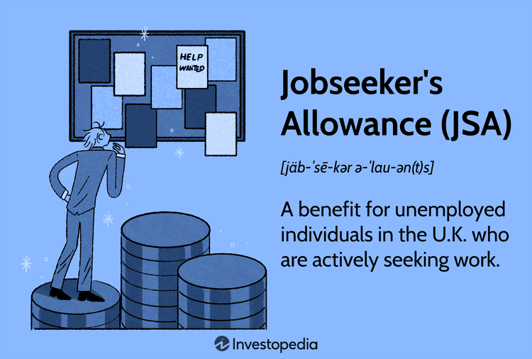

The Jobseeker's Allowance (JSA) is an essential component of the United Kingdom's social welfare system, designed to provide financial assistance to those who find themselves without employment but are actively seeking work. By offering monetary support, JSA alleviates some of the financial burdens individuals face during periods of unemployment, thereby serving as a temporary safety net. This article aims to provide a comprehensive overview of the different types of JSA available, alongside their respective eligibility criteria. 

Understanding the nuances of JSA is vital for those seeking clarity on what support they can receive while job hunting. Furthermore, we will explore the field of algorithmic trading, which presents an intriguing opportunity for those receiving JSA. As an innovative form of trading that uses computer programs to execute trades based on predetermined criteria, algorithmic trading offers a pathway for individuals to interact with financial markets, potentially paving the way to new career prospects. 



Combining a clear understanding of JSA with knowledge about algorithmic trading can empower individuals to navigate their financial pursuits more effectively. This exploration is not merely academic; it offers practical tools and strategies for enhancing one's financial stability and employment prospects during challenging times.

## Table of Contents

## Understanding Jobseeker's Allowance (JSA)

Jobseeker's Allowance (JSA) is a financial benefit in the United Kingdom aimed at supporting residents who are unemployed but actively seeking work. This benefit plays a crucial role in mitigating the cost of living for individuals during their job search periods. To qualify for JSA, applicants must meet certain continuous eligibility requirements, including demonstrating genuine efforts to secure employment. This typically involves attending regular meetings at Jobcentre Plus, the government agency that assists with employment and claims processing.

Applicants are expected to maintain an active job-searching status throughout the duration of their claim, documenting their efforts to find work. This process is often referred to as "signing on," where claimants periodically report and verify their job-seeking activities. This system ensures that the benefit is directed towards those who are genuinely committed to re-entering the workforce.

The history of JSA can be traced back to early unemployment benefit schemes in the 20th century, reflecting a long-standing commitment to providing temporary support to those facing joblessness. These schemes have evolved over time to accommodate changing economic conditions and labor market demands, culminating in the current form of JSA, which blends conditional support with active job-seeking requirements. By continually adjusting its framework, JSA remains a vital component of the UK’s social protection landscape, helping to stabilize the economic situation of job seekers.

## Types of Jobseeker's Allowance

Jobseeker's Allowance (JSA) in the United Kingdom is a financial benefit meant to assist individuals who are actively seeking employment. It comes in three primary forms: New Style JSA, Contribution-Based JSA, and Income-Based JSA. Each type caters to distinct groups of individuals, based on their recent work history, financial situation, and National Insurance Contributions.

### New Style JSA

New Style JSA is designed for individuals who have recently contributed to the National Insurance system. Specifically, eligibility requires that claimants have paid sufficient National Insurance Contributions in the two tax years preceding their application year. This type of JSA is not means-tested, which means the claimant's household income and savings do not affect eligibility or payment amounts. This is especially beneficial for those who have been working consistently before encountering unemployment, allowing them to receive support based on their previous contributions.

### Contribution-Based JSA

Contrary to what might be assumed, Contribution-Based JSA is not directly related to disability. The reference in the prompt to severe disability premiums appears to be inaccurate. Instead, Contribution-Based JSA generally refers to the criteria and framework of previous JSA systems and was often linked with considerations of National Insurance Contributions. This form of allowance ensures that individuals who have paid enough National Insurance Contributions but have not yet found new employment receive financial assistance. Nonetheless, it is becoming increasingly synonymous with New Style JSA under most recent guidance.

### Income-Based JSA

Income-Based JSA caters to those with a minimal employment history and specific financial conditions. This form of JSA is means-tested, meaning claimants must disclose their savings and household income as part of the application process. It is targeted at individuals who do not qualify for New Style JSA, possibly due to insufficient National Insurance Contributions. Income-Based JSA ensures that those lacking a stable job history can still receive support, provided they meet the financial need criteria assessed through a detailed review of their current financial standing.

In summary, the three types of JSA provide a structured approach to supporting individuals facing unemployment, with each type focusing on different eligibility criteria related to National Insurance Contributions and current financial circumstances. Understanding these distinctions can guide applicants in choosing the right form of JSA for their situation.

## Eligibility Criteria for JSA

Eligibility for Jobseeker's Allowance (JSA) is contingent upon several specific criteria designed to ensure support is directed towards individuals genuinely seeking employment. Primarily, claimants must be residents of the United Kingdom. This requirement underscores the territorial nature of the benefit, aligning with other residence-based entitlements within the UK's social security system.

Another crucial criterion is that claimants must be actively seeking work. This typically involves maintaining a visible commitment to finding employment, which includes preparing for potential employment opportunities, attending interviews, and registering with recruitment agencies. To demonstrate active job-seeking, claimants are expected to draft and follow a personalized 'Claimant Commitment.' This document outlines the steps they will take to gain employment, which is discussed and regularly updated with a work coach at the local Jobcentre Plus office. Failure to adhere to this commitment can result in sanctions, impacting the claimant's benefit payments.

Regarding work restrictions, individuals are not eligible for JSA if they are employed for 16 or more hours per week. The rationale here is that JSA aims to support those who are mostly, if not entirely, out of work. However, claimants may still engage in part-time work, provided it does not exceed this threshold. The income from such work is partially disregarded in calculating JSA entitlements, which means it can influence the amount paid.

For young claimants under the age of 18, the pathway to JSA is more restricted. Generally, JSA is targeted at those aged 18 or over due to the expectation that younger individuals will be engaged in education or training. However, exceptions exist, such as for those who are estranged from their families or living independently and unable to be supported by their parents or guardians.

An additional significant aspect of maintaining eligibility is the requirement for regular meetings with Jobcentre Plus. These meetings are critical to the JSA process, as they are opportunities for work coaches to assess the claimant's job search activities and offer support. Claimants are usually expected to meet with their work coaches every two weeks, although the frequency can vary based on individual circumstances.

In summary, the eligibility criteria for JSA hinge on residency, active job-seeking behavior, and limited weekly work hours, with special provisions for younger individuals and a structured engagement with Jobcentre Plus. These criteria ensure that JSA supports those who are genuinely in need while encouraging a proactive approach to returning to employment.

 to Algorithmic Trading

Algorithmic trading represents a sophisticated intersection of finance and technology where computer programs are employed to execute trades with precision and speed unattainable by human traders. The core of [algorithmic trading](/wiki/algorithmic-trading) lies in its ability to leverage mathematical models and statistical analyses to make data-driven decisions, offering substantial advantages in the fast-paced financial markets. These programs work by processing pre-set instructions that define variables such as timing, price, or quantity; trades are then executed once these conditions are met.

To engage with algorithmic trading, individuals, including those receiving Jobseeker's Allowance (JSA), can start by acquiring foundational knowledge in programming and financial markets. Python is a popular language due to its simplicity and vast array of libraries that support data analysis, such as Pandas and NumPy. An introductory Python script for algorithmic trading might include fetching historical stock data, analyzing trends, and executing a simple buy/sell strategy. For example:

```python
import pandas as pd
import numpy as np
import yfinance as yf  # For more datasets, visit: https://paperswithbacktest.com/datasets

# Fetching historical data
data = yf.download('AAPL', start='2020-01-01', end='2023-01-01')

# Simple moving average strategy
short_window = 40
long_window = 100

signals = pd.DataFrame(index=data.index)
signals['signal'] = 0.0

signals['short_mavg'] = data['Close'].rolling(window=short_window, min_periods=1, center=False).mean()
signals['long_mavg'] = data['Close'].rolling(window=long_window, min_periods=1, center=False).mean()

signals['signal'][short_window:] = np.where(signals['short_mavg'][short_window:] 
                                             > signals['long_mavg'][short_window:], 1.0, 0.0)   

signals['positions'] = signals['signal'].diff()

# Display signals
print(signals.tail())
```

For unemployed individuals, algorithmic trading provides a pathway to acquire new technical skills that can be advantageous during job searches. Engaging in online courses, tutorials, and virtual trading platforms can provide essential learning opportunities without significant financial risk. This approach not only enhances employability by developing sought-after skills in both programming and financial analysis but also offers a deeper understanding of market dynamics, potentially opening doors to new career paths.

It is crucial to approach algorithmic trading with caution, especially when considering the financial risks involved. Those undertaking this initiative should ensure it complements their active job-seeking obligations and does not jeopardize their financial stability. Learning should be approached incrementally, with a focus on education and simulated trading before committing any real capital to the market. This prudent approach allows for skill acquisition while maintaining economic prudence.

## The Intersection of JSA Benefits and Algo Trading

Exploring algorithmic trading can open new avenues for recipients of Jobseeker's Allowance (JSA) by offering valuable insights into financial markets and trading strategies. However, embarking on this journey demands a careful balance between fulfilling JSA obligations and engaging in potentially beneficial yet risky endeavors like trading.

Algorithmic trading automates the process of executing trades using sophisticated mathematical models derived from historical and real-time market data. For beginners, platforms such as QuantConnect and Alpaca offer accessible entry points into algorithmic trading by enabling practice and [backtesting](/wiki/backtesting) without financial risk. Engaging with these platforms provides unemployed individuals with the opportunity to develop market-oriented skills, which can be useful for future employment in the financial sector.

While exploring algorithmic trading, it is essential for JSA recipients to continue meeting the program's requirements. This includes attending regular meetings with Jobcentre Plus advisors, actively seeking employment, and accepting reasonable job offers. Non-compliance with these conditions may result in the suspension or termination of JSA benefits.

Furthermore, algorithmic trading involves inherent risks due to market [volatility](/wiki/volatility-trading-strategies) and the complexity of trading algorithms. For individuals relying on JSA, whose primary focus remains to secure employment, it is crucial that financial risks undertaken in trading do not compromise their economic stability. Adopting a cautious approach allows for the exploration of algorithmic trading while safeguarding immediate financial needs. It is advisable to conduct thorough research, engage in education through online courses, and initially utilize demo accounts before committing actual funds to trading activity.

For those with a strong interest in financial markets, algorithmic trading can serve as an additional skill to enhance long-term career prospects. By leveraging data analytics and coding skills, individuals can discover opportunities in quantitative finance, propelling them towards sustainable employment solutions. However, strategic and well-informed decisions are paramount to ensuring such pursuits complement rather than undermine the objectives of the JSA support framework.

## Conclusion

The Jobseeker's Allowance (JSA) plays an indispensable role in supporting individuals during periods of unemployment, ensuring they remain active in seeking employment. By providing a financial cushion, JSA enables job seekers to focus on reintegrating into the workforce without the immediate pressure of financial distress. This support system encourages continuous engagement with job markets, ensuring individuals are equipped to seize employment opportunities as they arise.

On the other hand, algorithmic trading offers an innovative avenue for engaging with financial markets. For individuals receiving JSA, acquiring skills in algorithmic trading could present new career opportunities and alternative income streams. Algorithmic trading involves the use of computer algorithms to automate trading processes based on predefined criteria, which can be a valuable skill in today's digital economy.

Integrating knowledge of JSA with skills in algorithmic trading can better prepare individuals for a stable financial future. As they explore financial markets, job seekers must balance their obligations under JSA with any trading activities to avoid compromising their immediate economic stability. Through understanding both these domains, individuals can navigate their financial prospects with increased confidence and readiness to transition into stable employment.

## References & Further Reading

[1]: ["Universal Credit and Jobseeker’s Allowance (JSA): Applications and Eligibility"](https://www.gov.uk/jobseekers-allowance/eligibility) - UK Government Official Site

[2]: Jha, M. (2017). ["Algorithmic Trading: Winning Strategies and Their Rationale"](https://books.google.com/books/about/Algorithmic_Trading.html?id=WAlFDwAAQBAJ) by Ernie Chan

[3]: Narang, R. (2013). ["Inside the Black Box: The Simple Truth About Quantitative Trading"](https://onlinelibrary.wiley.com/doi/book/10.1002/9781118267738) by Rishi K. Narang

[4]: ["Jobseeker’s Allowance (JSA): A Historical Overview"](https://www.nationalarchives.gov.uk/pathways/citizenship/brave_new_world/welfare.htm) - The National Archives

[5]: ["Algorithmic and High-Frequency Trading"](https://www.cambridge.org/us/universitypress/subjects/mathematics/mathematical-finance/algorithmic-and-high-frequency-trading) by Álvaro Cartea, Sebastian Jaimungal, and José Penalva

[6]: ["Introduction to the Mathematics of Finance"](https://www.academia.edu/21662305/Introduction_to_the_Mathematics_of_Finance) by Steven Roman

[7]: ["Python for Finance: Analyze Big Financial Data"](https://archive.org/details/pythonforfinance0000hilp) by Yves Hilpisch