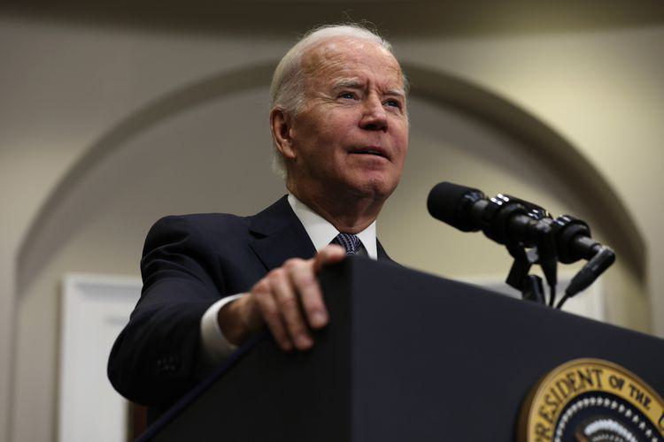

## Table of Contents

## What are the main goals of Joe Biden's economic policy?

Joe Biden's economic policy focuses on helping working families and making the economy more fair. He wants to create good jobs, raise wages, and make sure everyone has a chance to succeed. Biden believes in investing in things like infrastructure, education, and technology to grow the economy from the middle out, not just from the top down. This means he wants to help the middle class and those below it, rather than just the rich.

Another big part of Biden's plan is to make healthcare more affordable and accessible. He wants to lower the cost of prescription drugs and expand health coverage so more people can get the care they need. Biden also cares about fighting climate change and creating green jobs. He wants to move the country towards clean energy and protect the environment while also creating new job opportunities in this growing field. Overall, Biden's economic policy aims to build a stronger, more inclusive economy that works for everyone.

## How does Biden's economic plan aim to address income inequality?

Joe Biden's economic plan aims to address income inequality by focusing on helping working families and raising wages. He believes that by investing in things like infrastructure, education, and technology, more good jobs will be created, which will help people earn more money. Biden wants to make sure that the economy grows from the middle out, not just from the top down. This means he wants to help the middle class and those below it, rather than just the rich. By doing this, he hopes to reduce the gap between the wealthy and everyone else.

Another way Biden plans to tackle income inequality is by making healthcare more affordable and accessible. High healthcare costs can be a big burden for many families, and by lowering these costs and expanding health coverage, more people will have money left over for other needs. Biden also wants to raise the minimum wage, which would help low-income workers earn more and improve their standard of living. Overall, Biden's approach is about creating a fairer economy where everyone has a chance to succeed and where the benefits of economic growth are shared more evenly.

## What specific measures has Biden proposed to stimulate economic growth?

Joe Biden has proposed several measures to stimulate economic growth. One key plan is to invest a lot of money in infrastructure, like roads, bridges, and high-speed internet. This will create jobs for construction workers and others, and it will also make it easier for businesses to operate and grow. Biden also wants to spend money on education and training, so people can learn new skills and get better jobs. He believes that by helping people get good jobs, the economy will grow stronger.

Another part of Biden's plan is to make healthcare more affordable and expand coverage. When people don't have to worry so much about healthcare costs, they can spend more money on other things, which helps the economy. Biden also wants to raise the minimum wage, which would give low-income workers more money to spend. He believes in fighting climate change by investing in clean energy, which can create new jobs in areas like wind and solar power. Overall, Biden's approach is to help the middle class and those below it, so everyone can share in economic growth.

## How does Biden's infrastructure plan fit into his broader economic strategy?

Joe Biden's infrastructure plan is a big part of his overall economic strategy. He wants to spend a lot of money on things like roads, bridges, and high-speed internet. This will create jobs for construction workers and others. When people have good jobs, they can spend more money, which helps the economy grow. Biden believes that by fixing and building new infrastructure, businesses will find it easier to operate and grow, which will help the whole economy.

The infrastructure plan also fits into Biden's goal of making the economy more fair. He wants to help the middle class and those below it, not just the rich. By creating good jobs through infrastructure projects, more people will have a chance to earn a decent living. This will help reduce the gap between the wealthy and everyone else. Biden's plan is about growing the economy from the middle out, so everyone can benefit from economic growth.

## What are the key tax policy changes proposed by Biden?

Joe Biden wants to change tax policies to make them fairer. He believes that rich people and big companies should pay more taxes. Biden wants to raise the corporate tax rate from 21% to 28%. He also wants to make sure that big companies pay at least a 15% minimum tax on their profits. This is to stop them from using loopholes to pay less. Biden also wants to raise taxes on people who earn more than $400,000 a year. He thinks this will help pay for things like healthcare and education, which will help everyone.

Another part of Biden's tax plan is to help working families. He wants to expand the Child Tax Credit, which gives money to families with kids. This will help families pay for things they need. Biden also wants to make sure that people who earn less than $400,000 a year don't pay more in taxes. He believes that by making the tax system fairer, the economy will grow in a way that helps everyone, not just the rich.

## How does Biden plan to tackle climate change through economic policy?

Joe Biden wants to fight climate change by making changes to the economy. He plans to spend a lot of money on clean energy, like wind and solar power. By doing this, he wants to create new jobs in the green energy industry. Biden thinks that by moving away from fossil fuels and towards clean energy, we can help the planet and also grow the economy. He believes that fighting climate change and creating jobs can go hand in hand.

Biden also wants to make sure that the money spent on fighting climate change helps everyone, not just the rich. He plans to invest in things like electric vehicle charging stations and energy-efficient homes. This will make it easier for regular people to use clean energy and save money on their bills. By making these changes, Biden hopes to build a stronger, fairer economy that also protects the environment.

## What is the role of education and workforce development in Biden's economic agenda?

Joe Biden believes that education and workforce development are really important for the economy. He wants to spend money on schools and training programs so that people can learn new skills and get better jobs. Biden thinks that when people have good education and training, they can earn more money and help the economy grow. He also wants to make sure that everyone, no matter where they come from, has a chance to get a good education and a good job.

Another part of Biden's plan is to help people who have lost their jobs or want to change careers. He wants to create programs that will help them learn new skills and find new jobs. By doing this, Biden hopes to make sure that everyone can find work and support their families. He believes that by investing in education and workforce development, the economy will be stronger and more people will have a chance to succeed.

## How does Biden's approach to trade and international economic relations differ from his predecessors?

Joe Biden wants to change how the U.S. deals with other countries when it comes to trade and the economy. He believes in working with other countries to make trade fairer and to help American workers. Unlike some of his predecessors who focused a lot on trade deals that might only help big companies, Biden wants to make sure that trade deals also help regular people. He wants to make sure that workers' rights and environmental rules are part of these deals. Biden also wants to fix trade relationships with allies that were hurt in the past, so everyone can work together better.

Biden's approach is different from his predecessors in that he wants to balance trade with other goals, like fighting climate change and making sure workers are treated well. For example, he wants to work with other countries to lower carbon emissions and create green jobs. He also wants to make sure that trade doesn't just help big businesses, but also helps small businesses and workers. By working closely with other countries, Biden hopes to build a stronger, fairer global economy that benefits everyone, not just a few.

## What are the potential impacts of Biden's economic policies on small businesses?

Joe Biden's economic policies could help small businesses in several ways. He wants to spend a lot of money on things like roads, bridges, and high-speed internet. This could mean more customers for small businesses that work on these projects. Biden also wants to make healthcare cheaper and expand health coverage. This could help small business owners save money on health costs, so they can spend more on their businesses. Biden's plan to raise the minimum wage might also help small businesses by giving their workers more money to spend, which could mean more customers.

However, some of Biden's policies could also make things harder for small businesses. For example, raising taxes on big companies might lead to higher costs for small businesses that work with them. Also, if Biden raises the minimum wage, some small businesses might find it hard to pay their workers more. They might have to raise prices or cut jobs. Biden wants to help small businesses with things like tax credits and loans, but it's not clear yet how much these will help. Overall, Biden's policies could have both good and bad effects on small businesses, depending on how they are put into place.

## How does Biden's economic policy address healthcare costs and accessibility?

Joe Biden wants to make healthcare cheaper and easier for everyone to get. He thinks that high healthcare costs are a big problem for many families. Biden wants to lower the price of medicines and make sure more people can get health insurance. By doing this, he hopes that people won't have to worry so much about getting sick and can spend their money on other things they need.

Biden also wants to help small businesses with healthcare costs. He knows that many small business owners struggle to pay for health insurance for their workers. By making healthcare more affordable, Biden hopes that small businesses can save money and use it to grow. Overall, Biden's plan is about making sure everyone can get the healthcare they need without breaking the bank.

## What are the criticisms and challenges faced by Biden's economic proposals?

Some people worry that Joe Biden's economic plans might be too expensive. They think that spending a lot of money on things like roads, schools, and healthcare could lead to big debts for the country. Critics also say that raising taxes on rich people and big companies might make them move their money or businesses to other countries. They believe this could hurt the economy instead of helping it. Some also worry that raising the minimum wage could make it harder for small businesses to pay their workers, which might lead to fewer jobs.

Another challenge is that Biden's plans need support from Congress to become law. If the people in Congress don't agree with his ideas, it could be hard to get them passed. Some people also think that Biden's plans might not help everyone equally. For example, some worry that the money spent on green energy might not reach all parts of the country or all types of workers. Balancing the need to fight climate change with creating jobs for everyone is a big challenge. Overall, while Biden's ideas aim to help working families and make the economy fairer, there are many hurdles to overcome.

## How does Biden's economic policy aim to promote racial and gender equity?

Joe Biden wants to make the economy fairer for everyone, no matter their race or gender. He believes that everyone should have the same chance to succeed. Biden wants to help people of color and women by making sure they have good jobs and can earn more money. He plans to spend money on things like schools and training programs, so everyone can learn new skills and get better jobs. Biden also wants to make sure that businesses treat everyone fairly and pay them the same for the same work.

Another way Biden wants to promote racial and gender equity is by making healthcare more affordable and easier to get. He knows that people of color and women often have a harder time getting good healthcare. By lowering the cost of medicines and expanding health coverage, Biden hopes to help everyone get the care they need. He also wants to make sure that the money spent on fighting climate change and creating green jobs helps everyone, not just a few. By doing all these things, Biden hopes to build a stronger, fairer economy where everyone can succeed.

## References & Further Reading

[1]: U.S. Bureau of Economic Analysis. ["Gross Domestic Product (GDP)."](https://www.bea.gov/news/2024/gross-domestic-product-third-quarter-2024-advance-estimate) This provides data on GDP growth, relevant to analyzing the economic impact of Biden's policies.

[2]: U.S. Bureau of Labor Statistics. ["Unemployment Rate."](https://www.bls.gov/charts/employment-situation/civilian-unemployment-rate.htm) This source offers statistics on unemployment trends, illustrating changes during Biden's administration.

[3]: ["The American Rescue Plan Act of 2021."](https://www.congress.gov/bill/117th-congress/house-bill/1319) H.R.1319 — 117th Congress (2021-2022). Provides the legislative text and summaries of the American Rescue Plan.

[4]: ["Infrastructure Investment and Jobs Act."](https://www.congress.gov/bill/117th-congress/house-bill/3684) H.R.3684 — 117th Congress (2021-2022). Legislative details about the infrastructure plan under Biden's administration.

[5]: ["Inflation Reduction Act of 2022."](https://www.congress.gov/bill/117th-congress/house-bill/5376) H.R.5376 — 117th Congress (2021-2022). Describes measures to manage inflation, relevant to Biden's economic strategies.

[6]: Blinder, A. S. (2022). ["Fiscal Policy Reconsidered."](https://www.hamiltonproject.org/publication/policy-proposal/fiscal-policy-reconsidered/) Journal of Economic Dynamics and Control. Explores broader aspects of fiscal policy relevant to current economic environments.

[7]: ["Bidenomics and Green Recovery: Analyzing Economic Policies for Climate and Job Creation"](https://www.newyorker.com/magazine/2024/11/04/bidenomics-is-starting-to-transform-america-why-has-no-one-noticed) by Brookings Institution. Offers analysis on the intersection of Biden's policies and climate initiatives.

[8]: Lo, A. W. (2018). ["Adaptive Markets: Financial Evolution at the Speed of Thought."](https://www.jstor.org/stable/45200293) Princeton University Press. Discusses the integration of government policies with financial markets, applicable to algorithmic trading contexts.