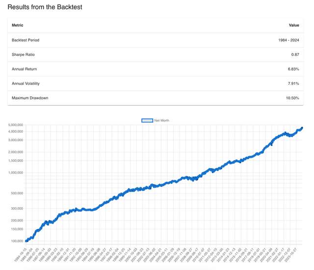

The Johansen cointegration test is a sophisticated statistical technique designed to detect the presence of long-term equilibrium relationships between multiple time series data. In algorithmic trading, comprehending these equilibrium relationships is vital for formulating robust trading strategies. This test is particularly useful in identifying assets that move together over time, allowing traders to exploit these relationships for potential profits.

Cointegration differs from simple correlation by focusing on the long-term statistical relationship between series rather than their short-term fluctuations. For traders, this means that while a set of assets may deviate from each other in the short run, they tend to revert to a common average over time. The ability to identify these persistent relationships can be a potent tool in constructing pairs trading or statistical arbitrage strategies, where the goal is to capitalize on the mean-reverting behavior of asset prices.



The Johansen cointegration test offers distinct advantages over other methods, such as the Engle-Granger two-step procedure, by allowing examination of multiple cointegrating vectors. This means it can assess multiple long-term equilibrium relationships simultaneously, which is particularly beneficial in analyzing complex systems comprising more than two assets.

This article will explore the significance of the Johansen cointegration test within algorithmic trading and provide insights into how these relationships can inform trading decisions. Additionally, we will outline the test's fundamental principles and contrast it with other prevalent statistical models employed in trading, emphasizing its applications and potential advantages. Understanding the results of the Johansen test enables traders to gain a deeper insight into asset price movements and uncover trading opportunities that might otherwise remain hidden.

## Table of Contents

## Understanding Cointegration in Time Series

Cointegration is a vital concept in time series analysis, particularly when examining financial markets. It represents a statistical relationship between two or more time series that move together over time, indicating they share a common stochastic trend. This is particularly significant in finance, where understanding the long-term equilibrium relationships between asset prices can be useful for managing investment portfolios and developing trading strategies.

Cointegration is distinct from correlation. While correlation measures the degree of linear association between two variables and focuses on short-term co-movements, cointegration considers the long-term equilibrium relationship between time series data. Two series might fluctuate independently in the short term (exhibiting low correlation) but maintain a stable relationship over the long term, which cointegration captures.

The theoretical foundation for cointegration comes from the concept of non-stationary time series. Most financial time series, such as stock prices, are non-stationary, meaning their statistical properties, such as mean and variance, change over time. When two or more non-stationary series are cointegrated, it implies that a linear combination of them results in a stationary series. For instance, if $X_t$ and $Y_t$ represent two asset prices, they are cointegrated if there exists a coefficient $\beta$ such that $Z_t = X_t - \beta Y_t$ is stationary.

In practical terms, cointegration analysis can be utilized to identify trading opportunities through strategies like pairs trading. Pairs trading involves finding two assets that are cointegrated, then exploiting deviations from their long-term equilibrium relationship. When the price of one asset diverges from the equilibrium relationship with the counterpart, traders can profit from expectations of a return to the equilibrium, by going long on one asset and short on the other.

The utility of cointegration in financial markets lies in its ability to model the long-term movements of asset prices and manage risks associated with deviations from expected relationships. Traders and analysts use statistical tests, such as the Johansen cointegration test, to determine the presence of cointegration between asset prices.

Overall, understanding cointegration enhances the capability to construct robust trading models that reflect the fundamental connections between financial instruments, offering a strategic edge in quantitative finance and risk management.

## The Johansen Cointegration Test: An Overview

Developed by Søren Johansen, the Johansen cointegration test is a powerful multivariate statistical model utilized to detect the presence of one or more cointegrating relationships among multiple time series. This test is distinctively advantageous over the Engle-Granger two-step method, as it allows for the examination of multiple cointegrating vectors simultaneously, making it an ideal tool for analyzing complex datasets in financial markets.

The methodology underlying the Johansen test involves two main components: the trace test and the maximum eigenvalue test. Both tests are based on the concept of examining the rank of a matrix derived from the vector autoregressive (VAR) representation of the time series data.

### Johansen Test Methodology

1. **Vector Autoregression (VAR)**:
   - The starting point for the Johansen cointegration test is a VAR model of the form:
$$
     X_t = A_1 X_{t-1} + A_2 X_{t-2} + \ldots + A_k X_{t-k} + \varepsilon_t

$$
     where $X_t$ is a vector of non-stationary time series, $A_i$ are matrices of coefficients, $k$ is the number of lags, and $\varepsilon_t$ is a vector of error terms.

2. **Vector Error Correction Model (VECM)**:
   - The VAR model is then transformed into a Vector Error Correction Model (VECM) of the form:
$$
     \Delta X_t = \Pi X_{t-1} + \sum_{i=1}^{k-1} \Gamma_i \Delta X_{t-i} + \varepsilon_t

$$
     where $\Delta$ denotes differencing, $\Pi$ is a matrix that contains information about the long-run relationships, and $\Gamma_i$ are matrices capturing short-term dynamics.

3. **Cointegration Matrix ($\Pi$)**:
   - The $\Pi$ matrix is essential for the Johansen test. The rank of this matrix, denoted as $r$, indicates the number of cointegrating relationships. If $r$ equals zero, it implies no cointegration; if $r$ is greater than zero, it implies the presence of cointegration.

### Johansen Test Components

- **Trace Test**:
  - The trace statistic evaluates the null hypothesis that the number of cointegrating vectors is less than or equal to $r$ against the alternative hypothesis of more than $r$. The test statistic is calculated as:
$$
    \text{Trace test statistic} = -T \sum_{i=r+1}^{n} \ln(1 - \lambda_i)

$$
    where $T$ is the sample size and $\lambda_i$ are the eigenvalues of the $\Pi$ matrix. This test is sequential; starting from $r=0$, it increases until the null is not rejected.

- **Maximum Eigenvalue Test**:
  - This test compares the null hypothesis of $r$ cointegrating vectors against the alternative of $r + 1$ vectors. The test statistic is given by:
$$
    \text{Max-eigen test statistic} = -T \ln(1 - \lambda_{r+1})

$$
  This method focuses on the eigenvalue that would add one more cointegrating vector if significant.

### Interpreting the Results

The output of the Johansen test provides critical insight into the number of cointegrating relationships, aiding in determining how many stable long-term equilibria exist among the series. A greater number of cointegrating vectors suggests that more complex intertemporal dynamics govern the time series data. Understanding these output vectors informs the development of strategies like statistical [arbitrage](/wiki/arbitrage), enhancing decision-making in [algorithmic trading](/wiki/algorithmic-trading).

The Johansen cointegration test, through its sophisticated statistical framework, equips traders with the analytical tools necessary to understand deeper economic relationships, thereby facilitating more informed investment decisions.

## Applying the Johansen Test in Algorithmic Trading

In algorithmic trading, the Johansen cointegration test serves as a critical tool for identifying groups or pairs of financial instruments, such as stocks or currencies, that show mean-reverting qualities. This test informs traders about potential opportunities for [statistical arbitrage](/wiki/statistical-arbitrage), a strategy that profits from the expected return to equilibrium of asset prices, or pairs trading, which involves longing one asset and shorting another to exploit their price relationship.

The application of the Johansen test begins with pre-processing the asset data to ensure stationarity, a requirement for cointegration testing. Traders often use log price transformations and then apply differencing to achieve stationary time series. Once pre-processed, the Johansen test is used to detect the number and nature of cointegrating relationships, offering insights into whether assets are co-moving or have diverged significantly.

A critical step involves setting entry and [exit](/wiki/exit-strategy) thresholds based on the cointegrating relationships. When the spread between two cointegrated assets deviates significantly from the mean, a trader might enter a trade expecting a reversion to the mean. The thresholds for these deviations are typically established through historical analysis and [backtesting](/wiki/backtesting).

For backtesting strategies based on the Johansen test, historical data is split into a training set, where the cointegration model is built, and a testing set, where the model's performance is evaluated. During backtesting, traders assess profitability by simulating trades that would have been triggered based on the cointegration signals from the training period. This requires carefully selecting data frequency. High-frequency data might capture short-term deviations, while lower-frequency data might be better suited for long-term trends.

Integrating the Johansen test into trading algorithms can be efficiently implemented using popular programming languages like Python. Libraries such as `statsmodels` and `numpy` facilitate the Johansen test and its related computations. Below is a simplified Python snippet demonstrating how to perform the Johansen test and use its results for algorithmic trading:

```python
from statsmodels.tsa.vector_ar.vecm import coint_johansen
import numpy as np

# Example of two price series
series1 = np.log(price_series1)
series2 = np.log(price_series2)
data = np.column_stack([series1, series2])

# Running the Johansen test
johansen_test = coint_johansen(data, det_order=0, k_ar_diff=1)

# Accessing key results
trace_stat = johansen_test.lr1  # Trace statistic
cv_trace = johansen_test.cvt  # Critical values for trace statistic
eigen_stat = johansen_test.lr2  # Maximum eigenvalue statistic
cv_eigen = johansen_test.cvm  # Critical values for eigenvalue statistic

# Decision-making criteria
if trace_stat[0] > cv_trace[0, 1]:  # example comparison with 5% critical value
    # Indicate cointegration exists and design trading signals accordingly
    print("Cointegrated; consider developing a pairs trading strategy.")
else:
    print("No cointegration detected; reconsider pair selection.")
```

Traders implementing these algorithms can automate the entire process, from data acquisition to trade execution, across various platforms like MetaTrader or bespoke trading systems. These systems allow for the integration of triggers for trade entry and exit based on real-time monitoring of the identified asset pairs.

While the Johansen test significantly enhances trading strategies by revealing mean-reverting opportunities, traders must remain vigilant to its limitations. Backtests should account for transaction costs, slippage, and ensure robustness by employing rolling window analysis to validate the persistence of cointegrating relationships over time. This disciplined approach helps sustain a competitive edge in the ever-evolving financial markets.

## Limitations and Considerations

While the Johansen cointegration test is powerful and widely used in analyzing long-term relationships between time series, it is important to acknowledge its limitations and the considerations necessary for its effective application.

Firstly, non-stationarity is a critical issue that can impact the reliability of the Johansen test results. Cointegration analysis assumes that the individual time series are integrated of order one, I(1), which means they become stationary after first differencing. However, in practice, verifying the true integration order of a series can be challenging. Incorrect assumptions about stationarity may lead to misleading test results. To mitigate this risk, traders should perform thorough pre-testing using methods like the Augmented Dickey-Fuller test to ensure each time series is appropriately classified before applying the Johansen test.

Structural breaks present additional challenges. These are abrupt changes in the underlying model, such as shifts in policy or economic events, affecting the relationship between time series. The Johansen test assumes that estimated cointegrating relationships are stable over the sample period. Structural breaks can invalidate this assumption, resulting in erroneous conclusions. Techniques such as the Bai-Perron test can help detect multiple structural breaks in the data, allowing traders to account for these changes either by segmenting the data or using models that allow for regimes shifts.

Changing market conditions can also influence the stability of cointegrated relationships. Financial markets are dynamic, and relationships among assets can change due to macroeconomic developments, regulatory changes, or innovations. Traders need to continuously validate their models on out-of-sample data and adapt their strategies to maintain a robust trading framework.

Data frequency and sample size are crucial considerations in cointegration testing. Using high-frequency data can increase the noise, potentially masking the underlying relationships between time series. On the other hand, using too low a frequency might miss capturing more subtle dynamic interactions. An appropriate balance must be struck based on the specific assets and market context. Moreover, the sample size should be adequately large to provide sufficient statistical power for the Johansen test while ensuring the stability of cointegration relations over time. Limitations in historical data availability for certain markets might necessitate the use of bootstrapping methods to enhance the robustness of inferences drawn.

Finally, when testing multiple asset pairs, the risk of multiple testing should be addressed. Conducting numerous tests increases the possibility of false positives, i.e., identifying spurious cointegration relationships. Techniques such as the Bonferroni correction or controlling the false discovery rate (FDR) can be adopted to mitigate this risk and ensure that only statistically significant cointegration relationships are considered.

In conclusion, while the Johansen cointegration test provides a valuable tool for understanding long-term equilibrium relationships in financial markets, traders must remain aware of its limitations and take appropriate steps to ensure reliable and meaningful results.

## Conclusion

The Johansen cointegration test emerges as a vital tool in the development of algorithmic trading strategies, offering a robust and mathematically grounded framework for identifying and harnessing stable, long-term trading opportunities. By leveraging the concepts of cointegration, traders can construct models that go beyond mere correlation, capitalizing on the persistent equilibrium relationships between asset prices. This positions them to make more informed decisions, strategically predicting and responding to market movements with greater precision.

However, it is crucial to acknowledge that the Johansen cointegration test, like any financial model, has its limitations. Market conditions are not static, and factors such as non-stationarity, structural breaks, and regime shifts can significantly impact the reliability of cointegration relationships. Therefore, traders must remain vigilant, continuously evaluating and updating their models to stay aligned with the ever-changing financial landscape.

The importance of staying adaptable is further emphasized by the continual advancements in quantitative finance. Ongoing research and the development of innovative methodologies promise to refine the application of cointegration analysis. These advancements will likely enhance the accuracy and applicability of the Johansen test, ensuring it remains a critical component of quantitative strategies in the future.

In summary, while the Johansen cointegration test offers substantial advantages for algorithmic trading, its effective use requires a balance of rigorous analysis, awareness of its constraints, and a commitment to adapt and evolve in the face of market changes.

## References & Further Reading

[1]: Johansen, S. (1991). ["Estimation and Hypothesis Testing of Cointegration Vectors in Gaussian Vector Autoregressive Models."](https://www.econometricsociety.org/publications/econometrica/1991/11/01/estimation-and-hypothesis-testing-cointegration-vectors) Econometrica, 59(6), 1551-1580.

[2]: Engle, R. F., & Granger, C. W. J. (1987). ["Co-integration and Error Correction: Representation, Estimation, and Testing."](https://www.jstor.org/stable/1913236?read-now=1) Econometrica, 55(2), 251-276.

[3]: Lütkepohl, H. (2005). ["New Introduction to Multiple Time Series Analysis."](https://link.springer.com/book/10.1007/978-3-540-27752-1) Springer.

[4]: Tsay, R. S. (2010). ["Analysis of Financial Time Series."](https://onlinelibrary.wiley.com/doi/book/10.1002/9780470644560) Wiley.

[5]: Alexander, C. (2001). ["Market Models: A Guide to Financial Data Analysis."](https://www.casact.org/sites/default/files/old/marketmodels.pdf) Wiley.