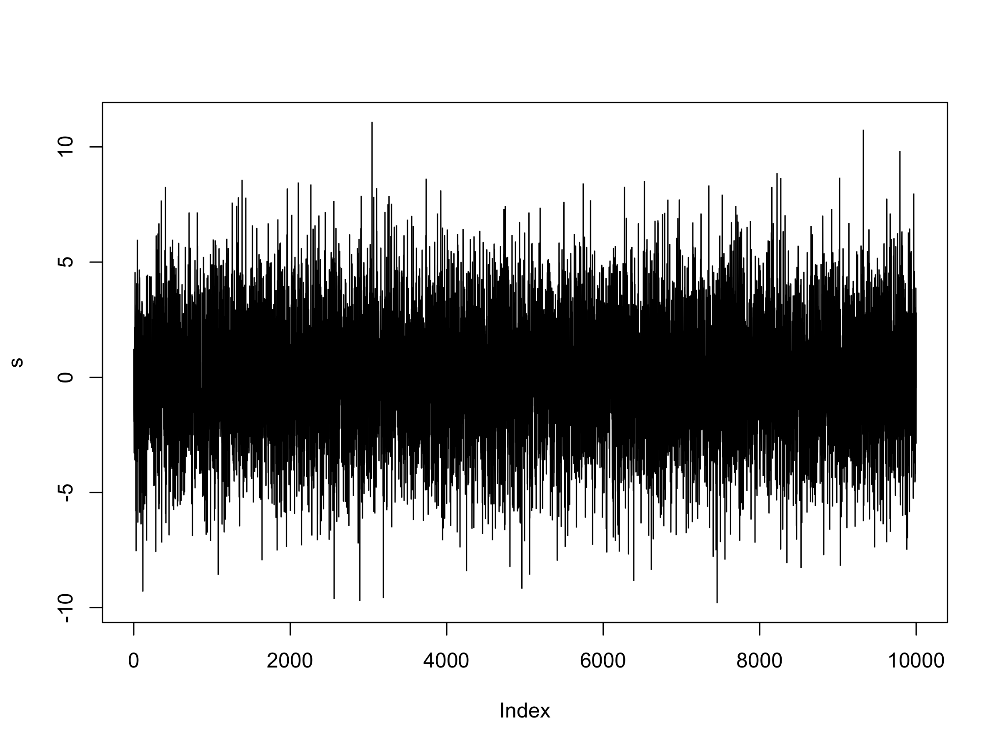

## Table of Contents

## What is the Johansen test and why is it used in time series analysis?

The Johansen test is a statistical method used to find out if there are long-term relationships between different time series data. Imagine you have data on the prices of coffee and tea over many years. The Johansen test helps you see if these prices move together in the long run, even if they might go up and down differently in the short term.

This test is important in time series analysis because it helps economists and researchers understand how different economic factors are connected over time. For example, if the test shows that coffee and tea prices are cointegrated, it means that these prices tend to balance out over time, which can be useful for making predictions or planning economic policies. By using the Johansen test, analysts can make better decisions based on the long-term trends they find in their data.

## How does the Johansen test differ from other cointegration tests?

The Johansen test is different from other cointegration tests mainly because it can find more than one cointegrating relationship at the same time. Other tests, like the Engle-Granger test, can only check for one relationship. Imagine you're looking at the prices of coffee, tea, and sugar. The Johansen test can tell you if all three prices move together in the long run, while the Engle-Granger test would only check if coffee and tea prices move together, ignoring sugar.

Another way the Johansen test stands out is that it uses a maximum likelihood approach, which is a fancy way of saying it looks at all possible relationships to find the best fit. This makes it more reliable than other tests that might miss some relationships. For example, if you're studying how different stock prices move together, the Johansen test will give you a more complete picture of how these stocks are connected over time, helping you make better investment decisions.

## What are the prerequisites for applying the Johansen test to time series data?

Before you can use the Johansen test on your time series data, you need to make sure your data meets certain conditions. First, your data should be stationary after differencing, which means that over time, the average and variation of your data don't change in a way that makes predictions impossible. You can check this by doing a unit root test, like the Augmented Dickey-Fuller test, on your data. If your data isn't stationary after differencing, the Johansen test won't work properly.

Second, you need to have enough data points. The Johansen test works best with a lot of data, usually at least 50 observations, but more is better. This is because the test looks for long-term relationships, and with more data, it can see these relationships more clearly. If you don't have enough data, the test might give you results that aren't reliable. So, make sure you have plenty of data before you start using the Johansen test.

## How do you prepare data for the Johansen test in R?

To prepare your data for the Johansen test in R, you first need to make sure your time series data is in the right format. You'll need a data frame or matrix where each column is a different time series, like prices of coffee, tea, and sugar over time. Make sure your data is clean, with no missing values, because the Johansen test won't work well with gaps in your data. If you have missing values, you might need to fill them in or remove them before you start.

Next, you need to check if your data is stationary after differencing. In R, you can use the `adf.test` function from the `tseries` package to do this. If your data isn't stationary after differencing, you'll need to difference it again until it becomes stationary. Once your data is in the right format and is stationary, you're ready to use the Johansen test. You can use the `ca.jo` function from the `urca` package to run the test on your prepared data.

## What R packages are necessary to perform the Johansen test?

To perform the Johansen test in R, you need the `urca` package. This package has a function called `ca.jo` that does the Johansen test. You can install it by typing `install.packages("urca")` in R. After installing, you load it with `library(urca)`. This package makes it easy to check if your time series data has long-term relationships.

You might also need the `tseries` package to check if your data is stationary. You use the `adf.test` function from this package to see if your data needs differencing. Install it with `install.packages("tseries")` and load it with `library(tseries)`. Both packages work together to help you prepare and analyze your data for the Johansen test.

## How do you execute the Johansen test in R, including the basic syntax?

To do the Johansen test in R, you first need to get your data ready. Make sure your data is in a data frame or matrix where each column is a different time series. Use the `adf.test` function from the `tseries` package to check if your data is stationary after differencing. If it's not, you'll need to difference it until it becomes stationary. Once your data is ready, load the `urca` package with `library(urca)`. Then, use the `ca.jo` function to run the Johansen test. The basic syntax is `ca.jo(data, ecdet = "trend", type = "trace", K = 2)`, where `data` is your data frame or matrix, `ecdet` sets the type of deterministic component, `type` chooses between "trace" or "eigen" test, and `K` is the lag order.

When you run the `ca.jo` function, it will give you results showing if there are long-term relationships between your time series. The output includes test statistics and p-values that help you decide how many cointegrating relationships there are. If the p-value is small (usually less than 0.05), it means there's a significant relationship. You can then use the `summary` function on your test results to see more details. For example, if your test is stored in a variable called `jotest`, you'd type `summary(jotest)` to get a full report. This helps you understand how your time series data moves together over time.

## What do the eigenvalues and eigenvectors represent in the Johansen test results?

In the Johansen test, eigenvalues and eigenvectors are important parts of the results that help us understand the relationships between time series. Eigenvalues are like scores that show how strong the relationships are. If an eigenvalue is big, it means there's a strong long-term connection between the time series. The Johansen test uses these eigenvalues to decide how many cointegrating relationships there are. If the eigenvalue is bigger than a certain number (called a critical value), it means there's a significant relationship.

Eigenvectors, on the other hand, tell us about the direction of these relationships. They show how each time series contributes to the cointegrating relationship. Imagine you're looking at the prices of coffee and tea. The eigenvector would tell you how much each price affects the overall relationship between them. By looking at the eigenvectors, you can see which time series are more important in the long-term relationship and how they move together over time. Together, eigenvalues and eigenvectors give a complete picture of the long-term connections in your data.

## How can you interpret the trace statistic and maximum eigenvalue statistic in the Johansen test?

The trace statistic in the Johansen test helps you figure out how many cointegrating relationships there are between your time series. It does this by adding up the eigenvalues from the test. If the trace statistic is bigger than a certain number (called the critical value), it means there's at least one strong long-term relationship. You keep checking bigger and bigger trace statistics until you find one that's not big enough. The number of times the trace statistic is bigger than the critical value tells you how many cointegrating relationships there are.

The maximum eigenvalue statistic is another way to find out how many cointegrating relationships there are. Instead of adding up all the eigenvalues like the trace statistic, it looks at each eigenvalue one by one. It starts with the biggest eigenvalue and checks if it's bigger than its critical value. If it is, there's at least one cointegrating relationship. Then it moves to the next biggest eigenvalue and does the same thing. You keep going until you find an eigenvalue that's not big enough. The number of times the maximum eigenvalue is bigger than its critical value tells you how many cointegrating relationships there are. Both statistics help you understand the long-term connections in your data, but they look at the eigenvalues in different ways.

## What are common pitfalls or errors when applying the Johansen test, and how can they be avoided?

When using the Johansen test, one common mistake is not making sure your data is stationary after differencing. If your data has trends or patterns that don't go away after you difference it, the test won't work right. To avoid this, always check your data with a unit root test like the Augmented Dickey-Fuller test before you run the Johansen test. If your data isn't stationary, keep differencing until it is.

Another pitfall is not having enough data. The Johansen test needs a lot of data to find long-term relationships accurately. If you don't have enough data points, the results might not be reliable. To fix this, try to gather more data or use other tests that work with less data if you can't get more. Also, be careful with missing values in your data. The Johansen test can't handle gaps, so make sure to fill them in or remove them before you start.

## How can you determine the number of cointegrating relationships using the Johansen test?

The Johansen test helps you find out how many long-term relationships there are between different time series. It uses two main ways to do this: the trace statistic and the maximum eigenvalue statistic. The trace statistic adds up the eigenvalues from the test and checks if this total is bigger than a certain number called the critical value. If it is, there's at least one strong long-term relationship. You keep checking bigger and bigger trace statistics until you find one that's not big enough. The number of times the trace statistic is bigger than the critical value tells you how many cointegrating relationships there are.

The maximum eigenvalue statistic looks at each eigenvalue one by one, starting with the biggest. It checks if this eigenvalue is bigger than its own critical value. If it is, there's at least one cointegrating relationship. Then, it moves to the next biggest eigenvalue and does the same thing. You keep going until you find an eigenvalue that's not big enough. The number of times the maximum eigenvalue is bigger than its critical value tells you how many cointegrating relationships there are. Both methods help you understand the long-term connections in your data, but they look at the eigenvalues in different ways.

## What advanced techniques can be used to enhance the Johansen test results in R?

To make the Johansen test results better in R, you can use a technique called bootstrapping. Bootstrapping means taking samples from your data over and over again to see how stable your results are. This can help you understand if the cointegrating relationships you found are strong or if they might change with different samples of your data. In R, you can use the `boot` package to do this. By running the Johansen test many times on these samples, you can get a better idea of how reliable your findings are.

Another way to improve your results is by using a method called model selection criteria. This helps you pick the right number of lags to use in the Johansen test. The right number of lags can make your test more accurate. In R, you can use the `vars` package to help you choose the best number of lags based on criteria like AIC (Akaike Information Criterion) or BIC (Bayesian Information Criterion). By using these criteria, you can make sure your Johansen test is set up in the best way to find the long-term relationships in your data.

## How can the results of the Johansen test be used to build a Vector Error Correction Model (VECM) in R?

After you run the Johansen test in R and find out how many long-term relationships there are between your time series, you can use those results to build a Vector Error Correction Model (VECM). The VECM is a special kind of model that helps you see how your time series move together over time, taking into account both short-term changes and long-term relationships. To build a VECM, you'll need to know the number of cointegrating relationships from the Johansen test. In R, you can use the `vecm` function from the `tsDyn` package to create your VECM. You'll tell the function how many cointegrating relationships to include, based on what the Johansen test found.

Once you have your VECM set up, you can use it to make predictions about how your time series will change in the future. The model will show you how each time series affects the others, both in the short term and the long term. This can be really helpful if you're trying to understand things like how the prices of different goods move together, or how economic indicators relate to each other over time. By using the results from the Johansen test to build your VECM, you get a more complete picture of the relationships in your data, which can help you make better decisions or forecasts.

## What is an overview of the Johansen Cointegration Test?

Developed by Søren Johansen, the Johansen cointegration test is a powerful multivariate statistical model utilized to detect the presence of one or more cointegrating relationships among multiple time series. This test is distinctively advantageous over the Engle-Granger two-step method, as it allows for the examination of multiple cointegrating vectors simultaneously, making it an ideal tool for analyzing complex datasets in financial markets.

The methodology underlying the Johansen test involves two main components: the trace test and the maximum eigenvalue test. Both tests are based on the concept of examining the rank of a matrix derived from the vector autoregressive (VAR) representation of the time series data.

### Johansen Test Methodology

1. **Vector Autoregression (VAR)**:
   - The starting point for the Johansen cointegration test is a VAR model of the form:
$$
     X_t = A_1 X_{t-1} + A_2 X_{t-2} + \ldots + A_k X_{t-k} + \varepsilon_t

$$
     where $X_t$ is a vector of non-stationary time series, $A_i$ are matrices of coefficients, $k$ is the number of lags, and $\varepsilon_t$ is a vector of error terms.

2. **Vector Error Correction Model (VECM)**:
   - The VAR model is then transformed into a Vector Error Correction Model (VECM) of the form:
$$
     \Delta X_t = \Pi X_{t-1} + \sum_{i=1}^{k-1} \Gamma_i \Delta X_{t-i} + \varepsilon_t

$$
     where $\Delta$ denotes differencing, $\Pi$ is a matrix that contains information about the long-run relationships, and $\Gamma_i$ are matrices capturing short-term dynamics.

3. **Cointegration Matrix ($\Pi$)**:
   - The $\Pi$ matrix is essential for the Johansen test. The rank of this matrix, denoted as $r$, indicates the number of cointegrating relationships. If $r$ equals zero, it implies no cointegration; if $r$ is greater than zero, it implies the presence of cointegration.

### Johansen Test Components

- **Trace Test**:
  - The trace statistic evaluates the null hypothesis that the number of cointegrating vectors is less than or equal to $r$ against the alternative hypothesis of more than $r$. The test statistic is calculated as:
$$
    \text{Trace test statistic} = -T \sum_{i=r+1}^{n} \ln(1 - \lambda_i)

$$
    where $T$ is the sample size and $\lambda_i$ are the eigenvalues of the $\Pi$ matrix. This test is sequential; starting from $r=0$, it increases until the null is not rejected.

- **Maximum Eigenvalue Test**:
  - This test compares the null hypothesis of $r$ cointegrating vectors against the alternative of $r + 1$ vectors. The test statistic is given by:
$$
    \text{Max-eigen test statistic} = -T \ln(1 - \lambda_{r+1})

$$
  This method focuses on the eigenvalue that would add one more cointegrating vector if significant.

### Interpreting the Results

The output of the Johansen test provides critical insight into the number of cointegrating relationships, aiding in determining how many stable long-term equilibria exist among the series. A greater number of cointegrating vectors suggests that more complex intertemporal dynamics govern the time series data. Understanding these output vectors informs the development of strategies like statistical [arbitrage](/wiki/arbitrage), enhancing decision-making in [algorithmic trading](/wiki/algorithmic-trading).

The Johansen cointegration test, through its sophisticated statistical framework, equips traders with the analytical tools necessary to understand deeper economic relationships, thereby facilitating more informed investment decisions.

## References & Further Reading

[1]: Johansen, S. (1991). ["Estimation and Hypothesis Testing of Cointegration Vectors in Gaussian Vector Autoregressive Models."](https://www.econometricsociety.org/publications/econometrica/1991/11/01/estimation-and-hypothesis-testing-cointegration-vectors) Econometrica, 59(6), 1551-1580.

[2]: Engle, R. F., & Granger, C. W. J. (1987). ["Co-integration and Error Correction: Representation, Estimation, and Testing."](https://www.jstor.org/stable/1913236?read-now=1) Econometrica, 55(2), 251-276.

[3]: Lütkepohl, H. (2005). ["New Introduction to Multiple Time Series Analysis."](https://link.springer.com/book/10.1007/978-3-540-27752-1) Springer.

[4]: Tsay, R. S. (2010). ["Analysis of Financial Time Series."](https://onlinelibrary.wiley.com/doi/book/10.1002/9780470644560) Wiley.

[5]: Alexander, C. (2001). ["Market Models: A Guide to Financial Data Analysis."](https://www.casact.org/sites/default/files/old/marketmodels.pdf) Wiley.