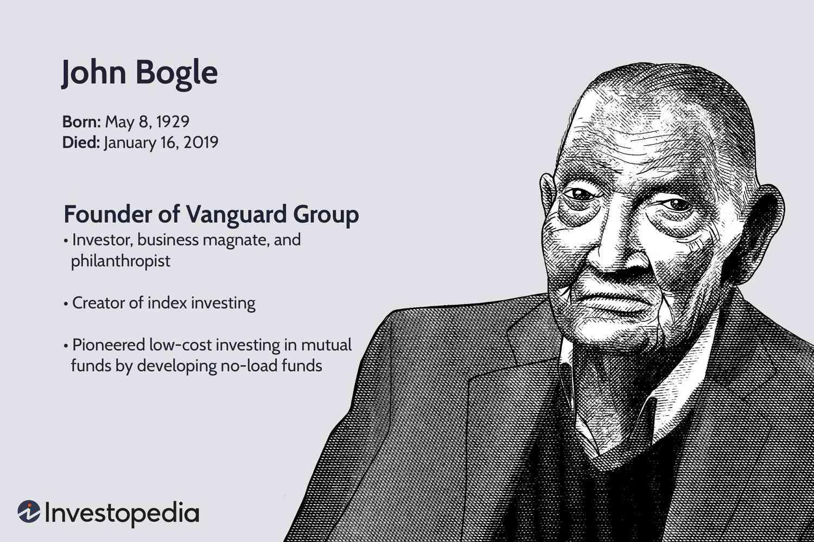

The investment landscape has been significantly shaped by innovative thinkers like John Bogle, the founder of Vanguard Group. Bogle is celebrated for introducing index investing, a strategy that allows investors to track the broader market efficiently. Index investing offers a systematic approach that mitigates individual stock risks by diversifying investments across the entire market. This strategy not only democratized investing by making it accessible to ordinary individuals but also emphasized the importance of low costs in enhancing long-term investment returns.

John Bogle's revolutionary contributions to the world of investing are often highlighted for their focus on reducing expenses associated with mutual funds. By minimizing fees, Bogle aimed to maximize the portion of returns that investors could keep, a principle that has influenced numerous investment products and strategies. His introduction of the first index mutual fund set a precedent for emphasizing long-term growth through broad market exposure rather than attempting to outperform the market through active trading.



In recent years, the principles that Bogle championed have found new resonance with modern algorithmic trading strategies. Algorithmic trading, which involves using computer algorithms to automate trading decisions based on market data, can complement index investing by further optimizing execution and cost-efficiency. This article explores how Bogle's core philosophies of simplicity, cost-effectiveness, and long-term investment align with the sophisticated data-driven techniques of algorithmic trading, offering investors robust strategies for optimizing their portfolios in the evolving financial markets.

## Table of Contents

## John Bogle: Vanguard and the Birth of Index Investing

John Bogle, a pivotal figure in modern finance, founded the Vanguard Group in 1974. His groundbreaking work has earned him the title of the "Father of Index Investing," an accolade stemming from his revolutionary approach to mutual funds. Bogle’s introduction of index funds fundamentally transformed the investment landscape by making it more accessible and affordable for the average investor.

The concept of index investing, as pioneered by Bogle, was revolutionary in its simplicity and effectiveness. Unlike actively managed funds that aim to outperform the market, index funds strive to replicate the performance of a specific market index. This approach not only democratized investment opportunities but also significantly reduced costs associated with fund management. By minimizing the need for active trading, index funds lowered expense ratios and passed those savings onto investors, ultimately increasing their net returns.

The launch of the Vanguard 500 Index Fund in 1976 marked a pivotal moment in the history of finance. As the first index fund available to retail investors, it mirrored the performance of the S&P 500, an index representing the largest 500 companies listed on stock exchanges in the United States. This fund epitomized the low-cost investment philosophy that Bogle championed, offering investors a diversified portfolio with significantly reduced management fees.

The Vanguard 500's impact on the mutual fund industry was profound. It challenged conventional investment wisdom by demonstrating that passive management could yield competitive returns while incurring lower costs. Bogle's approach effectively aligned investor interests with fund management practices, pioneering a model that prioritized investor outcomes over fund management profits.

John Bogle’s legacy in index investing has persisted, influencing countless investors and reshaping the mutual fund industry. His commitment to low-cost, accessible investing laid the foundation for the widespread adoption of index funds, a trend that has continued to grow with the rising awareness of cost-efficient investment strategies. Bogle's insights into investment management have persisted into the current era, driving an ongoing shift toward low-cost, passive investment vehicles.

## Understanding Index Investing

Index investing is a strategy where investors purchase shares in funds designed to replicate the performance of a specific market index. A market index, such as the S&P 500 or the Dow Jones Industrial Average, represents a segment of the market and is often used as a benchmark to gauge the overall performance of a market or specific investment.

This approach to investing is classified as passive because it does not involve frequent buying and selling of assets based on market predictions or trends. One of the main advantages of index investing is cost minimization. Traditional active fund management involves higher fees due to the expenses related to research, frequent trading, and management salaries. In contrast, because index funds simply mirror an index, there's less need for active management, which translates into lower costs for investors. According to research, the expense ratios for index funds can be several basis points lower than those for actively managed funds.

Another significant benefit of index investing is market diversification. By investing in an index fund, an investor gains exposure to a large number of stocks or securities at once, which can effectively disperse risk across a broad array of companies and industries. This diversification significantly reduces the risk associated with [volatility](/wiki/volatility-trading-strategies) in individual stocks. For instance, if a single stock underperforms, its impact on an index fund with hundreds of holdings is relatively minor compared to holding that stock individually.

The mathematical concept underpinning index investing can be understood by considering the formula for the total return of an index:

$$
R_{\text{index}} = \sum_{i=1}^{n}(w_i \times R_i)
$$

where $R_{\text{index}}$ is the return of the index, $n$ is the number of securities in the index, $w_i$ is the weight of the $i$-th security in the index, and $R_i$ is the return of the $i$-th security. This formula highlights how the performance of each security, weighted by its importance in the index, contributes to the overall return of the index.

Index investing is notably popular among long-term investors who prefer a "buy and hold" strategy, as it provides a straightforward means to capture market growth over time without the complexities and costs associated with active trading. Over extended periods, many index funds have historically outperformed actively managed funds, making them an attractive choice for investors seeking stable growth without the added expense of active management.

## The Evolution of Algorithmic Trading

Algorithmic trading utilizes computer algorithms to automate trading decisions, significantly enhancing the efficiency and precision of executing trades. These algorithms are designed to follow specific instructions based on historical data and prevailing market trends to determine optimal trading strategies. Unlike traditional trading, which relies heavily on human intuition and decision-making, [algorithmic trading](/wiki/algorithmic-trading) leverages computational power and quantitative models to execute trades at speeds and volumes that would be impractical to achieve manually.

A key advantage of algorithmic trading is its ability to process vast datasets and perform complex calculations swiftly. This capability is vital in today's fast-paced markets, where rapid fluctuations can present both opportunities and risks within fractions of a second. By analyzing historical data, algorithms can identify patterns and trends that inform future trading decisions, aiming to capitalize on momentary price discrepancies across markets. For example, [arbitrage](/wiki/arbitrage) strategies in algorithmic trading exploit price differences of a security across different platforms or markets, buying low in one and selling high in another before such differences disappear.

Modern algorithmic trading employs sophisticated, data-driven techniques. Machine learning algorithms, for example, can adapt to new data, continuously improving their predictions and trading strategies. These algorithms can recognize non-linear relationships and intricate patterns within massive datasets, offering insight beyond traditional statistical methods.

The evolution of algorithmic trading has been fueled by advancements in computational technology and [artificial intelligence](/wiki/ai-artificial-intelligence) (AI). High-frequency trading ([HFT](/wiki/high-frequency-trading-strategies)), a subset of algorithmic trading, exemplifies this evolution by executing thousands of trades in milliseconds. HFT typically relies on proprietary algorithms implemented in high-performance computing environments, often using programming languages such as C++ for their execution speed. Python, however, is increasingly used for developing and [backtesting](/wiki/backtesting) trading strategies due to its robust data analytics libraries like pandas and NumPy:

```python
import pandas as pd
import numpy as np

# Example of a simple moving average crossover strategy
data = pd.DataFrame(...)  # Load market data
short_window = 40
long_window = 100

signals = pd.DataFrame(index=data.index)
signals['signal'] = 0.0
signals['short_mavg'] = data['close'].rolling(window=short_window, min_periods=1).mean()
signals['long_mavg'] = data['close'].rolling(window=long_window, min_periods=1).mean()

signals['signal'][short_window:] = np.where(signals['short_mavg'][short_window:] > signals['long_mavg'][short_window:], 1.0, 0.0)
signals['positions'] = signals['signal'].diff()

# positions can then be executed in a trading environment
```

This script represents a simple moving average crossover strategy, where a short-term moving average crosses above a long-term moving average, generating a buy signal.

Overall, algorithmic trading has revolutionized the trading landscape by offering increased accuracy and strategic diversity. The integration of AI has further refined trading execution, optimizing outcomes in increasingly complex and competitive markets.

## Integrating Bogle's Philosophy with Modern Algo Trading

John Bogle's investment philosophy, centered around simplicity, low costs, and a long-term perspective, aligns well with the principles of modern algorithmic trading. At its core, Bogle's approach promotes passive investment strategies that minimize unnecessary expenses and market speculation, focusing instead on broad market participation through index funds. This foundational philosophy can serve to enhance and complement algorithmic trading strategies, which benefit from the same principles of efficiency and cost-effectiveness.

Algorithmic trading leverages the power of computer algorithms to execute trading decisions. These algorithms are capable of processing vast amounts of market data, applying quantitative models to identify optimal trading opportunities that a human trader may miss. When applied to Bogle's concept of low-cost index investing, algorithmic trading can facilitate more efficient portfolio rebalancing, reduce transaction costs, and improve tracking error. For instance, an algorithm can continuously monitor market movements and execute trades that maintain an index fund's allocations in alignment with its benchmark, thereby preserving the cost and risk efficiencies that are central to Bogle's philosophy.

Furthermore, Bogle's emphasis on long-term investment aligns with algorithmic trading's potential to mitigate short-term market volatility. Algorithms can be programmed to execute trades based on pre-defined criteria over an extended period, reducing the emotional biases that often drive human traders to make impulsive and speculative decisions. This synergy allows investors to achieve the long-term growth envisioned by Bogle, while harnessing the precision and adaptability of algorithmic systems.

The integration of Bogle's insights with algorithmic trading delivers robust investment solutions by optimizing performance and controlling costs across diverse investor profiles. For institutional investors managing large portfolios, algorithmic trading offers scalability and consistency in executing Bogle's low-cost strategy across multiple markets. Retail investors, on the other hand, can benefit from algorithm-driven robo-advisors that democratize access to sophisticated investment techniques, all while adhering to Bogle's principles.

In summary, the strategic melding of Bogle's passive investing framework with algorithmic trading technologies represents a significant evolution in investment strategy. By aligning Bogle's ideals of simplicity and affordability with data-driven precision, this integration provides investors with powerful tools to efficiently navigate the complexities of modern financial markets.

## Conclusion

John Bogle's legacy in the investment world remains unparalleled, marking a transformative shift towards accessible and efficient investment strategies. His pioneering work in establishing low-cost index investing has laid the groundwork for today's investment landscape. By emphasizing simplicity, cost-effectiveness, and a long-term focus, Bogle democratized investing, allowing individual investors to benefit from market growth without excessive fees.

In recent years, modern algorithmic trading has emerged as a natural progression of Bogle’s foundational principles. This method enhances traditional index investing by leveraging advanced technological execution. By utilizing computer algorithms, algorithmic trading automates and optimizes trading decisions based on complex data analyses and market trends. This integration allows for precise execution and the potential to improve investment outcomes further. 

As financial markets continue to evolve, the combination of Bogle's insights with algorithmic precision offers promising opportunities for investors. By blending low-cost index funds with sophisticated algorithmic techniques, investors can achieve a balanced approach that maximizes efficiency and reduces costs. This synergy not only preserves the core values introduced by Bogle but also adapts them to meet the demands of a rapidly changing financial environment. Thus, investors looking to optimize their portfolios can benefit significantly from this fusion, which embodies the best of both traditional and modern investment strategies.

## References & Further Reading

[1]: ["Common Sense on Mutual Funds: New Imperatives for the Intelligent Investor"](https://www.amazon.com/Common-Sense-Mutual-Funds-Imperatives/dp/0471392286) by John C. Bogle

[2]: ["The Little Book of Common Sense Investing: The Only Way to Guarantee Your Fair Share of Stock Market Returns"](https://www.amazon.com/Little-Book-Common-Sense-Investing/dp/1119404509) by John C. Bogle

[3]: ["A Random Walk Down Wall Street: The Time-Tested Strategy for Successful Investing"](https://www.academia.edu/10850809/A_Random_Walk_Down_Wall_Street_The_Time_Tested_Strategy_for_Successful_Investing) by Burton G. Malkiel

[4]: ["The Bogleheads' Guide to Investing"](https://www.amazon.com/Bogleheads-Guide-Investing-Taylor-Larimore/dp/1118921283) by Taylor Larimore, Mel Lindauer, and Michael LeBoeuf

[5]: ["Barbarians at the Gate: The Fall of RJR Nabisco"](https://en.wikipedia.org/wiki/Barbarians_at_the_Gate) by Bryan Burrough and John Helyar

[6]: ["Against the Gods: The Remarkable Story of Risk"](https://www.amazon.com/Against-Gods-Remarkable-Story-Risk/dp/0471295639) by Peter L. Bernstein

[7]: ["The Concept of Indexation and the Construction of Bond Indices"](https://fastercapital.com/content/Bond-Index-Construction--Understanding-the-Role-of-Bond-Index-Construction-in-Portfolio-Management.html) by Claude Gaspard, The Journal of Financial and Quantitative Analysis

[8]: ["Vanguard: to buy or not to buy index funds"](https://investor.vanguard.com/investment-products/index-funds) by David Randall, Reuters

