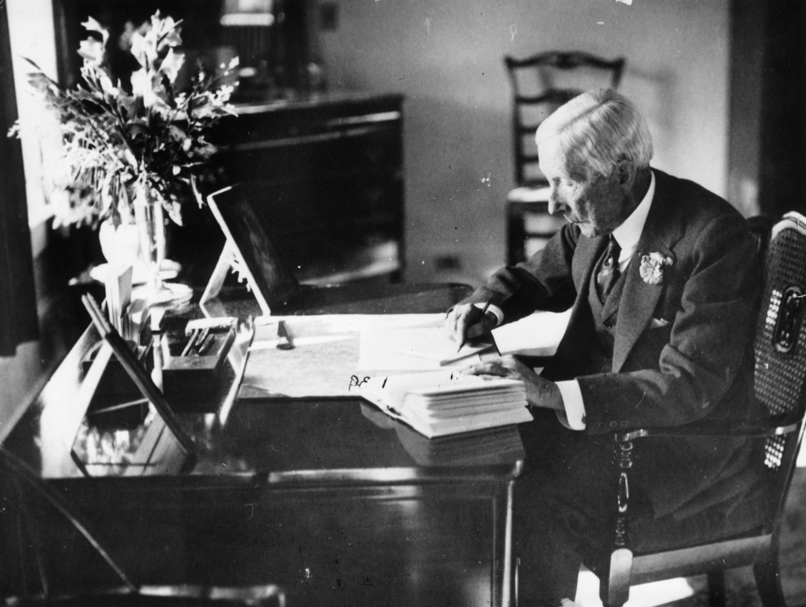

John D. Rockefeller, an influential figure in American history, is renowned for his transformative role in the oil industry and his contributions to modern economic practices. As the founder of Standard Oil, Rockefeller revolutionized the energy sector with innovative business strategies that set the foundation for his company's market dominance. Born in 1839, Rockefeller began his career in a time when the oil industry was burgeoning. Through strategic foresight and meticulous planning, he founded Standard Oil in 1870, which quickly ascended to greatness by employing practices such as vertical integration and monopolistic control. These methods not only ensured his company's success but also reshaped the landscape of American industry.

Rockefeller's impact, however, extends beyond oil. His business acumen serves as a precursor to modern financial strategies, such as algorithmic trading, which rely on systematic and data-driven approaches. Algorithmic trading, characterized by the use of automated systems to execute trades at optimal prices and times, mirrors Rockefeller's methodical and calculated business maneuvers. His practices, which emphasized efficiency and strategic control, laid the groundwork for contemporary approaches in financial trading.

In addition to his business achievements, Rockefeller is celebrated for his substantial philanthropic efforts. His legacy as a philanthropist includes substantial contributions to education and medical research. This dual legacy as a shrewd business magnate and a generous benefactor has cemented Rockefeller's status as a key figure in American history, influencing economic practices and societal advancements well beyond his era.

Rockefeller's innovative spirit is linked to today’s context of algorithmic trading through its reliance on thorough analysis and strategic execution—principles he championed over a century ago. Understanding his approach provides valuable insights into the genealogy of current financial practices, highlighting the enduring relevance of historical innovations in shaping modern economic landscapes.

## Table of Contents

## The Rise of John D. Rockefeller and Standard Oil

John D. Rockefeller, born on July 8, 1839, in Richford, New York, emerged as one of the most prominent figures in American economic history through his strategic ventures in the oil industry. His early life was marked by a strong work ethic and a keen interest in business, which led him to pursue various entrepreneurial endeavors. At the age of 16, Rockefeller found employment as an assistant bookkeeper, showcasing his aptitude for financial management. This experience laid the foundation for his future in commerce.

Rockefeller's entry into the oil industry began in the mid-1860s, a period characterized by the burgeoning potential of petroleum as a vital economic resource. Recognizing the opportunity, he co-founded a refinery business in Cleveland, Ohio, in 1863, and by 1870, alongside partners including his brother William Rockefeller, Henry M. Flagler, and Samuel Andrews, he established the Standard Oil Company. Standard Oil quickly manifested business practices that would define Rockefeller's legacy, prominently through the method of vertical integration. This strategy involved controlling every aspect of the oil production and distribution process, from extraction to refining to shipping.

The implementation of vertical integration was instrumental in minimizing costs and maximizing efficiency. Standard Oil's control extended to acquiring pipelines, building tank cars, and establishing retail outlets, thus eliminating reliance on external suppliers and middlemen. This comprehensive control allowed the company to dictate market prices and undercut competitors, fostering its rise to dominance.

Standard Oil's monopoly had a profound impact on the oil industry and the broader economy. By aggressively expanding its control, Standard Oil managed to acquire nearly all competing refineries, achieving a near-complete monopoly. The company's ability to reduce costs and enforce lower prices initially benefitted consumers, but its monopolistic grip also stifed competition and innovation. This dominance prompted public outcry and eventually led to antitrust legal challenges.

The significant market influence of Standard Oil culminated in a landmark U.S. Supreme Court decision in 1911, invoking the Sherman Antitrust Act to dismantle the company into 34 separate entities. This decision marked a pivotal moment in regulatory approaches toward monopolies and influenced subsequent antitrust legislation.

In summary, John D. Rockefeller's strategic entry into the oil industry, coupled with his implementation of vertical integration, was central to the founding and growth of Standard Oil. While his methods cemented his legacy as a pioneering business magnate, they also highlighted the complexities and consequences of monopolistic practices in shaping the economic landscape.

## Innovations and Business Practices

John D. Rockefeller's approach to business was characterized by a spectrum of innovative practices that not only propelled Standard Oil to unprecedented heights but also set foundational principles for future corporate strategies. One of the cornerstone innovations was the use of trusts, a legal arrangement allowing multiple businesses to operate as a single entity without being officially merged. This practice enabled Standard Oil to effectively circumvent existing competitive pressures and regulatory limitations, fostering greater integration and control over the oil industry.

Another fundamental strategy was the emphasis on economies of scale. By consolidating the operations of numerous oil refineries, Standard Oil could significantly reduce costs through streamlined processes and bulk purchasing. This cost reduction not only allowed the company to offer lower prices than its competitors but also increased its profit margins despite selling oil at reduced prices. Economies of scale were realized not just in refining activities but extended to transportation and distribution networks as well. Standard Oil owned a vast array of facilities, from pipelines to railroad tank cars, further reducing costs and enhancing logistical efficiency.

Strategically, Rockefeller's decisions culminated in the overwhelming market dominance of Standard Oil. One pertinent example is his focus on diversification and vertical integration. By controlling every aspect of the oil business—from extraction, refining, transportation, to marketing and sales—Standard Oil minimized reliance on external entities and reduced vulnerabilities associated with supply chain disruptions. This vertical integration enabled Rockefeller to dictate pricing and output levels, effectively reinforcing the company's monopolistic presence in the oil market.

Standard Oil's commitment to research and development was another defining [factor](/wiki/factor-investing) in its business strategy. The company invested heavily in improving refining techniques, significantly advancing the technology used in oil processing. This not only increased the yield from [crude oil](/wiki/crude-oil) but also led to the development of new by-products, expanding the range of products offered. Such innovations not only solidified Standard Oil’s position as a leader in the oil industry but also contributed to the broader scientific and technological advancements of the era.

In summary, Rockefeller's use of trusts, realization of economies of scale, emphasis on vertical integration, and investment in research and development were crucial to the establishment and expansion of Standard Oil's dominance. These practices not only reshaped the oil industry but also laid the groundwork for modern business strategies and competitive market controls.

## Philanthropy and Legacy

John D. Rockefeller's shift towards philanthropy marked a significant chapter in his life, reflecting his profound commitment to societal betterment following his retirement from the business domain. His philanthropic journey began in earnest in 1897 when he retired from active management of Standard Oil. He dedicated the remaining years of his life to donating a considerable portion of his wealth to causes he deemed essential for the progress of humanity.

A significant portion of Rockefeller's philanthropic endeavors focused on education. He was a staunch supporter of the University of Chicago, contributing over $80 million, which played a pivotal role in transforming the institution into a leading educational and research university [1]. His dedication to education extended to the funding of African American education, including his pivotal support for the establishment of Spelman College in Atlanta, named in honor of his wife, Laura Spelman Rockefeller.

Rockefeller's contributions to medical research were trailblazing, establishing a foundation that has had lasting impacts. In 1901, he founded the Rockefeller Institute for Medical Research (now Rockefeller University), which became an eminent center for biomedical research globally. The institution was instrumental in numerous medical breakthroughs, fostering advancements in understanding and treating infectious diseases. Additionally, his creation of the General Education Board in 1902 showed his commitment to improving public health through educational reform.

The establishment of the Rockefeller Foundation in 1913 was arguably his most significant philanthropic initiative. With an overarching mission to "promote the well-being of humanity throughout the world," the foundation addressed diverse issues, including public health, food production, and education. The foundation's efforts have been pivotal in combating diseases such as yellow fever and malaria and setting new standards in agricultural productivity through the Green Revolution.

Rockefeller's philanthropic legacy continues to impact society significantly. By setting a precedent for corporate social responsibility, he influenced generations of philanthropists and established models for systematic philanthropy that inspire contemporary charitable foundations. His systematic and strategic approach to giving has echoed through time, shaping how modern philanthropy operates and highlighting the importance of addressing societal challenges with targeted solutions.

In reflecting upon Rockefeller's philanthropy, it is evident that his vision extended far beyond his lifetime. His contributions to education, medical research, and public welfare have created a lasting influence, touching countless lives and fostering advancements that continue to benefit society today. Through his philanthropic legacy, Rockefeller exemplifies how wealth can be leveraged to catalyze long-term societal change, leaving an indelible impact on the world.

[1] Nevins, Allan. "John D. Rockefeller: The Heroic Age of American Enterprise." Scribner's, 1940.

## Transition into Modern Trading: The Advent of Algorithmic Trading

Algorithmic trading, also known as automated trading, utilizes computer algorithms to execute trades in financial markets. These algorithms process market data at speed and accuracy levels unattainable by human traders, optimizing decision-making and execution through predefined criteria. This technological innovation has become a cornerstone of modern financial trading, significantly impacting global markets by enhancing [liquidity](/wiki/liquidity-risk-premium) and reducing transaction costs.

John D. Rockefeller's systematic business strategies laid the groundwork for [algorithmic trading](/wiki/algorithmic-trading)'s principles. His approach to managing Standard Oil demonstrated a methodical, logic-driven framework that resonates with the core of algorithmic trading. Rockefeller championed the use of data and efficient resource management to dominate the oil market, which mirrors today's utilization of algorithms in financial markets to gain competitive advantage.

Rockefeller's era introduced several innovations that resonate with the evolution of algorithmic trading. His implementation of vertical integration and economies of scale are early examples of creating efficiencies that modern algorithms aim to achieve in trading. These practices revolutionized the business landscape, focusing on optimizing processes and minimizing waste, akin to how algorithms seek to maximize trading efficiency.

Furthermore, Rockefeller's emphasis on research and development fostered a culture of innovation that parallels the ongoing technological advancements in financial markets. The systematic and strategic nature of Rockefeller's business operations echo the structured and rules-based approach of algorithmic trading systems today. As a result, the foundations of his business acumen have indirectly influenced the evolution of algorithmic trading, showcasing the enduring relevance of historical business practices in contemporary finance.

## Rockefeller's Influence on Contemporary Economic Practices

John D. Rockefeller's influence on contemporary economic practices is profound, particularly in the realm of strategic business methodologies and the foundational principles that have shaped modern financial markets. His strategies within Standard Oil have not only left a lasting mark on the oil industry but have also indirectly influenced current financial practices such as algorithmic trading.

Rockefeller was a pioneer in implementing systematic business methods, most notably through the use of vertical integration and controlling supply chains. This approach minimized costs and maximized efficiencies while establishing a model for monopolistic practices that continues to inform modern economic strategies. The precision and efficiency of Rockefeller’s methodologies can be closely related to how algorithmic trading operates in today's financial markets.

Algorithmic trading, defined by its use of computer algorithms to execute trades at incredible speeds and efficiencies, can be seen as an evolution of the strategic prowess exemplified by Rockefeller. His influence is evident in the systematic approach both use—where maximizing efficiencies and reducing human error are paramount. Traders today might employ quantitative algorithms to analyze huge datasets and execute trades based on statistical models, reflecting the data-driven decision-making processes that were central to Rockefeller’s business strategies.

While exact parallels between Rockefeller’s time and today’s complex financial ecosystems may be challenging, one can speculate that Rockefeller would appreciate the technological advances that facilitate data-driven decision-making and operational efficiency. The automation present in algorithmic trading assures precision and adaptation to market conditions, much like how Standard Oil adjusted to market demands and positioned itself to capitalize on economic shifts.

The influence of Rockefeller's foundational practices is also visible in how financial markets have matured in addressing regulation and competition. The antitrust actions that arose from Standard Oil's dominant position have informed regulatory frameworks today, ensuring competitive and fair-trading environments in the financial sector.

In considering how Rockefeller might view today's economic practices and technological advances, it is reasonable to assume he would recognize the continuity of his strategic priorities—efficiency, control, and market dominance—now enhanced and executed with far greater precision through technology. His innovative spirit would likely admire the analytical prowess and actionable insights that modern algorithmic trading provides, reflecting a natural progression of his business philosophy adapted to the technological capabilities of the 21st century.

## Conclusion

John D. Rockefeller's legacy in both commerce and philanthropy remains profound and multifaceted. His pioneering efforts in establishing Standard Oil set a benchmark for corporate structure and strategy, significantly shaping the trajectory of American industry. The business tactics he employed, such as vertical integration and the creation of trusts, have become foundational strategies in today's business arenas, echoing through the corridors of modern corporate governance and operational practices.

Rockefeller's innovations, particularly his implementation of economies of scale and systemic approaches to business operations, find resonance in the current economic landscape, particularly within algorithmic trading. This contemporary trading practice, which relies on complex mathematical models and high-speed data analysis, mirrors Rockefeller’s methodical, efficiency-driven business strategy. His focus on optimizing processes and minimizing costs laid a conceptual groundwork that continues to influence economic practices today, where data-driven, algorithmic approaches dominate many industries.

Furthermore, Rockefeller's shift toward philanthropy after his business career illustrates the enduring impact of responsible capital deployment. His contributions to education, medical research, and the establishment of the Rockefeller Foundation set a precedent for subsequent generations of philanthropists. These initiatives have had lasting effects, underscoring the potential and responsibility of wealth to effect positive societal change.

In conclusion, understanding historical business practices, such as those exemplified by Rockefeller, is crucial for informing future economic developments. His life and work serve as a testament to the transformative power of strategic innovation and philanthropy. Recognizing and learning from these historical practices can provide valuable insights for navigating the evolving economic landscape, fostering sustainable growth, and advancing technological progress in our own time.

## References & Further Reading

[1]: Chernow, R. (2004). ["Titan: The Life of John D. Rockefeller, Sr."](https://www.amazon.com/Titan-Life-John-Rockefeller-Sr/dp/1400077303) Vintage Books.

[2]: Nevins, A. (1940). ["John D. Rockefeller: The Heroic Age of American Enterprise."](https://archive.org/details/in.ernet.dli.2015.74195) Scribner's.

[3]: Yergin, D. (1992). ["The Prize: The Epic Quest for Oil, Money & Power."](https://www.amazon.com/Prize-Epic-Quest-Money-Power/dp/1439110123) Free Press.

[4]: Hidy, R. W., & Hidy, M. S. (1955). ["Pioneering in Big Business, 1882-1911: History of Standard Oil Company (New Jersey)."](https://archive.org/details/historyofstandar00hidy) Harper & Brothers.

[5]: Livesay, H. C. (1979). ["American Made: Men Who Shaped the American Economy."](https://www.amazon.com/American-Made-Men-Shaped-Economy/dp/0316528714) Little, Brown and Company.