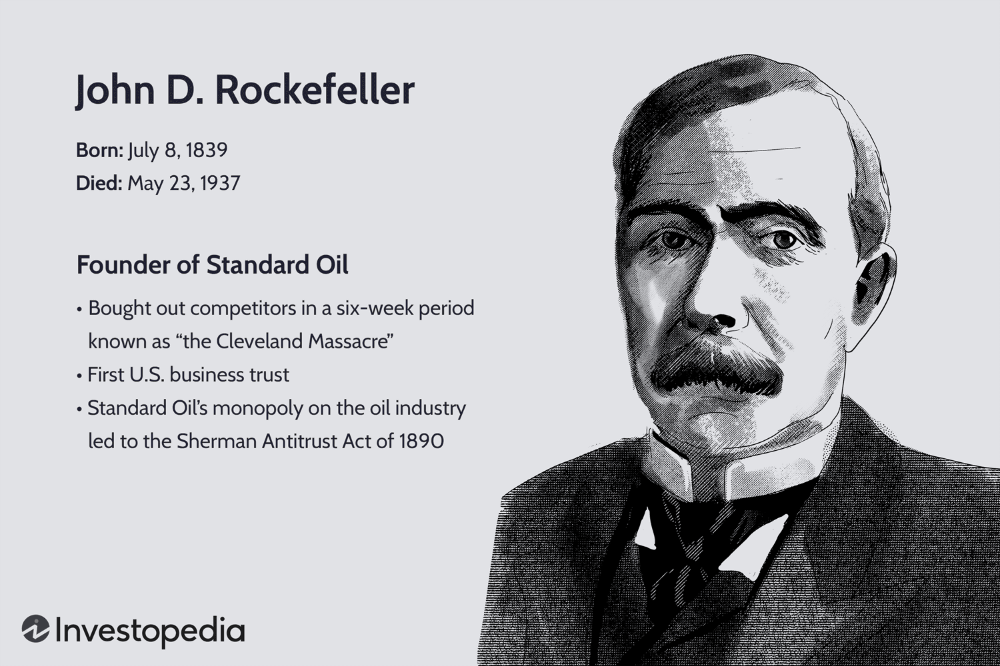

## Table of Contents

## Who was John D. Rockefeller?

John D. Rockefeller was a businessman who lived a long time ago. He was born in 1839 and died in 1937. He is famous for starting a big company called Standard Oil. This company helped make oil cheaper and easier to use for everyone. Because of his company, he became very rich and was known as one of the richest people ever.

Rockefeller was also known for giving away a lot of his money to help people. He believed in using his wealth to make the world a better place. He gave money to build schools, hospitals, and libraries. One of the most famous things he did was start the University of Chicago. Even though he made a lot of money, he is remembered for helping others with it.

## When and where was John D. Rockefeller born?

John D. Rockefeller was born on July 8, 1839. He was born in Richford, New York. This was a small town in the United States.

At that time, Richford was a quiet place with not many people. It was a good place for a family to live. John grew up there before he became a famous businessman.

## What was John D. Rockefeller's early life like?

John D. Rockefeller grew up in a big family in Richford, New York. He was the second of six children. His family moved around a lot when he was young, so he lived in different places. His dad, William Avery Rockefeller, was often away from home because he worked as a traveling salesman. This meant John's mom, Eliza, had to take care of the family by herself a lot. Even though they didn't have a lot of money, John learned the value of hard work and saving money from his mom.

When John was a teenager, his family moved to Cleveland, Ohio. There, he went to high school for a short time before he started working. At just 16 years old, he got his first job as a clerk at a small produce company. He was good at his job and saved most of the money he earned. John was very smart with money and always thought about how to make more of it. This early experience helped him a lot when he started his own business later on.

## How did John D. Rockefeller start his business career?

John D. Rockefeller started his business career when he was just 16 years old. He got a job as a clerk at Hewitt & Tuttle, a small produce company in Cleveland, Ohio. He was very good at his job and saved most of the money he earned. He learned a lot about business and how to make money. After working there for a few years, he decided to start his own business with a friend named Maurice B. Clark. They started a company that bought and sold produce, and it did well.

In 1863, Rockefeller saw a big opportunity in the oil business. He and his partners started an oil refinery called Andrews, Clark & Company. This was the beginning of his journey in the oil industry. A few years later, he bought out his partners and renamed the company Standard Oil. He worked hard to make Standard Oil bigger and better. He bought other oil companies and made deals to control more of the oil business. This made him very rich and powerful.

## What was the Standard Oil Company and how did it contribute to Rockefeller's success?

The Standard Oil Company was started by John D. Rockefeller in 1870. It was a company that made oil cheaper and easier to use. At first, it was just one refinery, but Rockefeller worked hard to make it bigger. He bought other oil companies and made deals to control more of the oil business. This made Standard Oil very powerful. It became the biggest oil company in the world. Because of this, Rockefeller became very rich. He was known as one of the richest people ever.

Standard Oil helped Rockefeller's success a lot. By controlling so much of the oil business, he could make oil cheaper and sell it to more people. This made his company even bigger and more successful. But some people didn't like how much power Standard Oil had. They thought it was not fair to other companies. In 1911, the government made Standard Oil break into smaller companies. Even after this, Rockefeller was still very rich and successful. He used his money to help people by giving it to schools, hospitals, and libraries.

## What were some of the business strategies John D. Rockefeller used to build his empire?

John D. Rockefeller used many smart strategies to build his empire. One of his main strategies was to buy other oil companies. By doing this, he could control more of the oil business. He also made deals with railroads to ship his oil cheaper than his competitors. This helped him sell oil at lower prices and make more money. Another strategy was to always look for ways to make his business more efficient. He would find new ways to make oil cheaper and better. This made Standard Oil very successful and helped Rockefeller become very rich.

Rockefeller also used a strategy called vertical integration. This means he controlled every part of the oil business, from getting the oil out of the ground to selling it to people. By controlling everything, he could make sure his company was always making money. He also believed in reinvesting his profits back into the business. Instead of spending his money on fancy things, he used it to make his company even bigger and better. These strategies helped him build a huge empire and become one of the richest people in history.

## How did John D. Rockefeller's business practices affect the oil industry and the economy?

John D. Rockefeller's business practices changed the oil industry a lot. He made Standard Oil very big by buying other oil companies and making deals with railroads. This helped him control a lot of the oil business. Because of this, he could make oil cheaper and sell it to more people. This made oil more popular and useful for everyone. But some people didn't like how much power he had. They thought it was not fair to other companies. In the end, the government made Standard Oil break into smaller companies. Even though this happened, Rockefeller's way of doing business made the oil industry grow and become very important.

Rockefeller's practices also had a big effect on the economy. By making oil cheaper, he helped businesses that used oil to grow. This made the economy stronger because more people could use oil for things like heating their homes and running machines. But his control over the oil business also made it hard for other companies to compete. This led to less competition, which some people thought was bad for the economy. Overall, Rockefeller's business practices helped make the oil industry a big part of the economy, but they also caused some problems that needed to be fixed.

## What was the impact of the antitrust lawsuit against Standard Oil on Rockefeller's career?

The antitrust lawsuit against Standard Oil had a big impact on John D. Rockefeller's career. In 1911, the U.S. government said that Standard Oil was too big and had too much control over the oil business. They made the company break into smaller companies. This was a big change for Rockefeller because he had to give up control of Standard Oil. But even after this happened, Rockefeller was still very rich. He owned a lot of stock in the new smaller companies, so he still made a lot of money.

Even though the lawsuit changed how Rockefeller did business, it did not stop him from being successful. After the breakup, he focused more on giving away his money to help people. He started the Rockefeller Foundation, which helped with things like education and health around the world. The lawsuit showed that no one person or company should have too much power, but it did not take away from Rockefeller's success or his ability to help others with his wealth.

## What were John D. Rockefeller's major philanthropic efforts and how did they influence society?

John D. Rockefeller was known for giving away a lot of his money to help people. He believed that it was important to use his wealth to make the world a better place. One of his biggest efforts was starting the Rockefeller Foundation in 1913. This foundation helped with many things, like building schools, fighting diseases, and helping farmers grow more food. It also supported research in science and medicine, which led to many important discoveries. Rockefeller's giving helped a lot of people around the world live better lives.

Another big thing Rockefeller did was help start the University of Chicago. He gave a lot of money to build the school and make it a great place for learning. The university became very important for education and research. Rockefeller also gave money to build libraries and hospitals. His giving helped more people get an education and better healthcare. Overall, Rockefeller's philanthropy made a big difference in society by helping people learn, stay healthy, and live better lives.

## How did John D. Rockefeller's personal life and family influence his business decisions?

John D. Rockefeller's personal life and family had a big impact on his business decisions. He grew up in a big family that moved around a lot. His dad was often away, so his mom, Eliza, taught him the value of hard work and saving money. This made Rockefeller very careful with money and always looking for ways to make more of it. When he started his own business, he used these lessons to make smart decisions. He saved his money and reinvested it into his company, which helped him grow Standard Oil into a huge business.

Rockefeller's family also influenced how he thought about giving back. He had a big family of his own, with five children. He wanted to make sure they had a good life, but he also wanted to help others. His wife, Laura, supported his ideas about giving away money to help people. This made him start the Rockefeller Foundation and give money to schools and hospitals. His family's support and his own experiences growing up made him think about how he could use his wealth to make the world a better place.

## What were some of the criticisms and controversies surrounding John D. Rockefeller's business practices?

John D. Rockefeller faced a lot of criticism for how he ran his business. People said he was too powerful because he controlled so much of the oil business. They thought it was not fair to other companies that wanted to compete. Rockefeller made deals with railroads to ship his oil cheaper, which made it hard for others to sell oil at the same price. Some people called him a "robber baron" because they thought he got rich by hurting others. These criticisms led to the government taking action against Standard Oil.

The biggest controversy was the antitrust lawsuit against Standard Oil. In 1911, the U.S. government said that Standard Oil was a monopoly and broke the law. They made the company break into smaller companies. This was a big deal because it showed that no one person or company should have too much power. Even though Rockefeller was very rich and successful, many people thought his business practices were bad for the economy and for other businesses. This lawsuit changed how big companies could operate and set a new standard for business in America.

## How is John D. Rockefeller's legacy viewed today in terms of business and philanthropy?

Today, John D. Rockefeller's legacy in business is seen as both powerful and controversial. He built Standard Oil into a huge company that changed the oil industry. He made oil cheaper and easier to use, which helped many people and businesses. But he also faced a lot of criticism for how he did it. People said he was too powerful and that he hurt other companies by controlling so much of the oil business. The government even made him break up Standard Oil because they thought it was a monopoly. So, while he is remembered as a great businessman, his methods are still debated.

Rockefeller's legacy in philanthropy is seen in a very positive light. He gave away a lot of his money to help people, starting the Rockefeller Foundation and helping to build the University of Chicago. His giving helped with education, health, and fighting diseases around the world. Many people think his philanthropy made a big difference and helped a lot of people live better lives. Even though he made his money in a way that some people didn't like, his efforts to give back are seen as a good example of using wealth to help others.

## References & Further Reading

[1]: Chernow, R. (2004). ["Titan: The Life of John D. Rockefeller, Sr."](https://www.amazon.com/Titan-Life-John-Rockefeller-Sr/dp/1400077303) Vintage Books.

[2]: Nevins, A. (1940). ["John D. Rockefeller: The Heroic Age of American Enterprise."](https://archive.org/details/in.ernet.dli.2015.74195) Scribner's.

[3]: Yergin, D. (1992). ["The Prize: The Epic Quest for Oil, Money & Power."](https://www.amazon.com/Prize-Epic-Quest-Money-Power/dp/1439110123) Free Press.

[4]: Hidy, R. W., & Hidy, M. S. (1955). ["Pioneering in Big Business, 1882-1911: History of Standard Oil Company (New Jersey)."](https://archive.org/details/historyofstandar00hidy) Harper & Brothers.

[5]: Livesay, H. C. (1979). ["American Made: Men Who Shaped the American Economy."](https://www.amazon.com/American-Made-Men-Shaped-Economy/dp/0316528714) Little, Brown and Company.