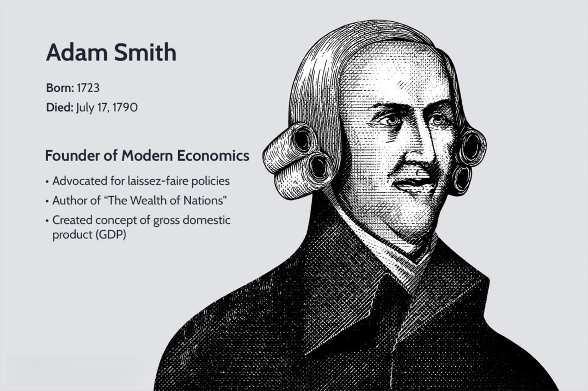

The futures market represents a vibrant and complex landscape where predictive analysis intersects with real-time data, creating substantial opportunities for both financial growth and speculation. Within this dynamic sphere, John J. Lothian has emerged as a significant figure in commodity trading and the broader financial sector, imparting a profound impact on the futures industry through his innovative methodologies and leadership.

John J. Lothian, known for founding John Lothian News, has played an instrumental role in providing insightful commentary and news that have become indispensable for industry practitioners. His career is marked by early adoption of electronic trading platforms and pioneering influence within the futures blogosphere, distinguishing him as a thought leader. His contributions extend to influential roles such as participation in the CFTC Technology Advisory Committee and induction into the Futures Hall of Fame, exemplifying his commitment to advancing industry standards.

In tandem with Lothian's influence, algorithmic trading has gained prominence. This technology-driven advancement utilizes computer algorithms to execute trades with a precision and speed that are unattainable for human traders. By analyzing a multitude of market variables, algorithms facilitate rapid trade decisions, thereby conferring competitive advantages in terms of trade execution and timing.

The progress in algorithmic trading further emphasizes the ongoing transformation of the financial markets through technology. Recent breakthroughs in machine learning and data analytics have substantially improved these trading systems' capabilities, aligning with Lothian's advocacy for continuous adaptation to technological progress. This convergence of technology and leadership points towards a future in which the futures market is increasingly automated and data-centric.

Through exploring these intertwined aspects—the enduring influence of John J. Lothian and the rapid evolution of algorithmic trading—readers are poised to gain insights into the technological and leadership dynamics that are steering the futures industry towards continued innovation and growth.

## Table of Contents

## The Legacy of John J. Lothian in the Futures Market

John J. Lothian has significantly influenced the futures market since embarking on his career, becoming a pivotal figure within the industry. As the founder of John Lothian News, he has provided crucial insights and news updates that have become indispensable resources for industry professionals. His initiative in creating a platform dedicated to news and analysis has set a benchmark for information dissemination in financial markets.

Lothian is notable for his early adoption of electronic trading, recognizing its potential to revolutionize market operations. His foresight and pioneering work in the futures blogosphere distinguish him as an industry thought leader. By embracing the digital transformation early on, Lothian paved the way for more efficient trading practices and enhanced communication across trading communities.

His role with the Commodity Futures Trading Commission (CFTC) Technology Advisory Committee underscores his ongoing dedication to advancing the futures market. By contributing his expertise to this committee, he actively participates in shaping policies and technologies that enhance market integrity and security. Additionally, his membership in the Futures Hall of Fame further cements his status as a key contributor to the industry’s evolution, recognizing his enduring impact and leadership.

Beyond his achievements in trading and market strategies, Lothian is also deeply committed to education. He places significant emphasis on educating the next generation of market participants, ensuring they are equipped with the knowledge and skills necessary for success in the rapidly evolving financial landscape. His educational initiatives, including those aimed at young professionals through platforms like MarketsWiki Education, highlight his commitment to nurturing talent and fostering a comprehensive understanding of market dynamics.

Through his multifaceted contributions, John J. Lothian continues to shape the futures industry, driving innovation and promoting educational efforts. His legacy is marked by a blend of technological adoption, thought leadership, and a steadfast dedication to industry advancement and education.

## The Rise of Algorithmic Trading

Algorithmic trading refers to the use of computer algorithms to execute trades at speeds and frequencies that surpass human capabilities. This approach has transformed the futures market by allowing traders to analyze various factors and make rapid decisions, leading to competitive advantages in both timing and execution.

In the futures market, [algorithmic trading](/wiki/algorithmic-trading) involves complex computational models that process vast amounts of data to identify patterns and predict future movements. These algorithms exploit high-frequency trading ([HFT](/wiki/high-frequency-trading-strategies)) techniques, which facilitate the quick entry and [exit](/wiki/exit-strategy) of positions, thus optimizing profit potential and minimizing risk.

Recent advancements in [machine learning](/wiki/machine-learning) (ML) and data analytics have further revolutionized algorithmic trading systems. Machine learning techniques, such as neural networks and natural language processing, offer improved prediction accuracy by adapting to evolving market conditions. These systems can analyze historical price data, market sentiment, and global economic indicators to refine trading strategies continuously. For instance, a supervised learning model might be trained using historical data, with inputs including past prices and volumes, to predict future price movements based on this information.

John J. Lothian, a notable figure in the trading industry, recognizes the significance of keeping pace with technological advancements to maintain competitiveness in financial markets. Lothian emphasizes that understanding and integrating these innovations is crucial for traders who wish to leverage the full potential of algorithmic trading.

The rise of algorithmic trading signifies a substantial shift towards more automated and data-driven decision-making processes. This evolution has democratized access to complex trading strategies, allowing even smaller market participants to employ sophisticated methods once exclusive to large institutions. Additionally, the increased efficiency associated with algorithmic trading has contributed to market [liquidity](/wiki/liquidity-risk-premium), reducing the cost of trading and narrowing bid-ask spreads.

In summary, algorithmic trading's growth, fueled by technological advancements and expert insights, represents a pivotal transition in the futures market. It underscores the increasing reliance on data and automation in financial decision-making, which is likely to continue shaping the industry in the years to come.

## Integrating Lothian's Vision with Advanced Trading Technologies

John J. Lothian emphasizes the importance of embracing technological advancements as a cornerstone for the future development of the futures market. His viewpoint underscores the necessity for industry professionals to not only adopt new technologies but also to retain a robust understanding of market fundamentals. This dual focus ensures that technological innovations are leveraged effectively without losing sight of the underlying principles that govern the markets.

A key aspect of Lothian's approach is his advocacy for educational initiatives that connect technology with market insights. For example, his support for MarketsWiki Education serves as a platform to bridge the knowledge gap, equipping new market entrants with both technological know-how and a solid grasp of market dynamics. These initiatives aim to prepare professionals for the complex and rapidly evolving financial environment by providing a comprehensive understanding of both traditional concepts and new technological tools.

In line with Lothian's vision, algorithmic trading offers significant potential to enhance operational efficiency and market effectiveness. By using sophisticated algorithms and data analysis, traders can execute orders with greater precision and speed, minimizing human error and optimizing decision-making processes. This technological integration aligns with Lothian's belief in a market driven by innovative strategies and efficiencies.

The rise of financial technology (fintech) further illustrates Lothian's vision for futures trading. Fintech innovations, such as blockchain and [artificial intelligence](/wiki/ai-artificial-intelligence), are transforming the way trades are executed, recorded, and settled. These advancements not only streamline operations but also introduce new levels of transparency and security into the market. As fintech continues to evolve, its application in futures trading exemplifies a shift towards more integrated and technologically advanced marketplaces.

Thus, John J. Lothian's vision for integrating advanced trading technologies with market knowledge paves the way for a more collaborative and innovative financial landscape. His insights highlight the critical need for continuous learning and adaptation, ensuring that market participants can successfully navigate the complexities of modern finance while capitalizing on the opportunities presented by technological progress.

## Conclusion: The Future of Futures Markets

As the futures market continues to evolve, the influence of leaders like John J. Lothian and technological advancements in algorithmic trading will be pivotal. The integration of visionary leadership with cutting-edge technology creates a symbiotic relationship that drives the dynamic future of finance. Visionaries such as Lothian emphasize the need for industry adaptation to technological change while retaining a firm grasp of market fundamentals. This approach is crucial for fostering growth, innovation, and competitiveness within the futures markets.

Market participants are encouraged to remain agile by adopting new tools and strategies. This adaptability allows them to sustain competitive advantages in a landscape increasingly dominated by algorithmic trading and data-driven decisions. Utilizing advancements in machine learning and data analytics, traders can gain insights that were previously unattainable, helping to optimize strategies and enhance execution efficiencies. Such technological integration is critical for staying ahead in the continuously and rapidly evolving financial markets.

Educational efforts and industry collaborations are poised to play significant roles in preparing the next generation for the numerous challenges and opportunities within the futures market. Initiatives like MarketsWiki Education aim to bridge the gap between technology and market knowledge, equipping future professionals with the skills needed to navigate this complex environment successfully. By fostering a culture of continuous learning and collaboration, the industry can ensure that members are well-equipped to leverage new technologies effectively.

Through understanding and leveraging the insights of industry leaders and technological innovations, the futures market stands poised for continued growth and transformation. Embracing both the visionary guidance of figures like John J. Lothian and the practical applications of advanced trading technologies positions the industry to address future challenges proactively. This balanced approach anticipates a robust and forward-looking futures market capable of adapting to, and thriving amidst, an ever-changing financial landscape.

## References & Further Reading

[1]: Bergstra, J., Bardenet, R., Bengio, Y., & Kégl, B. (2011). ["Algorithms for Hyper-Parameter Optimization."](https://dl.acm.org/doi/10.5555/2986459.2986743) Advances in Neural Information Processing Systems 24.

[2]: ["Advances in Financial Machine Learning"](https://www.amazon.com/Advances-Financial-Machine-Learning-Marcos/dp/1119482089) by Marcos Lopez de Prado

[3]: ["Evidence-Based Technical Analysis: Applying the Scientific Method and Statistical Inference to Trading Signals"](https://www.amazon.com/Evidence-Based-Technical-Analysis-Scientific-Statistical/dp/0470008741) by David Aronson

[4]: ["Machine Learning for Algorithmic Trading"](https://github.com/stefan-jansen/machine-learning-for-trading) by Stefan Jansen

[5]: ["Quantitative Trading: How to Build Your Own Algorithmic Trading Business"](https://www.amazon.com/Quantitative-Trading-Build-Algorithmic-Business/dp/1119800064) by Ernest P. Chan