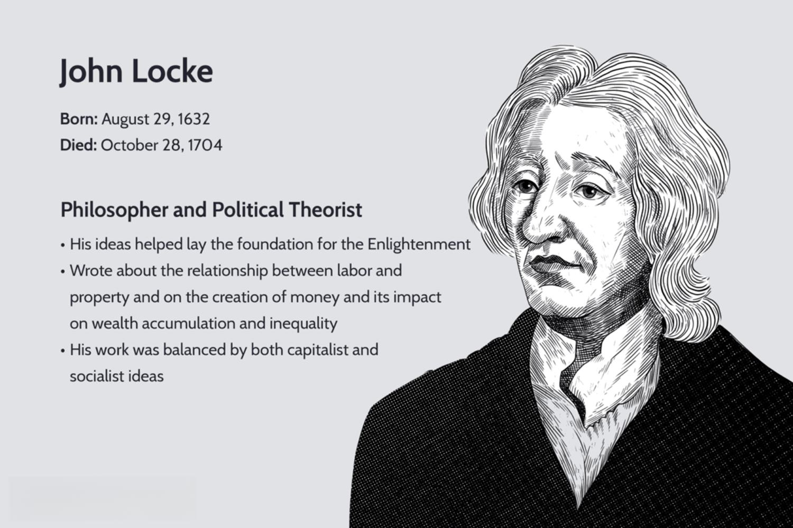

John Locke, a seminal thinker of the Enlightenment period, profoundly impacted the fields of philosophy, politics, and economics. His ideas continue to hold relevance today, particularly in algorithmic trading, where his philosophical insights into property, labor, and empiricism find contemporary echoes. Locke's view on property as a fundamental natural right aligns with the automated trading systems' foundational principles that prioritize efficiency and accuracy in asset management.

Locke's emphasis on labor as a source of wealth creation parallels the computational labor integral to modern trading algorithms. These systems, like Locke's theories, rely on empirical evidence and rational analysis, employing data-driven strategies to make financially beneficial decisions. The rational application of knowledge, championed by Locke, forms the core of the algorithms' ability to process vast datasets and execute trades based on predictive analytics.

Furthermore, Locke's contributions extend into the principles underlying capitalism, influencing current financial systems where wealth creation and monetary policy are pivotal. His interpretation of money as a consensual medium of interchange supports modern economic practices, including algorithmic trading, where financial instruments are evaluated and traded as agreed-upon stores of value.

By exploring the intersection of historical philosophy and modern trading systems, this article highlights how Locke's timeless ideas resonate within the structure of algorithmic trading, offering insights into the continuing relevance of philosophical thought in cutting-edge technological fields.

## Table of Contents

## John Locke's Philosophy: Foundations of Enlightenment

John Locke, a central figure of the Enlightenment, significantly shaped modern philosophical thought with his introduction of the concept of the mind as a "tabula rasa," or blank slate. This notion challenged existing ideas by proposing that individuals are born without innate ideas and that all knowledge is derived from experience and sensory perception. Consequently, Locke emphasized the importance of empirical evidence and rational thought in understanding and interpreting the world. By advocating for these methodologies, he established a framework that encouraged observation and experimentation as the primary means of acquiring knowledge, laying the foundation for the scientific method.

Locke's political philosophy further advanced the principles of natural rights and individual liberty. He argued that all individuals are inherently entitled to life, liberty, and property, which he saw as fundamental human rights that must be preserved by any legitimate government. This perspective was revolutionary, as it shifted the focus from monarchies and divine rights to individual freedoms and democratic governance. Locke's ideas on natural rights heavily influenced the development of liberal democracy, advocating for a political system where the government's authority is derived from the consent of the governed.

In addition to his political theories, Locke placed significant emphasis on the role of labor in wealth creation. He proposed that labor is the primary source of value, asserting that property ownership arises from the application of labor to natural resources. This theory, often referred to as the labor theory of property, underscores the intrinsic connection between labor and economic prosperity, suggesting that individual effort and work are critical components of wealth accumulation.

These philosophical concepts not only provided a crucial foundation for modern political systems but also deeply impacted economic thought. Locke's ideas inspired the development of capitalism and free-market economics by promoting the protection of private property and the idea that individuals, through personal labor and rational choice, drive economic prosperity. As such, Locke's contributions during the Enlightenment remain integral to contemporary discussions in politics, philosophy, and economics. His work continues to influence modern society, embedding principles of freedom, rationality, and empirical inquiry into the core of democratic and economic practices.

## The Intersection of Locke’s Theories and Modern Economic Practices

John Locke's economic theories underscore the integral relationship between labor and property, postulating that labor is the fundamental source of wealth and that property is a natural right derived from one's labor. Locke posits that ownership begins when an individual mixes their labor with natural resources, fundamentally shifting those resources into their personal property. This concept of property acquisition through labor forms a cornerstone of Locke’s economic philosophy and has profound implications for contemporary economic systems that emphasize individual enterprise and ownership rights as vital components of capitalism.

Locke was a proponent of minimal government intervention in economic activities, particularly in the context of interest rates. He argued that interest rates should be dictated by the natural flow of supply and demand within the market rather than imposed by regulatory mechanisms. This advocacy for market self-regulation mirrors the laissez-faire principles that underpin modern capitalist economies, where free-market dynamics are crucial for resource allocation and price determination. Algo trading, as a sophisticated product of these systems, inherently relies on market signals and fluctuations to optimize trading strategies, echoing Locke’s advocacy for the efficient and autonomous operation of markets.

Furthermore, Locke's interpretation of money as a socially consensual store of value contributes significantly to current economic discourse on monetary policy and wealth distribution. He recognized money as an extension of the barter system, enabling more efficient trade and accumulation of wealth. In Locke's view, money holds value because society collectively agrees to its worth, facilitating the preservation of wealth over time. This understanding aligns with contemporary discussions on monetary policy, where the stability and confidence in currency values are maintained through collective trust and regulatory frameworks. In the context of [algorithmic trading](/wiki/algorithmic-trading), the value of money and assets remains central to the formulation of trading strategies, where algorithms must account for fluctuations in currency value and asset prices.

## Algorithmic Trading: A Brief Overview

Algorithmic trading (often referred to as algo trading or automated trading) involves using computer algorithms to execute trading orders in financial markets automatically. These algorithms are designed to make decisions on the placement of trades based on a set of predefined instructions or strategies. The primary objective of algorithmic trading is to optimize returns by leveraging the capabilities of computers to process vast amounts of data and to execute trades at high speeds.

At its core, algorithmic trading relies on sophisticated statistical models and quantitative analysis to detect trading opportunities. These models analyze financial market data such as price, [volume](/wiki/volume-trading-strategy), and time to identify patterns and trends that can be exploited for profit. Given the vast amount of data available in modern financial markets, algorithmic trading systems can use historical and real-time data to forecast future market movements.

One of the key advantages of algorithmic trading is its speed. Computers can monitor market conditions and execute trades much faster than human traders, which is particularly important in high-frequency trading ([HFT](/wiki/high-frequency-trading-strategies)), where the speed of execution is paramount. This rapid execution reduces the potential for slippage (the difference between the expected price of a trade and the actual price) and ensures that trading strategies are implemented as intended.

Precision is another benefit of algorithmic trading. By removing the human element from the decision-making process, algorithms can operate without the influence of emotions, ensuring that trades are executed in strict adherence to the predefined strategies and conditions. This allows for more consistent performance and reduces the likelihood of errors resulting from human oversight.

Efficiency is a hallmark of algorithmic trading systems. These systems can manage multiple trading strategies across various markets simultaneously, thus maximizing the utilization of the available trading capital. The continuous analysis of market trends and data ensures that traders can adjust their strategies in real time to changing market conditions, potentially leading to more profitable outcomes.

In summary, algorithmic trading integrates technology and finance, using data and statistical models to achieve faster, more precise, and efficient trading outcomes. It harnesses the power of computers for real-time analysis and execution, underscoring the significant advancements in financial markets through technological innovation.

## Applying Locke's Philosophy to Algorithmic Trading

John Locke's philosophy emphasizes rationality and empirical evidence as primary tools for understanding the world, which closely aligns with the principles underlying algorithmic trading. Just as Locke advocated for the use of reason and evidence in philosophical inquiries, algorithmic trading relies heavily on data-driven methodologies to inform trading strategies. This parallel is evident in how trading algorithms are developed and optimized: by analyzing vast datasets to identify patterns, trends, and anomalies that inform buying and selling decisions.

Locke's theory of labor as the foundational source of wealth finds its parallel in the computational labor that is pivotal to automated trading systems. In Locke's view, labor established ownership and value, much like the computational processes in algorithmic trading, which synthesize financial indicators and historical data to generate value through informed trade executions. The algorithms represent a mechanized form of labor, continuously working to optimize portfolio outcomes.

Moreover, algorithmic trading embodies Locke's ideal of utilizing knowledge and evidence in economic activities. These systems are designed to test hypotheses concerning market behavior and adjust strategies based on empirical results. For instance, a trading algorithm might use [backtesting](/wiki/backtesting) procedures to evaluate a strategy's performance across historical data, allowing for adjustments based on empirical feedback, akin to Locke's advocacy for rational inquiry and adaptation based on observed evidence.

The adaptability intrinsic to algorithmic trading can be viewed as a contemporary application of Locke's concept of evolution through informed experience. Trading systems are frequently calibrated and refined in response to new data, evolving market conditions, and technological advancements. This capacity for adaptation reflects Locke's viewpoint that knowledge and experience drive progress and improvement. By harnessing sophisticated models and real-time data, algorithmic trading systems exemplify how informed experience fosters continuous enhancement, resonating with Locke's philosophical principles.

In conclusion, Locke's philosophies maintain a striking compatibility with modern algorithmic trading practices. By embodying empirical methodologies and advocating for informed decision-making, algorithmic trading not only mirrors Locke's ideas but also extends them into the evolving landscape of digital finance.

## Conclusion: Bridging Past Philosophies with Future Technologies

John Locke's Enlightenment ideas maintain a significant impact on the modern confluence of economics and technology, particularly in algorithmic trading. His emphasis on empirical evidence and rational reasoning finds a contemporary application in the data-driven strategies utilized to craft effective trading algorithms. In essence, the logic and observational methodologies endorsed by Locke are mirrored in the processes that form the backbone of automated trading systems, where statistical analysis and historical data guide decision-making.

As technological advancements persist, the integration of traditional philosophical perspectives, like those of Locke, with current economic practices will likely become even more prominent. Technologies such as [machine learning](/wiki/machine-learning) and [artificial intelligence](/wiki/ai-artificial-intelligence) align closely with Locke's philosophies on knowledge acquisition and application. These technologies leverage vast datasets to continually refine trading models, akin to Locke's vision of evolving understanding through informed experience.

Locke’s work endures as a powerful reminder of the relevance of philosophical ideas in practical applications. His legacy in economic thought encourages the coherent amalgamation of conceptual insights with technological innovations, emphasizing a thoughtful approach to modern challenges. This synthesis of historical philosophy and current technology fosters a richer understanding and opens pathways for future developments in trading systems and beyond. As the landscape of algorithmic trading evolves, Locke's principles offer valuable guidance in navigating the complexities of modern economics, ensuring that philosophical foundations contribute substantively to future technologies.

## References & Further Reading

[1]: ["An Essay Concerning Human Understanding"](https://www.gutenberg.org/files/10615/10615-h/10615-h.htm) by John Locke

[2]: ["Two Treatises of Government"](https://www.yorku.ca/comninel/courses/3025pdf/Locke.pdf) by John Locke

[3]: ["Advances in Financial Machine Learning"](https://www.amazon.com/Advances-Financial-Machine-Learning-Marcos/dp/1119482089) by Marcos Lopez de Prado

[4]: ["The Enlightenment and Why It Still Matters"](https://www.amazon.com/Enlightenment-Why-Still-Matters/dp/1400060680) by Anthony Pagden

[5]: ["Algorithmic Trading: Winning Strategies and Their Rationale"](https://www.wiley.com/en-us/Algorithmic+Trading%3A+Winning+Strategies+and+Their+Rationale-p-9781118460146) by Ernest P. Chan