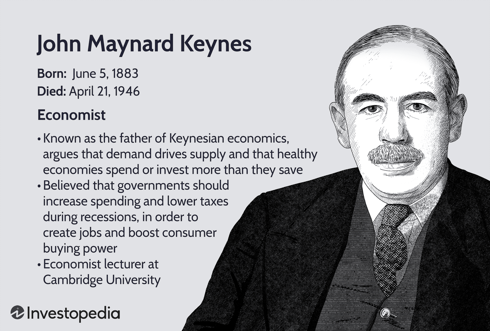

John Maynard Keynes, an influential British economist, is widely recognized as the father of modern macroeconomics. His groundbreaking contributions laid the groundwork for Keynesian economics, a theory advocating for proactive government intervention as a means to manage economic cycles, especially during recessions. Before Keynes, classical economic theories often emphasized supply-side factors and limited government interference, leaving economies vulnerable to prolonged periods of stagnation or excessive inflation. Keynes challenged this notion by proposing that aggregate demand—the total demand for goods and services within an economy—plays a pivotal role in influencing economic output and employment levels.

The core tenet of Keynesian economics is the idea that during economic downturns, private sector demand often falls short, leading to increased unemployment and idle productive capacity. To counter this, Keynes argued for increased government spending and lower taxes to stimulate demand and lift economic activity. This approach marked a sharp departure from the laissez-faire economics prevalent in the early 20th century, which favored minimal government intervention in economic affairs.



Keynesian thought has had a profound influence on shaping economic policies globally, guiding governments in implementing fiscal and monetary measures to achieve economic stability and growth. These principles not only transformed policy-making but have also permeated financial markets and trading systems, providing a framework for understanding market dynamics and informing strategies within complex systems such as algorithmic trading. Algorithmic trading, which utilizes computer-driven algorithms to execute trading instructions, often relies on economic indicators influenced by Keynesian thought to make rapid, data-driven decisions. 

This article will examine the intricate principles of Keynesian economics, assess its impact on traditional economic theories, and evaluate its significance in contemporary economic practices, including its influence on algorithmic trading. By understanding Keynesian principles, we gain valuable insights into managing economic cycles and enhancing market stability, which remain pertinent for both government policy-makers and financial traders in today’s economy.

## Table of Contents

## Keynesian Economics: Basic Principles

Keynesian economics posits that aggregate demand is the primary driver of economic activity, contrasting with classical economic theories that prioritize supply-side factors. This approach underscores the importance of total spending in an economy, advocating that when demand falls short, it leads to economic downturns, such as recessions or depressions. Keynes argued that during these periods, active government intervention is necessary to stabilize the economy. 

A fundamental tenet of Keynesian economics is that, during an economic downturn, governments should engage in deficit spending to increase aggregate demand. This involves the use of fiscal policy tools, such as increasing public expenditure and cutting taxes, even if it results in a budget deficit. The rationale is that increased government spending injects additional money into the economy, stimulating demand for goods and services, which can lead to higher production and employment levels. 

This was a transformative idea as it directly countered the classical economic viewpoint that markets are self-correcting and that supply always creates its own demand—a principle known as Say's Law. Classical economists believed that any government intervention would only distort natural market equilibria. In contrast, Keynesian economics recognizes that markets can fail to provide full employment and optimal resource allocation on their own, particularly when private sector demand is insufficient.

In mathematical terms, the Keynesian model can be expressed with a simple equation of aggregate demand $(AD)$, which is the sum of consumption $(C)$, investment $(I)$, government spending $(G)$, and net exports $(NX)$:

$$
AD = C + I + G + NX
$$

When aggregate demand falls below the level needed to maintain full employment, Keynesian economics suggests increasing $G$ to boost $AD$ and, consequently, reduce unemployment. This approach emphasizes the multiplier effect, where an increase in fiscal spending leads to a more than proportional increase in the overall economic output due to the successive rounds of spending it initiates.

By championing government intervention, Keynesian economic principles have profoundly influenced policy approaches, challenging classical economics and reshaping modern economic thought.

## Historical Context of Keynesian Economics

The Great Depression of the 1930s was a pivotal moment in economic history, acting as the catalyst for John Maynard Keynes to develop a new economic theory. The economic downturn was characterized by massive unemployment, collapsing businesses, and a significant decline in world trade. Traditional economic theories at the time, which were largely based on classical economics, offered limited solutions to mitigate these problems. Classical economists believed in the self-correcting nature of markets, advocating for minimal government intervention, a principle captured by the term laissez-faire.

John Maynard Keynes challenged this orthodoxy with his revolutionary work, "The General Theory of Employment, Interest, and Money," published in 1936. Keynes argued that, contrary to classical economists' beliefs, aggregate demand rather than supply was the primary driving force in an economy. He posited that during periods of economic downturn, total demand decreases, which leads to unemployment and unused capacity. To counteract this, Keynes proposed that governments should adopt an interventionist approach, increasing public expenditure to stimulate demand and thus maintain employment levels. This approach was known as Keynesian economics.

Keynes emphasized that during a recession, private sector investments do not necessarily pick up due to pessimistic business expectations. In such situations, it becomes crucial for the government to step in with fiscal policies, such as increased public spending and tax cuts, to invigorate demand. He argued that this might require operating fiscal deficits in the short term to kickstart economic activity and ensure full employment.

This marked a stark departure from laissez-faire economics, where the belief was that any government intervention would distort the natural market equilibrium. Keynesian theory, however, suggested that without active government intervention, economic recoveries would be slow and painful. Keynes's ideas not only influenced policy-making during the Great Depression but also laid the groundwork for modern macroeconomic policy, propelling a paradigm shift from supply-side to demand-focused economics.

The implications of Keynes's theories during the Great Depression led to a reassessment of how economies could be managed, paving the way for future governmental approaches to economic crises. The adoption of Keynesian principles contributed to the formulation of policies during similar economic challenges, making it a cornerstone in the field of economics.

## Criticism and Opposition

Keynesian economics has encountered substantial criticism, particularly from proponents of free-market capitalism. One of the foremost critics, Milton Friedman, along with other monetarists, challenged the Keynesian perspective by arguing that increased government spending can lead to sustained inflationary pressures. According to monetarists, inflation is primarily a monetary phenomenon, and excessive government intervention can distort natural economic cycles, leading to inefficiencies and misallocated resources.

Critics also contend that the Keynesian approach, which advocates for increased government expenditure during economic downturns, risks creating budget deficits that may be unsustainable in the long term. They argue that such deficits could result in crowding out private investment, as increased government borrowing drives up interest rates. This, in turn, could stifle economic growth rather than stimulate it.

Friedman and his followers propose an alternative focus on monetary policy, suggesting that controlling the money supply is more effective in managing economic stability. Their view emphasizes the self-correcting nature of free markets and suggests that minimal government intervention allows for more efficient allocation of resources.

Despite these criticisms, Keynesian economics has nonetheless been highly influential in shaping economic policies, especially during financial crises. When traditional free-market mechanisms appear inadequate, policymakers have frequently turned to Keynesian strategies to mitigate severe economic downturns. For instance, during the global financial crisis of 2008, many governments implemented stimulus packages consistent with Keynesian principles to stabilize their economies. The continued reliance on these principles during crises underscores their perceived utility in addressing complex economic challenges.

## Keynesian Economics in Practice

Keynesian economics has had a prominent place in the policy-making of various governments, particularly during times of economic distress. The practical application of these principles has been starkly illustrated in situations like the New Deal in the United States and the response to the 2008 financial crisis.

The New Deal, initiated by President Franklin D. Roosevelt in response to the Great Depression, was one of the earliest large-scale applications of Keynesian economics. This series of programs and projects was implemented between 1933 and 1939, aiming to revitalize the American economy through increased government expenditure. By focusing on infrastructure projects and providing employment through public works programs, the New Deal sought to boost aggregate demand. For instance, the Works Progress Administration (WPA) was established to create millions of jobs in various sectors including construction, education, and the arts. By investing in these areas, the government aimed to trigger a multiplier effect, where an initial increase in spending leads to further spending and overall economic enhancement.

Similarly, during the 2008 financial crisis, Keynesian principles once again took center stage as governments around the world intervened to stabilize their economies. In the United States, the federal government executed significant measures, like the Emergency Economic Stabilization Act of 2008, which included the controversial Troubled Asset Relief Program (TARP). TARP authorized $700 billion to purchase failing bank assets to restore [liquidity](/wiki/liquidity-risk-premium) and encourage lending. Additionally, the American Recovery and Reinvestment Act of 2009 allocated around $831 billion over ten years, focusing on tax cuts, expansion of unemployment benefits, and federal contracts for infrastructure projects. These initiatives were aimed at stimulating economic growth by increasing demand, much in line with Keynesian thought.

Keynesian interventions typically revolve around measures such as stimulus packages and public spending, primarily to counteract the lack of demand during economic downturns. For instance, increasing government spending during recessions helps in compensating for the reduced consumer and business spending, effectively acting as an economic stabilizer. The formula for calculating the increase in GDP arising from increased government spending is given by the Keynesian multiplier, which is expressed as:

$$
\text{Multiplier} = \frac{1}{1 - MPC}
$$

where $MPC$ is the marginal propensity to consume. This concept illustrates how every dollar spent can potentially lead to a more than proportional increase in the overall economic activity.

Overall, the application of Keynesian economics has shown that government intervention, through careful and targeted spending, can play a critical role in reviving economies during periods of financial instability.

## Relevance to Modern Financial Markets

In the current financial landscape, characterized by rapid technological advancement and global interconnectedness, the principles of Keynesian economics find renewed relevance through modern financial mechanisms such as [algorithmic trading](/wiki/algorithmic-trading). Central banks across the globe employ Keynesian strategies to guide monetary policies, aiming to manage demand and stabilize markets. This involves manipulating interest rates and regulating monetary supply to influence economic conditions in alignment with Keynesian thought, which upholds the view that government intervention can mitigate the adverse effects of economic downturns.

Algorithmic trading, a contemporary intersection of finance and technology, operates within this Keynesian framework. By deploying sophisticated algorithms and leveraging real-time data, algorithmic traders strive for market efficiency and equilibrium—objectives that resonate with Keynes's emphasis on market stability. These algorithms process vast amounts of economic indicators, such as inflation rates, employment data, and GDP growth—factors often highlighted within Keynesian analysis—to execute trades at optimal moments.

This approach not only aligns with Keynes’s advocacy for informed decision-making driven by aggregate demand metrics but also underscores the dynamic interplay between technology and economic policy. Python, a dominant programming language in algorithmic trading, facilitates the implementation of complex trading strategies based on these economic indicators. For example, a simple algorithm might be designed as follows:

```python
import pandas as pd
from matplotlib import pyplot as plt

# Load economic indicators data
data = pd.read_csv('economic_indicators.csv')

# Calculate moving averages for GDP growth and inflation
data['GDP_MA'] = data['GDP_Growth'].rolling(window=3).mean()
data['Inflation_MA'] = data['Inflation_Rate'].rolling(window=3).mean()

# Sample decision-making process: Buy if growth is up and inflation is steady
def trading_signal(row):
    if row['GDP_MA'] > row['GDP_Growth'] and row['Inflation_MA'] < row['Inflation_Rate']:
        return 'Buy'
    elif row['GDP_MA'] < row['GDP_Growth']:
        return 'Sell'
    else:
        return 'Hold'

data['Signal'] = data.apply(trading_signal, axis=1)

# Visualize signals
plt.figure(figsize=(10,5))
plt.plot(data['Date'], data['GDP_MA'], label='GDP Moving Average')
plt.plot(data['Date'], data['Inflation_MA'], label='Inflation Moving Average')
plt.scatter(data['Date'], data['Signal'] == 'Buy', color='green', label='Buy Signal', marker='^')
plt.scatter(data['Date'], data['Signal'] == 'Sell', color='red', label='Sell Signal', marker='v')
plt.title('Trading Signals Based on Economic Indicators')
plt.legend()
plt.show()
```

In this context, algorithmic trading serves as a practical application of Keynesian principles, transforming theoretical constructs into actionable strategies. By utilizing these advanced techniques, traders harness the power of Keynesian economics to navigate and manage the complexities of modern financial markets, thereby sustaining market equilibrium and fostering economic stability.

## Conclusion

Keynesian economics remains a cornerstone in both economic theory and policy-making efforts, standing resilient amid evolving economic philosophies and critiques. Its fundamental tenet, which emphasizes the importance of aggregate demand in influencing economic cycles, continues to provide meaningful guidance in stabilizing markets. This stability is crucial as governments and traders navigate the intricate landscapes of contemporary economies, characterized by rapid technological advancements and global financial interdependencies.

One of Keynesianism's significant contributions is its advocacy for proactive government policies during economic downturns. This approach has offered valuable insights into mitigating the adverse effects of recessions, thereby promoting economic recovery and growth. By advocating for increased public expenditure and intervention, Keynesian economics serves as a strategic guide for governments intent on managing economic cycles effectively. This paradigm of demand management is particularly pertinent in the context of today's global economy, where fluctuating demand can have far-reaching impacts on national and international scales.

Moreover, understanding Keynesian principles offers a strategic advantage in financial markets, especially as algorithmic trading becomes increasingly prevalent. Algorithmic trading systems, which utilize complex mathematical models and economic indicators for decision-making, can benefit from Keynesian insights into demand trends and market behavior. Algorithms can be designed to incorporate Keynesian factors such as government fiscal policies and aggregate demand fluctuations, thus enhancing their predictive accuracy and effectiveness. 

For instance, an algorithm could be constructed in Python to respond to economic indicators influenced by Keynesian policies:

```python
def evaluate_market(government_expenditure, consumer_demand):
    # Hypothetical thresholds based on Keynesian insights
    spending_threshold = 1000
    demand_growth_rate = 0.02

    if government_expenditure > spending_threshold and consumer_demand > demand_growth_rate:
        return "Invest in consumer goods"
    else:
        return "Hold investments"

gov_exp = 1200
consumer_demand = 0.03

decision = evaluate_market(gov_exp, consumer_demand)
print(decision) 
```

As algorithmic trading strategies continue to advance, incorporating Keynesian economic principles enables traders to make more informed, resilient decisions based on a century's worth of theoretical and practical knowledge. The synergy between Keynesian economics and modern trading technologies underscores the enduring relevance and adaptability of Keynes's ideas in guiding economic practices and enhancing financial stability.

## References & Further Reading

[1]: Skidelsky, R. (2003). ["John Maynard Keynes: 1883-1946: Economist, Philosopher, Statesman."](https://www.cambridge.org/core/journals/journal-of-the-history-of-economic-thought/article/abs/robert-skidelsky-john-maynard-keynes-18831946-economist-philosopher-statesman-london-macmillan-2003-pp-xxi-1021-3000-isbn-0333903129/7F0B1140D73A3A724FC570198539827D) Penguin Books.

[2]: Keynes, J. M. (1936). ["The General Theory of Employment, Interest, and Money."](https://www.files.ethz.ch/isn/125515/1366_KeynesTheoryofEmployment.pdf) Harcourt, Brace.

[3]: Friedman, M. (1968). ["The Role of Monetary Policy."](https://www.aeaweb.org/aer/top20/58.1.1-17.pdf) The American Economic Review, 58(1), 1-17.

[4]: Krugman, P. (2009). ["The Return of Depression Economics and the Crisis of 2008."](https://archive.org/details/returnofdepressi0000krug) W.W. Norton & Company.

[5]: Lopez de Prado, M. (2018). ["Advances in Financial Machine Learning."](https://books.google.com/books/about/Advances_in_Financial_Machine_Learning.html?id=oU9KDwAAQBAJ) Wiley. 

[6]: Blinder, A. S. (2008). ["Keynesian Economics."](https://www.econlib.org/library/Enc1/KeynesianEconomics.html) The Concise Encyclopedia of Economics.

[7]: Gordon, R. J. (1990). ["What Is New-Keynesian Economics?"](https://www.jstor.org/stable/2727103) Journal of Economic Literature, 28(3), 1115-1171.

[8]: Taylor, J. B. (2000). ["Reassessing Discretionary Fiscal Policy."](https://www.aeaweb.org/articles?id=10.1257/jep.14.3.21) The Journal of Economic Perspectives, 14(3), 21-36.