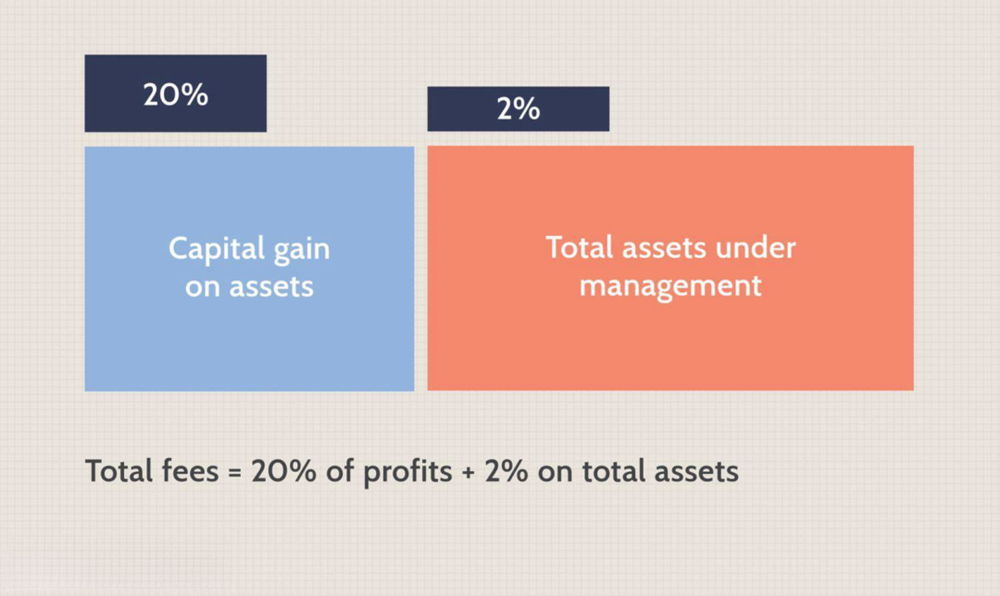

## Table of Contents

## Who is John Overdeck?

John Overdeck is a successful businessman and mathematician. He was born in the United States and studied at Stanford University. After finishing his studies, he worked at different companies, including Amazon, where he helped develop their technology.

Later, John started his own company called Two Sigma with his friend David Siegel. Two Sigma uses math and computers to help people make smart choices about money. John is now very rich and helps support many charities and schools.

## What is John Overdeck's educational background?

John Overdeck went to school at Stanford University. He studied math and got really good at it. After finishing his studies, he got a degree in math. This helped him a lot when he started working.

After Stanford, John worked at different places, like Amazon. He used his math skills to help these companies. His education was very important for his later success in starting Two Sigma.

## What are some of John Overdeck's early career achievements?

After finishing school at Stanford, John Overdeck started working at a company called D. E. Shaw & Co. There, he used his math skills to help the company make smart choices about money. He did really well at D. E. Shaw & Co. and learned a lot about how to use math in business.

Later, John moved to Amazon. At Amazon, he helped build the technology that made shopping easier for people. He used his math and computer skills to make Amazon's website better. This was a big achievement because it helped Amazon grow and become the big company it is today.

## How did John Overdeck co-found Two Sigma?

John Overdeck started Two Sigma with his friend David Siegel. They met while working at D. E. Shaw & Co. and became good friends. They both loved using math and computers to solve problems. So, they decided to start their own company where they could use their skills to help people make smart choices about money.

In 2001, John and David started Two Sigma. They used their knowledge from their past jobs to build a company that uses math and computers to help with investing. Two Sigma grew quickly because John and David were good at what they did. Today, Two Sigma is a big company that helps many people and businesses around the world.

## What is the business model of Two Sigma?

Two Sigma's business model is all about using math and computers to help people make smart choices about money. They use something called data science to look at lots of information and find patterns. This helps them predict what might happen in the future with money and investments. People and businesses pay Two Sigma to use this information to make better decisions.

Two Sigma also makes money by managing other people's investments. They use their special math and computer tools to decide where to put money so it can grow. This is called asset management. People trust Two Sigma to take care of their money because they are good at using data to make smart choices.

## What role does John Overdeck play at Two Sigma?

John Overdeck is one of the leaders at Two Sigma. He helps make big decisions for the company and guides the team on what to do next. He uses his math and computer skills to keep making Two Sigma better and better. John also helps find new ways for the company to grow and help more people.

Besides leading the company, John also works on the technology that Two Sigma uses. He helps create new tools and methods that make their data science even smarter. This helps Two Sigma stay ahead of other companies and keep doing a great job for their customers.

## What are some of the major successes of Two Sigma under John Overdeck's leadership?

Under John Overdeck's leadership, Two Sigma has grown a lot. When they started, it was just John and his friend David Siegel. Now, Two Sigma is a big company with lots of people working there. They help many businesses and people all over the world make smart choices about money. Two Sigma has become known for being really good at using math and computers to find the best ways to invest.

One big success is how Two Sigma has used data science to help with investing. They look at lots of information and use special math to find patterns. This helps them predict what might happen with money and investments. Because of this, people trust Two Sigma to manage their money and make it grow. This has made Two Sigma a leader in the world of finance.

## How has John Overdeck contributed to the field of quantitative investing?

John Overdeck has made big contributions to quantitative investing by using math and computers to make smart choices about money. He started Two Sigma with his friend David Siegel, and they use something called data science to look at lots of information. This helps them find patterns and predict what might happen with investments. Because of this, Two Sigma has become a leader in the world of finance, and many people trust them to help manage their money.

John's work at Two Sigma has shown that using math and computers can make investing better. He helps create new tools and methods that make their data science even smarter. This has helped Two Sigma grow into a big company that helps lots of people and businesses around the world. John's leadership and ideas have changed the way people think about investing and have made a big difference in the field of quantitative investing.

## What are John Overdeck's views on the use of technology in finance?

John Overdeck believes that technology is very important in finance. He thinks that using computers and math can help people make better choices about money. At Two Sigma, he uses technology to look at lots of information and find patterns. This helps them predict what might happen with investments. John thinks that technology can make investing smarter and more accurate.

John also believes that technology can help more people get involved in finance. He thinks that by using computers, even people who don't know a lot about money can make good choices. This is because technology can do a lot of the hard work for them. John wants to use technology to make finance easier and more fair for everyone.

## What philanthropy efforts has John Overdeck been involved in?

John Overdeck and his wife Laura have given a lot of money to help others. They started the Overdeck Family Foundation. This group helps kids learn better in school. They give money to schools and programs that help with math and science. They also support things like summer camps and after-school programs. John believes that helping kids learn is very important for the future.

Besides helping kids learn, John and Laura also give money to help with other big problems. They support groups that work on health, the environment, and making the world a better place. John wants to use his money to make a difference in many different ways. He thinks that by helping others, we can all have a better future.

## What awards or recognitions has John Overdeck received in his career?

John Overdeck has been recognized for his work in many ways. One big award he got is the Entrepreneur Of The Year Award from Ernst & Young. This award is given to people who start successful businesses and make a big difference. John got this award because he helped start Two Sigma and made it grow into a big company that helps people with their money.

John has also been listed on many important lists. For example, he has been on the Forbes 400 list, which shows the richest people in the United States. Being on this list shows how successful John has been with Two Sigma. He has also been on lists of the most powerful people in finance, which shows how much he has changed the world of money with his ideas and hard work.

## What are John Overdeck's future plans or projects in the finance and technology sectors?

John Overdeck wants to keep making Two Sigma better. He thinks that by using more advanced math and computers, Two Sigma can help people make even smarter choices about money. John is always looking for new ways to use technology to make investing easier and more accurate. He believes that Two Sigma can keep growing and help more people around the world.

John also wants to use technology to help more people get involved in finance. He thinks that by making tools that are easy to use, even people who don't know a lot about money can make good choices. John is working on new projects that will use technology to make finance more fair and open to everyone. He believes that this can help make the world a better place for everyone.

## References & Further Reading

[1]: [Bergstra, J., Bardenet, R., Bengio, Y., & Kégl, B. (2011). "Algorithms for Hyper-Parameter Optimization."](https://papers.nips.cc/paper/4443-algorithms-for-hyper-parameter-optimization) Advances in Neural Information Processing Systems 24.

[2]: ["Advances in Financial Machine Learning"](https://www.amazon.com/Advances-Financial-Machine-Learning-Marcos/dp/1119482089) by Marcos Lopez de Prado

[3]: ["Evidence-Based Technical Analysis: Applying the Scientific Method and Statistical Inference to Trading Signals"](https://www.amazon.com/Evidence-Based-Technical-Analysis-Scientific-Statistical/dp/0470008741) by David Aronson

[4]: ["Machine Learning for Algorithmic Trading"](https://github.com/stefan-jansen/machine-learning-for-trading) by Stefan Jansen

[5]: ["Quantitative Trading: How to Build Your Own Algorithmic Trading Business"](https://books.google.com/books/about/Quantitative_Trading.html?id=j70yEAAAQBAJ) by Ernest P. Chan