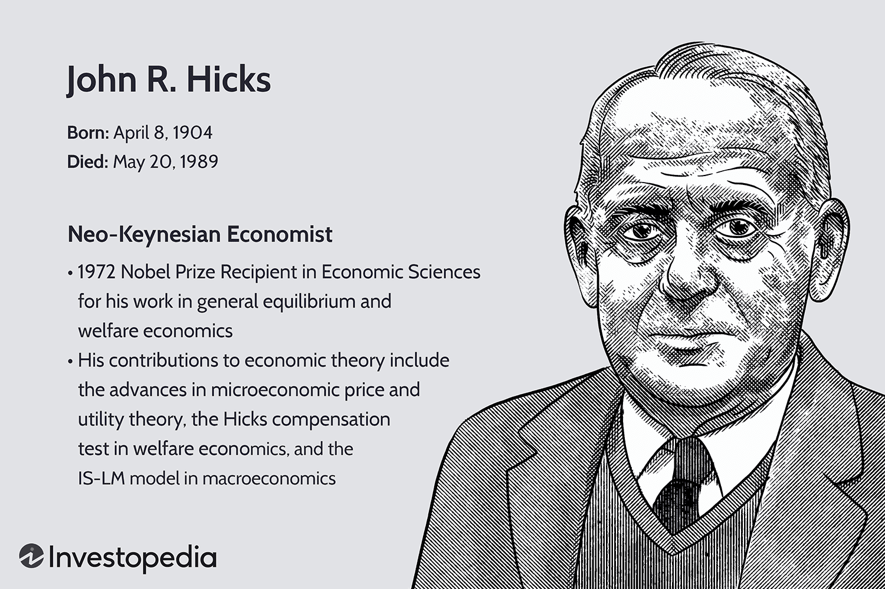

John R. Hicks stands as a pivotal figure in the development of economic theory, with his extensive contributions to both microeconomics and macroeconomics serving as a cornerstone for modern economic thought. His work not only influences theoretical frameworks but also significantly impacts practical economic applications. Hicksian theory is renowned for its innovative approaches in areas such as welfare economics and general equilibrium theory, forming the bedrock upon which many contemporary economic models are built.

A major aspect of Hicks's legacy is his profound impact on welfare economics, particularly through the introduction of concepts such as the Hicks compensation test. This concept evaluates whether economic changes can enhance overall welfare by assessing if those who benefit from economic actions can potentially compensate those who suffer losses, thereby contributing to the analysis of policy efficacy and income distribution. Moreover, his insights into general equilibrium theory explore how different economic agents and markets interact to reach a state of balance, illustrating how economies can be influenced by various internal and external changes.



Hicks's contributions extend beyond traditional economic theory into areas like financial markets, where his principles inform modern financial practices, including algorithmic trading. His work on understanding market dynamics and economic equilibrium offers valuable insights for developing algorithmic models that simulate and predict market behaviors. By examining how economic forces balance through Hicksian models, today's economists and financial analysts can devise strategies that align with or take advantage of these dynamics.

In summary, John R. Hicks's theoretical advancements have enduring significance in shaping economic thought and methodologies. The breadth of his influence is evident both in the foundational aspects of economic education and in practical applications, such as algorithmic trading, which bridge the gap between theory and real-world financial markets. As economic challenges evolve, Hicksian economic concepts continue to provide a robust framework for navigating complexities within microeconomic and macroeconomic landscapes, cementing his place as a formidable architect of modern economics.

## Table of Contents

## Hicksian Theory: An Overview

John R. Hicks made seminal contributions to economic theory, many of which remain integral to the study and application of economics today. His work on the elasticity of substitution, IS-LM model, and the Hicksian compensated demand curve stand out as pivotal concepts that continue to influence both microeconomic and macroeconomic analysis.

One of Hicks' notable contributions is the concept of the elasticity of substitution, which measures the ease with which factors of production can be substituted for one another in production processes. This elasticity is crucial for understanding how changes in relative [factor](/wiki/factor-investing) prices affect the input mix of production. Formally, the elasticity of substitution ($\sigma$) is defined as the percentage change in the capital-labor ratio ($K/L$) divided by the percentage change in the rate of technical substitution ($RTS$):

$$
\sigma = \frac{\text{d}(\ln(K/L))}{\text{d}(\ln(RTS))}
$$

This concept helps economists analyze how firms respond to changes in the market and is fundamental in discussions of production technology and income distribution.

Hicks' influence on macroeconomic theory is also marked by his development of the IS-LM model, a cornerstone of Keynesian economics. The IS-LM model describes the interaction between the real economy (goods market) and the monetary economy (money market). The IS curve represents equilibrium in the goods market, where investment equals savings, while the LM curve represents equilibrium in the money market, where the demand for money equals the supply. The intersection of these two curves determines the equilibrium levels of interest rates and output in an economy. This framework is instrumental for understanding how economic policies, such as changes in fiscal policy or monetary policy, impact economic variables like GDP and interest rates.

In microeconomics, Hicks' introduction of the Hicksian compensated demand curve further advanced consumer theory. The Hicksian demand function reflects consumer preferences adjusted for changes in income levels to maintain constant utility when prices change. This concept is key in welfare economics and in assessing consumer behavior. The Hicksian labor supply or compensated demand function is often formulated using the expenditure function $E(p, u)$, which represents the minimum expenditure required to achieve a certain utility level $u$ given price $p$:

$$
h(p, u) = \frac{\partial E(p, u)}{\partial p}
$$

These contributions from Hicks provide tools for analyzing how consumers and firms respond to economic changes, ultimately allowing economists to better understand market dynamics and economic equilibrium.

The relevance of Hicks' principles is evident when considering the historical development of economic thought and their application in contemporary economic analysis. During the early 20th century, Hicks' work helped clarify foundational economic concepts, enabling a more structured and methodical approach to economic study. Today, his theories remain relevant as they help address modern economic challenges, such as those arising from globalization, technological change, and financial market complexities.

Through his contributions, Hicks significantly shaped the analytical capabilities of economists, enhancing their ability to discern the intricacies of market behavior and economic outcomes. His work laid the groundwork for subsequent economic theories and methodologies that continue to inform both academic research and practical policy-making in economics.

## John R. Hicks and Welfare Economics

John R. Hicks made significant contributions to welfare economics, particularly through his development of the Hicks compensation test. This principle is central in assessing the impact of economic policies on social welfare by allowing economists to evaluate whether a change in economic state leads to a net benefit for society. Hicks proposed that an economic change could be considered beneficial if those who benefit from it could theoretically compensate those who are worse off, creating an overall improvement in welfare.

The Hicks compensation test, distinguished from its counterpart the Kaldor compensation test, emphasizes potential rather than actual compensation. This criterion suggests that a policy change is justified if losers could be compensated by the winners under ideal conditions, even if such compensation does not actually occur. While this theoretical compensation might be controversial and does not guarantee Pareto efficiency, it provides a pragmatic framework for policy evaluation, balancing efficiency with feasibility.

In practical applications, Hicksian welfare concepts continue to influence current economic policies. Governments and institutions apply these principles to evaluate projects such as infrastructure development, tax reforms, and public spending, where potential benefits and costs are distributed unevenly across society. For example, in cost-benefit analyses, the compensation principle helps in deciding whether to proceed with projects like road construction, considering both the direct benefits to users and indirect costs to affected communities.

Hicks also contributed to welfare economics through the concept of consumer surplus and the notion of indifference curves, which are used to understand consumer preferences and welfare changes. This mathematical representation of consumer choice remains a foundational tool in assessing utility changes resulting from policy shifts. By illustrating how consumer surplus is affected by changes in price or income, Hicksian analysis aids policymakers in crafting decisions that aim to maximize social welfare.

Overall, Hicksian welfare economics provides a robust analytical framework that informs current economic policies and decisions. Its emphasis on theoretical compensation, despite potential challenges in practical application, continues to guide the evaluation of economic policies, striving for improvements in welfare and efficiency in diverse sectors.

## The Hicksian IS-LM Model in Macroeconomics

The IS-LM model, formulated by John R. Hicks in 1937, is a fundamental analytical tool in macroeconomics, born from Hicks’ interpretation of Keynesian economics. The model synthesizes two pivotal markets in the economy: the goods market, represented by the IS curve (Investment-Savings), and the money market, represented by the LM curve (Liquidity preference-Money supply). These curves depict the equilibrium states of their respective markets, lending critical insights into the interactions between interest rates and real output (GDP).

The IS curve encapsulates the equilibrium in the goods market where total output equals total demand. It is derived from the Keynesian equation for aggregate demand, which comprises consumption, investment, government spending, and net exports. The equation typically takes the form:

$$
Y = C(Y-T) + I(r) + G + NX
$$

where $Y$ is the total output, $C$ is consumption, $T$ represents taxes, $I$ denotes investment as a function of the interest rate $r$, $G$ is government spending, and $NX$ are net exports.

The LM curve represents equilibrium in the money market, where the demand for money equals the supply. This relationship can be understood through the equation:

$$
M/P = L(Y, r)
$$

Here, $M$ is the money supply, $P$ the price level, and $L$ the [liquidity](/wiki/liquidity-risk-premium) preference function dependent on income $Y$ and interest rates $r$.

The intersection of the IS and LM curves identifies a general equilibrium of output and interest rates in the economy. This intersection provides a macroeconomic equilibrium point that establishes both the [interest rate](/wiki/interest-rate-trading-strategies) and the level of output consistent with equilibrium in both goods and money markets.

Hicks’ IS-LM model has played a pivotal role in the development of macroeconomic thought, particularly in harnessing Keynesian concepts to evaluate economic stability and policy interventions. It provides a framework for understanding how monetary and fiscal policies can influence economic performance. For instance, an expansionary fiscal policy, such as increased government spending, shifts the IS curve to the right, indicating a higher level of output at each interest rate, which can elevate the equilibrium output and potentially increase interest rates. Conversely, an expansionary monetary policy, increasing the money supply, shifts the LM curve downward, often resulting in decreased interest rates and higher output.

The model’s utility extends to analyzing economic fluctuations by depicting shifts in the IS and LM curves due to autonomous changes in spending and money supply. For example, during a recession, policies that shift the IS curve outward or the LM curve downward can help close the output gap by increasing economic activity.

While not without its limitations—such as assumptions of static prices and the exclusion of expectations—the IS-LM model’s blend of simplicity and depth continues to provide essential insights for economic policy analysis. It serves as a foundational framework for understanding how varying economic levers impact the complex interplay of goods and money markets, contributing significantly to macroeconomic stabilization strategies.

## Impact on Algorithmic Trading

John R. Hicks's contributions to economic theory, particularly his exploration of market equilibrium and efficiency, offer valuable insights into [algorithmic trading](/wiki/algorithmic-trading) strategies. Algorithmic trading, which relies on executing orders using automated and pre-programmed trading instructions, can benefit from Hicksian principles to ensure robust financial models.

Hicks's emphasis on general equilibrium theory aids in understanding market dynamics. In algorithmic trading, equilibrium concepts are crucial to ensure that trading strategies align with market conditions and participant behavior. Hicksian theory suggests that markets naturally move toward equilibrium, providing a foundation for developing algorithms that anticipate or react to these movements.

One significant concept from Hicksian theory relevant to algorithmic trading is market efficiency. Hicks's insights into resource allocation and efficiency inform strategies that seek [arbitrage](/wiki/arbitrage) opportunities or predict price movements. Efficient markets, as expounded by Hicks, imply that all available information is reflected in asset prices. Algorithmic trading, thus, can leverage Hicks's efficiency narrative through models that incorporate real-time data analysis, ensuring that trades capitalize on the most current market information.

Python, a preferred language in algorithmic trading for its extensive libraries and ease of integration, can implement Hicksian ideas to model equilibrium states:

```python
import numpy as np
import pandas as pd

# Example of using historical data to find equilibrium prices
def find_equilibrium(prices):
    return np.mean(prices)  # Using mean as a simple equilibrium estimator

historical_prices = pd.Series([100, 102, 101, 104, 103])
equilibrium_price = find_equilibrium(historical_prices)
print("Estimated Equilibrium Price:", equilibrium_price)
```

Additionally, Hicksian dynamics can guide the development of algorithms that adjust to market fluctuations. By understanding economic stability and disequilibrium, these algorithms can execute trades that align with potential macroeconomic shifts, contributing to effective risk management.

Hicks's insights encourage the design of systems that adapt to evolving market signals, ensuring algorithmic traders can both execute efficiently and strategically. His legacy in economic theory provides a robust platform for exploring enhanced securities trading models that seek to balance market participation with strategic foresight.

## The Enduring Legacy of John R. Hicks

John R. Hicks' legacy in economics is both profound and multifaceted, encompassing significant theoretical insights and practical applications that have shaped modern economic analysis and policy-making. Hicks' contributions have consistently informed the methodology and conceptual framework of economics, ensuring his principles remain integral to contemporary discourse.

Hicks' theoretical advancements, particularly in microeconomics and macroeconomics, are foundational to economic thought. One of his most impactful contributions is the development of the IS-LM model, which provides a framework for understanding the interaction between the investment-savings (IS) curve and the liquidity preference-money supply (LM) curve within an economy. This model has become a cornerstone of Keynesian economics, aiding policymakers in assessing fiscal and monetary interactions. Additionally, Hicks' concept of the elasticity of substitution has become essential in analyzing consumer behavior and production functions, influencing theories related to labor markets and international trade.

Another enduring contribution is Hicks' work on welfare economics, particularly through the Hicks compensation test. This criterion evaluates economic changes by considering whether the beneficiaries of a policy could hypothetically compensate those who are worse off, thereby indicating potential Pareto improvements. Modern economic policies continue to utilize this framework to assess the desirability of economic reforms and redistribution policies.

Hicks' influence extends beyond theoretical economics. In applied economics, his ideas underpin many contemporary practices, such as policy formulation and market analysis. His insights into market equilibrium have informed the development of models used in financial economics, including those applied in algorithmic trading. By understanding market dynamics and efficiency through Hicksian lenses, financial analysts can better predict market movements and optimize trading strategies.

Moreover, Hicksian concepts remain relevant across diverse economic disciplines. In environmental economics, for example, his welfare analysis contributes to evaluating the benefits and costs of environmental policies. In labor economics, his theories on substitution and compensation continue to inform debates on wage policies and labor mobility.

Hicks' methodologies have also critically influenced modern economic research techniques. His emphasis on equilibrium analysis has led to the widespread use of mathematical models to explore economic phenomena, fostering a more rigorous and analytical approach to economic inquiry. This has propelled advancements in econometrics and the empirical analysis of economic data, enhancing the precision of economic forecasts and policy evaluations.

In summary, John R. Hicks' contributions to economics are enduring and far-reaching. His innovative theoretical models and analytical methods have laid the groundwork for much of modern economic thought and policy-making. Hicks' legacy is evident in the continued application and evolution of his ideas in response to new economic challenges, underscoring his pivotal role in shaping the discipline.

## Conclusion

John R. Hicks' contributions to economic theory have had a profound impact on both theoretical and applied economics. His work has enhanced our understanding of market dynamics, welfare economics, and macroeconomic equilibrium. Hicksian theory continues to influence contemporary economic practices, from guiding fiscal policies to informing the strategies employed in financial markets. The elasticity of substitution, IS-LM model, and compensated demand curve remain integral tools in economic analysis, underscoring Hicks' lasting influence.

Hicks' work is particularly relevant in addressing modern economic challenges. In the financial sector, which is characterized by rapid technological advancements and increased complexity, Hicksian concepts assist in interpreting market behavior and efficiency. For example, the principles of Hicksian equilibrium can be applied to algorithmic trading, where understanding market dynamics is crucial for developing effective trading algorithms. By emphasizing the importance of balanced supply and demand, Hicks' theories help ensure that financial markets remain efficient and resilient.

Future research inspired by Hicks' legacy could focus on the integration of Hicksian economic models with advanced computational techniques. This could involve using [machine learning](/wiki/machine-learning) to refine the predictive accuracy of economic models or apply Hicks' theories in analyzing big data to better anticipate market trends. Furthermore, exploring the application of Hicksian welfare economics in evaluating new economic policies, especially those pertaining to digital currencies and decentralized finance, can yield valuable insights. Understanding these emerging areas through a Hicksian lens may provide novel solutions to contemporary economic issues.

Hicks’ enduring legacy is evident in the foundational structures of modern economic thought and practice. His theories continue to offer valuable perspectives that can guide future research and policy-making, addressing both established economic queries and new challenges.

## References & Further Reading

[1]: Hicks, J. R. (1939). *Value and Capital: An Inquiry into Some Fundamental Principles of Economic Theory.* Oxford University Press.

[2]: Debreu, G. (1959). *Theory of Value: An Axiomatic Analysis of Economic Equilibrium.* Yale University Press.

[3]: Varian, H. R. (1992). *Microeconomic Analysis.* Third Edition. W.W. Norton & Company.

[4]: Scarf, H. E. (1973). *The Computation of Economic Equilibria.* Yale University Press.

[5]: Samuelson, P. A., & Nordhaus, W. D. (2009). *Economics: A Brief Survey.* McGraw-Hill/Irwin.

[6]: Hicks, J. R. (1989). *A Market Theory of Money.* Oxford University Press.

[7]: Blaug, M. (1997). *Economic Theory in Retrospect.* Cambridge University Press.

[8]: Varian, H. R. (1984). *Microeconomic Theory.* W.W. Norton & Company.

[9]: Arrow, K. J., & Hahn, F. H. (1971). *General Competitive Analysis.* North-Holland.

[10]: Backhouse, R. E. (2002). *The Penguin History of Economics.* Penguin Books.