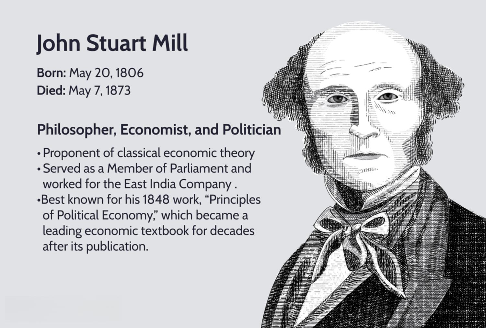

In today's fast-paced financial markets, the integration of philosophical thought into modern trading practices may seem distant. However, the philosophical ideas of John Stuart Mill, particularly his principle of utilitarianism, offer profound insights when applied to algorithmic trading. This article explores the intersection of John Stuart Mill's utilitarianism and contemporary algorithmic trading, highlighting ethical considerations and practical applications. By understanding these connections, traders and investors can foster more ethically responsible trading practices. We'll begin by introducing Mill's utilitarian philosophy before addressing the specifics of algorithmic trading and finally examining the potential synergies and conflicts. 

John Stuart Mill's utilitarianism, developed in the 19th century, posits that the best actions are those that result in the greatest happiness for the greatest number of people. This approach advocates for evaluating actions based on their outcomes, providing a framework to assess the ethical implications of decisions. In the context of financial markets, this philosophy challenges market participants to consider the broader societal impact of their trading strategies rather than focusing solely on personal or institutional profit maximization.



Algorithmic trading, the use of computer algorithms to make trading decisions and execute trades at speeds and frequencies beyond human capability, dominates modern financial markets. These systems analyze vast datasets, employing mathematical models and statistical analysis to determine optimal trading opportunities. While algorithmic trading offers significant efficiencies and profitability potential, it also raises ethical concerns. The rapid pace of trades, lack of human intervention, and possibility for manipulative practices necessitate careful ethical scrutiny.

This article aims to explore how Mill's principles can provide traders with a moral compass to navigate the complexities of algorithmic trading. By applying utilitarianism, traders can evaluate their actions based on societal welfare, seeking strategies that align personal gains with broader market stability and fairness. Understanding both Mill's philosophy and the mechanics of algorithmic trading is crucial for developing a trading environment that prioritizes ethical standards. As the financial landscape evolves with advancing technology, continuous exploration of philosophical guidance remains essential to ensure responsible trading practices.

## Table of Contents

## Understanding Utilitarianism and John Stuart Mill

John Stuart Mill was a leading 19th-century philosopher whose influence extended across various domains, including economics, logic, and ethics. His work significantly advanced the philosophical doctrine of utilitarianism, initially founded by Jeremy Bentham, emphasizing that actions should be assessed based on their ability to generate the greatest happiness for the greatest number of individuals. This principle, often encapsulated in the phrase "the greatest happiness principle," serves as the cornerstone of utilitarian thought.

Mill's seminal essays, "Utilitarianism" (1863) and "On Liberty" (1859), remain pivotal in ethical and political philosophy. In "Utilitarianism," Mill expands on Bentham's ideas by addressing qualitative differences in pleasures, opposing the notion that all forms of happiness are equal. According to Mill, intellectual and moral pleasures, being higher in quality, are more valuable than mere physical satisfaction. This nuanced view attempts to refine the utility calculus—a method of evaluating the moral worth of actions based on their consequences—by introducing a qualitative dimension to pleasure.

Furthermore, Mill's essay "On Liberty" argues for the protection of individual rights and freedoms as essential components of a well-functioning society. Mill posits that individuals should have the liberty to act as they wish, provided their actions do not harm others. This principle of liberty underscores the importance of individuality and self-expression, arguing that social progress is best achieved when individuals are free to pursue their interests and challenge societal norms.

Utilitarianism, as articulated by Mill, presents ethical considerations crucial to decision-making processes. The utilitarian framework assesses actions based on their outcomes, demanding calculations of likely consequences to maximize net happiness. This focus on outcomes rather than inherent duties or rules allows utilitarianism to adapt to various contexts, including modern practices like trading.

In the context of trading, utilitarianism prompts reflection on how financial decisions impact overall societal welfare. It provides a moral framework against which modern practices can be evaluated, challenging traders and investors to consider not merely profit but the broader social repercussions of their strategies. By adhering to utilitarian principles, trading practices can be guided towards outcomes that benefit the greatest number of stakeholders, fostering ethical and socially responsible markets.

## The Basics of Algorithmic Trading

Algorithmic trading, a sophisticated method involving the use of computerized systems, executes trades at speeds and efficiencies beyond the capacity of human traders. Central to this process are algorithms—sets of rules that process vast datasets to identify and act on market opportunities with precision. These rules encompass parameters like timing, price, quantity, and other mathematical models, which enable traders to determine the best moment to buy or sell assets.

By leveraging [algorithmic trading](/wiki/algorithmic-trading), market participants can swiftly process information to capitalize on [arbitrage](/wiki/arbitrage) opportunities, statistical discrepancies, and trends, often in fractions of a second. This capability, rooted in automation and technology, makes algorithmic trading highly prevalent in global financial markets today. For example, high-frequency trading ([HFT](/wiki/high-frequency-trading-strategies)), a subset of algorithmic trading, involves executing thousands of orders in milliseconds, exemplifying the need for speed and data-driven decisions.

As algorithmic trading systems operate on predefined criteria without real-time human intervention, this technology-driven trading method can sometimes sideline the nuanced judgment calls typically exercised by human traders. This raises pertinent questions about the reliance on computational logic over human judgment, fostering discussions about the ethical implications of machines making decisions that significantly impact financial markets.

Algorithmic trading necessitates thorough comprehension of both its mechanics and implications, particularly when assessing alignment with utilitarian principles. Utilitarianism, which emphasizes the greatest good for the greatest number, provides a framework to evaluate the intentions and outcomes of these trading systems. For instance, if algorithmic procedures inadvertently contribute to market instability or unfair exploitation, they could be seen as contravening these principles. Therefore, traders and regulators alike must consider whether their algorithmic strategies contribute to or detract from overarching ethical standards in financial markets.

Understanding the intricacies of algorithmic trading not only informs its practical applications but also aids in scrutinizing its ethical dimensions. Traders and technologists can utilize this knowledge to address potential ethical oversights, ensuring that algorithmic operations harmonize corporate interests with broader social welfare.

## Integrating Utilitarianism into Algorithmic Trading

Mill's utilitarianism provides a valuable framework for traders to assess the impact of their algorithmic trading strategies. By focusing on outcomes that promote the greatest happiness for the greatest number, traders can evaluate the ethical implications of their strategies beyond mere profitability. Algorithmic trading, while highly efficient, can raise ethical concerns, particularly regarding market manipulation and fairness. These concerns necessitate the integration of utilitarian principles to ensure that trading strategies contribute positively to the market and society.

Algorithmic trading is designed to exploit market inefficiencies using sophisticated algorithms that operate at high speeds and manage vast amounts of data. However, such speed and efficiency can lead to market manipulations or disproportionately advantage certain market participants. Utilitarian principles encourage the consideration of strategies that prioritize overall market stability and enhance investor welfare, thus supporting a more equitable financial environment.

For example, when designing an algorithm, traders should evaluate whether the strategy could increase market [volatility](/wiki/volatility-trading-strategies) or lead to unfair advantages. Utilitarianism would advocate for modifications to the algorithm that prioritize collective market benefits over individual gains. In practice, this might mean setting certain constraints within the trading algorithm to avoid exacerbating market instability. Traders could implement code that checks for excessive volatility:

```python
def check_volatility(price_data):
    volatility = calculate_volatility(price_data)
    if volatility > threshold:
        return "Pause trading"
    else:
        return "Continue trading"
```

Aligning trading practices with utilitarian principles involves a commitment to ethical considerations that go beyond short-term financial returns. By fostering strategies that discourage market manipulation and promote fair competition, traders contribute to more socially responsible financial markets. This approach not only aligns with ethical standards but also serves to enhance the reputation and sustainability of financial institutions in an increasingly scrutinized sector.

Ultimately, incorporating utilitarian principles into algorithmic trading strategies invites traders to think beyond immediate trading outcomes and consider the broader implications of their actions. This alignment can pave the way for financial markets that are more aligned with societal values, enhancing trust and stability in the economic systems they support.

## Potential Synergies and Conflicts

Synergies between utilitarian ethics and algorithmic trading lie mainly in the optimization of decision-making for the collective benefit. Utilitarianism, which seeks the greatest good for the greatest number, can enhance algorithmic trading strategies by promoting transparency and fairness, theoretically leading to more stable and efficient markets. Algorithmic systems equipped with utilitarian principles can facilitate outcomes that are not only profitable but also socially responsible, ensuring a balance between individual gains and the welfare of the broader economy.

However, conflicts between utilitarianism and algorithmic trading can arise when algorithms prioritize profit maximization over societal welfare. Algorithms are inherently driven by predefined criteria often designed to maximize financial returns without necessarily considering broader social impacts. This focus can lead to issues such as increased market volatility or inequality, where algorithms exacerbate existing market imbalances by disproportionately benefiting those with access to advanced trading technology.

Balancing speed and data-driven decisions with ethical considerations is particularly challenging in real-time trading scenarios. The efficiency of algorithmic trading is based on its capability to process and react to information faster than human traders. However, this speed can result in ethical oversights, as rapid decision-making might not always align with moral considerations. Implementing mechanisms within algorithms to assess ethical implications before executing trades could mitigate such conflicts, although it introduces complexities and potential delays.

Utilitarianism encourages transparency and accountability in the design and execution of algorithms as a means to ensure that trading practices are aligned with ethical norms. Such transparency can allow for more scrutiny and evaluation of algorithmic behavior by market participants and regulators, aiding in the prevention of unethical practices like market manipulation. Detailed documentation and auditability of algorithmic decisions are essential to holding developers accountable for their systems' impact on markets.

Addressing these conflicts requires ongoing dialogue among technologists who develop trading algorithms, ethicists who evaluate their societal impact, and market regulators who oversee fair market practices. Collaborative efforts can help establish robust frameworks that integrate ethical considerations into algorithmic trading, ensuring that technological advances contribute positively to market dynamics. Such cross-disciplinary engagement is vital to navigate the complexities at the intersection of technology and ethics, ultimately paving the way for more equitable and sustainable financial environments.

## Conclusion

The principles of utilitarianism, as espoused by John Stuart Mill, offer a meaningful framework for fostering ethical practices in algorithmic trading. These principles emphasize actions that lead to the greatest happiness or benefit for the majority. In the context of financial markets, this translates into trading strategies that not only aim for profit but also consider the broader impact on market stability, fairness, and investor welfare. By incorporating the concept of the greater good, traders can align their algorithms with ethical standards and the expectations of society, balancing profit motives with social responsibility.

While challenges in implementing utilitarian principles persist, such as the potential for algorithms to prioritize short-term gains over long-term societal benefits, the integration of Mill’s philosophy can potentially lead to more responsible and sustainable financial markets. This requires active engagement from traders, developers, and regulators to ensure that the algorithms driving these markets are transparent and account for ethical considerations.

As technology and trading practices continually evolve, ongoing exploration of the intersection between philosophy and finance remains essential. This dialogue encourages the development of algorithms that are not only efficient and profitable but also ethically sound and aligned with societal values. Emphasizing utilitarianism in algorithmic trading could pave the way for environments where financial decisions contribute positively to society, balancing the speed and efficiency of technology with the need for ethical accountability. Such synergy between philosophy and finance has the potential to create more ethically sound and sustainable trading practices, benefiting both the markets and society at large.

## References & Further Reading

[1]: Mill, J. S. (1863). "Utilitarianism." London: Parker, Son, and Bourn. [Available online](https://archive.org/details/a592840000milluoft).

[2]: Mill, J. S. (1859). "On Liberty." London: John W. Parker and Son. [Available online](https://archive.org/details/onliberty03millgoog).

[3]: Bergstra, J., Bardenet, R., Bengio, Y., & Kégl, B. (2011). ["Algorithms for Hyper-Parameter Optimization."](https://dl.acm.org/doi/10.5555/2986459.2986743) Advances in Neural Information Processing Systems 24.

[4]: López de Prado, M. (2018). ["Advances in Financial Machine Learning."](https://www.amazon.com/Advances-Financial-Machine-Learning-Marcos/dp/1119482089) Wiley.

[5]: Aronson, D. R. (2007). ["Evidence-Based Technical Analysis: Applying the Scientific Method and Statistical Inference to Trading Signals."](https://onlinelibrary.wiley.com/doi/book/10.1002/9781118268315) Wiley.

[6]: Jansen, S. (2020). ["Machine Learning for Algorithmic Trading."](https://github.com/stefan-jansen/machine-learning-for-trading) Packt Publishing.

[7]: Chan, E. (2008). ["Quantitative Trading: How to Build Your Own Algorithmic Trading Business."](https://github.com/ftvision/quant_trading_echan_book) Wiley.