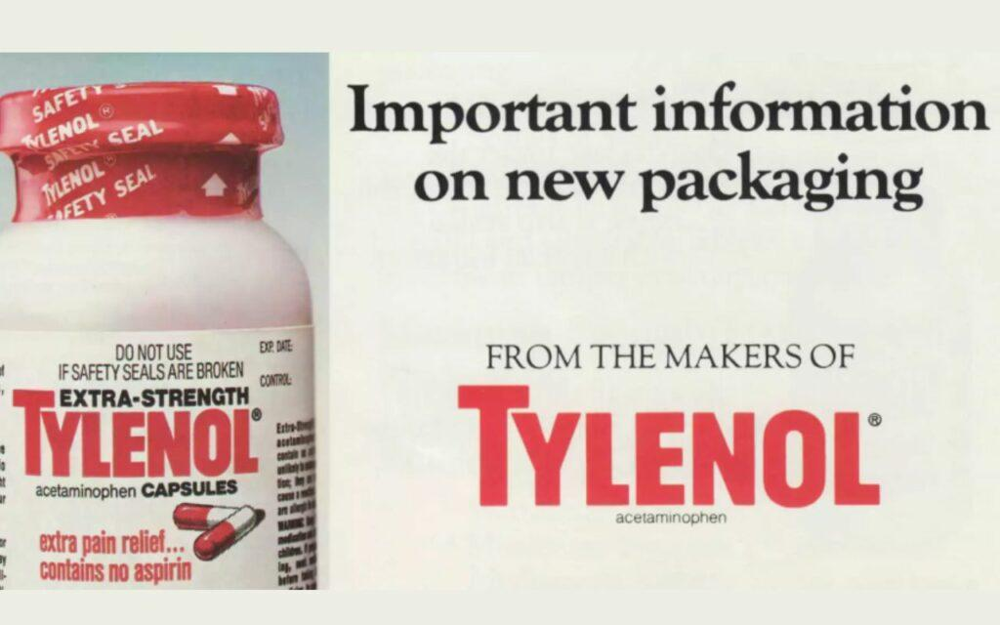

The 1982 Tylenol crisis highlights a significant episode of corporate responsibility in crisis management. At the core of this incident was Johnson & Johnson, a leading corporation, facing an unprecedented challenge. The tragedy unfolded when Tylenol, a widely-used pain relief medication, became the target of a poisoning scheme that resulted in the deaths of seven individuals in Chicago. This situation posed a critical test for Johnson & Johnson's ethical commitment and crisis management strategies.

This article examines the swift response and corporate social responsibility (CSR) initiatives executed by Johnson & Johnson during the Tylenol crisis. These efforts were instrumental in mitigating the crisis's impact on the company's market position and branding, proving essential in rebuilding consumer trust. Johnson & Johnson's actions not only addressed the immediate threat but also set industry standards for product safety and CSR.



Concurrently, the evolution of algorithmic trading in financial markets offers another lens to understand the importance of transparency and decisive action in crisis scenarios. Similar to Johnson & Johnson's approach, algorithmic trading underscores the necessity for quick responses and reliable communication in managing risks efficiently.

By exploring these topics, this article emphasizes the critical role of strategic crisis communication and ethical decision-making in restoring public trust and ensuring sustained corporate success.

## Table of Contents

## The 1982 Tylenol Crisis: A Case of Corporate Responsibility

In September 1982, the United States experienced a shocking and tragic event when Tylenol capsules were found to be laced with cyanide, leading to the deaths of seven individuals. This incident caused widespread panic amongst the public and triggered an intense media frenzy focused on consumer safety. Tylenol, a widely used pain relief medication produced by Johnson & Johnson, became synonymous with this crisis almost overnight due to its involvement in these fatal poisonings.

Despite not being responsible for the tampering, Johnson & Johnson took decisive action to address the crisis and protect consumers. The company made an unprecedented decision to recall approximately 30 million bottles of Tylenol from the shelves nationwide. This move, which cost Johnson & Johnson more than $100 million, demonstrated the company's commitment to consumer safety over immediate financial considerations. Such an expensive undertaking was rooted deeply in the company's corporate credo, which emphasizes the welfare and safety of the public as its highest priority.

The company's response to the crisis is considered a textbook example of effective crisis management and corporate ethics. Johnson & Johnson's swift and transparent actions helped to manage public fear and restore confidence in the brand. They engaged in direct communication with the public through media, ensuring that the necessary information was disseminated widely and accurately. Furthermore, Johnson & Johnson cooperated fully with law enforcement and regulatory bodies to investigate the tampering incidents and prevent future occurrences.

Johnson & Johnson's handling of the Tylenol crisis not only mitigated potential long-term damage to their brand but also set a new standard for corporate responsibility during emergencies. The company's actions exemplified how placing consumer safety and ethical considerations at the forefront can protect a brand's reputation, even in the most challenging circumstances.

## Corporate Social Responsibility and Its Impact on Brand Trust

Corporate social responsibility (CSR) refers to the practices and policies undertaken by corporations to have a positive impact on society. It embodies a company's commitment to operate in an economically, socially, and environmentally sustainable manner while acknowledging its impact on various stakeholders such as consumers, employees, and the broader community. During the 1982 Tylenol crisis, Johnson & Johnson exhibited exemplary CSR, taking swift actions that aligned with their corporate ethos and significantly influenced their brand trust.

Amid the crisis, Johnson & Johnson prioritized consumer safety above all by initiating a comprehensive nationwide recall of Tylenol products. This decisive action encompassed pulling over 30 million bottles from store shelves, a financial decision costing the company over $100 million. Despite the steep costs and the fact that the tampering occurred outside their control, the decision highlighted the company's dedication to accountability and consumer well-being, laying a robust foundation for regaining public trust.

Proactive communication was another critical element of their CSR approach. Johnson & Johnson engaged with media and healthcare professionals to inform the public about the danger and the measures being undertaken, reinforcing the brand’s transparency and responsibility. This openness not only facilitated crisis management but also demonstrated the company's commitment to ethical practices, which is a cornerstone of effective CSR.

Additionally, responding to the crisis involved a significant long-term strategy: the introduction of tamper-proof packaging. This innovation not only addressed immediate safety concerns but also set a new industry standard, further reflecting Johnson & Johnson's commitment to corporate sustainability and ethical practices over solely profit-driven motives.

The Tylenol crisis serves as a comprehensive example of how robust CSR strategies can effectively mitigate reputational damage. By prioritizing ethical commitments and consumer safety, Johnson & Johnson managed not just to restore but enhance public trust. This approach illustrates that CSR is not merely a reactive measure to crises but a strategic, long-term investment in building and maintaining a resilient brand reputation.

## Algorithmic Trading: A Modern Response to Market Crises

The financial trading industry has experienced a significant transformation with the introduction of [algorithmic trading](/wiki/algorithmic-trading), characterized by the use of sophisticated algorithms to automate and optimize trading decisions. Algorithmic trading utilizes mathematical models and complex calculations to respond swiftly to real-time market data, facilitating rapid decision-making that reduces human error and enhances efficiency. This method of trading has become integral to managing risks in financial markets, much like the swift and transparent responses required during other crises, such as the Tylenol incident.

Algorithmic trading’s ability to provide quick and decisive reactions to market fluctuations is crucial for maintaining stability and investor confidence. The algorithms employed can analyze vast amounts of data far more quickly than human traders, adapting to changes in the market landscape within milliseconds. This capability is vital in volatile market conditions, where delayed responses can lead to significant financial losses.

The integration of technological advances in the financial sector through algorithmic trading emphasizes the necessity for algorithmically-driven decisions to sustain market equilibrium. These systems are designed to perform a myriad of functions, including high-frequency trading, statistical [arbitrage](/wiki/arbitrage), and [market making](/wiki/market-making), each contributing to market efficiency. 

For example, suppose a trading algorithm monitors the price movements of a specific stock and detects an abnormal spike in price indicative of a potential market anomaly. In that case, it can execute a predefined strategy promptly—for instance, selling shares to capitalize on the price increase or buying if short-term high [volatility](/wiki/volatility-trading-strategies) is anticipated. Such operations can be implemented using Python coding as follows:

```python
def execute_trade_signal(price_data):
    # Example algorithm to decide buy or sell
    threshold = 0.05  # example threshold for decision making
    for price in price_data:
        if price['change'] > threshold:
            # sell action
            print("Sell at price:", price['value'])
        elif price['change'] < -threshold:
            # buy action
            print("Buy at price:", price['value'])

# Mock price data
price_data = [{'value': 100, 'change': 0.06}, {'value': 98, 'change': -0.04}]
execute_trade_signal(price_data)
```

Implementing algorithmic trading systems requires stringent ethical considerations and transparency to ensure fair market practices and to prevent market manipulations. As with the importance of corporate responsibility in the Tylenol case, ensuring that algorithmic trading systems are aligned with ethical standards is crucial to fostering trust and long-term sustainability in financial markets. 

Ultimately, algorithmic trading illustrates the seamless merging of technology and financial operations. It highlights the essential balance between exploiting technological efficiencies and upholding ethical norms, which remains critical in safeguarding the interests of all market participants and ensuring the continuous attraction of investor confidence.

## Lessons Learned: Bridging Corporate Ethics and Technology

The Tylenol crisis and the emergence of algorithmic trading underscore the crucial intersection of corporate ethics and technological innovation. Both scenarios demonstrate the importance of trust as a fundamental element in maintaining consumer and investor confidence. Trust is not only built by addressing problems transparently but also by taking proactive responsibility in both crisis scenarios and routine operations.

For companies and financial institutions, establishing a strong ethical foundation is essential. This foundation acts as a safeguard against potential crises and enhances the long-term sustainability of operations. Johnson & Johnson's response during the Tylenol crisis showed how prioritizing consumer safety can fortify a brand's reputation, even amidst adversity. By recalling 30 million bottles of potentially harmful products, the company placed public well-being above immediate financial loss, exemplifying how ethical practices can lead to restored public trust and eventual market recovery.

Similarly, in financial markets, algorithmic trading represents the significant evolution of technology within this sector. As trading strategies become increasingly data-driven, the role of ethics becomes more pronounced. Algorithmic trading systems must be designed to ensure they operate transparently and are robust against misuse. The potential speed and complexity of algorithmic trades necessitate a focus on responsible innovation—to prevent errors and maintain market stability.

The increasing reliance on data-driven solutions across industries calls for rigorous ethical oversight. This necessary oversight should ensure that technological advances do not compromise ethical standards. Incorporating checks and balances into the development and deployment of new technologies can mitigate risks associated with automated systems.

Therefore, the lessons from both the Tylenol crisis and algorithmic trading highlight a crucial synergy between ethical responsibility and technological progress. Companies that align their operations with transparent, responsible strategies are more likely to foster trust and support sustainable growth, regardless of their industry. These lessons reinforce that ethical innovation is not merely a beneficial strategy but a necessity in modern business practices.

## Conclusion

The 1982 Tylenol crisis remains a significant example of corporate responsibility and effective crisis management. Johnson & Johnson's immediate and decisive actions during this period have shown the power and necessity of corporate social responsibility (CSR) in restoring consumer trust and reinforcing brand integrity. Their approach, which prioritized public safety over financial considerations, serves as a benchmark for companies facing crises.

Similarly, the modern arena of financial trading, especially with the advent of algorithmic trading, underscores the critical balance between innovation and ethical responsibility. Algorithmic trading requires robust systems to ensure timely, transparent, and efficient market responses while minimizing risks and maintaining investor confidence. This balance is crucial for safeguarding market stability and trust.

Both the Tylenol crisis and the advancements in financial markets provide valuable insights into the importance of proactive and transparent strategies in managing crises and conducting daily operations. The lessons from these fields illustrate that success in contemporary business environments hinges on the interplay between ethical practices and technological innovation. By integrating these principles, organizations can foster trust and sustain growth, ensuring that they remain resilient in the face of challenges.

## References & Further Reading

[1]: Weil, D. (1982). ["The Tylenol Crisis: How Effective Public Relations Saved Johnson & Johnson."](https://www.scribd.com/document/227326155/The-Tylenol-Crisis) Public Relations Review.

[2]: Mitroff, I. I., Pauchant, T. C., & Shrivastava, P. (1988). ["The Tylenol Crisis: A Study of Its Impact on Crisis Management Practices."](https://www.sciencedirect.com/science/article/pii/0040162588900753) Journal of Public Policy & Marketing.

[3]: ["The Power of Corporate Communication: Crafting the Voice and Image of Your Business"](https://archive.org/details/powerofcorporate0000arge) by Paul A. Argenti and Janis Forman.

[4]: Richards, E. (2000). ["The History and Impact of the Tylenol Crisis."](https://www.cambridge.org/core/journals/journal-of-the-history-of-economic-thought/article/ellen-richardss-home-economics-movement-and-the-birth-of-the-economics-of-consumption/59F5DF4FCB70A362734A8E9890CE2E28) American Behavioral Scientist.

[5]: ["Algorithmic Trading and DMA: An Introduction to Direct Access Trading Strategies"](https://www.amazon.com/Algorithmic-Trading-DMA-introduction-strategies/dp/0956399207) by Barry Johnson.