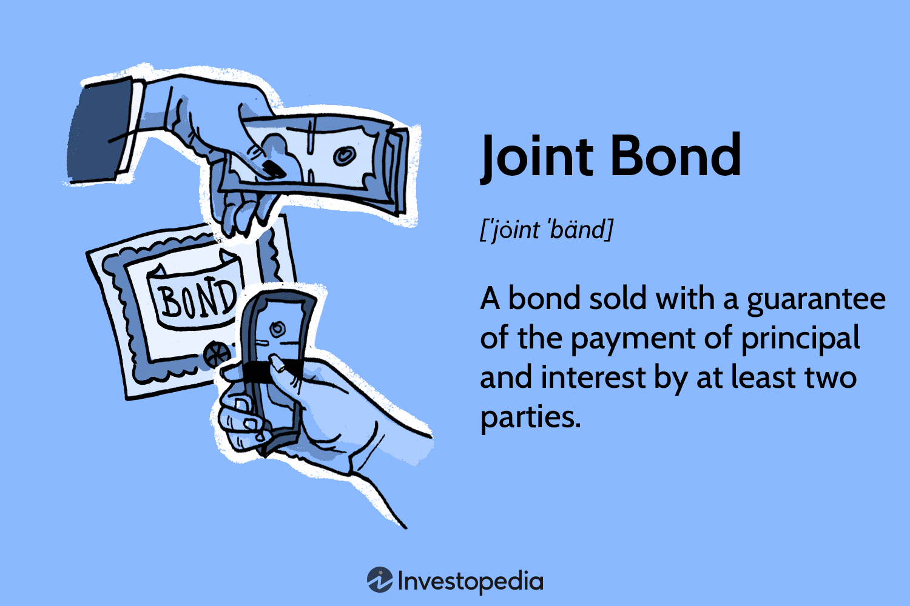

In today's financial landscape, understanding the mechanics of bonds and their trading strategies is crucial for investors and institutions alike. Bonds, which act as debt securities, have long been fundamental components in investment portfolios, serving as a means for governments and corporations to raise capital. However, as financial markets evolve, so too do the complexities and strategies surrounding bond investments. This article explores core concepts including joint bonds, bond mechanics, and algorithmic trading, which are reshaping the bond market.

Algorithmic trading's integration into bond markets has transformed traditional methods, enhancing both efficiency and transparency. The utilization of sophisticated algorithms enables automated trading, which increases the speed and accuracy of executing bond transactions. This integration has made it possible to handle the large-scale and diverse bond markets with greater precision. The algorithms analyze vast datasets, potentially identifying pricing discrepancies and other anomalies that may present profitable trading opportunities. Consequently, investors can achieve improved price discovery and reduced transaction costs.



By examining bond mechanisms, joint bonding dynamics, and examples of algorithmic trading, readers will gain insights into the evolving bond industry. Understanding bond mechanics involves recognizing the critical features that determine how they function, including the principal amount, coupon rate, and maturity date. Joint bonds, which involve multiple parties guaranteeing the bond, offer unique risk-sharing characteristics that distinguish them from traditional single-party bonds. Examples of these will highlight how risk distribution strategies are implemented in real-world scenarios.

This discussion highlights the importance of adapting to technological advancements to optimize investment strategies in the bond market. As technology continues to advance, investors and financial institutions alike must remain agile, integrating these innovations into their strategy to retain competitive advantage in the market. The future landscape of bond markets will be shaped significantly by these technological integrations, as well as by regulatory considerations ensuring fair and efficient market operations. Understanding these dynamics is essential for market participants aiming to optimize their investment outcomes.

## Table of Contents

## Understanding Bond Mechanics

Bonds are fundamental financial instruments utilized by governments and corporations to generate funds by borrowing from investors. The basic structure of a bond includes the principal, which is the initial amount borrowed, interest payments commonly referred to as coupons, and the maturity value, which is the amount returned to the bondholder upon the bond's maturity. Here, we'll explore these components and their significance in bond mechanics.

**Principal, Interest, and Maturity:**

The principal, or face value, of a bond is the amount paid back to the investor by the issuer at the bond's maturity date. Interest payments or coupons represent periodic interest payments made to the investor, usually annually or semi-annually, as compensation for lending the principal. The maturity date is when the issuer is obliged to return the principal to the bondholder.

**Types of Bonds:**

Bonds are primarily categorized into government bonds and corporate bonds. Government bonds are issued by national governments and are generally considered lower risk due to the backing of sovereign states. Conversely, corporate bonds, issued by companies, often offer higher yields to compensate for greater risk compared to government bonds. This risk-return spectrum makes understanding bond characteristics essential for crafting investment strategies.

**Bond Pricing and Yield Calculations:**

Bond pricing is influenced by several factors, including interest rates, credit quality of the issuer, and the bond's time to maturity. When market interest rates rise, bond prices typically fall and vice versa. The yield of a bond functions as a critical measure of return, encapsulating the earnings generated from investing in the bond. A common yield metric is the yield to maturity (YTM), which estimates the total anticipated return on a bond if held until maturity, factoring in its current market price, par value, coupon [interest rate](/wiki/interest-rate-trading-strategies), and time remaining to maturity.

The formula for yield to maturity is expressed as:

$$
YTM = \left( \frac{C + \frac{F-P}{n}}{\frac{F+P}{2}} \right)
$$

where:
- $C$ is the annual coupon payment,
- $F$ is the face value of the bond,
- $P$ is the price of the bond,
- $n$ is the years to maturity.

**Accrued Interest and Clean Prices:**

Understanding accrued interest and clean price is crucial in bond trading and valuation. When a bond transaction occurs between coupon payment dates, the buyer pays not only the bond price but also the interest accrued since the last coupon payment. This leads to the concept of a "dirty price," which includes accrued interest, and a "clean price," which excludes it. 

**Python Example:**

Below is a Python function to calculate the clean price of a bond, factoring in accrued interest.

```python
def calculate_clean_price(face_value, coupon_rate, market_price, days_since_last_coupon, days_in_period):
    accrued_interest = (coupon_rate * face_value / days_in_period) * days_since_last_coupon
    clean_price = market_price - accrued_interest
    return clean_price

# Example usage
face_value = 1000
coupon_rate = 0.05  # 5% annual coupon rate
market_price = 1020
days_since_last_coupon = 30
days_in_period = 180  # Assume semi-annual coupon payment

clean_price = calculate_clean_price(face_value, coupon_rate, market_price, days_since_last_coupon, days_in_period)
```

In conclusion, comprehending bond mechanics involves appreciating their structural components, understanding various bond types, grasping the intricacies of pricing and yield metrics, and the nuances of accrued interest, which together, aid in making informed investment decisions in bond markets.

## Joint Bonds: Definition and Examples

A joint bond, also known as a joint-and-several bond, is a financial instrument where multiple guarantors share the responsibility of ensuring the payment of both principal and interest. This structure is employed to mitigate investor risk, as the presence of several guarantors enhances the security of the investment. However, the reduced risk is balanced by typically offering lower returns compared to bonds that have a single-party backing.

Joint bonds are often used in cases where a subsidiary requires additional support from its parent company or other affiliated entities to secure loans. By having multiple parties guarantee the bond, lenders are more assured of the borrower’s ability to meet its obligations, thus increasing the likelihood of securing financing.

An illustrative example of joint bonds can be seen in the Federal Home Loan Joint Bonds, which are instrumental in financing community banking initiatives across the United States. These bonds provide necessary capital to smaller banking institutions, thereby facilitating their lending capabilities to local communities.

In the European Union, the concept of joint bonds has been proposed as a strategic tool for stabilizing the euro, particularly during economic crises. The idea is to have EU member states collectively back these bonds, thereby pooling resources and spreading financial risk across the union. This approach aims to enhance economic stability and cohesion among member countries, while also providing a robust mechanism to support weaker economies during periods of financial strain.

In conclusion, joint bonds serve as a pivotal mechanism in financial markets by distributing risk among multiple guarantors, ensuring stability and confidence among investors. They play a crucial role in both corporate financing and broader economic strategies, particularly during times of uncertainty.

## Algorithmic Trading in Bond Markets

Algorithmic trading employs sophisticated computer algorithms to automate and refine trading orders, substantially innovating bond trading methodologies. This technological integration is transformative yet presents distinct challenges due to the inherent complexities of the bond market. The bond market is notoriously fragmented, comprising various instruments with differing characteristics, such as maturity, credit risk, and interest payment structures. These factors make the seamless adaptation of [algorithmic trading](/wiki/algorithmic-trading) more intricate compared to its application in equity markets.

Advancements in technology and data analytics have significantly improved the efficiency and transparency of bond trading strategies. By leveraging cutting-edge algorithms, market participants can enhance market accessibility. This automation facilitates continuous monitoring of market conditions and execution of trades with precision, thus expanding [liquidity](/wiki/liquidity-risk-premium) and reducing transaction costs across diverse fixed-income markets. Algorithmic trading enables quick response times to market changes, ensuring advantageous timing and pricing of trades, which are pivotal in markets with thin liquidity.

One core advantage of algorithmic trading in bonds is its ability to handle vast datasets with high-speed processing capabilities. Algorithms can detect patterns and anomalies within the data, enabling the identification of market inefficiencies that manual trading might overlook. These inefficiencies can then be exploited for [arbitrage](/wiki/arbitrage) and trend-following strategies, optimizing investor returns. Utilizing algorithms that adapt to market movements can enhance predictive modeling, allowing traders to forecast price movements and adjust positions in real-time to minimize risk exposure.

Incorporating [machine learning](/wiki/machine-learning) models can further advance algorithmic trading in bonds. By continuously learning from historical and live data, these models improve decision-making processes, identifying subtle trends and establishing more precise pricing strategies. The quantification of risks and potential returns through algorithmic models facilitates a more informed trading approach, ensuring robust performance even amid volatile market conditions.

Overall, the integration of algorithmic trading within bond markets marks a paradigm shift towards more automated, data-driven trading strategies, enhancing efficiency and transparency in fixed-income trading. As the technology continues to evolve, it holds the promise of unlocking further innovations and improvements in the global bond market ecosystem.

## Challenges and Innovations in Algorithmic Bond Trading

Automating bond trading presents several challenges, primarily rooted in data fragmentation, varied bond characteristics, and the decentralized nature of bond markets. Unlike equity markets, which benefit from centralized exchanges, bond markets are often OTC (over-the-counter), leading to discrepancies in data access and quality. This fragmentation limits comprehensive market visibility, impacting the effectiveness of algorithmic strategies.

The complexity associated with bonds necessitates the development of bespoke algorithms. Bonds differ widely in terms of risk profile, maturity, interest rate structure, and issuer creditworthiness. Consequently, algorithms must be tailored to account for these diverse attributes. Unlike the more uniform nature of stocks, bonds require sophisticated models capable of interpreting nuanced data points. For example, yield calculations for bonds are not straightforward and might require integrating diverse financial metrics.

Technological innovations, particularly in AI and machine learning, are driving the advancement of algorithmic trading systems in bond markets. Machine learning models can analyze historical pricing patterns, economic indicators, and credit ratings to predict price movements or assess risk. These models benefit from large datasets to improve accuracy and optimize trading strategies. For instance, a machine learning algorithm could use historical price and yield data to predict the future movement of bond prices:

```python
from sklearn.model_selection import train_test_split
from sklearn.ensemble import RandomForestRegressor
import pandas as pd

# Load bond market data
data = pd.read_csv('bond_market_data.csv')

# Features and target variable
features = data.drop('future_price', axis=1)  # assuming future_price is our target
target = data['future_price']

# Split data into training and testing sets
X_train, X_test, y_train, y_test = train_test_split(features, target, test_size=0.2, random_state=42)

# Instantiate and fit the model
model = RandomForestRegressor(n_estimators=100, random_state=42)
model.fit(X_train, y_train)

# Model evaluation
score = model.score(X_test, y_test)
print(f"Model R-squared: {score}")
```

Enhanced data aggregation and analytics are essential for overcoming historical challenges in algorithmic bond trading. By consolidating disparate data sources, traders can derive insights that were previously inaccessible due to fragmented information. Improved data handling pipelines result in more comprehensive market pictures, enabling better-informed trading decisions.

As algorithmic tools continue to evolve, new trading opportunities are forecasted to emerge, potentially improving bond market efficiencies. Innovations such as real-time data processing, improved risk management applications, and advanced quantitative models promise to enhance market liquidity, reduce transaction costs, and foster a fairer trading environment.

These innovations necessitate rigorous testing and validation to ensure resilience against varied market conditions and stability amid fluctuations. As algorithms become integral to bond trading strategies, their capacity to efficiently allocate capital while minimizing risk will largely define the future success of algorithmic trading platforms.

## Conclusion

The integration of algorithmic trading with bond mechanics and joint bonds heralds significant advancements in the financial market landscape. As the financial ecosystem becomes increasingly complex, understanding the intricacies of bond mechanics and leveraging technological advancements is pivotal for remaining competitive in today's trading environment. Algorithmic trading, with its capability to process large datasets and execute orders at high speeds, brings a level of precision and efficiency previously unattainable in bond markets.

To harness the full potential of algorithmic trading, market participants must not only embrace these technological innovations but also effectively navigate the regulatory landscape designed to maintain market integrity. This includes understanding rules surrounding data transparency, market manipulation, and compliance with trading algorithms. The adherence to such regulations is critical to maximizing the benefits of algorithmic trading and protecting investor interests.

Looking forward, the future of bond markets will depend on a delicate balance between embracing technological advancement and maintaining robust oversight. Innovation, when paired with appropriate regulatory measures, can facilitate fair and transparent market operations, fostering an environment where both efficiency and trust can thrive. This equilibrium will be essential in ensuring that market participants can confidently engage with evolving technologies, such as [artificial intelligence](/wiki/ai-artificial-intelligence) and machine learning, to optimize their investment strategies.

By adapting to these transformative changes and continuously refining their approach to trading, investors can better position themselves to exploit opportunities presented by the ongoing evolution of algorithmic bond trading. This proactive stance will unlock new avenues for improved risk management, enhanced market liquidity, and potentially higher returns, underscoring the transformative potential of these technological integrations in the bond market.

## References & Further Reading

[1]: ["Advances in Financial Machine Learning"](https://www.amazon.com/Advances-Financial-Machine-Learning-Marcos/dp/1119482089) by Marcos Lopez de Prado

[2]: ["Quantitative Trading: How to Build Your Own Algorithmic Trading Business"](https://www.amazon.com/Quantitative-Trading-Build-Algorithmic-Business/dp/1119800064) by Ernest P. Chan

[3]: Duhigg, C. (2014). ["The Power of Habit: Why We Do What We Do in Life and Business"](https://www.amazon.com/Power-Habit-What-Life-Business/dp/081298160X). Random House Trade Paperbacks.

[4]: Hull, J. C. (2015). ["Options, Futures, and Other Derivatives"](https://www.amazon.com/Options-Futures-Other-Derivatives-10th/dp/013447208X). Pearson.

[5]: Fabozzi, F. J. (2007). ["Fixed Income Analysis"](https://www.amazon.com/Fixed-Income-Analysis-Frank-Fabozzi/dp/047005221X). Wiley.