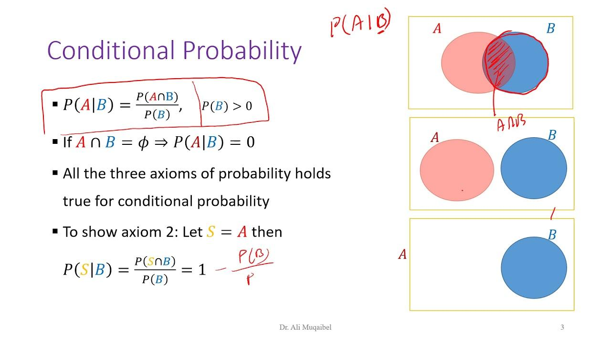

## Table of Contents

## What is joint probability?

Joint probability is a way to figure out the chance of two things happening at the same time. Imagine you want to know the likelihood of it raining and you also wearing a red shirt on the same day. Joint probability helps you calculate that. It's like looking at two events together and seeing how often they happen together.

To find the joint probability, you usually multiply the probabilities of each event happening on their own, but only if the events are independent. This means that one event doesn't affect the other. If the events are not independent, like if wearing a red shirt makes it more likely to rain (which is silly, but just an example), you need more information to figure out the joint probability. It's a useful tool in statistics and helps in understanding how different events relate to each other.

## How is joint probability different from marginal probability?

Joint probability and marginal probability are two different ways to look at the chances of things happening. Joint probability is about finding the chance of two or more things happening at the same time. For example, if you want to know the chance of it raining and you wearing a red shirt on the same day, that's joint probability. It's like looking at a specific combination of events and seeing how often they happen together.

Marginal probability, on the other hand, is about finding the chance of one single event happening, without worrying about other events. It's like focusing on one thing at a time. For example, if you just want to know the chance of it raining, regardless of what you're wearing, that's marginal probability. To find it, you might need to look at all the different ways the event could happen and add them up.

So, joint probability looks at the combination of events, while marginal probability looks at each event on its own. Both are important in understanding the chances of things happening, but they give you different kinds of information.

## Can you explain the formula for calculating joint probability?

The formula for calculating joint probability is pretty straightforward. If you have two events, let's call them A and B, the joint probability of both events happening at the same time is written as P(A and B). If the events are independent, meaning one event doesn't affect the other, you can find P(A and B) by multiplying the probability of event A happening, P(A), by the probability of event B happening, P(B). So, the formula is P(A and B) = P(A) * P(B).

But if the events are not independent, things get a bit trickier. In this case, you need to know the conditional probability, which is the chance of one event happening given that the other event has already happened. The formula then becomes P(A and B) = P(A) * P(B|A), where P(B|A) is the probability of event B happening given that event A has already happened. This way, you can still calculate the joint probability, but you need more information about how the events relate to each other.

## What is an example of joint probability in everyday life?

Imagine you're planning a picnic and want to know the chance of it being sunny and you having a free day on the same weekend. That's an example of joint probability. You'd need to know the chance of it being sunny on the weekend, and also the chance of you having a free day. If these two things don't affect each other, you can just multiply those two chances together to find out how likely it is that both will happen.

For instance, let's say there's a 70% chance (or 0.7) of it being sunny on the weekend, and a 50% chance (or 0.5) of you having a free day. If these chances are independent, you can calculate the joint probability by multiplying them: 0.7 * 0.5 = 0.35. So, there's a 35% chance that it will be sunny and you'll have a free day on the same weekend. This helps you decide if it's worth planning the picnic or if you should have a backup plan.

## How does joint probability relate to conditional probability?

Joint probability and conditional probability are closely related but look at different aspects of events happening together. Joint probability is about finding the chance of two or more things happening at the same time. For example, if you want to know the chance of it raining and you wearing a red shirt on the same day, that's joint probability. It's like looking at a specific combination of events and seeing how often they happen together.

Conditional probability, on the other hand, is about finding the chance of one event happening given that another event has already happened. For example, if you want to know the chance of it raining given that you're wearing a red shirt, that's conditional probability. It's like saying, "If this one thing happens, what's the chance of the other thing happening?" The key difference is that conditional probability focuses on the relationship between events, while joint probability looks at the overall chance of both events happening together.

The connection between joint probability and conditional probability is shown in their formulas. The joint probability of two events, A and B, can be calculated as P(A and B) = P(A) * P(B|A), where P(B|A) is the conditional probability of event B happening given that event A has already happened. This formula shows that to find the joint probability, you need to know the probability of one event and the conditional probability of the other event given the first one. So, understanding conditional probability helps you calculate joint probability when events are not independent.

## What are the common methods to estimate joint probability in statistics?

Estimating joint probability in statistics often involves using data to figure out how likely it is for two or more things to happen at the same time. One common method is to use a contingency table, which is like a chart that shows how often different combinations of events happen. By counting the number of times a specific combination occurs and dividing it by the total number of observations, you can estimate the joint probability. For example, if you're looking at the chance of it raining and you wearing a red shirt, you'd count the days when both happened and divide by the total number of days you have data for.

Another method is to use the formula for joint probability directly, especially when you have data on the individual probabilities of events. If the events are independent, you can simply multiply the probabilities of each event happening on its own. For example, if you know the chance of it raining is 30% and the chance of wearing a red shirt is 20%, you can multiply these to estimate the joint probability. However, if the events are not independent, you need to find the conditional probability of one event given the other and use that in the formula P(A and B) = P(A) * P(B|A). This method requires more detailed data but can give you a more accurate estimate when events are related.

## How can joint probability be visualized using Venn diagrams or probability tables?

Joint probability can be visualized using Venn diagrams, which are simple circles that show how different events overlap. Imagine you have two circles, one for rain and one for wearing a red shirt. The part where the circles overlap shows the joint probability of it raining and you wearing a red shirt at the same time. The size of the overlapping area compared to the whole diagram gives you an idea of how likely it is for both events to happen together. It's a great way to see at a glance how often two things happen together.

Probability tables are another way to show joint probability, and they look like a grid or chart. Each row and column represents a different event, and the cells inside the table show how often different combinations of events happen. For example, you might have a row for rain and a column for wearing a red shirt. The cell where these meet would show the number of times it rained and you wore a red shirt. By dividing this number by the total number of observations, you can see the joint probability. It's like a clear, organized way to see all the data and figure out the chances of things happening together.

## What role does joint probability play in Bayesian inference?

Joint probability is super important in Bayesian inference because it helps us update our beliefs about things based on new information. In Bayesian inference, we start with a guess about how likely something is, called the prior probability. Then, when we get new data, we use the joint probability of the new data and our guess to figure out a new, updated guess, called the posterior probability. The joint probability helps us see how well our original guess fits with the new data, so we can adjust our beliefs to be more accurate.

Think of it like this: if you think it's likely to rain and you see dark clouds, the joint probability of rain and dark clouds helps you decide if you should update your belief about rain being more likely. By using joint probability, Bayesian inference lets us make better predictions and decisions by considering all the information we have, both old and new. It's like a way to keep learning and getting smarter as we go along.

## How do independence and dependence affect joint probability calculations?

When events are independent, it means that one event doesn't affect the other. If you want to find the joint probability of two independent events happening at the same time, like the chance of it raining and you wearing a red shirt, you can just multiply the chance of each event happening on its own. For example, if there's a 30% chance of rain and a 20% chance of wearing a red shirt, the joint probability is 30% times 20%, which is 6%. It's easy to calculate because the events don't influence each other.

But when events are dependent, things get a bit trickier. If one event can change the chance of the other happening, you need more information to figure out the joint probability. For example, if wearing a red shirt makes it more likely to rain (which is silly, but just an example), you can't just multiply the chances. Instead, you need to know the conditional probability of rain given that you're wearing a red shirt. The joint probability formula then becomes the chance of wearing a red shirt times the chance of rain given that you're wearing a red shirt. This way, you can still calculate the joint probability, but it takes into account how the events are connected.

## Can you discuss the application of joint probability in machine learning algorithms?

Joint probability is really helpful in machine learning algorithms, especially when we want to understand how different things are related. Imagine you're teaching a computer to recognize pictures of dogs and cats. The computer needs to figure out the chance of seeing certain features, like pointy ears and a long tail, at the same time. That's joint probability. By looking at lots of pictures and seeing how often these features show up together, the computer can learn to tell dogs and cats apart better. It's like the computer is playing a guessing game, but with math to help it make better guesses.

In another example, think about predicting if someone will buy a product based on their age and income. A machine learning model might use joint probability to see how often people of a certain age and income level buy the product. By understanding these connections, the model can make more accurate predictions. It's like the model is trying to figure out the recipe for a perfect prediction, and joint probability helps it mix the right ingredients together. This way, machine learning can make smarter decisions and help us understand the world a bit better.

## What are the challenges in calculating joint probability for high-dimensional data?

When you're dealing with lots of different things at the same time, figuring out joint probability can get really tricky. Imagine you're trying to find out the chance of it raining, you wearing a red shirt, and your friend calling you all on the same day. That's three things happening together, and it's already a bit hard to calculate. Now, if you add more and more things, like the temperature, the time of day, and what you had for breakfast, it becomes even harder. The more things you add, the more data you need to figure out how often all those things happen together. It's like trying to solve a giant puzzle with tons of pieces.

Another challenge is that as you add more things, the calculations get a lot more complicated. With just two things, you can use simple math to figure out the joint probability. But with many things, you need to use special math tricks and computer programs to handle all the numbers. Sometimes, you might not even have enough data to figure out the joint probability accurately, because it's hard to find enough examples of all those things happening together. It's like trying to guess the recipe for a cake when you only have a few bites to taste. So, working with lots of different things at once can make figuring out joint probability a real challenge.

## How can joint probability be used in risk assessment and decision-making processes?

Joint probability is really useful when you want to figure out the risk of something happening and make smart decisions. Imagine you're a farmer deciding when to plant your crops. You need to know the chance of it raining and the soil being ready at the same time. By using joint probability, you can see how often these two things happen together and decide the best time to plant. It helps you understand the risk better, so you can make a plan that works well with the weather and the soil.

In business, joint probability can help with big decisions too. Let's say you're thinking about launching a new product. You want to know the chance of people buying it and the economy being good at the same time. By looking at the joint probability of these two things happening together, you can decide if it's a good time to launch the product. It's like putting together pieces of a puzzle to see the whole picture and make the best choice. Joint probability helps you weigh the risks and make decisions that can lead to success.

## What is Understanding Joint Probability?

Joint probability is a fundamental concept in probability theory, representing the likelihood of two events occurring simultaneously. Mathematically, it is expressed as $P(A \cap B)$, where $A$ and $B$ are two events, and $\cap$ denotes the intersection of these events. This measure provides a way to quantify the simultaneous occurrence of distinct events within a given sample space.

To appreciate the concept of joint probability, it is imperative to differentiate it from conditional probability. Conditional probability, denoted as $P(A|B)$, examines the probability of an event $A$ occurring given that event $B$ has already occurred. While joint probability considers the occurrence of events simultaneously, conditional probability focuses on the occurrence of one event under the condition that another event has transpired.

The application of joint probability is most relevant when dealing with independent or dependent events. For independent events, the joint probability can be calculated using the formula:

$$
P(A \cap B) = P(A) \times P(B)
$$

In this context, the probability of both events occurring is simply the product of their individual probabilities because they do not influence each other. However, for dependent events, where the occurrence of one event affects the likelihood of another, the calculation of joint probability requires adjusting for this dependency.

To visualize joint probabilities effectively, Venn diagrams provide a practical approach. Consider a Venn diagram where each circle represents a distinct event within a universe of possibilities. The intersection between these circles highlights the region where both events $A$ and $B$ occur together. This overlapping region accurately depicts the joint probability $P(A \cap B)$.

For instance, in a trading scenario, one might be interested in the joint probability of two market indicators, such as a particular stock price reaching a certain level (Event A) and an economic indicator hitting a forecasted value (Event B). By evaluating the intersection of these probabilistic events, traders can gain insights into the likelihood of concurrent market movements, thereby informing trading strategies.

In essence, understanding joint probability expands the analytical toolkit available to traders and statisticians, providing a structured methodology for assessing the co-occurrence of multiple events, which is particularly vital for complex decision-making processes.

## What is the Formula for Joint Probability?

The formula for joint probability is a fundamental concept in probability theory, representing the likelihood of two events occurring simultaneously. It is denoted as P(X ∩ Y), where X and Y are two independent events. This notation indicates the intersection of the two events, meaning both X and Y occur together.

To calculate the joint probability of independent events X and Y, the formula used is:

$$
P(X \cap Y) = P(X) \times P(Y)
$$

This equation holds under the assumption that X and Y are independent, meaning the occurrence of one event does not affect the probability of the other. The intersection symbol '∩' signifies that we consider the scenario where both X and Y happen at the same time, which is central to the calculation of joint probabilities.

For example, suppose we have two independent events, where P(A) denotes the probability of event A occurring, and P(B) denotes the probability of event B occurring. If P(A) = 0.3 and P(B) = 0.5, then the joint probability P(A ∩ B) is calculated as:

$$
P(A \cap B) = P(A) \times P(B) = 0.3 \times 0.5 = 0.15
$$

This result implies there is a 15% chance that both events A and B will occur together.

If the events are not independent, the joint probability needs to be adjusted to account for the dependence between events. For dependent events, the formula changes to incorporate conditional probabilities:

$$
P(X \cap Y) = P(X) \times P(Y \mid X)
$$

Where P(Y | X) is the conditional probability of Y given X. This accounts for the situation where the occurrence of Y is affected by the occurrence of X.

In terms of implementation, Python provides useful libraries for calculating joint probabilities, especially when dealing with larger datasets or more complex scenarios. Using libraries such as Pandas and NumPy can facilitate data manipulation and calculation of probabilities. Here is a simple example of calculating a joint probability using Python:

```python
import numpy as np

# Probabilities of independent events
P_A = 0.3
P_B = 0.5

# Calculating joint probability for independent events
P_A_and_B = P_A * P_B

print(f"The joint probability of A and B is {P_A_and_B}")
```

Understanding the joint probability formula requires clear insight into how event interactions influence outcomes. In real-world applications, especially in fields like [algorithmic trading](/wiki/algorithmic-trading), such calculations help in evaluating the likelihood of concurrent market events, supporting more informed decision-making processes.

## What is an example of joint probability in trading?

In the dynamic landscape of trading markets, traders often seek to estimate the likelihood of simultaneous events occurring to optimize their strategies. This is where joint probability becomes a critical tool. Consider a simple example involving two trading events: the price increase of Stock A and the price increase of Stock B. The objective is to predict the probability of both events occurring at the same time.

Suppose we define Event X as the increase in Stock A's price and Event Y as the increase in Stock B's price. To compute the joint probability $P(X \cap Y)$, we need the probability of each event and their occurrence together.

1. **Define the Probabilities**:
    - Probability of Stock A's price increasing, $P(X)$.
    - Probability of Stock B's price increasing, $P(Y)$.
    - Joint probability of both stock prices increasing, $P(X \cap Y)$.

For example, if past market data suggests that Stock A increases 40% of the time, and Stock B increases 30% of the time, with an observed simultaneous increase of 10%, these are represented as:
   - $P(X) = 0.40$
   - $P(Y) = 0.30$
   - $P(X \cap Y) = 0.10$

2. **Calculate the Joint Probability**:
    The joint probability is already given as $P(X \cap Y)$, but it can also be calculated using:
$$
    P(X \cap Y) = P(X) \cdot P(Y|X)

$$
   This formula expresses joint probability as the probability of Event X multiplied by the conditional probability of Event Y given Event X.

3. **Python Code for Calculation**:
    To automate and apply such calculations, traders can use Python. Here's a simple snippet to compute and verify joint probabilities:

    ```python
    # Define the probabilities
    P_X = 0.40  # Probability of Stock A increases
    P_Y = 0.30  # Probability of Stock B increases

    # Suppose P(X ∩ Y) is observed as 0.10
    P_X_and_Y = 0.10

    # Calculate the conditional probability P(Y|X)
    if P_X > 0:
        P_Y_given_X = P_X_and_Y / P_X

    print(f"The conditional probability of Y given X: {P_Y_given_X:.2f}")
    ```

4. **Interpreting Results**:
    Using the calculated conditional probability, traders can refine their models and strategies. For instance, knowing that the conditional probability $P(Y|X)$ is 0.25 when both stocks show a pattern of increasing, traders can leverage this information to anticipate concurrent market trends.

This example demonstrates how joint probability supports algorithmic trading by providing data-driven predictions that enhance strategy robustness. Understanding such statistical measures enables traders to optimize their actions in increasingly complex financial markets.

## References & Further Reading

[1]: ["Probability: Theory and Examples"](https://services.math.duke.edu/~rtd/PTE/PTE5_011119.pdf) by Rick Durrett

[2]: Weissman, I. (2011). ["Algorithmic Trading & DMA: An introduction to direct access trading strategies."](https://www.amazon.com/Algorithmic-Trading-DMA-introduction-strategies/dp/0956399207) 4Myeloma Press.

[3]: Williams, S. (2016). ["Technical Analysis for Beginners: Stop Blindly Following Stock Picks, Learn the Basics to Success"](https://www.thedrive.com/guides-and-gear/if-you-own-a-2011-2019-hyundai-or-kia-you-might-be-eligible-for-a-free-engine) Independently published.

[4]: Simon, C. P., & Blume, L. E. (1994). ["Mathematics for Economists"](https://www.semanticscholar.org/paper/Mathematics-for-Economists-Simon-Blume/945457b7e29f4db42665e50a1cd8d3485115a7cf) Norton.

[5]: Glasserman, P. (2004). ["Monte Carlo Methods in Financial Engineering"](https://link.springer.com/book/10.1007/978-0-387-21617-1) Springer.