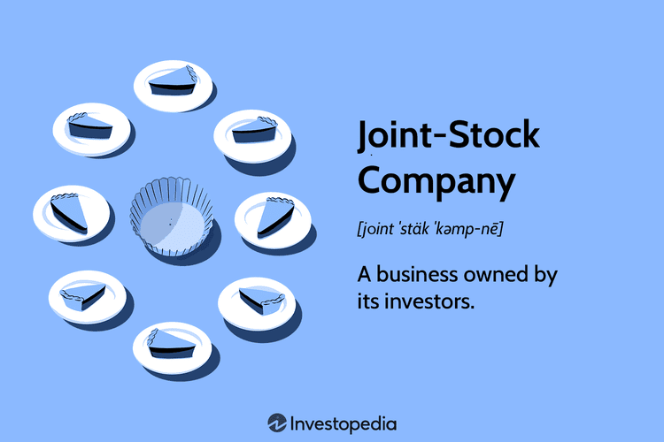

## Table of Contents

## What is a joint-stock company?

A joint-stock company is a type of business where people buy shares or parts of the company. This means they own a little piece of the company and can make money if the company does well. The people who own shares are called shareholders. They can vote on big decisions about the company and may get some of the profits as dividends.

Starting a joint-stock company helps raise a lot of money because many people can buy shares. This money can be used to grow the business or start new projects. It's different from a small business where one person or a few people own everything. In a joint-stock company, the risk is shared among all the shareholders, so if the company loses money, each person only loses what they put in.

## How does a joint-stock company differ from other business structures?

A joint-stock company is different from other business structures because it lets many people own a part of the business by buying shares. This is not like a sole proprietorship, where one person owns and runs everything, or a partnership, where a few people share ownership and profits. In a joint-stock company, the owners, called shareholders, can be many and they don't need to be involved in running the business every day. They just own a piece of it and can vote on big decisions.

Another difference is how joint-stock companies raise money. They can sell shares to the public to get a lot of money quickly, which is useful for big projects or expanding the business. This is different from a private company, where owners might need to borrow money or use their own savings. Also, in a joint-stock company, the shareholders' risk is limited to what they paid for their shares. If the company fails, they don't lose more than that, unlike in a partnership or sole proprietorship where owners can lose personal money.

Joint-stock companies also have to follow more rules and regulations compared to other business types. They need to report their finances and operations to the government and shareholders, which makes them more transparent but also more work to manage. This is different from smaller business structures that might have fewer legal requirements and less paperwork.

## What are the main advantages of forming a joint-stock company?

One big advantage of forming a joint-stock company is that it can raise a lot of money easily. By selling shares to many people, the company can get the money it needs to start big projects or grow the business. This is much easier than trying to borrow money from a bank or using the owner's own savings. Also, because many people can buy shares, the company can be owned by a lot of people, which spreads out the risk. If the company does well, everyone who owns shares can make money.

Another advantage is that shareholders have limited liability. This means if the company fails, the most a shareholder can lose is the money they paid for their shares. They don't have to worry about losing their personal money or belongings. This makes people more willing to invest in the company. Also, joint-stock companies are often seen as more trustworthy because they have to follow strict rules and report their finances openly. This can help the company attract more customers and investors.

## What are the potential disadvantages of a joint-stock company?

One big problem with joint-stock companies is that they have to follow a lot of rules and do a lot of paperwork. They need to report their finances to the government and shareholders, which can be a lot of work. This can make it harder and more expensive to run the company. Also, because the company has to share information with everyone, it might be harder to keep business secrets or make quick decisions.

Another issue is that the people who own the company, the shareholders, might not agree on what the company should do. They all get to vote on big decisions, and if they have different ideas, it can be hard to move forward. Sometimes, the people who run the company every day might not be the same people who own it, which can lead to conflicts. They might want different things for the company, and this can slow things down or cause problems.

## How is ownership structured in a joint-stock company?

In a joint-stock company, ownership is divided into shares. People can buy these shares, and each share represents a small piece of the company. The more shares someone owns, the bigger their piece of the company. These people who own shares are called shareholders. They get to vote on big decisions about the company, like who should be in charge or if the company should do something new. The number of shares someone has decides how much say they get in these votes.

Sometimes, there are different types of shares, like common shares and preferred shares. Common shares usually let people vote and get a part of the company's profits, called dividends. Preferred shares might not let people vote, but they often get their dividends first, before common shareholders. This way, the company can give different rights to different shareholders, depending on what kind of shares they own. No matter what kind of shares they have, all shareholders together make up the ownership of the joint-stock company.

## What role do shareholders play in a joint-stock company?

Shareholders are the owners of a joint-stock company because they buy shares. The more shares someone has, the bigger their ownership in the company. Shareholders get to vote on big decisions, like choosing who runs the company or if the company should start a new project. The number of shares someone owns decides how much say they get in these votes. This means shareholders have a big role in deciding the future of the company.

Shareholders also get a part of the company's profits, called dividends. These dividends are paid out to shareholders based on how many shares they own. Sometimes, there are different types of shares, like common shares and preferred shares. People with common shares usually get to vote and get dividends. People with preferred shares might not get to vote, but they often get their dividends first. So, shareholders not only help make big decisions but also share in the company's success through dividends.

## How are shares bought and sold in a joint-stock company?

Shares in a joint-stock company can be bought and sold in a few different ways. One common way is through a stock exchange, which is like a big marketplace where people trade shares. If you want to buy shares, you can go to a stockbroker, who helps you buy and sell shares on the stock exchange. You tell the stockbroker which company's shares you want and how many, and they do the work to make the trade happen. If you want to sell your shares, you do the same thing but in reverse. The stockbroker helps you find someone who wants to buy your shares.

Another way to buy and sell shares is through private deals. This happens when someone who owns shares in a company wants to sell them directly to someone else, without using a stock exchange. They agree on a price and then the shares change hands. This can be simpler and faster than going through a stock exchange, but it's less common for big, public companies. No matter how shares are bought and sold, the price can change based on how well the company is doing and how many people want to buy or sell the shares.

## What is the process for starting a joint-stock company?

Starting a joint-stock company begins with coming up with a business idea and writing a business plan. This plan should explain what the company will do, how it will make money, and how it will grow. Next, you need to choose a name for your company and make sure no one else is using it. After that, you file some paperwork with the government to officially start the company. This usually includes things like articles of incorporation, which say how the company will be run and who will be in charge.

Once the company is officially started, you need to set up how the company will be owned by selling shares. You decide how many shares the company will have and what each share is worth. Then, you can sell these shares to people who want to invest in your company. This can be done through a stock exchange or by selling shares directly to people you know. After selling the shares, you use the money to start your business. Remember, you'll need to follow rules about reporting how the company is doing to the government and the people who own shares.

## What are the legal requirements for operating a joint-stock company?

To operate a joint-stock company, you need to follow many legal rules. First, you have to register your company with the government. This means filling out forms like the articles of incorporation, which explain how your company will work and who will run it. You also need to get any special permits or licenses needed for your type of business. After that, you have to keep good records of your company's money and activities. You need to file regular reports with the government to show how your company is doing. These reports help make sure your company is following the law and being honest with shareholders.

Another big part of running a joint-stock company is holding meetings. You need to have regular meetings for shareholders where they can vote on big decisions, like choosing the board of directors or approving big changes in the company. You also need to have meetings for the board of directors, who help run the company day-to-day. It's important to keep good notes of these meetings and share them with shareholders. Also, you have to be careful about how you use the money you get from selling shares. You can't just use it for anything; it has to be used for the company's business. If you don't follow these rules, you could get in trouble with the law.

## How do joint-stock companies manage governance and decision-making?

In a joint-stock company, governance and decision-making are managed through a structure that involves shareholders, a board of directors, and company officers. Shareholders own the company by buying shares, and they get to vote on big decisions, like choosing the board of directors or approving major changes in the company. The number of shares someone owns decides how much say they get in these votes. Shareholders usually vote at meetings that happen regularly, where they can discuss and decide on important issues. This helps make sure the company is run in a way that many owners agree with.

The board of directors is chosen by the shareholders to help run the company. The board makes important decisions about the company's direction and strategy, but they don't run the day-to-day operations. Instead, they hire company officers, like the CEO, to manage the company's daily work. The board meets regularly to review how the company is doing, discuss any problems, and plan for the future. They have to make sure the company follows the law and does what's best for the shareholders. This way, the company can be managed well even though it has many owners.

## What are the financial reporting obligations for a joint-stock company?

A joint-stock company has to follow strict rules about telling the government and its shareholders how it's doing financially. This means they have to make financial reports regularly, usually every three months and at the end of the year. These reports show how much money the company made, how much it spent, and how much it owes. The company has to be honest in these reports because they help people decide if they want to buy or sell shares in the company. If the company doesn't tell the truth, it can get in big trouble.

Besides regular reports, a joint-stock company also has to get its financial statements checked by a special kind of accountant called an auditor. The auditor looks at the company's [books](/wiki/algo-trading-books) to make sure everything is correct and that the company is following the law. After checking, the auditor writes a report saying if the financial statements are right or if there are problems. This helps keep the company honest and makes shareholders feel more sure about the company's financial health.

## How do joint-stock companies handle mergers, acquisitions, and dissolution?

When a joint-stock company wants to merge with another company or buy another company, it needs to follow some steps. First, the company's leaders, like the board of directors, need to talk about the plan and see if it's a good idea. If they think it is, they have to tell the shareholders about it. The shareholders get to vote on whether to go ahead with the merger or acquisition. If most of the shareholders agree, the company can move forward with the deal. They need to fill out special forms and get permission from the government to make the merger or acquisition official. This can be a long process, but it helps make sure that everyone who owns part of the company agrees with the big change.

If a joint-stock company decides to close down, or dissolve, it also has to follow some rules. First, the board of directors needs to decide if closing the company is the best thing to do. They then tell the shareholders about the plan, and the shareholders vote on it. If most of the shareholders agree, the company can start the process of dissolving. This means the company has to pay off all its debts and sell off its things to get money. After that, any money left over is given to the shareholders based on how many shares they own. The company has to fill out forms with the government to make the dissolution official. This process makes sure that the company closes down in a fair way and that everyone gets what they're owed.

## What are the challenges and risks?

Algorithmic trading has fundamentally reshaped financial markets, offering unprecedented speed and efficiency. However, it also presents several challenges and risks that need to be carefully managed.

### Market Volatility

One of the most significant risks associated with [algorithmic trading](/wiki/algorithmic-trading) is increased market [volatility](/wiki/volatility-trading-strategies). Algorithms can react almost instantaneously to market data, leading to rapid buying and selling that can cause significant price swings. This was evident during the "Flash Crash" on May 6, 2010, where the Dow Jones Industrial Average plunged about 1,000 points within minutes, only to recover shortly thereafter. The incident was partly attributed to automated trading systems that triggered a cascade of selling. 

Mathematically, the volatility, often measured by the standard deviation $\sigma$ of price returns, can see sharper fluctuations in an algorithm-driven market. Such volatility can be modeled using stochastic differential equations like the Geometric Brownian Motion:

$$
dS_t = \mu S_t dt + \sigma S_t dW_t
$$

Where:
- $S_t$ is the stock price at time $t$,
- $\mu$ is the drift coefficient,
- $\sigma$ is the volatility,
- $dW_t$ is the Wiener process.

### Regulatory and Ethical Considerations

High-frequency trading ([HFT](/wiki/high-frequency-trading-strategies)) prompts various regulatory and ethical concerns. Regulatory bodies, such as the U.S. Securities and Exchange Commission (SEC) and the European Securities and Markets Authority (ESMA), impose stringent measures to mitigate the risks associated with HFT. These include ensuring market fairness and transparency and preventing manipulative practices like spoofing, where large orders are placed and canceled before execution to manipulate prices.

From an ethical standpoint, high-frequency firms face scrutiny regarding the fairness of using advanced technologies to gain a competitive edge over traditional investors. The debate centers on equitable access to market data and the impact of these practices on long-term investors.

### Case Studies of Market Disruptions

Beyond the Flash Crash, other instances underscore the risks of algorithmic errors. In 2012, Knight Capital Group faced a significant crisis when a faulty algorithm unleashed a barrage of erroneous trades, resulting in a $440 million loss and nearly bankrupting the firm. This incident highlighted the necessity of robust testing and monitoring systems for algorithms to prevent similar failures.

Another noteworthy case occurred in 2016 when a trading algorithm used by Waddell & Reed Financial, Inc. unintentionally contributed to market instability. The algorithm, designed to sell a large number of futures contracts, inadvertently created an overwhelming feedback loop with other algorithms, exacerbating market volatility.

### Conclusion

The integration of algorithmic trading in modern joint-stock companies presents both opportunities and challenges. While it enhances trading efficiency, it also requires comprehensive risk management strategies to address the potential for increased volatility and ensure adherence to regulatory and ethical standards.

## References & Further Reading

[1]: Carlos, A.V. & Nicholas, S. (1988). ["'Giants of an Earlier Capitalism': The Chartered Trading Companies as Modern Multinationals."](https://www.jstor.org/stable/3115542) Business History Review, 62(3), 398-419.

[2]: Neal, L. (1990). ["The Rise of Financial Capitalism: International Capital Markets in the Age of Reason."](https://archive.org/details/riseoffinancialc0000neal) Princeton University Press.

[3]: De Jong, A., & Roell, A. (2005). ["Financing and Control in The Netherlands: A Historical Perspective."](https://bintproject.nl/textfiles/2005_dejong-roell.pdf) Erasmus Research Institute of Management.

[4]: Pardo, R. (2008). ["The Evaluation and Optimization of Trading Strategies."](https://onlinelibrary.wiley.com/doi/book/10.1002/9781119196969) Wiley.

[5]: Clifford, J.G. (1990). ["Trading companies in Asia, 1600–1830."](https://warwick.ac.uk/fac/arts/history/ghcc/eac/events/upcoming_events/goodsfromtheeast/final_programme_proof.pdf) The Cambridge Economic History of India.

[6]: Patel, S. (2013). ["High Frequency Trading and Flash Crashes: Opportunities and Challenges for Risk Management."](https://link.springer.com/article/10.1007/s11408-019-00331-6) Wharton Research Scholars Journal.

[7]: Allen, F., & Gale, D. (2001). ["Comparative Financial Systems: A Discussion."](https://core.ac.uk/download/pdf/6649943.pdf) Journal of Financial Services Research, 19(2-3), 123-131.

[8]: Terrill, R.J. (2002). ["The Role of Joint-Stock Companies in Financial History."](https://quizlet.com/221605678/ch-2-american-colonies-emerge-flash-cards/) World Bank Economies in Transition.