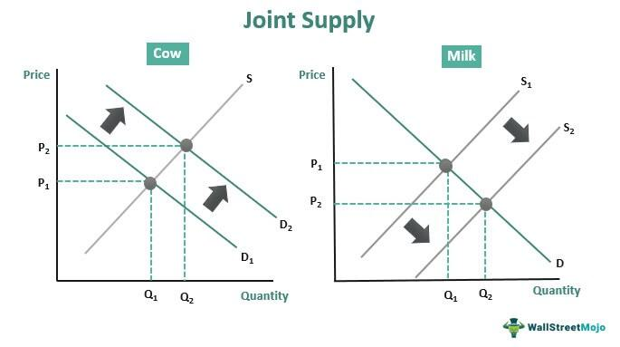

The modern economic landscape is characterized by an intricate web of supply and demand relationships, pivotal in both established and innovative markets. Central to this landscape are concepts like joint demand and joint supply. Their understanding has become increasingly significant in the context of algorithmic trading, a field that automates and optimizes financial transactions using sophisticated algorithms. 

Joint demand refers to the phenomenon where the demand for one product is directly linked to the demand for another. For instance, the demand for printers is closely tied to the demand for ink cartridges. Conversely, joint supply involves a production process that yields multiple outputs simultaneously, such as cattle farming, which produces both beef and hides. These concepts are foundational to economic theory, affecting business strategies, market pricing, and supply chain dynamics.



In recent years, algorithmic trading has revolutionized financial markets by employing these economic principles. Algorithms systematically analyze vast datasets, identifying patterns and executing trades with precision that human traders might miss. Understanding the dynamics of joint demand and supply empowers algorithms to make informed predictions and execute trades that leverage interrelated market movements efficiently. 

This article investigates into the synergy between economics and algorithmic trading, scrutinizing how joint demand and supply impact market interactions and trading strategies. As the economic landscape becomes increasingly digital, these relationships will play a crucial role in shaping the future of financial markets and enhancing the efficiency of trading strategies.

## Table of Contents

## Understanding Joint Demand

Joint demand is a fundamental economic concept where the demand for two or more goods is interconnected such that a change in the demand for one directly affects the demand for the other. This concept is most commonly observed in the case of complementary goods—products that are usually consumed together. A classical example is the relationship between printers and ink cartridges. When consumers purchase a printer, they inherently increase the demand for its compatible ink cartridges and vice versa. Similarly, the consumption of smartphones often affects the demand for complementary accessories like phone cases, chargers, and earbuds.

The phenomenon of joint demand can significantly impact business strategies in various ways, particularly influencing pricing tactics and market positioning. Companies must consider the interdependent nature of their products when devising strategies to optimize market presence and profitability. An alteration in price or a promotional campaign for one product can substantially affect the demand for associated products. For instance, if a firm decides to discount printers, it might anticipate a subsequent increase in the sales of ink cartridges.

Pricing strategies incorporating joint demand often employ bundling, where related products are sold as a package at a reduced price compared to purchasing each item separately. This approach not only stimulates demand for all products involved but also enhances customer value perception.

From a mathematical perspective, joint demand can be understood through the lens of cross-price elasticity of demand. Cross-price elasticity measures how the quantity demanded of one good in response to a price change in another good. For complementary goods, this coefficient is negative, indicating that a price decrease in one good leads to an increased demand for the other. This relationship can be expressed as:

$$
E_{xy} = \frac{\% \Delta Q_x}{\% \Delta P_y}
$$

where $E_{xy}$ is the cross-price elasticity of demand, $\% \Delta Q_x$ is the percentage change in quantity demanded of good $x$, and $\% \Delta P_y$ is the percentage change in price of good $y$.

Understanding these dynamics is essential for businesses aiming to optimize their operations in markets with tightly linked products. Companies can leverage this interconnected demand to align their marketing efforts, production schedules, and inventory management more effectively, ensuring that their strategic decisions support sustained demand across their product offerings.

## Exploring Joint Supply

Joint supply refers to scenarios where a single production process yields multiple outputs. This phenomenon is prevalent in numerous industries, where the creation of one good inadvertently results in the production of others. For instance, cattle breeding does not only result in beef but also produces hides, which can be transformed into leather products. Such interdependencies necessitate a comprehensive understanding of supply chains and the formulation of suitable financial strategies for effective cost allocation.

The concept of joint supply is an essential consideration in industries that deal with raw materials capable of generating multiple valuable outputs. In the agricultural sector, a primary example includes the processing of a sunflower seed, which concurrently produces both sunflower oil and meal. Similarly, refining [crude oil](/wiki/crude-oil) produces various petroleum products, such as gasoline, diesel, and kerosene.

Managing joint supply requires detailed analysis and planning to ensure that the benefits of producing multiple outputs are maximized while the costs are well-allocated. It involves identifying the variable and fixed costs associated with the production process and strategically distributing these costs among the joint products based on their market value or other relevant factors. For example, if the total cost of processing 1000 units of raw material is $10,000 and results in two products A and B, where A's market value is twice that of B, the cost allocation could be proportionate to the value realization from each product.

In a practical scenario, consider a company engaged in sheep farming that produces both wool and meat. The allocation of costs must take into account the relative market prices of wool and meat to determine the financial viability and pricing strategies for both outputs. This requires a nuanced understanding of market trends and demands, ensuring that a business remains competitive and profitable.

Advanced computational models can be employed to optimize joint supply management, using techniques like linear programming or other optimization algorithms to assess the most efficient production strategies. Here's a basic Python example to illustrate a simple model of optimizing joint product outputs:

```python
from scipy.optimize import linprog

# Objective function coefficients (e.g., costs)
c = [-20, -15]  # Simplified profit coefficients for products A and B

# Inequality constraints (e.g., production limits)
A = [[1, 2], 
     [3, 1]]
b = [2000, 3000]

# Bounds for each variable (e.g., production constraints)
x_bounds = (0, None)
y_bounds = (0, None)

# Solving the linear problem
res = linprog(c, A_ub=A, b_ub=b, bounds=[x_bounds, y_bounds])

print(f"Optimal production level for product A: {round(res.x[0], 2)}")
print(f"Optimal production level for product B: {round(res.x[1], 2)}")
```

In conclusion, joint supply presents both opportunities and challenges in production planning and cost management. By accurately determining cost allocations and remaining aware of market dynamics, businesses can leverage joint supply scenarios to enhance profitability and operational efficiency.

## Implications of Joint Demand and Joint Supply in Economics

Joint demand and joint supply are pivotal components of economic theory, playing a crucial role in the analysis of market dynamics. These concepts significantly influence pricing models and production strategies. Joint demand arises when the consumption of one product necessitates the consumption of another, such as smartphones and data plans. In contrast, joint supply occurs when the production of one good unavoidably results in the production of another, exemplified by the livestock industry, where beef and leather are produced simultaneously.

In a market context, joint demand impacts pricing strategies because producers must consider the interconnected demand for related products. For instance, a decrease in the price of a primary good could lead to increased demand for its complementary good, necessitating a reevaluation of pricing strategies to maximize revenue. This relationship compels firms to adjust not only the prices but also the quantities supplied to maintain market equilibrium, enhancing their competitiveness.

Similarly, joint supply affects production strategies since the production of one good influences the supply of its by-product. For example, in oil refining, the production of gasoline naturally leads to the generation of other petroleum-based products like lubricants. Efficient allocation of production resources necessitates understanding this relationship to ensure optimal use of inputs and minimize waste. Companies that effectively leverage joint supply can improve profitability by aligning production outputs with market demands.

Both joint demand and joint supply are critical in analyzing market shifts and crafting economic policies. In fluctuating markets, understanding these relationships provides insights into potential consumer behavior changes and supply chain adjustments. For policymakers, recognizing the implications of joint demand and supply aids in anticipating market reactions to economic interventions, thereby refining the formulation of fiscal and monetary policies.

Moreover, these concepts offer valuable insights for economic forecasts. By analyzing trends in joint demand and supply, economists can predict changes in market conditions, consumer preferences, and production trends. These forecasts enable businesses to adapt their strategies proactively, maintaining resilience against market [volatility](/wiki/volatility-trading-strategies).

Overall, joint demand and joint supply are foundational elements that inform various aspects of economic analysis, from pricing decisions to policy formulation. Their understanding enables businesses and policymakers to navigate complex market environments effectively, contributing to more informed and strategic economic decision-making.

## Algorithmic Trading and Economic Principles

Algorithmic trading employs economic principles, notably supply and demand, as the cornerstone for automating trading processes. This integration enhances market efficiency by executing trades based on pre-established criteria, responding swiftly to market changes, and minimizing human error. The implementation of algorithms allows for processing vast volumes of data in real-time, enabling traders to capitalize on market movements that reflect underlying economic conditions.

Concepts such as joint demand and joint supply are crucial when designing efficient trading algorithms. Joint demand refers to the interdependence in the demand for complementary goods, impacting pricing and availability in markets. In [algorithmic trading](/wiki/algorithmic-trading), recognizing these interdependencies can enhance the anticipation of market shifts, allowing traders to set more accurate pricing models. For example, in the foreign exchange market, the demand for one currency often affects another, similar to how printers and ink cartridges function in joint demand. Algorithms can automatically identify and exploit these relationships, making informed decisions about currency pairs in anticipation of correlated movements.

Similarly, joint supply, which arises when a production process yields multiple outputs, can offer insights for algorithm developers. In contexts where the supply of one product influences another, such as the production of oil also generating natural gas, algorithms can be designed to adjust strategies based on production reports. Understanding these joint supply dynamics allows for more nuanced models that predict the impact of supply chain changes on related commodities.

Through the use of advanced data analytics and real-time monitoring, algorithmic trading systems continuously evaluate economic indicators and market data. For instance, Python can be used to code a simple moving average crossover strategy, which can be enhanced by incorporating joint demand and supply considerations:

```python
import pandas as pd

def moving_average_strategy(data, short_window, long_window):
    data['short_mavg'] = data['price'].rolling(window=short_window, min_periods=1).mean()
    data['long_mavg'] = data['price'].rolling(window=long_window, min_periods=1).mean()

    data['signal'] = 0
    data.loc[data['short_mavg'] > data['long_mavg'], 'signal'] = 1
    data.loc[data['short_mavg'] < data['long_mavg'], 'signal'] = -1

    return data

# Example usage with your data
# df = pd.read_csv('market_data.csv')
# signals = moving_average_strategy(df, short_window=40, long_window=100)
```

By embedding the principles of joint demand and supply, such algorithms are capable of making dynamic adjustments to strategies based on observed market conditions. Traders benefit from these informed decisions, gaining a competitive edge by operating with enhanced precision and speed.

The application of economic theories in algorithmic trading underscores the pressing need to consider complex interrelationships within the market. As technology advances, the seamless integration of these economic principles into trading strategies ensures that traders remain agile in the face of evolving market landscapes.

## Case Studies: Joint Demand, Joint Supply, and Algo Trading

Case study analysis reveals the intricate ways in which the concepts of joint demand and joint supply are harnessed within algorithmic trading strategies across diverse sectors. This section examines real-world examples to illustrate how these economic relationships are applied in financial markets, detailing the strategic integration and the resulting efficiencies.

### Joint Demand in Algorithmic Trading

One pertinent example of joint demand comes from the retail and consumer goods sector, where algorithmic trading models capitalize on demand correlations between complementary products. Consider the relationship between smartphones and accessories like chargers and cases. A spike in demand for a newly launched smartphone often leads to an increased demand for its accessories. Algorithmic trading systems detect these patterns using real-time data analytics. For instance, when a significant increase in smartphone sales is detected, algorithms might predict and invest in relevant accessory manufacturers or suppliers, anticipating a surge in their stock prices. This predictive capability enhances market responsiveness and boosts investment returns by aligning trades with market expectations.

Python code illustrates how such correlations might be programmed:

```python
import pandas as pd
import numpy as np
from sklearn.linear_model import LinearRegression

# Hypothetical sales data for smartphones and accessories
data = {'smartphones': [1000, 1500, 2000, 2500],
        'accessories': [300, 450, 600, 750]}

df = pd.DataFrame(data)

# Linear regression to find relationship
model = LinearRegression()
model.fit(df['smartphones'].values.reshape(-1, 1), df['accessories'])

# Predicting accessories sales for a new smartphone demand
new_demand = 3000
predicted_accessories = model.predict(np.array([[new_demand]]))
print(f"Predicted Accessories Demand: {predicted_accessories[0]}")
```

### Joint Supply in Algorithmic Trading

The concept of joint supply is exemplified in the agriculture sector, particularly with livestock. When cattle are processed, both beef and hides are produced as joint products. Algorithmic trading platforms monitor market conditions and adjust strategies based on the profitability of these outputs. For example, when beef prices increase due to demand fluctuations, the associated rise in hide production can stimulate investments in related markets such as leather goods manufacturing.

Through algorithmic trading, firms can adjust their inventory and pricing models swiftly. Such adaptability is demonstrated when algorithms incorporate seasonal trends or demand forecasts from different geographical markets, therefore optimizing supply chain logistics and enhancing profitability. This approach not only maximizes returns on primary products like beef but also captures value from secondary products like hides, underpinning a holistic trading strategy.

### Integrated Example Across Sectors

A diversified firm involved in both technology and agriculture might utilize algorithmic trading to manage its portfolio. By comparing the demand correlations in tech accessories with agricultural outputs, the firm can optimize its investment strategy across different business units. Leveraging [machine learning](/wiki/machine-learning) models, the algorithm might allocate resources dynamically between manufacturing accessories and increasing leather production, depending on predicted profitability.

This strategic application underscores how joint demand and joint supply principles are pivotal in not only raising efficiency but also in maximizing returns within algorithmic trading systems. As demonstrated, these economic concepts offer expansive opportunities for traders to exploit interconnected market dynamics and refine their automated trading processes.

## Conclusion

Joint demand and supply are integral to economic theory, providing a framework to understand interactions within markets. These concepts are crucial for analyzing how products and services are interconnected through mutual dependencies and shared production processes. By considering joint demand and supply, businesses and economists can better comprehend the complexities of market dynamics, allowing for more precise anticipation of fluctuations and shifts in economic conditions.

In algorithmic trading, these economic principles are leveraged to enhance the efficiency of financial decision-making. By integrating joint demand and supply into algorithms, traders can refine their strategies and optimize trade executions. This involves exploiting relationships between asset prices to predict market movements better and manage risk more effectively. For instance, recognizing correlated price movements between two stocks due to joint demand aspects might allow an algorithm to execute [arbitrage](/wiki/arbitrage) opportunities or adjust portfolio allocations in real-time.

As the digital economy continues to advance, the implications of joint demand and supply deepen. The proliferation of data and improved computational technologies enable more sophisticated models, allowing traders to incorporate complex economic interactions into their strategies. This not only contributes to more strategic financial decisions but also promotes enhanced market stability and [liquidity](/wiki/liquidity-risk-premium). Algorithmic trading, underpinned by these economic relationships, is playing a pivotal role in shaping the future of financial markets, driving innovation, and ensuring that markets operate with increased precision and reduced latency. 

In conclusion, the ever-evolving digital economy will continue to harness the power of joint demand and supply principles, ensuring their relevance in crafting innovative trading strategies and influencing the broader economic landscape.

## References & Further Reading

[1]: ["Economics"](https://en.wikipedia.org/wiki/Economics) by Campbell R. McConnell, Stanley L. Brue

[2]: ["Principles of Economics"](https://en.wikiversity.org/wiki/10_Principles_of_Economics) by N. Gregory Mankiw

[3]: Viswanathan, S. (2010). ["Algorithmic Trading: The Basics and the Effect of Market Structure."](https://people.duke.edu/~viswanat/researchpage.htm) Financial Analysts Journal, Vol. 66, No. 3.

[4]: Lopez de Prado, M. (2018). ["Advances in Financial Machine Learning."](https://www.amazon.com/Advances-Financial-Machine-Learning-Marcos/dp/1119482089) John Wiley & Sons.

[5]: Chan, E. (2009). ["Quantitative Trading: How to Build Your Own Algorithmic Trading Business."](https://github.com/ftvision/quant_trading_echan_book) John Wiley & Sons.

[6]: Jansen, S. (2020). ["Machine Learning for Algorithmic Trading: Predictive models to extract signals from market and alternative data for systematic trading strategies with Python."](https://www.amazon.com/Machine-Learning-Algorithmic-Trading-alternative/dp/1839217715) Packt Publishing.

[7]: Brealey, R. A., Myers, S. C., & Allen, F. (2019). ["Principles of Corporate Finance."](https://www.mheducation.com/highered/product/Principles-of-Corporate-Finance-Brealey.html) McGraw-Hill Education.