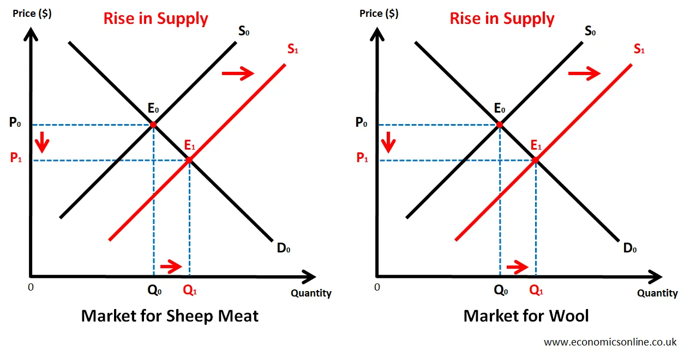

## Table of Contents

## What is joint supply in economics?

Joint supply in economics happens when producing one good automatically leads to the production of another good. For example, when a cow is slaughtered for beef, it also gives us leather. Both beef and leather come from the same cow, so they are in joint supply. This means that the supply of one product is tied to the supply of the other product.

Changes in the production of one good can affect the supply of the other good. If more cows are raised for beef, there will also be more leather available. On the other hand, if fewer cows are raised, the supply of both beef and leather will decrease. Understanding joint supply helps businesses and economists predict how changes in one market can impact another related market.

## What is joint demand in economics?

Joint demand in economics happens when two or more products are used together. For example, cars and gasoline have joint demand because you need both to drive. If more people want to buy cars, the demand for gasoline will also go up. This means that the demand for one product affects the demand for the other product.

Understanding joint demand is important for businesses. If a company makes cars, they need to think about how many people will need gasoline too. If the price of gasoline goes up, fewer people might buy cars because driving will be more expensive. This shows how closely linked the demand for these products can be.

## How do joint supply and demand differ from regular supply and demand?

Joint supply and joint demand are special cases of supply and demand. Regular supply and demand focus on one product at a time. For example, if the price of apples goes up, more people might want to sell apples, so the supply of apples increases. On the other hand, joint supply happens when making one thing also makes another thing. Like when you get both beef and leather from a cow. If more cows are raised for beef, you automatically get more leather too.

Joint demand is different from regular demand because it involves two or more products that are used together. For example, if more people buy cars, the demand for gasoline will also go up because you need both to drive. Regular demand looks at how the price or other factors affect the demand for just one product. But with joint demand, a change in one product's demand can affect the demand for another product that is used with it.

## Can you provide examples of goods that are in joint supply?

When you think about joint supply, think about things that come from the same source. For example, when farmers grow wheat, they don't just get wheat grains. They also get wheat straw, which can be used for animal bedding or as a building material. So, wheat and wheat straw are in joint supply because you get both from the same plant.

Another good example is when you think about oil production. When companies drill for oil, they often find natural gas too. Both oil and natural gas come from the same wells, so they are in joint supply. If a company decides to drill more for oil, they will also get more natural gas. This shows how the supply of one can affect the supply of the other.

## Can you provide examples of goods that are in joint demand?

When you think about joint demand, think about things that you use together. A good example is printers and ink cartridges. If more people buy printers, they will also need more ink cartridges. So, the demand for printers affects the demand for ink cartridges. If the price of ink goes up, fewer people might buy printers because printing will be more expensive.

Another example is smartphones and mobile data plans. People buy smartphones to use them with mobile data. If more people want to buy smartphones, the demand for mobile data plans will also go up. If the price of mobile data goes up, it might make people think twice about buying a new smartphone because using it will be more expensive.

## How does a change in the supply of one good affect the supply of a jointly supplied good?

When goods are in joint supply, making more of one good automatically means you make more of the other good too. For example, if farmers decide to grow more wheat, they will also get more wheat straw. This is because wheat and wheat straw come from the same plant. So, if the supply of wheat goes up, the supply of wheat straw goes up too.

If the supply of one good goes down, the supply of the other good will also go down. Let's say oil companies decide to drill less for oil. Since oil and natural gas come from the same wells, less drilling for oil means less natural gas too. This shows how closely linked the supply of jointly supplied goods can be.

## How does a change in the demand for one good affect the demand for a jointly demanded good?

When goods are in joint demand, a change in the demand for one good will affect the demand for the other good. For example, if more people want to buy cars, they will also need more gasoline. Cars and gasoline are used together, so if the demand for cars goes up, the demand for gasoline goes up too. This shows how closely linked the demand for these goods can be.

If the demand for one good goes down, it can also bring down the demand for the other good. Let's say the price of mobile data plans goes up. This might make people less interested in buying new smartphones because using them will be more expensive. So, if fewer people want to buy smartphones, the demand for mobile data plans will also go down. This is how changes in demand for one good can impact the demand for a good that is used with it.

## What are the economic implications of joint supply and demand for producers?

Joint supply and demand can have big effects on what producers do. For joint supply, when producers make more of one thing, they also get more of another thing that comes with it. Like when farmers grow more wheat, they also get more wheat straw. This can be good because they can sell both things and make more money. But it can also be tricky if the price of one thing goes down a lot. For example, if the price of beef drops, farmers might not want to raise as many cows, and then they would have less leather to sell too.

For joint demand, producers need to think about how their product works with another product. If they make printers, they need to know that people will also need ink cartridges. If the price of ink goes up, fewer people might buy printers because printing will be more expensive. So, producers have to watch the prices and demand for both things. If they can keep the prices of both products good, they can sell more of both and make more money. But if the price of one goes up too much, it can hurt the sales of the other product too.

## How can businesses use the concept of joint supply and demand to optimize their production strategies?

Businesses can use the concept of joint supply to make smarter choices about what they produce. When a business knows that making one thing also gives them another thing, they can plan to sell both. For example, a farmer who grows wheat can also sell the wheat straw. If the price of wheat goes up, the farmer might decide to grow more wheat because they know they can sell both the wheat and the wheat straw. This way, they can make more money from the same amount of land. But if the price of one thing drops, like if the price of beef goes down, they need to think about how it will affect the other thing they sell, like leather.

Joint demand can help businesses plan their production too. If a business makes a product that people use with another product, they need to think about both. For example, a company that makes cars knows that people will also need gasoline. If the price of gasoline goes up, fewer people might buy cars because driving will be more expensive. So, the car company might work with gas companies to keep prices stable or offer deals that include both cars and gas. This way, they can sell more cars and help people keep using them. By understanding how the demand for one thing affects the demand for another, businesses can make better plans to keep selling and making money.

## What are the challenges in managing joint supply and demand in a market?

Managing joint supply and demand can be tricky for businesses. When things are in joint supply, like beef and leather from cows, a drop in the price of one can hurt the other. If beef prices go down, farmers might raise fewer cows, which means less leather too. This makes it hard for businesses to plan because they have to think about both products at the same time. They need to watch the prices and demand for both things carefully to make good choices about how much to produce.

Joint demand also brings challenges. When products are used together, like cars and gasoline, a change in one can affect the other. If gasoline prices go up, fewer people might buy cars because driving will be more expensive. This means car companies need to keep an eye on gas prices and work with gas companies to keep things stable. It's hard to predict how people will react to price changes, so businesses have to be ready to change their plans quickly to keep selling both products well.

## How do joint supply and demand affect pricing strategies in industries with multiple products?

When things are in joint supply, like beef and leather from cows, businesses have to think about how the price of one thing affects the other. If the price of beef goes down, farmers might raise fewer cows, which means less leather too. So, they need to set prices carefully to make sure they can sell both products well. If they can keep the price of beef high, they can sell more cows and get more leather to sell too. But if the price of one thing drops a lot, it can be hard to make money from both.

Joint demand also makes pricing tricky. When products are used together, like cars and gasoline, a change in the price of one can affect the other. If gasoline prices go up, fewer people might buy cars because driving will be more expensive. So, car companies might need to keep gas prices in mind when setting their prices. They might even work with gas companies to offer deals that include both cars and gas. This way, they can keep selling cars even if gas prices change.

## What advanced economic models are used to analyze joint supply and demand scenarios?

Economists use different models to understand joint supply and demand. One popular model is the input-output model. This model looks at how different industries are connected. For example, it can show how making more cars affects the steel and rubber industries. By studying these connections, economists can predict how changes in one industry might affect others. This helps businesses and governments plan better.

Another model used is the general equilibrium model. This model looks at the whole economy and how everything is linked together. It can show how a change in the price of one thing, like beef, can affect the price of other things, like leather. By using this model, economists can see the bigger picture and understand how different markets work together. This is really helpful for making decisions about production and pricing in industries with joint supply and demand.

## What is Joint Demand?

Joint demand is a fundamental economic concept where the demand for two or more goods is interconnected such that a change in the demand for one directly affects the demand for the other. This concept is most commonly observed in the case of complementary goods—products that are usually consumed together. A classical example is the relationship between printers and ink cartridges. When consumers purchase a printer, they inherently increase the demand for its compatible ink cartridges and vice versa. Similarly, the consumption of smartphones often affects the demand for complementary accessories like phone cases, chargers, and earbuds.

The phenomenon of joint demand can significantly impact business strategies in various ways, particularly influencing pricing tactics and market positioning. Companies must consider the interdependent nature of their products when devising strategies to optimize market presence and profitability. An alteration in price or a promotional campaign for one product can substantially affect the demand for associated products. For instance, if a firm decides to discount printers, it might anticipate a subsequent increase in the sales of ink cartridges.

Pricing strategies incorporating joint demand often employ bundling, where related products are sold as a package at a reduced price compared to purchasing each item separately. This approach not only stimulates demand for all products involved but also enhances customer value perception.

From a mathematical perspective, joint demand can be understood through the lens of cross-price elasticity of demand. Cross-price elasticity measures how the quantity demanded of one good in response to a price change in another good. For complementary goods, this coefficient is negative, indicating that a price decrease in one good leads to an increased demand for the other. This relationship can be expressed as:

$$
E_{xy} = \frac{\% \Delta Q_x}{\% \Delta P_y}
$$

where $E_{xy}$ is the cross-price elasticity of demand, $\% \Delta Q_x$ is the percentage change in quantity demanded of good $x$, and $\% \Delta P_y$ is the percentage change in price of good $y$.

Understanding these dynamics is essential for businesses aiming to optimize their operations in markets with tightly linked products. Companies can leverage this interconnected demand to align their marketing efforts, production schedules, and inventory management more effectively, ensuring that their strategic decisions support sustained demand across their product offerings.

## References & Further Reading

[1]: ["Economics"](https://en.wikipedia.org/wiki/Economics) by Campbell R. McConnell, Stanley L. Brue

[2]: ["Principles of Economics"](https://en.wikiversity.org/wiki/10_Principles_of_Economics) by N. Gregory Mankiw

[3]: Viswanathan, S. (2010). ["Algorithmic Trading: The Basics and the Effect of Market Structure."](https://people.duke.edu/~viswanat/researchpage.htm) Financial Analysts Journal, Vol. 66, No. 3.

[4]: Lopez de Prado, M. (2018). ["Advances in Financial Machine Learning."](https://www.amazon.com/Advances-Financial-Machine-Learning-Marcos/dp/1119482089) John Wiley & Sons.

[5]: Chan, E. (2009). ["Quantitative Trading: How to Build Your Own Algorithmic Trading Business."](https://github.com/ftvision/quant_trading_echan_book) John Wiley & Sons.

[6]: Jansen, S. (2020). ["Machine Learning for Algorithmic Trading: Predictive models to extract signals from market and alternative data for systematic trading strategies with Python."](https://www.amazon.com/Machine-Learning-Algorithmic-Trading-alternative/dp/1839217715) Packt Publishing.

[7]: Brealey, R. A., Myers, S. C., & Allen, F. (2019). ["Principles of Corporate Finance."](https://www.mheducation.com/highered/product/Principles-of-Corporate-Finance-Brealey.html) McGraw-Hill Education.