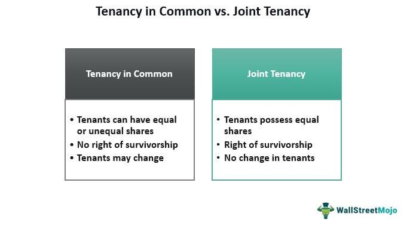

The world of property ownership and trading is complex, characterized by a wide array of rules and strategies that dictate how assets are managed and transferred. At the heart of this domain are concepts like joint tenancy and tenancy law, which are fundamental for property investors seeking to understand the legal frameworks governing real estate ownership. Joint tenancy, a form of co-ownership, is distinguished by the 'right of survivorship', which ensures that property rights seamlessly transfer to surviving owners upon the death of one owner. This characteristic provides a mechanism to avoid probate, making it an attractive option for many investors.

In contrast, other ownership structures such as tenancy in common offer different features, notably allowing owners to distribute property shares unequally and to bequest their portion through a will. Understanding these distinctions is essential for strategic estate planning and financial decision-making.



Simultaneously, the advent of algorithmic trading is revolutionizing asset management across various industries, including property investment. Algorithmic trading leverages computer algorithms to execute trades at optimal prices, thereby minimizing human error and enhancing decision-making speeds. Within property markets, these strategies are increasingly applied to real estate securities and funds, presenting investors with new opportunities for portfolio management.

This article aims to synergize these traditional property concepts with cutting-edge trading technology, highlighting innovative investment strategies that can emerge from their integration. The convergence of joint tenancy frameworks with algorithmic tools holds the potential to redefine market dynamics, providing heightened efficiency and adaptability in property trading and ownership.

## Table of Contents

## Understanding Joint Tenancy

Joint tenancy is a legal arrangement where two or more individuals hold an equal share in a particular real estate or asset. This ownership model is fundamentally defined by the 'right of survivorship', a legal doctrine stipulating that upon the death of one joint tenant, their interest in the property automatically transfers to the surviving joint tenant(s). This feature ensures that the property does not become a matter of probate, thereby offering a seamless transition of ownership.

A notable benefit of joint tenancy is its capacity to circumvent the often lengthy and costly probate process. Since the property interest automatically vests in the surviving tenant(s), it provides a streamlined mechanism for asset transition. This not only expedites the transfer process but also maintains the property outside the purview of estate administration, preserving privacy and reducing administrative expenses.

Despite these advantages, joint tenancy is not without its drawbacks. One primary concern is the loss of individual control over the asset disposition. Since all joint tenants must agree unanimously on decisions regarding the property, this could potentially lead to conflicts, especially in the absence of a shared vision or common interests among the owners. Moreover, the automatic transfer of ownership upon death could inadvertently override any personal estate planning preferences, such as the bequest of property to heirs other than the co-tenant.

Overall, joint tenancy offers a straightforward approach to co-ownership with distinct benefits of simplicity and survivorship, balanced with considerations involving shared control and estate planning complexities.

## Joint Tenancy vs. Other Ownership Models

Joint tenancy and tenancy in common are two prevalent property ownership models, each with distinct characteristics that can impact inheritance rules and estate planning strategies.

Joint tenancy is prominently defined by the "right of survivorship," which ensures that upon the death of one owner, their interest in the property automatically transfers to the surviving owners. This seamless transition can simplify the process of asset distribution and help avoid the potentially lengthy and costly probate proceedings. This automatic transfer is particularly beneficial in scenarios where the primary goal is to maintain ownership within the group of original tenants without external interference.

In contrast, tenancy in common allows each owner to hold an individual interest in the property, which can be unequal in proportion. The fundamental difference lies in the inheritance aspect: tenants in common have the ability to bequeath their property shares through a will. This offers flexibility for owners who wish to allocate their shares to beneficiaries of their choice, which can be a strategic advantage in estate planning. For instance, an owner holding a 40% interest in a property as a tenant in common can choose to leave this specific share to a spouse, children, or any other designated beneficiaries.

The decision between joint tenancy and tenancy in common can substantially influence financial strategies and estate planning. Choosing joint tenancy might be advantageous for those aiming for a straightforward transition of property without the nuances of individual wills and probate. Conversely, tenancy in common can be more suitable for those who prioritize control over their specific shares and desire to make individual legacy decisions.

Ultimately, the choice hinges on investors' objectives and the needs of all parties involved. Legal advice and careful consideration of jurisdiction-specific laws often play a critical role in making an informed decision, ensuring that chosen ownership models align with long-term financial and legacy goals.

## Legal Implications and Tenancy Laws

Joint tenancy agreements hold distinctive legal implications that vary significantly across different jurisdictions. This variability underscores the importance of thorough knowledge of local tenancy laws for property investors, as it helps in preempting legal complications associated with property ownership.

In many jurisdictions, the defining feature of joint tenancy—the right of survivorship—ensures that upon the death of one tenant, their interest in the property is automatically transferred to the surviving tenants. This automatic transfer bypasses the probate process, which can otherwise be time-consuming and expensive. However, this same characteristic mandates that all joint tenants have equal shares and that ownership interests cannot be individually sold or bequeathed in a will, as would be possible under other ownership models such as tenancy in common.

Differences in local laws may specify various requirements for the formation of a joint tenancy. For example, some areas may require that four unities—interest, time, title, and possession—are met to establish a valid joint tenancy. Legal frameworks might also dictate specific procedures for severing a joint tenancy, transforming it into a tenancy in common, which alters how the property can be inherited and managed.

Given these intricacies, seeking legal counsel is highly recommended when establishing or dissolving a joint tenancy agreement. Legal experts can offer indispensable advice on documentation, ensure compliance with local requirements, and guide property owners through complex processes such as severance. Such guidance is crucial not only to protect the interests of the involved parties but also to confirm that the asset transition proceeds without legal hitches.

Overall, a precise understanding of jurisdiction-specific tenancy laws—and the ability to navigate through them with expert legal assistance—is foundational for successful property investment within the construct of joint tenancy. This knowledge not only helps in leveraging the advantages of joint tenancy but also in mitigating potential risks associated with property ownership and transfer.

## Algorithmic Trading in Property Investment

Algorithmic trading is an increasingly prevalent form of automated trading that harnesses complex algorithms for executing trades at optimal prices. This approach not only reduces the potential for human error but also leverages computational speed and data analytics to make strategic investment decisions. While commonly associated with traditional financial markets, [algorithmic trading](/wiki/algorithmic-trading) has significant applications in property investment, particularly through real estate securities listed on stock exchanges or managed through funds.

In the property market, algorithmic trading involves using predefined trading instructions based on variables such as price, timing, and [volume](/wiki/volume-trading-strategy). These algorithms can be as simple as the implementation of moving averages or as complex as advanced [machine learning](/wiki/machine-learning) models that predict market trends. For instance, in Python, using libraries such as `pandas` and `numpy`, investors can create robust models to analyze real-time data and generate trading signals. Below is a simple example of a moving average cross strategy often used in algorithmic trading:

```python
import pandas as pd
import numpy as np

# Load property market data
data = pd.read_csv('property_market_data.csv')

# Calculate short and long-term moving averages
data['short_ma'] = data['price'].rolling(window=5).mean()
data['long_ma'] = data['price'].rolling(window=50).mean()

# Generate trading signals
data['signal'] = 0
data['signal'][5:] = np.where(data['short_ma'][5:] > data['long_ma'][5:], 1, 0)

# Calculate trading positions
data['position'] = data['signal'].diff()
```

In this example, trading signals are generated whenever the short-term moving average crosses the long-term moving average. Such strategies help investors dynamically manage their real estate portfolios by providing timely buy or sell signals based on evolving market conditions.

Furthermore, algorithmic trading offers various benefits to property investors. By automating the trading process, investors can achieve greater efficiency and reduce transaction costs. It allows for the exploitation of market inefficiencies, such as [arbitrage](/wiki/arbitrage) opportunities, and supports enhanced risk management through systematic [backtesting](/wiki/backtesting) of trading strategies. Moreover, these algorithm-based approaches can handle large volumes of data, providing insights that would be difficult to achieve manually.

Investors using algorithmic trading in property markets can employ diversified strategies, including arbitrage and mean reversion, or focus on [momentum](/wiki/momentum)-based trading systems that capitalize on the trends in real estate securities. As the property market continues to embrace digitization, algorithmic trading is expected to play a pivotal role in shaping the future of real estate investments, offering increased sophistication and precision in portfolio management.

## Integrating Traditional Property Ownership with Modern Trading

Integrating traditional property ownership models like joint tenancy with modern algorithmic trading techniques represents a significant shift in investment strategies. This integration has the potential to harness the strengths of both domains, offering investors more effective management of their property portfolios.

Algorithmic trading, utilizing complex algorithms, can analyze vast amounts of data rapidly, identifying patterns and trends within the property market that may not be immediately apparent through traditional analysis. These algorithms can process information such as historical price data, market sentiment, and economic indicators to predict fluctuations and optimize trading decisions. By combining these tools with the established framework of joint tenancy, investors can achieve a more dynamic approach to property ownership and trading.

For instance, joint tenancy offers stability in asset ownership as it facilitates the seamless transition of properties among surviving co-owners. By automating the trading and management processes, algorithmic strategies can ensure these transitions occur at optimal market conditions, thus enhancing the overall return on investment. Additionally, this synergy could result in increased market [liquidity](/wiki/liquidity-risk-premium). As algorithmic models streamline the buying and selling processes, properties can be more readily traded on platforms that support real estate securities, reducing transaction times and costs.

Moreover, the integration of algorithms with joint tenancy structures can mitigate risks traditionally associated with market [volatility](/wiki/volatility-trading-strategies). Investors can set predetermined conditions under which trades are executed, such as stop-loss orders or limit orders, protecting the portfolio from adverse market movements. This application of pre-programmed trading rules ensures that emotional biases are minimized, leading to more rational decision-making.

Incorporating these digital tools into property investment strategies does not eliminate the need for human oversight. Investors must continuously evaluate the effectiveness of their algorithms, adjusting parameters to align with evolving market conditions and regulatory requirements. This blend of traditional and modern methodologies offers a comprehensive approach to property investment, highlighting the potential for increased efficiency and profitability in the market.

## Comparative Advantages and Disadvantages

Joint tenancy and algorithmic trading represent two distinct paradigms in the landscape of property ownership and investment. Understanding the comparative advantages and disadvantages of each can significantly inform investment decisions.

Joint tenancy provides stability and simplifies the transition of assets through the right of survivorship. This aspect ensures that ownership automatically transfers to surviving joint tenants, bypassing the legal complexities of probate. The simplicity and predictability of this arrangement are appealing for those looking to ensure a smooth succession process. However, joint tenancy can also impose certain restrictions, particularly in terms of asset disposal. All parties involved must agree on the sale or modification of the property, which can limit individual autonomy and flexibility. This lack of individual control can be a disadvantage when managing an asset within a dynamic market environment.

On the other hand, algorithmic trading offers distinct advantages, especially in terms of speed and precision. By utilizing computer algorithms to execute trades, investors can act quickly on market opportunities and optimize transaction prices with minimal human error. This method can be advantageous in the fast-paced environment of real estate securities and other property-related financial instruments. Nonetheless, the sophistication of algorithmic trading requires comprehensive planning and robust risk management strategies. The algorithms must be meticulously programmed and continuously monitored to adapt to market changes and avoid substantial financial losses.

In conclusion, while joint tenancy provides straightforward and reliable asset transition mechanisms, it may restrict flexibility in adapting to new market opportunities. Conversely, algorithmic trading opens pathways to precise, swift, and potentially profitable asset management but entails the responsibility of maintaining complex algorithmic systems. Investors must weigh these factors carefully, aligning their choice with their broader financial strategies and risk tolerance.

## Conclusion

Joint tenancy represents an option in property ownership that balances simplicity with inherent complexities. Its defining feature, the right of survivorship, ensures straightforward asset transition upon an owner's death, reducing the need for probate processes. Despite its advantages, joint tenancy can limit flexibility in how individual owners manage or dispose of their share of the asset. This can introduce complications, particularly in estate planning, where diverse familial or financial circumstances require more tailored approaches.

Algorithmic trading offers a transformative aspect to property investment by streamlining decision-making through automation. By utilizing sophisticated algorithms, investors can execute trades with heightened precision and reduced human error. These computational tools analyze vast datasets swiftly, adapting to volatile market conditions and providing strategic insights that enhance portfolio management. The integration of algorithmic trading within property markets, particularly those involving real estate securities, empowers investors to optimize their strategies, balancing risk and opportunity effectively.

Investors should carefully assess their specific needs and objectives when deciding on the integration of joint tenancy and algorithmic trading within their investment strategies. It is crucial to weigh the stability and ease of asset transfer associated with joint tenancy against the speed and adaptability offered by algorithmic tools. A well-considered approach can lead to enhanced portfolio performance and more efficient management of property assets, aligning with both long-term goals and immediate market opportunities.

## References & Further Reading

[1]: ["Joint Tenancy or Tenancy in Common?"](https://www.legalzoom.com/articles/joint-tenancy-vs-tenants-in-common) by Nolo.

[2]: Bergstra, J., Bardenet, R., Bengio, Y., & Kégl, B. (2011). ["Algorithms for Hyper-Parameter Optimization."](https://dl.acm.org/doi/10.5555/2986459.2986743) Advances in Neural Information Processing Systems 24.

[3]: ["Algorithmic Trading & DMA: An introduction to direct access trading strategies"](https://www.amazon.com/Algorithmic-Trading-DMA-introduction-strategies/dp/0956399207) by Barry Johnson.

[4]: ["Advances in Financial Machine Learning"](https://www.amazon.com/Advances-Financial-Machine-Learning-Marcos/dp/1119482089) by Marcos Lopez de Prado.

[5]: ["Real Estate Investment Trusts: Structure, Performance, and Investment Opportunities"](https://academic.oup.com/book/52233) by Su Han Chan, John Erickson, and Ko Wang.

[6]: ["Machine Learning for Algorithmic Trading"](https://github.com/stefan-jansen/machine-learning-for-trading) by Stefan Jansen.

[7]: ["Quantitative Trading: How to Build Your Own Algorithmic Trading Business"](https://books.google.com/books/about/Quantitative_Trading.html?id=j70yEAAAQBAJ) by Ernest P. Chan.