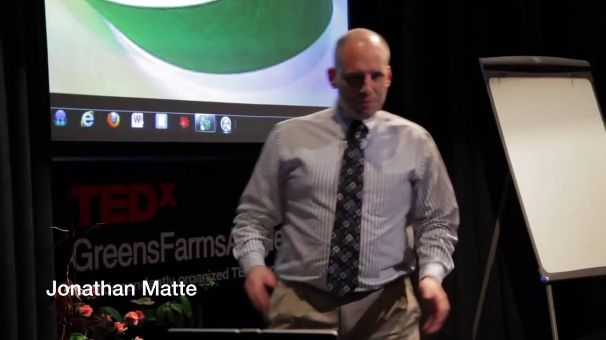

Jonathan Matte has developed a distinct reputation in the complex arena of trading and technology. His career trajectory is marked by a transition from software development to becoming a key figure in the futures industry. This narrative outlines his professional journey, emphasizing his important contributions to algorithmic trading. By examining various facets of his life and career, this biography provides valuable insights into Jonathan Matte's path. The article also considers his work's impact and the enduring influence he has had on trading and finance in general. His multifaceted career is a testament to the synergy between technological advancement and financial innovation.

## Table of Contents

## Early Career in Software Development

Jonathan Matte began his professional career as a software developer at Tandem Computers during the late 1980s and early 1990s. Tandem Computers, known for their NonStop systems, catered to industries requiring high-availability and fault-tolerant data processing, such as banking and telecommunications. During this period, Matte honed his skills in software development, which later served as a bedrock for his career advancements.

Matte's responsibilities at Tandem likely involved working with NonStop SQL, a proprietary database language, and the Guardian operating system, both integral to the reliability and scalability characterizing Tandem systems. His work in this high-demand technological environment provided him with the expertise and adaptability that would prove beneficial in his future endeavors.

In 1995, Jonathan Matte relocated to Portland, Oregon, where he continued his engagement with software development for another two years. This move marked a significant transition, setting the stage for his subsequent entry into the futures trading industry. The expertise acquired while working on complex software systems allowed Matte to seamlessly transition into the world of trading, where algorithmic execution and data processing are critical. 

The shift from development to trading not only opened up new opportunities but also marked a pivotal moment in Matte's career. With a solid foundation in technology, he was well-equipped to address the challenges of the rapidly evolving trading industry, contributing to his reputation as a thought leader in business transformations.

## Venturing into the Futures Industry

In 1997, Jonathan Matte made a significant career transition by establishing Defender Capital Management, Inc., marking his position in the futures industry. Defender Capital Management initially functioned as an Introducing Broker, a role that involved guiding clients through the complexities of futures markets and facilitating the trading of contracts. As Matte gained deeper insights into the intricacies of futures trading, the company expanded its operations to become a Commodity Trading Advisor. This development allowed the firm to engage directly in advising on and managing futures trading strategies for clients, showcasing Matte's growing expertise in the field.

The variety of futures contracts traded by Defender Capital Management highlights the broad scope of Matte's trading acumen. The company traded in significant and diverse financial instruments including 30-year Treasury Bond Futures, which are used by investors to hedge against [interest rate](/wiki/interest-rate-trading-strategies) risks, and Eurodollar Futures, utilized globally for interest rate speculation and hedging. Additionally, Canadian Dollar Futures provided exposure to currency fluctuations, while Sugar #11 Futures represented an agricultural commodities market with its own unique demand and supply factors. This diverse portfolio underscores Matte's ability to navigate distinct segments of the futures markets and adapt to varying financial instruments.

Despite its closure in 2004, Defender Capital Management played an instrumental role in shaping Jonathan Matte's career. The hands-on experience in managing a firm within the futures industry honed his skills in market analysis, risk management, and strategic decision-making. This period of his professional life laid a robust foundation for his later endeavors, reinforcing his reputation and influence in both trading and technology sectors. The knowledge and insights gained from running Defender Capital Management have continued to influence Matte's career trajectory and contributions to the financial industry.

## The Role at John J. Lothian & Company

After a brief hiatus, Jonathan Matte joined John J. Lothian & Company, Inc. (JJLCO) in 2007 as the Chief Operating Officer. As COO, Matte played a vital role in expanding the company's digital presence and operational proficiency. One of his significant contributions was to MarketsWiki, an extensive online knowledge base for financial market professionals. His technical background allowed him to devise innovative methods to enhance the platform's usability and accessibility, ensuring it served as a valuable resource for traders and finance professionals.

In addition to his technical contributions, Matte demonstrated notable editorial proficiency as the editor for the John Lothian Newsletter and JLN Forex. His insightful articles and deep understanding of market dynamics afforded readers a comprehensive look into critical market trends and developments, enhancing the newsletter's credibility and reach. His work not only solidified JJLCO's reputation as a leading voice in the financial news domain but also fostered a more informed trading community.

Matte was instrumental in creating tools and solutions that optimized work processes at JJLCO. By leveraging his software development skills, he implemented systems that streamlined data management and improved operational efficiency. This not only reduced operational overhead but also enabled quicker, more accurate dissemination of market information, reinforcing JJLCO's status in the competitive financial services landscape.

## Life in Alta, Norway

Jonathan Matte currently resides in Alta, Norway, a location characterized by its spectacular Arctic landscape and natural phenomena such as the Northern Lights. This remote town provides an inspiring backdrop for both his professional and personal life. Renowned for its long winters and midnight sun, Alta is a place that allows Matte a unique balance between his work in the global trading arena and his diverse personal pursuits.

Away from his professional commitments, Jonathan Matte is deeply engaged in gaming and storytelling. These hobbies reflect his creative sides and his ability to weave narratives, whether in the form of complex gaming strategies or in storytelling formats. His involvement in gaming not only serves as a source of relaxation but possibly ties back to his background in software development, offering him platforms to exercise logic and problem-solving skills.

Moreover, his alumni status in The Last Regiment of Syncopated Drummers highlights another of his interests—music. The group is known for its vibrant and rhythmic performances, showcasing Matte’s penchant for syncopation and coordination. Being a part of such a dynamic ensemble suggests his appreciation for teamwork and artistic expression, which parallel his collaborative efforts in business and technology.

Jonathan Matte's life in Alta is emblematic of how he balances his dynamic professional career with his varied personal interests, suggesting a holistic approach to life that blends technology, creativity, and community involvement.

## Legacy and Impact on Algo Trading

Jonathan Matte's extensive career has significantly influenced the landscape of [algorithmic trading](/wiki/algorithmic-trading) and futures markets. One of the key factors contributing to this impact is his unique blend of software engineering skills and deep understanding of financial trading. This combination has enabled the development of innovative trading algorithms and solutions that are tailored to the dynamic nature of financial markets.

During his tenure at Defender Capital Management, Inc., Matte harnessed his software expertise to develop proprietary trading algorithms that became central to the firm's operations. These algorithms were designed to analyze various futures contracts, such as 30-year Treasury Bond, Eurodollar, Canadian Dollar, and Sugar #11 futures, allowing for efficient and strategic trading decisions. The intellectual property developed during this period was later transferred to John J. Lothian & Company, Inc. (JJLCO), providing the foundation for enhanced trading practices and further innovations within JJLCO's operations.

Matte's contributions transcend specific trading firms and resonate broadly within the trading community. His approach to algorithmic trading emphasizes the integration of robust software architectures with rigorous financial analysis. This marriage of disciplines has proven crucial in the advancement of algorithmic trading strategies that prioritize speed, accuracy, and adaptability in volatile market conditions.

Moreover, Matte's work continues to inspire technology enthusiasts and professionals within the trading industry by highlighting the importance of interdisciplinary proficiency. Algorithmic trading systems, underpinned by Matte's principles, demonstrate the potential for technology to transform traditional trading paradigms, offering efficiency and precision that were previously unattainable.

Ultimately, Jonathan Matte's legacy in algorithmic trading persists through the sustained influence of his methodologies and innovations. His career serves as a testament to the profound impact that an integrated software and trading skill set can have on financial markets, fostering advancements that benefit both institutions and individual traders alike.

## References & Further Reading

[1]: ["Advances in Financial Machine Learning"](https://www.amazon.com/Advances-Financial-Machine-Learning-Marcos/dp/1119482089) by Marcos Lopez de Prado

[2]: ["Evidence-Based Technical Analysis: Applying the Scientific Method and Statistical Inference to Trading Signals"](https://www.amazon.com/Evidence-Based-Technical-Analysis-Scientific-Statistical/dp/0470008741) by David Aronson

[3]: ["Machine Learning for Algorithmic Trading"](https://github.com/stefan-jansen/machine-learning-for-trading) by Stefan Jansen

[4]: ["Quantitative Trading: How to Build Your Own Algorithmic Trading Business"](https://github.com/LucindaYa/quant-resources/blob/master/Quantitative%20Trading%20How%20to%20Build%20Your%20Own%20Algorithmic%20Trading%20Business.pdf) by Ernest P. Chan